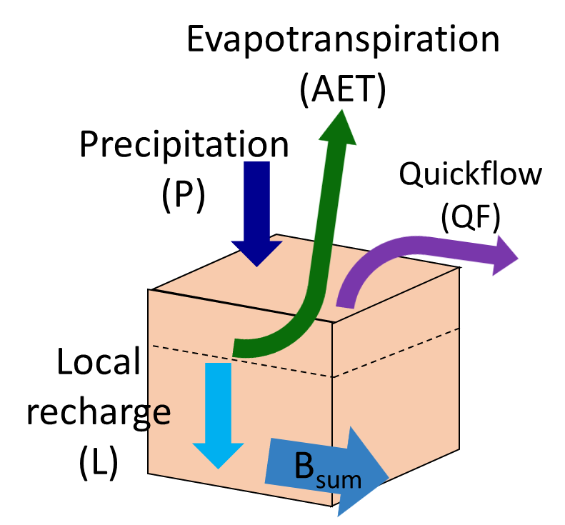
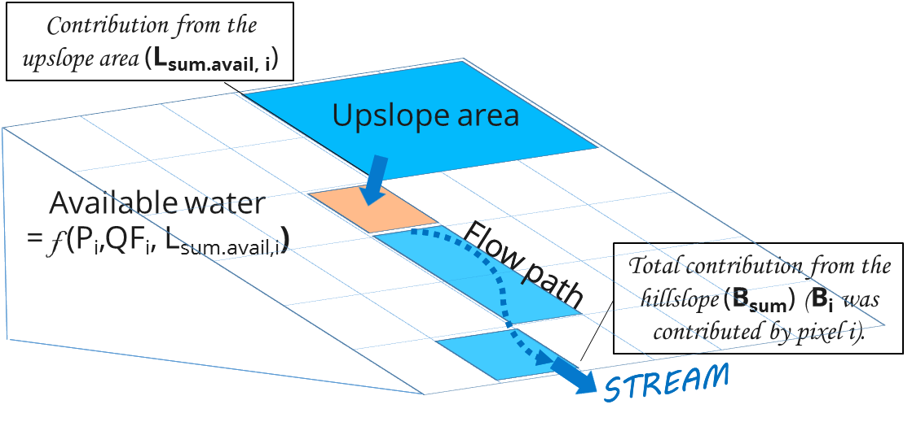

.. _seasonal_water_yield:

********************
Seasonal Water Yield
********************

Summary
=======

There is a high demand for tools estimating the effect of landscape
management on the water supply service, for uses like irrigation, domestic consumption and
hydropower production. While the InVEST Annual Water Yield model
provides an estimate of total water yield for a catchment, many
applications require knowledge of seasonal flows, especially during the
dry season. This requires the understanding of hydrological processes in
a catchment, in particular the partitioning between quickflow
(occurring during or shortly after rain events) and baseflow (occurring
during dry weather). In highly seasonal climates, baseflow is likely to
provide greater value than quickflow, unless significant storage
(e.g., a large reservoir) is available. The InVEST Seasonal Water Yield
model seeks to provide guidance regarding the contribution of land
parcels to the generation of both baseflow and quickflow. The model
computes spatial indices that quantify the relative contribution of a
parcel of land to the generation of both baseflow and quickflow.
Currently, there are no quantitative estimates of baseflow, only the
relative contributions of pixels; a separate tool is in development to
address this question.

Introduction
============

Understanding the effect of landscape management on seasonal flow is of
critical importance for watershed management. The contribution of a
given parcel to streamflow depends on a number of environmental factors
including climate, soil, vegetation, slope, and position along the flow
path (determining if the pixel may receive water from upslope or if
water recharged may later be evapotranspired).

Water flowing across the landscape is either evaporated, transpired,
withdrawn by a well, or leaves the watershed as deep groundwater flow or
streamflow. If we consider an individual pixel, and its value with
respect to water yield, we can consider two approaches:

- The first gives credit to the net amount of water generated on a
   pixel as equal to the incoming precipitation minus the losses to
   evapotranspiration on that pixel. In this scheme, it is possible for
   actual evapotranspiration to be greater than precipitation if water
   is supplied to the site from upslope. Thus, the net generation
   could be negative. This approach pays no heed to the eventual
   disposition of that water generated on that pixel; that is, it does
   not consider whether the water actually shows up as streamflow or is
   evaporated or withdrawn somewhere along its path.

- The second approach gives credit to the water from a parcel that
   actually shows up as streamflow. Thus, if a parcel generates water
   that is later evaporated, the contribution is considered to be nil.

The former approach puts greater emphasis on the land-use and land-cover
of a site, since the focus is on net generation from that pixel. It
accounts for the subsidy of water from upslope pixels, but does not
consider downslope effects. It represents the *potential* to generate
streamflow (not an actual generation of flow).

The second approach puts more emphasis on the topographic position of a
pixel, as that will determine the potential for water generated on that
pixel to be consumed before becoming streamflow. It represents the
actual streamflow generated by a pixel. Since actual streamflow cannot
be less than zero, this approach, unlike the first, will result in
indices that are greater than or equal to zero.

We use both of these concepts to develop a set of three indices, one for
quickflow, one for recharge (which represents the ‘potential baseflow’),
and one for actual baseflow. Here, baseflow is defined as the generation
of streamflow with watershed residence times of months to years, while
quickflow represents the generation of streamflow with watershed
residence times of hours to days.

The Model
=========

Quickflow
---------

*Quickflow* (QF) is calculated with a Curve Number (CN)-based approach. Monthly rain events cause precipitation to fall on the landscape. Soil and land cover properties determine how much of the rain runs off of the land surface quickly (producing quickflow) versus infiltrating into the soil (producing local recharge.) The curve number is a simple way of capturing these soil + land cover properties - higher values of CN have higher runoff potential (for example, clay soils and low vegetation cover), lower values are more likely to infiltrate (for example, sandy soils and dense vegetation cover.)

To calculate quickflow, we use the mean event depth, :math:`\frac{P_{i,m}}{n_{i,m}}` and assume an exponential
distribution of daily precipitation depths on days with rain,

.. math:: f\left( p \right) = \frac{1}{a_{i,m}}exp\left( - \frac{p}{a_{i,m}} \right)

Where :math:`a_{i,m} = \frac{P_{i,m}}{n_{m}}/25.4` and

- :math:`a_{i,m}` is the mean rain depth on a rainy day at pixel
   *i* on month *m* [in],

- :math:`n_{i,m}` is the number of events at pixel *i* in month *m*
   [-],

- :math:`P_{i,m}` is the monthly precipitation for pixel *i* at month
   *m* [mm].

Quickflow for pixels located in streams is set to the precipitation on
that pixel, which assumes no infiltration, only runoff.

.. math:: \text{QF}_{stream,m} = \ P_{stream,m}

otherwise it can be shown from the exponential distribution that the
monthly runoff :math:`\text{QF}_{i,m}` is

.. math:: \text{QF}_{i,m} = n_{m} \times \left( \left( a_{i,m} - S_{i} \right)\exp\left( - \frac{0.2S_{i}}{a_{i,m}} \right) + \frac{S_{i}^{2}}{a_{i,m}}\exp\left( \frac{0.8S_{i}}{a_{i,m}} \right)E_{1}\left( \frac{S_{i}}{a_{i,m}} \right) \right) \times \left( 25.4\ \left\lbrack \frac{\text{mm}}{\text{in}} \right\rbrack \right)
	:label: (swy. 1)

where

- :math:`S_{i} = \frac{1000}{\text{CN}_{i}} - 10` [in]

- :math:`\text{CN}_{i}` is the curve number for pixel *i*
   [in\ :sup:`-1`\], tabulated as a function of the local LULC, and soil type
   *(see Appendix I for a template of this table)*,

- :math:`E_{1}` is the exponential integral function,
   :math:`E_{1}(x) = \int_{1}^{\infty}{\frac{e^{-xt}}{t}\text{dt}}`.

- and :math:`25.4` is a conversion factor from inches (used by the equation) to millimeters (used by the model)

Thus the annual quick flow :math:`\text{QF}_{i}`, can be calculated from
the sum of monthly :math:`\text{QF}_{i,m}` values,

.. math:: \text{QF}_{i} = \sum_{m = 1}^{12}{QF_{i,m}}
	:label: (swy. 2)

Local recharge
--------------

The *local* *recharge,* or potential contribution to baseflow, of a
pixel is computed from the local water balance. Precipitation that does not run off as quickflow, and is not evapotranspired by the vegetation on a pixel, can infiltrate the soil to become local recharge. Local recharge can be negative if a pixel does not receive enough of its own water to satisfy its vegetation requirements (determined by its crop factor *Kc*), so it uses water generated upslope of the pixel as well (referred to as an "upslope subsidy".) The local recharge index is computed on an annual time scale, but uses values derived from monthly water budgets.

For a pixel *i*, the local recharge derived from the annual water budget
is (Figure 1):

.. math:: L_{i} = P_{i} - \text{QF}_{i} - \text{AET}_{i}
	:label: (swy. 3)

Where annual actual evapotranspiration AET is the sum of monthly AET:

.. math:: \text{AET}_{i} = \sum_{\text{months}}^{}\text{AET}_{i,m}
	:label: (swy. 4)

For each month, :math:`\text{AET}_{i,m}` is either limited by the demand
(potential evapotranspiration - PET) or by the available water (from Allen et al. 1998):

.. math:: \text{AET}_{i,m} = min(\text{PET}_{i,m}\ ;\ P_{i,m} - \text{QF}_{i,m} + \alpha_{m}\beta_{i}L_{sum.avail,i})
	:label: (swy. 5)

Where :math:`\text{PET}_{i,m}` is the monthly potential
evapotranspiration,

.. math:: \text{PET}_{i,m} = K_{c,i,m} \times ET_{0,i,m}
	:label: (swy. 6)

:math:`L_{sum.avail,i}` is recursively defined by (Figure 2),

.. math:: L_{sum.avail,i} = \sum_{j \in \{ neighbor\ pixels\ draining\ to\ pixel\ i\}}^{}{p_{\text{ij}} \cdot \left( L_{avail,j} + L_{sum.avail,j} \right)}
	:label: (swy. 7)

where :math:`p_{\text{ij}}\ \in \lbrack 0,1\rbrack` is the proportion
of flow from cell *i* to *j*, and :math:`L_{avail,i}` is the available
recharge to a pixel, which is :math:`L_{i}` whenever :math:`L_{i}` is negative, and
a proportion :math:`\gamma` of :math:`L_{i}` when it is positive (see
below for definition of :math:`\gamma`):

.. math:: L_{avail,i}\ = min(\gamma L_{i},L_{i})
	:label: (swy. 8)

In the above:

- :math:`P_{i}` and :math:`P_{i,m}` are the annual and monthly
   precipitation, respectively [mm]

- :math:`\text{QF}_{i}` and :math:`\text{QF}_{i,m}` are the quickflow
   indices, defined above [mm]

- :math:`ET_{0,i,m}` is the reference evapotranspiration for month m
   [mm]

- :math:`K_{c,i,m}` is the monthly crop factor for the pixel’s LULC

- :math:`\alpha_{m}` is the fraction of upslope annual available
   recharge that is available in month m (default is 1/12)

- :math:`\beta_{i}` is the fraction of the upslope subsidy that is
   available for downslope evapotranspiration (default is 1; see
   Appendix II for more information)

- γ is the fraction of pixel recharge that is available to downslope
   pixels (default is 1)

Attribution of recharge
-----------------------

The total baseflow, :math:`Q_b` (in mm), is the average of the contributing local
recharges (negative or positive) in the catchment,

.. math:: Q_{b} = \frac{\sum_{k \in \left\{ \text{pixels in catchment} \right\}}^{}L_{k}}{n_{\text{pixels in catchment}}}
	:label: (swy. 9)

Attribution value to a pixel is the relative contribution of local recharge :math:`L` on that pixel to the
baseflow :math:`Q_b`:

.. math:: V_{R,i} = \frac{L_{i}}{{Q_{b} \times n}_{\text{pixels in catchment}}}
	:label: (swy. 10)

|

*Figure 1. Water balance at the pixel scale to compute the local
recharge (Eq. 3), where Bsum is the flow actually reaching the stream.*

|
|
|

*Figure 2. Routing at the hillslope scale to compute actual
evapotranspiration (based on each pixel’s climate variables and the upslope
contribution, see Eq. 5) and baseflow (based on Bsum, the flow
actually reaching the stream, see Eq. 11-14)*

|
|

Baseflow
--------

The baseflow index represents the contribution of a pixel to
baseflow (i.e. water that reaches the stream during the dry season). If the local recharge is
negative, then the pixel did not contribute to baseflow so :math:`B` is set to
zero. If the pixel contributed to groundwater recharge, then :math:`B` is a
function of the amount of flow leaving the pixel and of the relative
contribution to recharge of this pixel.

For a pixel that is not adjacent to the stream channel, the cumulative
baseflow, :math:`B_{sum,i}`, is proportional to the cumulative baseflow
leaving the adjacent downslope pixels minus the cumulative baseflow
that was generated on that same downslope pixel (Figure 2):

.. math::
   B_{sum,i} = L_{sum,i}\sum_{j \in \{\text{cells to which cell i pours}\}}^{}\begin{Bmatrix}
   p_{\text{ij}}\left( 1 - \frac{L_{avail,j}}{L_{sum,j}} \right)\frac{B_{sum,j}}{L_{sum,j} - L_{j}}\ \text{   if }j\text{ is a nonstream pixel} \\
   p_{\text{ij}}\ \text{   if }j\text{ is a stream pixel} \\
   \end{Bmatrix}
 :label: (swy. 11)

At the watershed outlet (or at any pixel adjacent to the stream), the
sum of baseflow generation :math:`B_{sum,i}` over all upslope pixels
is equal to the sum of local generation over the same pixels (because
there is no further opportunity for the slow flow to be consumed before
reaching the stream):

.. math:: B_{sum,outlet} = L_{sum,outlet}
	:label: (swy. 12)

where :math:`L_{sum,i}` is the cumulative upstream recharge defined by

.. math:: L_{sum,i} = L_{i} + \sum_{j,\ all\ pixels\ draining\ to\ pixel\ i}^{}{L_{sum,j} \cdot p_{\text{ji}}}
	:label: (swy. 13)

and the baseflow, :math:`B_{i}` can be directly derived from the
proportion of the cumulative baseflow leaving cell *i*, with respect to
the available recharge to the upstream cumulative recharge:

.. math:: B_{i} = max\left(B_{sum,i} \cdot \frac{L_{i}}{L_{sum,i}}, 0\right)
	:label: (swy. 14)

Limitations
-----------

Like all InVEST models, Seasonal Water Yield uses a simplified approach to estimating quickflow and baseflow, and does not include many of the complexities that occur as water moves through a landscape. Quickflow is primarily based on curve number, which does not take topography into account. For baseflow, although the model uses a physics-based approach, the equations are extremely simplified at both spatial and temporal scales, which significantly increases the uncertainty on the absolute numbers produced. So we do not suggest to use the absolute values, but instead the relative values across the landscapes (where we assume that the simplifications matter less, because they apply to the entire landscape).

Calibration
-----------

It is always recommended to validate against observed data if possible. However, while the quickflow output from the model may be used as a quantitative measure, baseflow is intended to be used as an index, not an absolute value. So it is difficult to combine quickflow and baseflow and expect to get realistic model results for validating against observed flow. One possibility is to validate the relative values (i.e. the distribution of values across the landscape). This requires several (at least >3, more realistically >5) stream gauges, which can be compared with the quickflow and baseflow outputs of the model, aggregated to the same stream gauge points. Alternatively, results may be compared to a different spatially-explicit model, if it is available.

If you do try quantitatively validating either quickflow, or a combination of quickflow and baseflow (again, not recommended, but people do try), note that since the results are in millimeters, if we simply sum these up over the whole area, the result is likely to be orders of magnitude too large, and doesn’t represent the total water volume properly. Instead, use the *mean* B or Qf value across the watershed, convert millimeters to meters, then multiply by the watershed area to get a value in cubic meters, which can be compared against observed flow data. Alternatively, you could calculate volume per pixel and sum those.

See the paper Hamel et al (2020) for an example of calibrating the Seasonal Water Yield model against observed data and other hydrology models. For more general guidance about assessing uncertainty in ecosystem services analyses, see Hamel & Bryant (2017). 

Data needs
==========

Raster inputs may have different cell sizes, and they will be resampled to match the cell size of the DEM. Therefore, all model results will have the same cell size as the DEM.

- :investspec:`seasonal_water_yield.seasonal_water_yield workspace_dir`

- :investspec:`seasonal_water_yield.seasonal_water_yield results_suffix`

- :investspec:`seasonal_water_yield.seasonal_water_yield precip_dir`

  Contents:

  - :investspec:`seasonal_water_yield.seasonal_water_yield precip_dir.contents.[MONTH]`

- :investspec:`seasonal_water_yield.seasonal_water_yield et0_dir`

  Contents:

  - :investspec:`seasonal_water_yield.seasonal_water_yield et0_dir.contents.[MONTH]`

- :investspec:`seasonal_water_yield.seasonal_water_yield dem_raster_path`

- :investspec:`seasonal_water_yield.seasonal_water_yield lulc_raster_path`

- :investspec:`seasonal_water_yield.seasonal_water_yield soil_group_path`

- :investspec:`seasonal_water_yield.seasonal_water_yield aoi_path`

- :investspec:`seasonal_water_yield.seasonal_water_yield biophysical_table_path` A .csv (Comma Separated Value) table containing model information corresponding to each of the land use classes in the LULC raster. *All LULC classes in the LULC raster MUST have corresponding values in this table.* Each row is a land use/land cover class and columns must be named and defined as follows:

  Columns:

  - :investspec:`seasonal_water_yield.seasonal_water_yield biophysical_table_path.columns.lucode`
  - :investspec:`seasonal_water_yield.seasonal_water_yield biophysical_table_path.columns.cn_[SOIL_GROUP]`
  - :investspec:`seasonal_water_yield.seasonal_water_yield biophysical_table_path.columns.kc_[MONTH]`

- :investspec:`seasonal_water_yield.seasonal_water_yield rain_events_table_path` A rain event is defined as >0.1mm precipitation.

  Columns:

  - :investspec:`seasonal_water_yield.seasonal_water_yield rain_events_table_path.columns.month`
  - :investspec:`seasonal_water_yield.seasonal_water_yield rain_events_table_path.columns.events`

- :investspec:`seasonal_water_yield.seasonal_water_yield threshold_flow_accumulation`
- :investspec:`seasonal_water_yield.seasonal_water_yield alpha_m` Default value: 1/12.
- :investspec:`seasonal_water_yield.seasonal_water_yield beta_i` Default value: 1.
- :investspec:`seasonal_water_yield.seasonal_water_yield gamma` Default value: 1.

Advanced model options
----------------------

The monthly Rain Events table is a simple way to provide rain events data. This assumes that there is one such number for the whole watershed, which may not be
true for large areas or areas with very spatially variable precipitation.

To represent variability in the number of rain events, it is possible to
enter a map of climate zones, and associated number of rain events for
each zone.

**Inputs**

- :investspec:`seasonal_water_yield.seasonal_water_yield user_defined_climate_zones`

- :investspec:`seasonal_water_yield.seasonal_water_yield climate_zone_table_path`

   Columns:

   - :investspec:`seasonal_water_yield.seasonal_water_yield climate_zone_table_path.columns.cz_id`
   - :investspec:`seasonal_water_yield.seasonal_water_yield climate_zone_table_path.columns.[MONTH]`

- :investspec:`seasonal_water_yield.seasonal_water_yield climate_zone_raster_path`

|

The model computes sequentially the local recharge layer, and then the baseflow layer from local recharge. Instead of InVEST calculating local recharge, this layer could be obtained from a different model (e.g, RHESSys.) To compute baseflow contribution based on your own recharge layer, it is possible to bypass the first part of the model and directly enter a map of local recharge.

**Inputs**

- :investspec:`seasonal_water_yield.seasonal_water_yield user_defined_local_recharge`
- :investspec:`seasonal_water_yield.seasonal_water_yield l_path`

|

The *alpha* parameter represents the temporal variability in the
contribution of upslope available water to evapotranspiration on a
pixel. In the default parameterization, its value is set to 1/12,
assuming that the soil buffers water release and that the monthly
contribution is exactly 1\\12\ :sup:`th` of the annual contribution.

To allow upslope subsidy to be temporally variable instead, the user can instead provide a table of monthly *alpha* values.

**Inputs**

- :investspec:`seasonal_water_yield.seasonal_water_yield monthly_alpha`
- :investspec:`seasonal_water_yield.seasonal_water_yield monthly_alpha_path`

Interpreting outputs
--------------------

The resolution of the output rasters will be the same as the resolution of the DEM that is provided as input.

* **[Workspace]** folder:

 * **Parameter log**: Each time the model is run, a text (.txt) file will be created in the Workspace. The file will list the parameter values and output messages for that run and will be named according to the service, the date and time. When contacting NatCap about errors in a model run, please include the parameter log.

 * **B_[Suffix].tif** (type: raster; units: mm, but should be interpreted as relative values, not absolute): Map of baseflow :math:`B` values, the contribution of a pixel to slow release flow (which is not evapotranspired before it reaches the stream)

 * **B_sum_[Suffix].tif** (type: raster; units: mm, but should be interpreted as relative values, not absolute): Map of :math:`B_{\text{sum}}`\ values, the flow through a pixel, contributed by all upslope pixels, that is not evapotranspirated before it reaches the stream

 * **CN_[Suffix].tif** (type: raster): Map of curve number values

 * **L_avail_[Suffix].tif** (type: raster; units: mm, but should be interpreted as relative values, not absolute): Map of available local recharge :math:`L_{\text{avail}}`

 * **L_[Suffix].tif** (type: raster; units: mm, but should be interpreted as relative values, not absolute): Map of local recharge :math:`L` values

 * **L_sum_avail_[Suffix].tif** (type: raster; units: mm, but should be interpreted as relative values, not absolute): Map of :math:`L_{\text{sum.avail}}` values, the available water to a pixel, contributed by all upslope pixels, that is available for evapotranspiration by this pixel

 * **L_sum_[Suffix].tif** (type: raster; units: mm, but should be interpreted as relative values, not absolute): Map of :math:`L_{\text{sum}}` values, the flow through a pixel, contributed by all upslope pixels, that is available for evapotranspiration to downslope pixels

 * **QF_[Suffix].tif** (type: raster; units: mm): Map of quickflow (QF) values

 * **P_[Suffix].tif** (type: raster; units: mm/year): The total precipitation across all months on this pixel.

 * **Vri_[Suffix].tif** (type: raster; units: mm): Map of the values of recharge (contribution, positive or negative), to the total recharge

 * **aggregated_results_swy_[Suffix].shp**: Table containing biophysical values for each watershed, with fields as follows:

        * **qb** (units: mm, but should be interpreted as relative values, not absolute): Mean local recharge value within the watershed

* **[Workspace]\\intermediate_outputs** folder:

 * **aet_[Suffix].tif** (type: raster; units: mm): Map of actual evapotranspiration (AET)

 * **qf_1_[Suffix].tif...qf_12_[Suffix].tif** (type: raster; units: mm): Maps of monthly quickflow (1 = January... 12 = December)

 * **stream_[Suffix].tif** (type: raster): Stream network generated from the input DEM and Threshold Flow Accumulation. Values of 1 represent streams, values of 0 are non-stream pixels.

Appendix 1: Data sources and guidance for parameter selection
=============================================================

:ref:`Precipitation <precipitation>`
------------------------------------

:ref:`Evapotranspiration <et0>`
-------------------------------

:ref:`Digital Elevation Model <dem>`
------------------------------------

:ref:`Land Use/Land Cover <lulc>`
---------------------------------

:ref:`Soil Groups <soil_groups>`
---------------------------------

:ref:`Watersheds <watersheds>`
------------------------------

:ref:`Curve Number <cn>`
------------------------

:ref:`Kc <kc>`
--------------

:ref:`Rain Events <rain_events>`
--------------------------------

:ref:`Threshold Flow Accumulation <tfa>`
----------------------------------------

Climate Zones
-------------
Climate zone data is available on the `Köppen-Geiger climate classification site <http://koeppen-geiger.vu-wien.ac.at/present.htm>`_.

alpha_m
-------

Default: 1/12. See Appendix 2

beta_i
------

Default: 1. See Appendix 2

gamma
-----

Default: 1. See Appendix 2

|
|

Appendix 2: :math:`{\mathbf{\alpha},\mathbf{\beta}}_{\mathbf{i}},`\ and :math:`gamma` parameters definition and alternative values
==================================================================================================================================

:math:`\alpha` and :math:`\beta_{i}` represent the fraction of annual
recharge from upslope pixels that is available to a downslope
pixel for evapotranspiration in a given month. The product
:math:`\alpha \times \beta_{i}` is expected to be <1 since some water
from upslope may be unavailable, either when it follows deep flowpaths
or when the timing of supply and (evapotranspiration) demand is not
synchronized.

:math:`\alpha` is a function of precipitation seasonality: recharge from
a given month can be used by downslope areas during later months,
depending on the subsurface travel times. In the default
parameterization, its value is set to 1/12, assuming that the soil
buffers water release and that the monthly contribution is exactly one
12\ :sup:`th` of the annual contribution. An alternative assumption is
to set values to the antecedent monthly precipitation values, relative
to the total precipitation: P\ :sub:`m-1`/P\ :sub:`annual`

:math:`\beta_{i}` is a function of local topography and soils: for a
given amount of upslope recharge, the amount of water used by a pixel is
a function of the storage capacity. It also depends on the
characteristics of the upslope area: the use of the upslope subsidy
is conditioned by the shape and area of the contribution area (i.e. the
recharge from the pixel just above the pixel of interest is less likely
to be lost than the pixels much further away)

In the default parameterization, :math:`\beta` is set to 1 for all
pixels. One alternative is to set :math:`\beta_{i}` as TI, the
topographic wetness index for a pixel, defined as
:math:`ln(\frac{A}{\text{tan}\beta}`) (or other formulation including soil
type and depth).

γ represents the fraction of pixel recharge that is available to
downslope pixels. It is a function of soil properties and possibly
topography. In the default parameterization, γ is constant over the landscape and plays a
role similar to :math:`\alpha`.

In practice
-----------

The options above are provided mainly for research purposes. In
practice, we suggest that for highly seasonal climates, *alpha* should be
set to the antecedent monthly precipitation values, relative to the
total precipitation: P\ :sub:`m-1`/P\ :sub:`annual`

Then, we offer two options to address the uncertainty around the
parameter values:

1. Verification of actual evapotranspiration with observations

The model outputs the actual evapotranspiration at the annual time
scale: users can adjust parameters to meet observed actual
evapotranspiration (e.g. from MODIS,
https://www.ntsg.umt.edu/project/modis/mod16.php). In the following, "_mod" stands for modeled AET, "_obs" stands for observed AET.

* If AET\_mod > AET\_obs, the model overpredicts evapotranspiration,
   which can be corrected by: reducing *Kc* values, or reducing *gamma*
   values, and/or *beta* values (so less water is available for each
   pixel).

* If AET\_mod < AET\_obs, the model underpredicts evapotranspiration,
   which can be corrected by: increasing *Kc* values (and increasing *gamma*
   or *beta* values if they are not at their maximum of 1).

If monthly values of AET are available, a finer calibration can be
performed by changing the seasonal parameter alpha.

2. Ensemble modeling

The model can be run under different assumptions and the outputs
compared to estimate the effect of parameter error. Parameter ranges can
be determined from assumptions about the proportion of upslope subsidy
available to a given pixel; they can be set to the maximum bounds (0 and
1) for preliminary results.

References
==========

Allen, R.G., Pereira, L.S., Raes, D., Smith, M., 1998. Crop
evapotranspiration - Guidelines for computing crop water requirements,
FAO Irrigation and drainage paper 56. Rome, Italy.

Hamel, P. & Bryant, B. (2017). Uncertainty assessment in ecosystem services analyses: Seven challenges and practical responses. Ecosystem Services, Volume 24. https://doi.org/10.1016/j.ecoser.2016.12.008.

Hamel, P., Valencia, J., Schmitt, R., Shrestha, M., Piman, T., Sharp, R.P., Francesconi, W., Guswa, A.J., 2020. Modeling seasonal water yield for landscape management: Applications in Peru and Myanmar. Journal of Environmental Management 270, 110792.

NRCS-USDA, 2007. National Engineering Handbook. United States Department
of Agriculture,
https://www.nrcs.usda.gov/wps/portal/nrcs/detailfull/national/water/?cid=stelprdb1043063.

