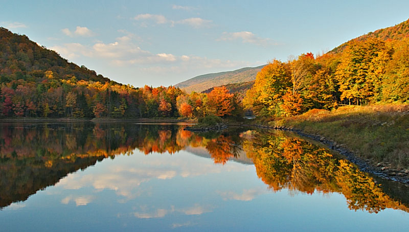
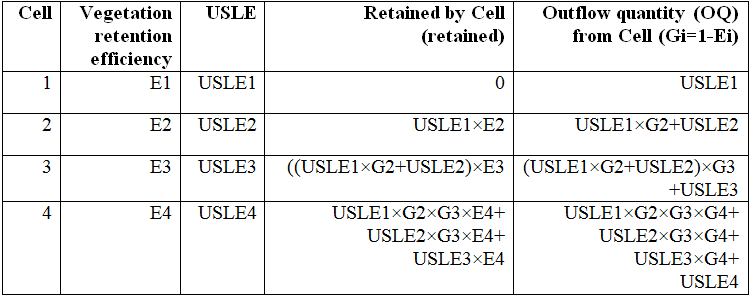
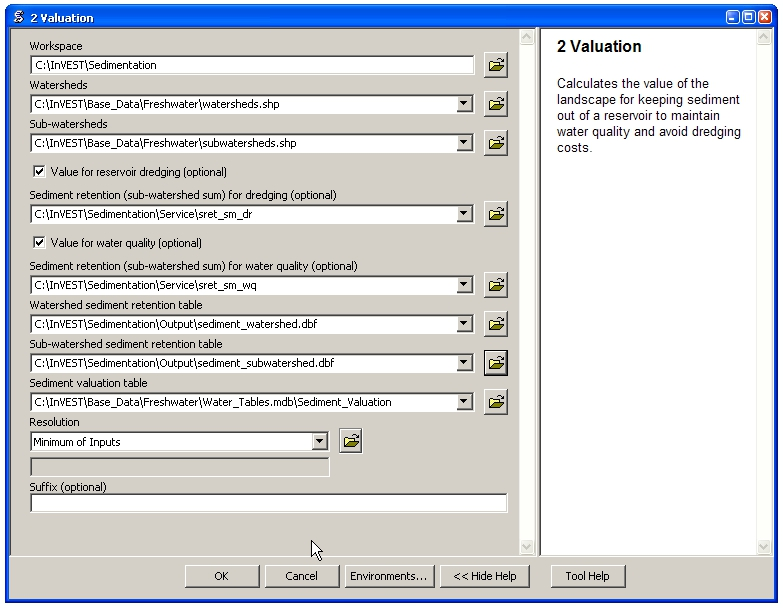

.. _sediment_retention:

.. |addbutt| image:: ./shared_images/addbutt.png
             :alt: add
	     :align: middle 
	     :height: 15px

.. |toolbox| image:: ./shared_images/toolbox.jpg
             :alt: toolbox
	     :align: middle 
	     :height: 15px

***********************************************************************
Sediment Retention Model: Avoided dredging and water quality regulation
***********************************************************************

Summary
=======

Reservoirs are linked to a number of environmental services, including the generation of energy through reservoir hydropower production, irrigation of crops and recreational activities. Erosion and sedimentation of watersheds can lead to decreased hydropower output, structural damage to reservoirs and other water infrastructure, and flooding. InVEST estimates the capacity of a land parcel to retain sediment using data on geomorphology, climate, vegetation and management practices. These estimates are combined with data on sediment removal costs, reservoir design, and a discount rate to calculate the avoided cost of sediment removal. Limitations of the model include negligence of mass erosion, inadequate information about sediment removal costs, and simplified LULC classifications.

Sediment Updates to InVEST 3.0
==============================

As part of a continuing effort to improve our models we are developing the next generation open source platform of InVEST.  The sedimentation model has a new version of this model available in versions of InVEST 2.5.0 and later.  It can be found in the Windows start menu under All Programs -> InVEST [version] -> Freshwater -> Sedimentation.  Differences in the 3.0 version of this model from the original ArcGIS version will be indicated below.  A summary of the changes are below:

 * Improved runtime performance, stability, and error messages during a runtime failure.

 * C and P values should be stored in their original floating point state (the ArcGIS version requires the values to be multiplied by 1000 and stored as integers in the biophysical table.

 * The 3.0 flow algorithm uses a D-infinity flow whereas the ArcGIS version used D8.

 * The 3.0 sediment model uses a modern LS factor for two dimensional surfaces from Desmet and Govers (1996):

 .. math:: L_{i,j}=\frac{\left(A_{i,j-in}+D^2\right)^{m+1}-A^{m+1}_{i,j-in}}{D^{m+2}\cdot x^m_{i,j}\cdot (22.13)^m}
 
 
  

Introduction
============

Erosion and sedimentation are natural processes that contribute to healthy ecosystems, but too much may have severe consequences. Excessive erosion can reduce agricultural productivity, increase flooding and pollutant transport, and threaten bridges, railroads and power infrastructures. Erosion can lead to sediment build-up, which strains water infrastructures, such as reservoirs and flood control systems, and increases water treatment costs. Sedimentation is particularly problematic for reservoirs, which are designed to retain sediment as water is released. Regular sediment removal can avoid some of these issues but this involves expensive maintenance costs.

The magnitude of sediment transport in a watershed is determined by several factors. Natural variation in soil properties, precipitation patterns, and slope create patterns of erosion and sediment runoff. Vegetation holds soil in place and captures sediment moving overland.  However, changes in land management practices can alter the sediment retention capacity of land by removing important vegetation.

There are many clear examples of the effects of LULC change on erosion and sedimentation. Forest fires that clear significant areas of vegetation are often followed by mudslides when heavy rains occur (Meyer et al. 2001). After the fire the vegetation that once held sediment in place no longer exists and the top layers of soil can be carried downstream by overland runoff. Deforestation results in a similar process, although in some cases it may occur on longer time scales. Even in areas where land cover remains the same, a change in land use practice can alter the sediment retention capacity of the landscape. For example, moving from no-till to till agriculture has been shown to increase the rate of soil erosion. The continuous accumulation of increased sediment loads as a result of changes in LULC can cause serious problems such as increasing siltation rate, and increasing dredging costs that were not anticipated during the original design of reservoir infrastructure, maintenance and operation plans. To reduce the damages and costs associated with sedimentation, land, water and reservoir managers require information regarding the extent to which different parts of a landscape contribute to sediment retention, and how land use changes may affect this retention. Such information can support decisions by government agencies, businesses, and NGOs. For example, a power company operating a hydropower reservoir may elect to conserve upstream forests that maintain a sediment retention service if the cost of conserving the forests is less than the costs of reduced hydropower potential, sediment removal, and dam replacement. Maps showing which forest parcels offer the greatest sediment retention benefits would help the power company maximize returns on their investment. InVEST aims to provide these kinds of information. The outputs from these models will allow planners and managers to consider how LULC change in one area in the watershed can cause sedimentation problems at other locations.

The Model
=========

The Sediment Retention model provides the user with a tool for calculating the average annual soil loss from each parcel of land, determining how much of that soil may arrive at a particular point of interest, estimating the ability of each parcel to retain sediment, and assessing the cost of removing the accumulated sediment on an annual basis. An important determinant of soil retention capacity is land use and land cover. To identify a land parcel's potential soil loss and sediment transport, the InVEST Avoided Reservoir Sedimentation model uses the Universal Soil Loss Equation (USLE) (Wischmeier & Smith 1978) at the pixel scale, which integrates information on LULC patterns and soil properties, as well as a digital elevation model, rainfall and climate data. The pixel-scale calculations allow us to represent the heterogeneity of key driving factors in water yield such as soil type, precipitation, vegetation type, etc. However, the theory we are using as the foundation of this set of models was developed at the sub-watershed to watershed scale. We are only confident in the interpretation of these models at the sub-watershed scale, so all outputs are summed and/or averaged to the sub-basin scale. We do continue to provide pixel-scale representations of some outputs for calibration and model-checking purposes only. **These pixel-scale maps are not to be interpreted for understanding of hydrological processes or to inform decision making of any kind.**

This model can also be used to value the landscape vis-a-vis maintaining water quality or avoiding reservoir sedimentation. In the water quality maintenance case, the model uses additional information on water quality standards and treatment costs to value the ability of each sub-watershed to reduce treatment costs. In the reservoir maintenance case, the model uses additional data on reservoir location and the avoided cost of sediment removal to value a sub-watershed's capacity to keep sediment out of reservoirs.

How it works
------------

First, we estimate the potential for soil loss based on geomorphological and climate conditions. The model is based on the USLE, and represents the first four factors in the equation (rainfall erosivity, soil erodibility, and the length-slope factor). This part of the model accounts for two key relationships. In areas where rainfall intensity is high, there is a high chance that soil particles will become detached and transported by overland runoff. Also, in areas  where the soil has a high proportion of sand, the erodibility is high which means soil particles are easily detached from the soil pack and transported by overland runoff.

The Universal Soil Loss Equation (USLE) provides the foundation of the biophysical step of the InVEST sediment retention model.

:math:`USLE=R \times K \times LS \times C \times P`	(from Wischmeier & Smith, 1978)

where *R* is the rainfall erosivity, *K* is the soil erodibility factor, *LS* is the slope length-gradient factor, C is the crop/vegetation and management factor and P is the support practice factor.

The Slope Length Factor (LS) is one of the most critical parameters in the USLE. Slope length is the distance from the origin of overland flow along its flow path to the location of either concentrated flow or deposition. It reflects the indirect relationship between slope and land management (terracing, ditches, buffers, barriers). The LS factor is essentially the distance that a drop of rain/sediment runs until its energy dissipates. It represents a ratio of soil loss under given conditions compared to a reference site with the "standard" slope of 9% and slope length of 72.6 feet. The steeper and longer the slope is, relative to the conditions of the reference site, the higher the risk for erosion will be (for more information see http://www.omafra.gov.on.ca/english/engineer/facts/00-001.htm). The estimates of slope-length are based on methodology in a model called N-SPECT such that abrupt changes in slope result in length cutoffs. Adjustments are necessary when slope is greater than 9% and slope length is different than 72.6 feet (22.12m). In the model, different LS equations are automatically used for slope conditions that differ from the standard reference site conditions of the USLE equation development.  The slope threshold that the model uses to switch between the follwoing two equations is specified as a model input and depends on the local geomorphology and watershed characteristics..

*For low slopes:*

.. math:: LS=\left(\frac{flowacc\cdot cellsize}{22.13}\right)^{nn}\left(\left(\frac{\sin(slope\cdot 0.01745)}{0.09}\right)^{1.4}\right)*1.6

.. math:: nn=\left\{\begin{array}{l}0.5, slope \geq 5\%\\0.4,3.5 < slope < 5\%\\0.3,1<slope\leq 3.5\%\\0.2, slope \leq 1\%\end{array}\right.

where *flowacc* is accumulated water flow to each cell and *cellsize* is the pixel size or the grid resolution (10m, 30m, 90m, etc.).

*For high slopes:* We use the following equation, defined by Huang and Lu (1993) for areas with slopes higher than the threshold identified by the user:

.. math:: LS = 0.08\lambda^{0.35}prct\_slope^{0.6}

.. math:: \lambda = \left\{\begin{array}{l}cellsize,flowdir = 1,4, 16, \mathrm{\ or\ } 64\\1.4\cdot cellsize, otherflowdir\end{array}\right.

where *prct_slope* is the pixel's percent slope and *flowdir* is the flow direction of the pixel

Calculation of Potential Soil Loss
^^^^^^^^^^^^^^^^^^^^^^^^^^^^^^^^^^

We estimate the ability of vegetation to keep soil in place on a given pixel by comparing erosion rates on that pixel to what erosion rates would be on that pixel with no vegetation present (bare soil). The bare soil estimate is calculated as follows:

.. math:: RKLS = R \times K \times LS

Erosion from the pixel with existing vegetation is calculated by the USLE equation:

.. math:: USLE =R \times K \times LS \times C \times P 

Avoided erosion (sediment retention) on the pixel is then calculated by subtracting USLE from RKLS.

Vegetation does not only keep sediment from eroding where it grows. It also traps sediment that has eroded upstream. The USLE equation overlooks this component of sediment dynamics, so we attempt to account for it as follows. All soil that the USLE equation estimates will erode is routed downstream via a flowpath. We estimate how much of the sediment eroded on all  pixels will be trapped by downstream vegetation based on the ability of vegetation in each pixel to capture and retain sediment. The model also determines the total sediment load exported that reaches the stream from each pixel on the landscape. The table below describes how the removal of sediment by vegetation along hydrologic flowpaths is done:

|

The total retained sediment (:math:`sret_x`) is equal to the sum of the sediment removed by the pixel itself and the sediment removed through routing filtration.

The model provides the option to consider two services associated with the retention of sediments on the landscape; improved water quality and avoided sedimentation of reservoirs. When considering improved water quality, there may be an allowed annual amount of sediment load for the water body of interest (just as in the water purification model for nutrients). This annual load may be specified by national or local drinking water standards.  We subtract this annual allowed load in the service step because people would not receive benefit from retention of sediment upstream of systems that have annual loads below this threshold. We assume that each pixel on the landscape gets an equal proportion of this allowance in the following calculation:

.. math:: sed\_ret\_wq_x = sret_x-\frac{wq\_annload}{contrib} 

where :math:`sret_x` is the total retained sediment calculated above, *wq_annload* is the annual allowed sediment load and *contrib* is the number of pixels in the watershed.

When considering avoided sedimentation of reservoirs, there is usually an engineered reservoir dead volume, or space built in to the reservoir to capture sediment and avoid the loss of reservoir capacity over time. Because this space is specifically constructed to catch sediment and avoid costs associated with dredging, people do not receive benefit from the landscape's ability to slow erosion until this dead volume is filled. To account for this and avoid over-valuing this service, we subtract any engineered dead volume in the service step. This calculation is made as follows:

.. math:: sed\_ret\_dr_x = sret_x-\frac{dr\_deadvol\times 1.26}{dr\_time\times contrib}

where *dr_deadvol* is the engineered dead volume of the reservoir, 1.26 is a constant representing the density of sediment in tons m\ :sup:`-3`\ , dr_time is the remaining lifetime of the reservoir and *contrib* is the number of pixels in the watershed.

The model then sums (*sret_sm_dr; sret_sm_wq*) and averages (*sret_mn_dr; sret_mn_wq*) the sediment export and retention per pixel to the sub-watersheds and provides separate outputs for water quality and dredging.

The valuation model uses the cost of sediment removal entered by the user to determine the avoided cost of dredging and/or water quality treatment. .

The following equation is used to determine the value each sub-watershed contributes to reservoir maintenance by helping to avoid erosion.

.. math:: sed\_Value_s=Cost(s)\times sret\_sm \times \sum^{T-1}_{t=0}\frac{1}{(1+r)^t}
 

:math:`sed\_Value_s` is the present value of sediment retention on sub-watershed *s* over *T* years, where *T* indicates the period of time over which the LULC pattern is constant  (for water quality valuation) or the length of the reservoir life (for dredging valuation), *sret_sm* is  is the total sediment retention adjusted for for either dredging (*sret_sm_dr*) or water quality (*sret_sm_wq*), *Cost(s)* is the marginal cost of sediment removal for either the service of dredging or water quality treatment and r is the discount rate. The *Cost(s)* may vary across reservoirs or water treatment facilities if different technologies are employed for sediment removal. If this is the case, the user may input reservoir- or plant-specific removal costs. The marginal cost of sediment removal should be measured in units of monetary currency per cubic meter (i.e. $ m\ :sup:`-3`\ ).

Limitations and simplifications
-------------------------------

Although the USLE method is a standard way to calculate soil loss, it has several limitations. The USLE method predicts erosion from sheet wash alone (erosion from plains in gentle slopes) (FAO 2002).  Rill-inter-rill, gullies and/or stream-bank erosion/deposition processes are not included in this model. As such, it is more applicable to flatter areas because it has only been verified in areas with slopes of 1 to 20 percent. Moreover, the relationship between rainfall intensity and kinetic energy may not hold in mountainous areas because it has only been tested in the American Great Plains. Finally, the equation considers only the individual effect of each variable.  In reality, some factors interact with each other, altering erosion rates.

Another simplification of the model is the grouping of LULC classes because the model's results are highly sensitive to the categorization of LULC classes. If there is a difference in land use between two areas within the same broad LULC category, it is recommended to create two LULC categories. For example, if all forest is combined into one LULC class, the difference in soil retention between an old growth forest and a newly planted forest is neglected. More generally, where there is variation across the landscape that affects a USLE parameter, the LULC classes should reflect that variation.

Third, the model relies on retention or filtration efficiency values for each LULC type. However, there are often few data available locally for filtration rates associated with local LULC types. Data from other regions may be applied in these cases, but may misrepresent filtration by local LULC types.

Additionally, the model may not accurately depict the sedimentation process in the watershed of interest since the model is based on parameterization of several different equations and each parameter describes a stochastic process. Due to the uncertainty inherent in the processes being modeled, it is not recommended to make large-scale area decisions based on a single run of the model. Rather, the model functions best as an indicator of how land use changes may affect the cost of sediment removal, and like any model is only as accurate as the available input data. A more extensive study may be required for managers to calculate a detailed cost-benefit analysis for each reservoir site.

Another assumption is that sediment retention upstream from a reservoir is valuable only if sediment delivery impacts reservoir function, which incurs a cost.  If sediment is not removed from a reservoir, the model does not assign a value to the sediment retention service.  In this case, the user may assign a value to upstream sediment retention based on an assumed trajectory of sediment deposition at the reservoir.  This method is explained below and it not included in this model. As noted above, we are only modeling sheetwash erosion, meaning that our estimate of annual reservoir sedimentation will be less than actual sedimentation rates. Nonetheless, it is possible to use information about the sediment volume in the reservoir at time t, :math:`V_t`, and the volume at which reservoir function will be impacted, :math:`V_D`, to estimate the time period over which sediment removal will occur. If the user is able to provide accurate estimates of :math:`V_t` and :math:`V_D`, then it is likely that information about annual deposition is available as well. Let :math:`SEDDEP_t` represent the total volume of sediment (USLE) assumed to reach the reservoir in a given year. Then we can model the time path of sediment as :math:`V_{t+1}=SEDDEP_t+V_t`, and we can define the year at which removal will commence, :math:`t'`, as the first period for which :math:`V_t > V_D`. In this case, let the value of sediment retention on the upstream parcel x be given by :math:`PVSR_{x\in d}=\sum^{T-1}_{t=t'}\frac{SEDREM_{jx}\times MC_d}{(1+r)^t}` where, :math:`PVSR_x` is the present value of sediment retention on pixel x over T years, where T  indicates the period of time over which the LULC pattern is constant or the length of the reservoir life length. :math:`SEDREM_x` is the sediment removed by the LULC on pixel x. MC is the marginal cost of sediment removal.  *r* is the discount rate.

The accuracy of the sediment retention value is limited by two factors. First, it is limited by the quality of information of the cost of sediment removal. Up-to-date estimates of sediment removal costs for an area may be difficult to find. The user may be limited to using an outdated average value from other locations and for a different type of reservoir. Second, the accuracy of the model is limited by the user's ability to calibrate it with actual sedimentation data. The model allows for a calibration constant to be applied and adjusted via the Sediment Delivered output. This can greatly improve the model, but only if the user has access to reliable sedimentation data for the watershed(s) of interest.

Data needs
==========

Here we outline the specific data used by the model. See the Appendix for detailed information on data sources and pre-processing.  For all raster inputs, the projection used should be defined, and the projection's linear units should be in meters.

1.  **Digital elevation model (DEM) (required)**.  A GIS raster dataset with an elevation value for each cell.  Make sure the DEM is corrected by filling in sinks, and if necessary 'burning' hydrographic features into the elevation model (recommended when you see unusual streams.)  See the Working with the DEM section of this manual for more information. 

 *Name:* File can be named anything, but no spaces in the name and less than 13 characters. 
 
 *Format:* Standard GIS raster file (e.g., ESRI GRID or IMG), with elevation value for each cell given in meters above sea level. 
 
 *Sample data set:* \\InVEST\\Base_Data\\Freshwater\\dem

2. **Rainfall erosivity index (R) (required)**. R is a GIS raster dataset, with an erosivity index value for each cell. This variable depends on the intensity and duration of rainfall in the area of interest. The greater the intensity and duration of the rain storm, the higher the erosion potential. The erosivity index is widely used, but in case of its absence, there are methods and equations to help generate a grid using climatic data.  See the Appendix for further details.

 *Name:* File can be named anything, but no spaces in the name and less than 13 characters.

 *Format:* Standard GIS raster file (e.g., ESRI GRID or IMG), with a rainfall erosivity index value for each cell given in MJ*mm*(ha*h*yr)\ :sup:`-1`\ .

 *Sample data set:* \\InVEST\\Base_Data\\Freshwater\\erosivity

3. **Soil erodibility (K) (required)**. K is a GIS raster dataset, with a soil erodibility value for each cell. Soil erodibility, K, is a measure of the susceptibility of soil particles to detachment and transport by rainfall and runoff.

 *Name:* File can be named anything, but no spaces in the name and less than 13 characters.

 *Format*: Standard GIS raster file (e.g., ESRI GRID or IMG), with a soil erodibility value for each cell. K is in T.ha.h. (ha.MJ.mm)\ :sup:`-1`\ .

 *Sample data set:* \\InVEST\\Base_Data\\Freshwater\\erodibility

4. **Land use/land cover (LULC) (required)**. LULC is a GIS raster dataset, with an integer LULC code for each cell.

 *Name:* File can be named anything, but no spaces in the name and less than 13 characters.

 *Format*: Standard GIS raster file (e.g., ESRI GRID or IMG), with an LULC class code for each cell (e.g., 1 for forest, 3 for grassland, etc.) These codes must match LULC codes in the Biophysical table (see below).

 *Sample data set:* \\InVEST\\Base_Data\\Freshwater\\landuse_90

5. **Watersheds (required)**. A shapefile of polygons. This is a layer of watersheds such that each watershed contributes to a point of interest where water quality will be analyzed.  See the Working with the DEM section for information on creating watersheds.

 *Name:* File can be named anything, but avoid spaces.

 *Format*: Standard GIS shapefile , with unique integer values for each watershed in the ws_id field

 *Sample data set:* \\InVEST\\Base_Data\\Freshwater\\watersheds.shp

6. **This option has been removed for the 3.0 version of the sediment model** **Sub-watersheds (required)**. A shapefile of polygons. This is a layer of sub-watersheds, contained within the Watersheds (described above) which contribute to the points of interest where water quality will be analyzed.  See the Working with the DEM section for information on creating sub-watersheds.  Due to limitations in ArcMap geoprocessing, the maximum size of a sub-watershed that can be used in the Sediment Retention model is approximately the equivalent of 4000x4000 cells, with cell size equal to the smallest cell size of your input layers.

7. **Biophysical table (required)**. A table containing model information corresponding to each of the land use  classes. NOTE: these data are attributes of each LULC class, not each cell in the raster map.

 *Name:* Table names should only have letters, numbers and underscores, no spaces.

 *File type:* ``*``.dbf or ``*``.mdb

 *Rows:* Each row is a land use/land cover class.

 *Columns:* Each column contains a different attribute of each land use/land cover class and must be named as follows:

	a. *lucode (Land use code)*: Unique integer for each LULC class (e.g., 1 for forest, 3 for grassland, etc.), must match the LULC raster above.
	
	b. *LULC_desc*: Descriptive name of land use/land cover class (optional) 
	
	c. *usle_c*: Cover and management factor for the USLE.  **Note, the ArcGIS version requires the final P and C values given in the table should each be multiplied by 1000.  The InVEST 3.0 version requires that P and C are stored in their original floating values.  For example, if P=0.2, the ArcGIS version requires the value to be stored as 200 in the table; the 3.0 version requires 0.2.**

	
	d. *usle_p*: Management practice factor for the USLE.  **Note, the ArcGIS version requires the final P and C values given in the table should each be multiplied by 1000.  The InVEST 3.0 version requires that P and C are stored in their original floating values.  For example, if P=0.2, the ArcGIS version requires the value to be stored as 200 in the table; the 3.0 version requires 0.2.**
	
	e. *sedret_eff*: The sediment retention value for each LULC class, as an integer percent between zero and 100.  This field identifies the capacity of vegetation to retain sediment, as a percentage of the amount of sediment flowing into a cell from upslope.  In the simplest case, when data for each LULC type are not available, a value of 100 may be assigned to all natural vegetation types (such as forests, natural pastures, wetlands, or prairie), indicating that 100% of sediment is retained. An intermediary value also may be assigned to features such as contour buffers. All LULC classes that have no filtering capacity, such as pavement, can be assigned a value of zero.

 *Sample data set:* \\InVEST\\Base_Data\\Freshwater\\Water_Tables.mdb\\Biophysical_Models

8. **Threshold flow accumulation (required)**. The number of upstream cells that must flow into a cell before it's considered part of a stream.  Used to define streams from the DEM.  The model's default value is 1000. If the user has a map of streams in the watershed of interest, he/she should compare it the Output\\Pixel\\v_stream map (output of the model). This value also needs to be well estimated in watersheds where ditches are present. This threshold expresses where hydraulic routing is discontinued and where retention stops and the remaining pollutant will be exported to the stream.

9. **Slope threshold (required)**. An integer slope value describing landscape characteristics such as slope management practices including terracing and slope stabilization techniques. It depends on the DEM resolution and the terracing practices used in the region. In many places, farmers cultivate slopes without any terracing or slope stabilization up to a certain slope, then start implementing these practices or cease agriculture. This slope, where practices stop or switch to terracing or stabilization, should be entered as the slope threshold. The threshold was introduced, along with the alternative LS equation, after application of our model in China in a very steep region of the Upper Yangtze River basin. There, the model performed well when we used a slope threshold of 75% which indicates that agriculture extended into very steep sloping areas, which was the case. In an application in the Cauca Valley, Colombia (in the high Andes), we have used a slope threshold of 90%, basically turning off the alternative slope equation, and the model has performed well there with this approach. If you are unsure of the value to use here, we recommend running the model at least twice, once with the default 75% value and once with 90% and comparing results. If the results are very different (e.g. the model is very sensitive to this input in your region) we recommend finding at least one observation to compare outputs to to guide the decision on the value to use here.

10. **Sediment valuation table (required for valuation)**. A table containing valuation information for each of the reservoirs. There must be one row for each watershed in the Watersheds layer.

 *Name:* Table names should only have letters, numbers and underscores, no spaces.

 *File type:* ``*``.dbf or ``*``.mdb

 *Rows:* Each row is a reservoir or structure that corresponds to the watersheds shapefile.

 *Columns:*  Each column contains a different attribute of each reservoir and must be named as follows:

	a. *ws_id (watershed ID)*: Unique integer value for each reservoir, which must correspond to values in the Watersheds layer. 
	
	b. *dr_cost*: Cost of sediment dredging in $ (Currency) / m\ :sup:`3`\  removed.  Floating point value.  Used for valuing sediment retention for dredging. 
	
	c. *dr_time*: Integer time period to be used in calculating Present Value (PV) of removal costs.  This time period should be the remaining designed lifetime of the structure.  For instance, if you are using an LULC map for the year  2000 and a reservoir of interest was designed in 1950 for a 100-year lifetime, the time period entered here 	should be 50 years.  Used for valuing sediment retention for dredging. 
	
	d. *dr_disc*: The rate of discount over the time span, used in net present value calculations.  Used for valuing sediment retention for dredging. Floating point value. 
	
	e. *wq_cost*: Cost of  removing sediment for water quality in $ (Currency) / m\ :sup:`3`\  removed.  Floating point value.  Used for valuing sediment retention for water quality. 
	
	f. *wq_time*: Integer time period to be used in calculating Present Value (PV) of removal costs.  This time period should be the remaining designed lifetime of the structure.  For instance, if you are using an LULC map for the year  2000 and a reservoir of interest was designed in 1950 for a 100-year lifetime, the time period entered here should be 50 years.  Used for valuing sediment retention for water quality. 
	
	g. *wq_disc*: The rate of discount over the time span, used in net present value calculations.  Used for valuing sediment retention for water quality. Floating point value.

 *Sample data set:* \\InVEST\\Base_Data\\Freshwater\\Water_Tables.mdb\\Sediment_Valuation

11. **Sediment threshold table (required)** A table containing annual sediment load threshold information for each of the reservoirs. There must be one row for each watershed in the Watersheds layer.

 *Name:* Table names should only have letters, numbers and underscores, no spaces.

 *File type:* ``*``.dbf or ``*``.mdb

 *Rows:* Each row is a reservoir or structure that corresponds to the watersheds layer.

 *Columns:* Each column contains a different attribute of each reservoir and must be named as follows:

	a. *ws_id (watershed ID)*: Unique integer value for each reservoir, which must correspond to values in the Watersheds layer. 
	
	b. *dr_time*: Integer time period corresponding to the remaining designed lifetime of the reservoir (if assessing avoided sedimentation) or the expected time period over which the land use will remain relatively constant. For reservoir sedimentation, if you are using an LULC map for the year  2000 and a reservoir of interest was designed in 1950 for a 100-year lifetime, the time period entered here should be 50 years. 
	
	c. *dr_deadvol*: The volume of water below the turbine. It is a design dimension below which water is not available for any use and it's designed to store (deposit) sediment without hindering turbine and reservoir hydropower functions. Used for calculating service in biophysical terms and valuing retention for dredging.  Given in cubic meters. 
	
	d. *wq_annload*: Allowed annual sediment loading, used for valuing sediment retention for water quality.  This could be set by national or local water quality standards. Given in metric tons.

 *Sample data set:* \\InVEST\\Base_Data\\Freshwater\\Water_Tables.mdb\\Sediment_Threshold

Running the Model
=================

The Avoided Reservoir Sedimentation model maps the soil loss, sediment exported, sediment retained, and value of sediment retention on the landscape. This model is structured as a toolkit which has two tools. The first tool, Soil Loss, produces multiple outputs, including USLE, sediment retained by the landscape and sediment exported to the stream. Some of these output values feed into the next portion of the model, the Valuation tool, which calculates sediment retention value. By running the tool, three folders will automatically be created in your workspace (you will have the opportunity to define this file path): "Intermediate", where temporary files are written and which is deleted after each tool run; "Service", where results that show environmental services are saved (such as sediment retention); and "Output", where non-service biophysical results are saved (such as sediment export.)

Before running the Avoided Reservoir Sedimentation Model, make sure that the InVEST toolbox has been added to your ArcMap document, as described in the Getting Started chapter of this manual. Second, make sure that you have prepared the required input data files according to the specifications in Data Needs.

* Identify workspace

 If you are using your own data, you need to first create a workspace, or folder for the analysis data, on your computer hard drive. The entire pathname to the workspace should not have any spaces. All your output files will be saved here. For simplicity, you may wish to call the folder for your workspace 'Sediment' and create a folder in your workspace called "Input" and place all your input files here. It's not necessary to place input files in the workspace, but advisable so you can easily see the data you use to run your model.

 Or, if this is your first time using the tool and you wish to use sample data, you can use the data provided in InVEST-Setup.exe. If you installed the InVEST files on your C drive (as described in the Getting Started chapter), you should see a folder called /Invest/Sedimentation. This folder will be your workspace. The input files are in a folder called /Invest/Base_Data/Freshwater.

* Open an ArcMap document to run your model.

* Find the InVEST toolbox in ArcToolbox. ArcToolbox is normally open in ArcMap, but if it is not, click on the ArcToolbox symbol. See the Getting Started chapter if you don't see the InVEST toolbox and need instructions on how to add it.

* You can run this analysis without adding data to your map view, but usually it is recommended to view your data first and get to know them. Add the data for this analysis to your map using the ADD DATA button and look at each file to make sure it is formatted correctly. Save your ArcMap file as needed.

* Click once on the plus sign on the left side of the InVEST toolbox to see the list of tools expand. Next, click on the plus sign next to the InVEST_Sediment toolset. Within the toolset are two tools, Soil Loss and Valuation. You will need to run Soil Loss first to generate layers that will feed into Valuation.

* Double click on Soil Loss. An interface will pop up like the one below. The tool shows default file names, but you can use the file buttons to browse instead to your own data. When you place your cursor in each space, you can read a description of the data requirements in the right side of the interface. Click Show Help if the description isn't showing by default. In addition, refer to the Data Needs section above for information on data formats.

* Fill in data file names and values for all required prompts. Unless the space is indicated as optional, it requires you to enter some data.

* After you've entered all values as required, click on OK. The script will run, and its progress will be indicated by a "Progress dialogue".

* Upon successful completion of the model, you will see new folders in your workspace called "Intermediate", "Service" and "Output". These folders contain several raster grids. These grids are described in the next section.

* Load the output grids into ArcMap using the ADD DATA button.

* You can change the symbology of a layer by right-clicking on the layer name in the table of contents, selecting PROPERTIES, and then SYMBOLOGY. There are many options here to change the way the file appears in the map.

* You can also view the attribute data of many output files by right clicking on a layer and selecting OPEN ATTRIBUTE TABLE.

* Now, run the Valuation Tool.  Several outputs from the Soil Loss model  are inputs to this model, depending on whether dredging, water quality or both are valued: sret_sm_wq (sediment retention for water quality, summed by sub-watershed), sret_sm_dr (sediment retention for dredging, summed by sub-watershed), sediment_watershed.dbf (table of sediment export/retention per watershed) and sediment_subwatershed.dbf (table of sediment export/retention per sub-watershed.) . The interface is below:

* When the script completes running, the outputs will  be placed into the "Service" folder. A description of the files is below.

* Since this model is open source, the user can edit the scripts to modify, update, and/or change equations by right clicking on the script's name and selecting "Edit..."  The script will then open in a text editor. After making changes, click File/Save to save your new script.

Interpreting Results
====================

The following is a short description of each of the outputs from the Sediment Retention model.  Final results are found in the *Output* and *Service* folders within the *Workspace* specified for this model.

* **Parameter log**: Each time the model is run, a text (.txt) file will appear in the *Output* folder. The file will list the parameter values for that run and will be named according to the service, the date and time, and the suffix. 

* **Output\\usle_mn** (tons/ha): Mean potential soil loss per sub-watershed.

* **Output\\usle_sm** (tons/sub-watershed, not /ha): Total potential soil loss per sub-watershed.

* **Output\\sediment_watershed.dbf**: Table containing biophysical values for each watershed, with fields as follows:

	* *sed_export* (tons/watershed, not /ha): Total amount of sediment exported to the stream per watershed. This should be compared to any observed sediment loading at the outlet of the watershed. Knowledge of the hydrologic regime in the watershed and the contribution of the sheetwash yield into total sediment yield help adjust and calibrate this model.
	
	* *sed_ret_dr/sed_ret_wq* (tons/watershed, not /ha): Total amount of sediment retained by the landscape in each watershed.

* **Output\\sediment_subwatershed.dbf**: Table containing biophysical values for each sub-watershed, with fields as follows:

	* *sed_export* (tons/sub-watershed, not /ha): Total amount of sediment exported to the stream per sub-watershed. 
	
	* *sed_ret_dr/sed_ret_wq* (tons/sub-watershed, not /ha): Total amount of sediment retained by the landscape in each sub-watershed for either dredging (*_dr*) or water quality (*_wq*).

* **Output\\upret_mn** (tons/ha): Raster containing the mean amount of sediment retained from sediment originating upstream of each pixel, averaged across pixels in each sub-watershed.  Does not include the sediment originating from the pixel itself.

* **Output\\upret_sm** (tons/sub-watershed, not /ha): Raster containing the total amount of sediment retained from sediment originating upstream of each pixel, summed across pixels in each sub-watershed.  Does not include the sediment originating from the pixel itself.

* **Service\\sret_mn_wq** (Sediment Retained) (tons/ha): Raster containing the mean sediment retained on each sub-watershed, including sediment retained that originates upstream as well as sediment that originates on the cell itself.  It is adjusted by the water quality sediment allowable threshold. THIS IS THE SUB-WATERSHED MEASURE OF THIS ENVIRONMENTAL SERVICE IN BIOPHYSICAL TERMS.

* **Service\\sret_sm_wq** (Sediment Retained) (tons/sub-watershed, not /ha): Raster containing the total sediment retained within each sub-watershed, including sediment retained that originates upstream as well as sediment that originates on the cell itself.  It is adjusted by the water quality sediment allowable threshold. THIS IS THE SUB-WATERSHED MEASURE OF THIS ENVIRONMENTAL SERVICE IN BIOPHYSICAL TERMS.

* **Service\\sret_mn_dr** (Sediment Retained) (tons/ha): Raster containing the mean sediment retained per cell on each sub-watershed, including sediment retained that originates upstream as well as sediment that originates on the cell itself.   It is adjusted by the reservoir dead volume allowance. THIS IS THE SUB-WATERSHED MEASURE OF THIS ENVIRONMENTAL SERVICE IN BIOPHYSICAL TERMS.

* **Service\\sret_sm_dr** (Sediment Retained) (tons/sub-watershed, not /ha): Raster containing the total sediment retained within each sub-watershed, including sediment retained that originates upstream as well as sediment that originates on the cell itself.  It is adjusted by the reservoir dead volume allowance. THIS IS THE SUB-WATERSHED MEASURE OF THIS ENVIRONMENTAL SERVICE IN BIOPHYSICAL TERMS.

* **Output\\sexp_mn** (tons/ha): Raster containing the mean sediment export  for each sub-watershed.

* **Output\\sexp_sm** (tons/sub-watershed, not /ha): Raster containing the total sediment export within each sub-watershed.

* **Service\\sed_val_dr** (Value of Sediment Removal for dredging) (currency/timespan): Raster showing the value per  sub-watershed of the landscape for retaining sediment by keeping it from entering the reservoir, thus avoiding dredging costs, over the specified timespan.  THIS IS THE SUB-WATERSHED MEASURE OF THIS ENVIRONMENTAL SERVICE IN ECONOMIC TERMS.

* **Service\\sed_val_wq** (Value of Sediment Removal for water quality) (currency/timespan): Raster showing the value per sub-watershed of the landscape for retaining sediment by keeping it from entering the reservoir, thus avoiding water quality treatment costs, over the specified timespan.  THIS IS THE SUB-WATERSHED MEASURE OF THIS ENVIRONMENTAL SERVICE IN ECONOMIC TERMS.

* **Service\\sediment_value_watershed.dbf**: Table containing economic values for each watershed, with fields as follows:

	* *sed_export/sed_ret_dr/sed_ret_wq*: Same as for *sediment_watershed.dbf*.
	
	* *sed_val_dr/sed_val_wq* (currency/timespan): Value of the watershed landscape for retaining sediment for either dredging (*_dr*) or water quality (*_wq*), over the specified timespan.

* **Service\\sediment_value_subwatershed.dbf**: Table containing economic values for each sub-watershed, with fields as follows:

	* *sed_export/sed_ret_dr/sed_ret_wq*: Same as for *sediment_subwatershed.dbf*.
	
	* *sed_val_dr/sed_val_wq* (currency/timespan): Value of the sub-watershed landscape for retaining sediment for either dredging (*_dr*) or water quality (*_wq*), over the specified timespan.

The application of these results depends entirely on the objective of the modeling effort. Users may be interested in all of these results or select one or two. If sediment removal cost information is not available or valuation is not of interest, the user may use a value of one for the cost of sediment removal. This forces a unit cost of sediment removal, which normalizes the cost across the different reservoirs but still allows a relative comparison of scenarios.

The following provides more detail on each of the relevant model outputs. The length-slope factor depends solely on the geometry of the landscape, and, as the name infers, is simply a description of the length of the slopes in the watershed. The RKLS is the potential soil loss based on the length-slope factor, rainfall erosivity, and soil erodibility. These are factors that generally cannot be altered by human activity, as they are inherent to the watershed.

*USLE* differs from RKLS in that it takes into account the management practice factor and the cover factor. These are factors that can be altered with land use changes or changes in land management. Examples of changes that can alter the *USLE* output are forest clear cuts, changing crop type or type of agriculture (no till to tilled), expansion of an urban area, or restoring vegetation along a stream-bank. The model output describes this 'actual' soil loss on an annual basis in tons per hectare, summarized in a raster grid over the landscape.

The user should understand that this USLE method predicts the sediment from sheet wash alone.  Rill-inter-rill, gullies and/or stream-bank erosion/deposition processes are not included in this model. A visit to the watershed and consultation of regional research results need to be used to evaluate the portion of sheet wash in the total sediment loading that is used in testing and verifying this model.

Total Sediment exported to the outlet of the watershed (*sed_export* in the output tables) indicates the volume of soil delivered each year. Since this model doesn't simulate the in-stream processes where erosion and deposition could have a major impact on the sediment exported, the user should pay great attention to their importance while calibrating or adjusting this model. When soil deposition rates are known from observations at interest points, the user can aggregate the sediment export values (tons of sediment) and compare to observations. Remember that USLE only predicts sheet erosion (not landslide or roads induced or channel erosion), so a sediment budget (distribution of observed sediment yield into erosion types) must be performed to compare the correct measured sources of sediment with the model output.

The Value of Sediment Removal is a raster grid that displays the present value (in currency per sub-watershed) of sediment retention on the landscape. In other words, it is the avoided cost of sediment removal at a downstream reservoir (over the reservoir's projected lifetime) due to the ability of the landscape to keep sediment in place. This raster grid provides valuable information to the decision maker on the relative importance of each part of the landscape in determining the cost of sediment removal for a particular reservoir. This output allows managers to see which parts of the landscape are providing the greatest value in terms of avoided sediment removal costs. They may want to protect, or at least avoid serious land use change, in these areas. Similarly, when scenarios of future land management are analyzed with this model, the Value of Sediment Removal layer can be used to identify where the benefits of avoided maintenance costs will be lost, maintained or improved across the landscape. Summarizing this layer across the landscape can also give an overall sense of the total costs that will be avoided given a particular landscape configuration.

The user should keep in mind that the Tier 1 model may not accurately depict the sedimentation process in the user's watershed of interest.  Furthermore, the model is based on parameterization of several different equations, and each parameter describes a stochastic process.  Due to the uncertainty inherent in the processes being modeled here, the user should not make large-scale decisions based on a single run of this model. The Sediment Retention model provides a first cut in prioritization and comparison of landscape management alternatives. A more detailed study is required for managers to calculate a specific benefit-cost analysis for each reservoir site. This model functions best as an indicator of how land use changes may affect the cost of sediment removal, and like any model is only as accurate as the available input data.

Appendix: data sources
======================

This is a rough compilation of data sources and suggestions about finding, compiling, and formatting data. This section should be used for ideas and suggestions only. We will continue to update this section as we learn about new data sources and methods.

1. **Digital elevation model (DEM)**

 DEM data is available for any area of the world, although at varying resolutions. 
 
 Free raw global DEM data is available on the internet from the World Wildlife Fund - http://www.worldwildlife.org/freshwater/hydrosheds.cfm. 
 
 NASA provides free global 30m DEM data at http://asterweb.jpl.nasa.gov/gdem-wist.asp 
 
 As does the USGS - http://eros.usgs.gov/#/Find_Data/Products_and_Data_Available/Elevation_Products and http://hydrosheds.cr.usgs.gov/.   
 
 Or, it may be purchased relatively inexpensively at sites such as MapMart (www.mapmart.com).  
 
 The DEM resolution is a very important parameter depending on the project's goals. For example, if decision makers need information about impacts of roads on ecosystem services then fine resolution is needed. And the hydrological aspects of the DEM used in the model must be correct. Please see the Working with the DEM section of this manual for more information. 

2. **Rainfall erosivity index (R)**

 R should be obtained from published values, as calculation is very tedious. For calculation, R equals E (the kinetic energy of rainfall) times I30 (maximum intensity of rain in 30 minutes in cm/hr). Roose (1996) found that for Western Africa R = a * precipitation where a = 0.5 in most cases, 0.6 near the sea, 0.3 to 0.2 in tropical mountain areas, and 0.1 in Mediterranean mountain areas.

 The following equation is widely used to calculate the R index (http://www.fao.org/docrep/t1765e/t1765e0e.htm):

 .. math:: R = E\cdot I30 = (210 + 89 \log_{10}I30)*I30

 *E:* kinetic energy of rainfall expressed in metric MJ ``*`` m/ha/cm of rainfall.

 *I30:* maximum intensity of rain in 30 minutes expressed in cm per hour.

 In the United States, national maps of the erosivity index can be found through the United States Department of Agriculture (USDA) and Environmental Protection Agency (EPA) websites. The USDA published a loss handbook (http://www.epa.gov/npdes/pubs/ruslech2.pdf ) that contains a hard copy map of the erosivity index for each region. Using these maps requires creating a new line feature class in GIS and converting to raster. Please note that conversion of units is also required (multiply by 17.02). We provide a raster version of this map on the InVEST support site http://invest.ecoinformatics.org/shared. The EPA has created a digital map that is available at http://www.epa.gov/esd/land-sci/emap_west_browser/pages/wemap_mm_sl_rusle_r_qt.htm . The map is in a shapefile format that needs to be converted to raster, along with an adjustment in units.

3. **Soil erodibility (K)**

 Texture is the principal factor affecting K, but soil profile, organic matter and permeability also contribute. It varies from 70/100 for the most fragile soil and 1/100 for the most stable soil. It is measured on bare reference plots 22.2 m long on 9% slopes, tilled in the direction of the slope and having received no organic matter for three years. Values of 0 -- 0.6 are reasonable, while higher values should be given a critical look. K may be found as part of standard soil data maps.

 Coarse, yet free global soil characteristic data is available at http://www.ngdc.noaa.gov/seg/cdroms/reynolds/reynolds/reynolds.htm.  The FAO also provides global soil data in their Harmonized World Soil Database: http://www.iiasa.ac.at/Research/LUC/External-World-soil-database/HTML/ .

 In the United States free soil data is available from the U.S. Department of Agriculture's NRCS in the form of two datasets: SSURGO http://soils.usda.gov/survey/geography/ssurgo/ and STATSGO http://soils.usda.gov/survey/geography/statsgo/ . Where available SSURGO data should be used, as it is much more detailed than STATSGO. Where gaps occur in the SSURGO data, STATSGO can be used to fill in the blanks.

 The soil erodibility should be calculated as the average of all horizons within a soil class component, and then a weighted average of the components should be estimated. This can be a tricky GIS analysis: In the US soil categories, each soil property polygon can contain a number of soil type components with unique properties, and each component may have different soil horizon layers, also with unique properties. Processing requires careful weighting across components and horizons. The Soil Data Viewer (http://soildataviewer.nrcs.usda.gov/), a free ArcMap extension from the NRCS, does this soil data processing for the user and should be used whenever possible.

 The following equation can be used to calculate K (Wischmeier and Smith 1978):

 .. math:: K= 27.66\cdot m^{1.14}\cdot 10^{-8}\cdot(12-a)+(0.0043\cdot(b-2))+(0.0033\cdot(c-3))

 In which K = soil erodibility factor (t*ha/MJ*mm) m = (silt (%) + very fine sand (%))(100-clay (%)) a = organic matter (%) b = structure code: (1) very structured or particulate, (2) fairly structured, (3) slightly structured and (4) solid c = profile permeability code: (1) rapid, (2) moderate to rapid, (3) moderate, (4) moderate to slow, (5) slow and (6) very slow.

4. **Land use/land cover**

 A key component for all water models is a spatially continuous landuse / land cover raster grid. That is, within a watershed, all landuse / land cover categories should be defined. Gaps in data will create errors. Unknown data gaps should be approximated.  Global land use data is available from the University of Maryland's Global Land Cover Facility: http://glcf.umiacs.umd.edu/data/landcover/.  This data is available in 1 degree, 8km and 1km resolutions.  Data for the U.S. for 1992 and 2001 is provided by the EPA in their National Land Cover Data product: http://www.epa.gov/mrlc/.

 The simplest categorization of LULCs on the landscape involves delineation by land cover only (e.g., cropland, temperate conifer forest, prairie). Several global and regional land cover classifications are available (e.g., Anderson et al. 1976), and often detailed land cover classification has been done for the landscape of interest.

 A slightly more sophisticated LULC classification could involve breaking relevant LULC types into more meaningful types. For example, agricultural land classes could be broken up into different crop types or forest could be broken up into specific species. The categorization of land use types depends on the model and how much data is available for each of the land types. The user should only break up a land use type if it will provide more accuracy in modeling. For instance, for the sediment model the user should only break up 'crops' into different crop types if they have information on the difference in soil characteristics between crop management values.

5. **P and C coefficients**

 The management practice factor, P, accounts for the effects of contour plowing, strip-cropping or terracing relative to straight-row farming up and down the slope. The cover and management factor, C, accounts for the specified crop and management relative to tilled continuous fallow. Several references on estimating these factors can be found online:

 * U.S. Department of Agriculture soil erosion handbook http://topsoil.nserl.purdue.edu/usle/AH_537.pdf

 * USLE Fact Sheet http://www.omafra.gov.on.ca/english/engineer/facts/00-001.htm

 * U.N. Food and Agriculture Organization http://www.fao.org/docrep/T1765E/t1765e0c.htm

 **Note, the ArcGIS version requires the final P and C values given in the table should each be multiplied by 1000.  The InVEST 3.0 version requires that P and C are stored in their original floating values.  For example, if P=0.2, the ArcGIS version requires the value to be stored as 200 in the table; the 3.0 version requires 0.2.**

6. **Vegetation retention efficiencies**

 These values are used to incorporate the effects of natural vegetation that buffer potential water quality impairment downhill from sources. To develop these values, all land class pixels that contain natural vegetation (such as forests, natural pastures, wetlands, or prairie) are assigned high values and vegetation that has no or little filtering value receives a value of zero. All values should fall between 0 and 100. Consult with a hydrologist if not certain about assignment of specific values.

7. **Watersheds / Sub-watersheds**

 Watersheds should be delineated by the user, based on the location of reservoirs or other points of interest. Exact locations of specific structures, such as reservoirs, should be obtained from the managing entity or may be obtained on the web at sites such as the National Inventory of Dams (http://nid.usace.army.mil/).

 Watersheds that contribute to the points of interest must be generated.  If known correct watershed maps exist, they should be used.  Otherwise, watersheds and sub-watersheds can be generated in ArcMap using a hydrologically-correct digital elevation model. Due to limitations in ArcMap geoprocessing, the maximum size of a sub-watershed that can be processed by the Nutrient Retention tool is approximately the equivalent of 4000x4000 cells, at the smallest cell size of all input grids. See the Working with the DEM section of this manual for more information on generating watersheds and sub-watersheds.

8. **Sediment table**

 The estimated sediment removal cost from the reservoirs will ideally be based on the characteristics of each reservoir and regional cost data. The user should consult managers at the individual reservoirs or a local sediment removal expert. The technology available at each location may vary, and the applicability of the specific technologies depends on the storage capacity/mean annual runoff ratio and the storage capacity/annual sediment yield ratio.

 Once a range of possible technologies has been established for each reservoir, the model user should investigate past sediment removal projects to determine appropriate costing. This may require calculating to present day value and taking into account that the technology may have improved, reducing the relative cost.

 If local information is not available, pricing must be estimated using published information. Adjust costs to specific requirements, location, and present day value as needed.

9. **Slope Threshold**

 The threshold was introduced, along with the alternative LS equation, after application of our model in China in a very steep region of the Upper Yangtze River basin. There, the model performed well when we used a slope threshold of 75% which indicates that agriculture extended into very steep sloping areas, which was the case. In an application in the Cauca Valley, Colombia (in the high Andes), we have used a slope threshold of 90%, basically turning off the alternative slope equation, and the model has performed well there with this approach. If you are unsure of the value to use here, we recommend running the model at least twice, once with the default 75% value and once with 90% and comparing results. If the results are very different (e.g. the model is very sensitive to this input in your region) we recommend finding at least one observation to compare outputs to to guide the decision on the value to use here.

10. **Dredging and Water Quality annual loading thresholds**

 Gathering information on water quality standards or targets should be part of the formulation of modeling objectives. If the target to be met is a drinking water target, standards may be set by the federal, state or local level (whichever standard is the most stringent).

 These standards are set for point of use, meaning that the standard at the point of interest, where water supply will be drawn, may be more relaxed than these standards if water treatment is in place. In-situ water quality standards (for rivers, lakes and streams) may also be set at the national, state and local level. They may be the same across all water bodies of the same type (in rivers, for example) or they may vary depending on the established use of the water body or the presence of endangered species. In the U.S. Total Maximum Daily Loads of sediment are typically established by state regulatory agencies in compliance with the Clean Water Act. States report information on TMDLs to the U.S. EPA on specific waterways http://www2.ctic.purdue.edu/kyw/tmdl/statetmdllists.html .

References
==========

Anderson, J.R., Hardy E., Roach, J., and Witmer, R. 1976. A Land Use and Land Cover Classification System For Use with Remote Sensor Data: Geological Survey Professional Paper 964. Edited by NJDEP, OIRM, BGIA, 1998, 2000, 2001, 2002, 2005.

Desmet, P., and G. Govers (1996) A GIS procedure for automatically calculating the USLE LS factor on topographically complex landscape units. Journal of Soil and Water Conservation, vol. 51, no. 5, pp. 427-433.

FAO. 2002., FAOSTAT Homepage of Food and Agriculture Organization of the United Nations, Online 2008, 9/11.

Huang Yanhe and Lu Chenglong. 1993. Advances in the application of the Universal Soil Loss Equation (USLE) in China. Journal of Fujian Agricultural College (Natural Science Edition) 22 (1): 73 ~ 77.

Roose, E. 1996, Land Husbandry -Components and strategy. 70 FAO Soils Bulletin, Food & Agriculture Organization of the UN, Rome, Italy.

Wischmeier, W.H. & Smith, D. 1978, Predicting rainfall erosion losses: a guide to conservation planning. USDA-ARS Agriculture Handbook , Washington DC.
