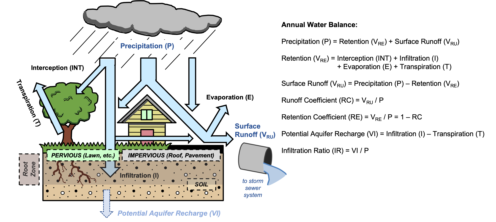
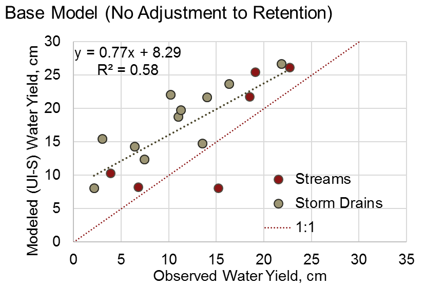

.. _stormwater:

***********************************************
Urban Stormwater Retention Model
***********************************************

Overview
========

Planning agencies are increasingly considering urban water management in their strategies to address issues such as climate change, flood risk, or population growth, while protecting the environment. The InVEST stormwater runoff retention model can support this effort by providing information on two ecosystem services related to stormwater management: runoff retention, and groundwater recharge (Flood risk reduction is assessed in a separate InVEST model, :ref:`Urban Flood Risk Mitigation <ufrm>`). Runoff retention has two aspects: runoff quantity, and runoff quality. Specifically, it corresponds to the retention of stormwater (rainfall-runoff) by pervious land uses, which is beneficial given the detrimental effects of polluted stormwater discharge into rivers or the ocean. Groundwater recharge is a related service, corresponding to the percolation of stormwater past the root zone, potentially recharging groundwater for human and non-human purposes. A secondary output of the model is an estimate of the surface runoff, or the portion of stormwater that is not retained by the landscape and exported along with associated nutrients or pollutants. These major components of the urban water balance are illustrated in :numref:`hydro-schematic`.

Retention, groundwater recharge, and surface runoff are estimated by the model for an annual time scale, rather than that of a single storm event. This is the primary distinction between InVEST’s Stormwater Retention and Flood Risk Mitigation models: the former is intended to assess the more general hydrologic services provided by the landscape in response to a year’s precipitation, in which primary planning concerns are related to surface water quality and water supply, while the latter model is intended to assess the services provided by the landscape in response to a single large (“extreme”) storm event, in which flooding is the primary concern.

The Model
=========

The model calculates annual stormwater retention volume and the associated water quality benefits (i.e., avoided transport of nutrients or pollutants to lakes, streams, or estuaries that receive runoff). The value of the retention service may be calculated using a replacement cost of stormwater infrastructure. Optionally, the model can also provide estimates of potential groundwater recharge to the aquifer, as well as the stormwater exported in surface runoff (as volume and mass of pollutants or nutrients). An overview of the urban rainfall-runoff water balance, illustrating these major fluxes of water, is shown in :numref:`hydro-schematic` below.

.. _hydro-schematic:

   Major hydrologic fluxes in the urban stormwater balance, illustrating potential fates of incoming precipitation as it falls on pervious surfaces (soil or vegetation, such as lawns and trees) and impervious surfaces (rooftops and paved surfaces). Potential aquifer recharge is estimated during dry weather periods as the difference between the volume of infiltrated rainfall and the volume of water transpired by vegetation over a soil depth in which most plant roots may be found.

Estimate stormwater retention, recharge, and runoff
^^^^^^^^^^^^^^^^^^^^^^^^^^^^^^^^^^^^^^^^^^^^^^^^^^^^^^^

The model requires values of the annual runoff coefficients (:math:`RC`), and optionally the recharge ratios (:math:`IR`), for each land use-land cover (LULC) type in the biophysical table. The runoff coefficient is defined as the ratio between annual surface runoff and annual precipitation, a value between 0 and 1, while the recharge ratio is the ratio between annual percolation to groundwater (“potential aquifer recharge”) and annual precipitation (:numref:`hydro-schematic`). These coefficients will typically be a function of the land cover and soil properties in a watershed; see `Input Guidance`_ for further details on determining these values.

For each LULC class :math:`x`, the stormwater retention coefficient :math:`RE_x` is calculated as:

.. math:: RE_x=1-RC_x

Based on the LULC and hydrologic soil group rasters, the model assigns the stormwater retention coefficients (:math:`RE_i`) to each pixel :math:`i`. Next, the model computes :math:`V_{RE,i}`, the retained volume (:math:`m^3/yr`) for each pixel :math:`i` as:

.. math:: V_{RE,i}=0.001\cdot P_i\cdot RE_i\cdot pixel.area

where :math:`P_i` is annual precipitation on pixel :math:`i` (:math:`mm/yr`) and :math:`pixel.area` is the pixel area in :math:`m^2`.

Runoff volume :math:`V_{RU}` (:math:`m^3/yr`) is calculated from the runoff coefficients (:math:`RU` or :math:`RC`): If the Adjust Retention Coefficients option is selected (see below), the runoff coefficients may differ from the input :math:`RC` values, as they are derived from the (adjusted) retention coefficients using the equation below:

.. math:: RU_i=1-RE_i

.. math:: V_{RU,i}=0.001\cdot P_i\cdot RU_i\cdot pixel.area

Optionally, if recharge ratios have been defined by the user, the model assigns these values to each pixel :math:`i` based on the LULC and soil hydrological group rasters, and computes :math:`VI`, the infiltrated volume (:math:`m^3/yr`) for each pixel :math:`i`:

.. math:: VI_i=0.001\cdot P_i\cdot IR_i\cdot pixel.area

Where :math:`IR_i` is the annual recharge ratio on pixel :math:`i` (“potential aquifer recharge”; :numref:`hydro-schematic`).

Adjust Retention Coefficient for directly-connected impervious (Optional)
^^^^^^^^^^^^^^^^^^^^^^^^^^^^^^^^^^^^^^^^^^^^^^^^^^^^^^^^^^^^^^^^^^^^^^^^^^^^^^^^^^
Retention on a given pixel, at least when considered at an aggregated sub-watershed scale, should be affected by retention on upstream and downstream pixels. (For example, the current InVEST nutrient delivery ratio model takes this into account through a flowpath delineation and retention length framework, which is not as feasible in an urban drainage network because of how storm drains alter surface and sub-surface flow paths.) To account for this retention of runoff flowing to surrounding pixels, the stormwater model optionally uses a simple modification to retention. The retention coefficient, :math:`RE_{i}`, for pixel :math:`i` is adjusted upwards based on the retention value of its neighboring pixels within a certain retention radius. The adjustment, :math:‘C_{i}`, is applied to the un-retained runoff from a given pixel, as follows:

.. math:: RE^{adj}_{i} = RE_{i} + (1 - RE_{i})\cdot C_{i}
   :label: adjusted_retention_coefficient

where :math:`RE^{adj}_{i}` is the adjusted retention coefficient, and the adjustment factor :math:‘C_{i}` has one of the following values:

* 0, if the pixel :math:`i` is near a directly-connected impervious area and/or near a road.
* :math:`R_{mean,i}`, otherwise

A pixel is "near" a directly-connected impervious area if its centerpoint is within a radius :math:`l` of the centerpoint of a pixel whose LULC class is marked as connected (has a 1 in the biophysical table ``is_connected`` column)
A pixel is "near" a road if its centerpoint is within a radius :math:`l` of the centerpoint of a road pixel (determined by rasterizing a road centerlines vector).

:math:`R_{mean,i}` is the average retention coefficient of the pixel :math:`i` and its valid neighboring pixels. "Neighboring" pixels are those which are not further than the retention radius :math:`l` from :math:`i`, measured centerpoint-to-centerpoint.

In other words, no additional retention is provided by surrounding land if the pixel is considered directly-connected, i.e., is near dense urban land use or roadways, which in most urban areas are directly connected to the drainage network by ditches or sub-surface pipes. Otherwise, the pixel’s retention coefficient is increased proportional to the retention provided by its neighboring pixels.

**Note 1 on Connectedness:** The consideration of connectedness to the drainage network is somewhat subjective but should be dictated by the land cover layer being used. Thus, determination of "connectedness" is left up to the user, since land use / land cover layers might have more (or less) detail, depending on availability. The default characterization of connectedness (see the sample table in `Input Guidance`_below) is based on the US National Land Cover Database (NLCD) and on assumptions of the connectedness of its most “developed” categories. More specifically, NLCD has broad categories of development intensity (Open, Low, Medium, and High) that are essentially bins of imperviousness, and we made the assumption that the "High" and "Medium" development categories would likely be fully connected to storm sewer systems (i.e. given a value of 1 for the ``is_connected`` column in the biophysical table), due to having > 50% imperviousness per the NLCD specification. The Low and Open categories were lower imperviousness (< 50%) and might contain some cover types like parks that are not connected and/or provide more retention, and were assumed effectively disconnected (value of 0 for ``is_connected``). Finally, the use of an optional **road line layer**, a dataset commonly available for cities, provides further classification of pixels with direct connection to the storm drain network (a calculation the model handles internally).

**Note 2 on Retention Radius :math:`l`:** This is the distance from a pixel over which to check for connectedness to the storm drainage network and/or consider additional retention. Another way to consider the parameter is as the maximum overland distance runoff might travel in an urban watershed before encountering connected pavement or infiltrating completely, and this might differ slightly depending on land use. For example, if the depth of a typical residential lot is 40 m, then the maximum drainage distance on the parcel to either the street (front) or the alley (back) is roughly 20 m, and thus 20 m (or less) might be an appropriate retention radius to use for a land use that is primarily dense residential.

`Other Considerations`: This approach produces additional retention in large pervious areas such as agriculture, parks, golf courses, and cemeteries, and should provide improved accuracy in more developed watersheds, where the assumption of direct connectedness of roadways is more probable due to the prevalence of piped, curb-and-gutter roadways. However, the approach may “over-correct” (under-predict) retention for more rural watersheds, especially those with primarily ditched roadways, where the assumption of direct connection of roadways may fall short due to additional retention that might occur in ditches due to increased residence time and/or infiltration. Further, it is acknowledged that this approach may incur some error due to use of a retention radius, rather than considering connectedness or retention in only the downslope direction (the direction water would be moving), but the efficiency of this approach likely outweighs potential inaccuracies. A simple test of the adjustment for gauged watersheds in the Minneapolis-St. Paul, MN (USA) metropolitan area is shown in the Appendix (this study only considered the eight adjacent cells rather than a radius; the model uses a radius to reduce dependence on pixel size).

Calculate water quality benefits of stormwater retention (Optional)
^^^^^^^^^^^^^^^^^^^^^^^^^^^^^^^^^^^^^^^^^^^^^^^^^^^^^^^^^^^^^^^^^^^

The potential water quality impact of stormwater retention is determined as the pollutant mass associated with retained stormwater, i.e. the amount of pollutant load avoided. The annual avoided pollutant load, in :math:`kg/yr`, is calculated for each pixel :math:`i` as the product of retained volume (:math:`m^3/yr`) and the event mean concentration (:math:`EMC`) of a pollutant, in :math:`mg/L`:

.. math:: Avoided.load_i=0.001\cdot V_{RE,i}\cdot EMC

Similarly, the annual pollutant load (:math:`kg/yr`) exported by surface runoff is calculated from the runoff volume:

.. math:: Load_i=0.001\cdot V_{RU,i}\cdot EMC

EMCs for each pollutant are assigned to land use classes using the biophysical table. Nitrogen and phosphorus are common pollutants of interest, but any stormwater pollutants (such as sediment, metals, or organic compounds) may be used by providing EMC values for those pollutants in the biophysical table. If no pollutants are included, this step is skipped.

Valuation of stormwater retention service (Optional)
^^^^^^^^^^^^^^^^^^^^^^^^^^^^^^^^^^^^^^^^^^^^^^^^^^^^

A review of the most common valuation methods for the stormwater retention service can be found in a report for local government (Catchlove, 2020). If stormwater regulations exist, the user can assess the value of stormwater retention with the target retention volume as a reference. The economic value can be assessed if the average value of retention device (currency/volume) is available.

.. math:: Retention.cost=PR\cdot V_{RE}
   :label: retention-value

where :math:`PR` is the replacement cost of stormwater retention (currency per volume, e.g., :math:`$/m^3`). For example, Simpson and McPherson (2007) estimate this to be :math:`$1.59/m^3` for urban areas in the San Francisco Bay Area (California, USA).

The model can output potential groundwater recharge volume (:math:`VI`), which may also serve as a valuation of retention. However, the model does not currently estimate the pollutant load associated with this recharge volume, as sub-surface transport and transformation of pollutants is not implemented in the model.

Aggregation at the watershed scale (Optional)
^^^^^^^^^^^^^^^^^^^^^^^^^^^^^^^^^^^^^^^^^^^^^

Users may provide a polygon vector file outlining areas over which to aggregate data (typically watersheds or sewersheds). The model will aggregate the output rasters to compute:

- Average stormwater retention ratio (average of :math:`RE` values)
- Total retention volume, :math:`m^3` (sum of :math:`V_{RE}` values)
- Total retained pollutant load for each pollutant, :math:`kg/yr` (sum of :math:`Avoided.load` values)
- Total runoff volume, :math:`m^3` (sum of :math:`V_{RU}` values)
- Total pollutant load for each pollutant, :math:`kg/yr` (sum of :math:`Load` values)
- Total potential recharge volume, :math:`m^3` (sum of :math:`VI`, if recharge ratios provided)
- Total Replacement Cost, currency units (sum of replacement cost of retention services, if value specified)

Data Needs
==========

- :investspec:`stormwater workspace_dir`

- :investspec:`stormwater results_suffix`

- :investspec:`stormwater lulc_path`

- :investspec:`stormwater soil_group_path`

- :investspec:`stormwater precipitation_path`

- :investspec:`stormwater biophysical_table`

  Columns:

    - :investspec:`stormwater biophysical_table.columns.lucode`
    - :investspec:`stormwater biophysical_table.columns.is_connected`
    - :investspec:`stormwater biophysical_table.columns.rc_a`
    - :investspec:`stormwater biophysical_table.columns.rc_b`
    - :investspec:`stormwater biophysical_table.columns.rc_c`
    - :investspec:`stormwater biophysical_table.columns.rc_d`
    - :investspec:`stormwater biophysical_table.columns.ir_a`
    - :investspec:`stormwater biophysical_table.columns.ir_b`
    - :investspec:`stormwater biophysical_table.columns.ir_c`
    - :investspec:`stormwater biophysical_table.columns.ir_d`
    - :investspec:`stormwater biophysical_table.columns.emc_[POLLUTANT]`

- :investspec:`stormwater adjust_retention_ratios`

- :investspec:`stormwater retention_radius`

- :investspec:`stormwater road_centerlines_path`

- :investspec:`stormwater replacement_cost` Available from national or regional studies (e.g. EPA report for the US: https://www3.epa.gov/npdes/pubs/usw_d.pdf). Representative value of $1.59 USD/m3 from Simpson and McPherson (2007).

- :investspec:`stormwater aggregate_areas_path` Watersheds can be obtained with the DelineateIt model.

Interpreting Results
====================

Final Outputs
^^^^^^^^^^^^^
Note: unless otherwise stated, all ratios (e.g. retention ratio) or coefficients (e.g. runoff coefficients), whether at the pixel level or as averages over a watershed, are expressed as decimals with a value between 0 and 1.

- **retention_ratio.tif**: A raster derived from the LULC raster and biophysical table `RC_x` columns, where each pixel's value is the stormwater retention ratio in that area

- **adjusted_retention_ratio.tif** (only if "adjust retention ratios" is selected): A raster of adjusted retention ratios, calculated according to equation :eq:`adjusted_retention_coefficient` from the ‘retention_ratio, ratio_average, near_road’, and ‘near_connected_lulc’ intermediate outputs

- **retention_volume.tif**: Raster map of retention volumes in :math:`m^3/yr`

- **recharge_ratio.tif**: (if recharge data provided) Raster map of recharge ratios derived by cross-referencing the LULC and soil group rasters with the biophysical table

- **recharge_volume.tif**: (if recharge data provided) Raster map of recharge volumes in :math:`m^3/yr`

- **runoff_ratio.tif**: A raster derived from the retention ratio raster, where each pixel's value is the stormwater runoff ratio in that area. This is the inverse of **retention_ratio.tif** (:math:`runoff = 1 - retention`).

- **runoff_volume.tif**: Raster map of runoff volumes in :math:`m^3/yr`

- **retention_value.tif**: (if value data provided) Raster map of the value of the water retained on each pixel in :math:`currency/yr` according to equation :eq:`retention-value`

- **aggregate.gpkg**: (if aggregate vector provided) Vector map of aggregate data. This is identical to the aggregate areas input vector, but each polygon is given additional fields with the aggregate data:

    - **mean_retention_ratio**: Average retention ratio over this polygon

    - **total_retention_volume**: Total retention volume over this polygon in :math:`m^3/yr`

    - **mean_runoff_ratio**: Average runoff coefficient over this polygon

    - **total_runoff_volume**: Total runoff volume over this polygon in :math:`m^3/yr`

    - **mean_recharge_ratio** (if recharge data provided): Average recharge ratio over this polygon

    - **total_recharge_volume** (if recharge data provided): Total recharge volume over this polygon in :math:`m^3/yr`

    - **p_total_avoided_load** (for each pollutant :math:`p`): Total avoided amount of pollutant over this polygon in :math:`kg/yr`

    - **p_total_load** (for each pollutant :math:`p`): Total amount of pollutant in runoff over this polygon in :math:`kg/yr`

    - **total_retention_value** (if value data provided): Total value of the retained volume of water over this polygon in :math:`currency/yr`

Intermediate Outputs
^^^^^^^^^^^^^^^^^^^^

- **lulc_aligned.tif**: Copy of the soil group raster input, cropped to the intersection of the three raster inputs

- **soil_group_aligned.tif**: Copy of the soil group raster input, aligned to the LULC raster and cropped to the intersection of the three raster inputs

- **precipitation_aligned.tif**: Copy of the precipitation raster input, aligned to the LULC raster and cropped to the intersection of the three raster inputs

- **reprojected_centerlines.gpkg**: Copy of the road centerlines vector input, reprojected to the LULC raster projection

- **rasterized_centerlines.tif**: A rasterized version of the reprojected centerlines vector, where 1 means the pixel is a road and 0 means it isn't

- **is_connected_lulc.tif**: A binary raster derived from the LULC raster and biophysical table `is_connected` column, where 1 means the pixel has a directly-connected impervious LULC type, and 0 means it does not

- **road_distance.tif**: A raster derived from the rasterized centerlines map, where each pixel's value is its minimum distance to a road pixel (measured centerpoint-to-centerpoint)

- **connected_lulc_distance.tif**: A raster derived from the **is_connected_lulc** map, where each pixel's value is its minimum distance to a connected impervious LULC pixel (measured centerpoint-to-centerpoint)

- **near_road.tif**: A binary raster derived from the **road_distance** map, where 1 means the pixel is within the retention radius of a road pixel, and 0 means it isn't

- **near_connected_lulc.tif**: A binary raster derived from the **connected_lulc_distance** map, where 1 means the pixel is within the retention radius of a connected impervious LULC pixel, and 0 means it isn't

- **search_kernel.tif**: A binary raster representing the search kernel that is convolved with the **retention_ratio** raster to calculate the averaged retention ratio within the retention radius of each pixel

- **ratio_average.tif**: A raster where each pixel's value is the average of its neighborhood of pixels in the **retention_ratio** map, calculated by convolving the search kernel with the retention ratio raster

.. _Input Guidance:

Input Guidance
==============

Runoff Coefficients and recharge Ratios
^^^^^^^^^^^^^^^^^^^^^^^^^^^^^^^^^^^^^^^^^^^

**Using reported data:** Runoff coefficients are commonly reported in studies of watersheds of various sizes and land use settings (urban to rural). In some cases, these studies may be available for the locations in which the Stormwater Retention model is to be applied, and reported runoff coefficients could be used directly in place of the default values. However, if these are not specified by land use in available studies, then they will be difficult to implement in the model, and default or best-guess estimates of runoff coefficients may have to be used. The model output could then be checked against the reported values as a calibration step. If runoff coefficients are known as a function of LULC type but not per hydrologic soil group (HSG), as may often be the case, then specify the same :math:`RC` value for each HSG within a given LULC type (i.e., `RC_A`, `RC_B`, `RC_C`, and `RC_D` will all have the same value in one row of the biophysical table). Do NOT leave any blanks in the biophysical table or remove required columns (:math:`lucode`, :math:`RC_x`, :math:`IR_x`).

**Other methods of estimating runoff coefficients:** If runoff coefficients for each LULC type are not found from previous studies, they may be determined from the following approaches:

- the EPA stormwater runoff calculator in the US (https://swcweb.epa.gov/stormwatercalculator/);

- any (monthly or daily time scale) rainfall-runoff model that calculates stormwater runoff and actual evapotranspiration (in mm/yr) for general LC classes (e.g., SWMM software; see example below)

- the monthly approach used in the InVEST seasonal water yield model. The model requires monthly precipitation and evapotranspiration (ET) values for a representative site in the landscape, as well as Curve Number (CN) values for the SCS-Curve Number method (NRCS-USDA 2004).

Note that runoff coefficients for pervious land covers and bare soil should be defined for each soil hydrologic group (even if all have the same value). `RC` for water is set to 1.

**Estimating runoff coefficients (and recharge ratios) from a SWMM model:** SWMM can be used to estimate runoff coefficients for a study area using a simple implementation of SWMM with a combination of basic land cover types and the four soil hydrologic groups (A, B, C, D). The approach is described in the SI of Hamel et al. (2021):
“The [SWMM] model consisted of several synthetic watersheds (100-m long, 10-m wide), each of which had uniform land cover comprised of bare (unvegetated), pervious (vegetated), or impervious surface; the latter two categories included instances both with and without tree canopy (e.g., ‘pervious without tree cover’), for a total of five synthetic watersheds. One set of these five watersheds was included for each of the four hydrologic soil groups (HSG; i.e., A, B, C, or D) for a total of 20 synthetic watersheds. We ran the SWMM model in a continuous simulation with 10 years (2008-2017) of local climate data (Minneapolis-St. Paul International Airport), using Horton infiltration and kinematic wave surface routing models, with snowmelt and aquifer transport enabled. Separate aquifers were defined for each soil class (differing only in infiltration capacity), and initial soil moisture conditions were average, though the use of a 10-year continuous simulation should reduce the effects of this assumption. Resulting runoff coefficients for the basic land cover classes ... were determined as the average over the entire 10-year period (rather than an average of 10 annual coefficients).”

Recharge ratio (:math:`IR`), an estimate of potential groundwater recharge, was also estimated from these SWMM models by computing the difference between infiltrated rainfall and total evapotranspiration by vegetation, and normalizing this difference by total rainfall.

The next step was to assign or aggregate the runoff coefficients from these basic SWMM land cover types (“SW_Type" in the sample table below) to values of runoff coefficient for all cover classes in the LULC input raster (in this case, the NLCD land cover data). For some classes, assignment was straightforward: for example, the NLCD classes “scrub/shrub”, “grassland”, and “pasture/hay” were assigned the runoff coefficients for “pervious without tree canopy” (`SW_Type`=3). Classes of mixed basic cover type (impervious + pervious, canopy + open), such as “developed” classes in NLCD, required aggregation of the SW_Type based on assumptions of imperviousness and canopy levels. We assumed an imperviousness from the midpoint of interval per NLCD definition, and further assumed 50% tree cover for the basic cover types. As an example, the “high-intensity urban” NLCD class represents urban areas with 80 - 100% total impervious area (nominal value 90%): it was assigned a retention coefficient that was weighted 90% impervious, half with tree cover (so 45% “impervious without canopy” (`SW_Type`=1) and 45% “impervious without canopy” (`SW_Type`=2)) and 10% pervious, half with tree cover (so 5% “pervious without canopy” (`SW_Type`=3) and 5% “pervious with canopy” (`SW_Type`=4)). This approach produced runoff coefficients ranging from 0.76 – 0.79 for the four HSG types. Recharge ratios (:math:`IR`) were assigned to land use classes using the same approach.

Example of Runoff Coefficient and Recharge Ratio table with values specified by basic SWMM land cover type (`SW_Type`) and A/B/C/D soil hydrologic group (for pervious and bare soil). Values derived from SWMM simulations using 10 years of hourly weather data (2008 - 2017) at Minneapolis-St. Paul Airport, MN, USA.

.. csv-table:: **Example Runoff and Recharge Coefficients**
      :file: ./stormwater/example_coefficients.csv
      :header-rows: 1

Pollutant Event Mean Concentrations
^^^^^^^^^^^^^^^^^^^^^^^^^^^^^^^^^^^
Pollutant event mean concentrations (EMC) may be specified by the user for any pollutant of interest. EMCs are commonly reported in watershed studies and databases (e.g., https://bmpdatabase.org), but volume-weighted concentrations from previous studies would be more accurate to specify here if available. This is because the EMC values used by the model are applied to annual runoff values.

Default values for nitrogen and phosphorus for the urban-specific NLCD land use classes are provided in the sample biophysical table above and were be obtained from the US National Stormwater Quality Database (bmpdatabase.org/nsqd.html), which includes data for over 7,000 samples collected from 500+ sites over the past 30 years across the U.S., as well as from some previous summaries on less-developed land uses (Lin 2004; King and Balogh. 2011). Note: Pitt et al. (2018) found that EMCs in this database were significantly affected by land use, region, and season.

These data are reported with generic land use classifications (e.g. “residential”, “commercial”, “industrial”) and need to be adapted to the LULC types provided by the user. Often, a subset of these data with information on total imperviousness of the monitored watersheds can be used to aggregate sites by imperviousness, similar to the approach (outlined above) used to aggregate runoff coefficients for basic SWMM land cover types to more complex classes in the NLCD land cover data. Nitrogen and phosphorus concentrations for non-urban classes can be obtained from literature summaries, e.g. Line et al. 2002, Maestre and Pitt 2005, Lin 2004, Tetra Tech 2010, and King et al. 2011.

Users are encouraged to use results from local studies or other relevant literature values as appropriate, e.g., http://dcstormwaterplan.org/wp-content/uploads/AppD_EMCs_FinalCBA_12222014.pdf). Typically, pollutant concentrations will be reported as event mean concentrations (EMC). EMC data are acceptable for the coarse load estimate approach used by the Model, but use of volume-weighted concentrations, if available, would provide greater accuracy in the results due to the approach of estimating pollutant loads from multiplying the retention (or runoff) volume by a characteristic concentration.

Representing stormwater retention techniques
~~~~~~~~~~~~~~~~~~~~~~~~~~~~~~~~~~~~~~~~~~~~

Individual stormwater retention techniques like biofilters, bioretention cells, or swales can be represented by a unique LULC category, with a negative runoff coefficient, corresponding to the depth of catchment runoff they capture divided by the precipitation depth on the pixel. This requires the catchment area for the techniques to be known.

Appendix 1: Assessing the Retention Coefficient Adjustment
==========================================================
**Rationale**: A primary concern with a grid-based approach to runoff modeling is that when aggregating results at a watershed or study site-scale, the runoff and retention loads are calculated as the sum of loads generated on every pixel – i.e. the runoff generated on each pixel is assumed to enter the drainage network of the watershed, with no chance to be retained as it moves through the network. This is a fair assumption in highly developed areas, where flow path length (i.e., distance surface runoff travels before entering a storm drain) is likely not greater than the size of the pixels (30m in U.S. NLCD/C-CAP). This was also the assumption inherent in the SWMM model as implemented to estimate runoff coefficients, in which all runoff was routed directly to the outlet. However, in areas with substantial greenspace such as parks, cemeteries, and golf courses, and potentially outside the urban core where residential development might be less dense, “direct connection” of all constituent grid cells would lead to over-predicted loads and volumes, as additional runoff retention could be provided by infiltration in pervious areas located between pervious pixels and the storm drain network. Further, the lack of routing also prevents any context analysis in the stormwater model; runoff being generated on a pixel (or a collection of pixels making up a parcel of interest, such as a golf course) is not affected by its surrounding land, nor does it have any effect on its downstream or neighboring pixels. The configuration or location of land uses within the watershed of interest have no bearing on the output, only the total amount of each land use.

Discharge data for 18 watersheds located across the metropolitan area of Minneapolis-St. Paul MN, USA (“Twin Cities” Metro Area, or TCMA) were used for testing the Stormwater Retention model. These data were collected by a number of state agencies, and were publicly available. The sites could be roughly categorized by the flow regime and type of system being monitored:
Large storm drains monitored by several watershed management organizations (Mississippi Watershed Management Organization, www.mwmo.org; Capitol Region Watershed District, www.capitolregionwd.org/monitoring-research/data/; South Washington Watershed District, wq.swwdmn.org), in which discharge was monitored annually, and for which mean annual stormflow volumes had already been determined [n=10 sites, plus 1 stream site monitored as part of stormwater permitting];
Stream gauging sites, monitored by the Metropolitan Council Environmental Services (https://eims.metc.state.mn.us) and maintained by several local watershed districts, in which annual total (baseflow + stormflow) discharge were determined for periods of 10+ years [n = 6 sites].
For the stream gauging sites (Group 2), in which year-round monitoring has been done for 6-30 years (depending on site/constituent), data are generally of high quality, and drainage areas are known. However, the flow volumes include baseflow, which does not allow for direct comparison to Runoff Retention model, though the sites were still tested as a case study. Only the past 10 years of data were included so that the land use classification used to run the Stormwater Retention model (U.S. NLCD, derived in 2013) was roughly contemporary with the gauging data; some of the watersheds have undergone substantial development over the previous 20-30 years.

**Input data** included 30-m U.S. NLCD land cover classification, HSG from the NRCS-USDA Soil Survey, road lines from the state of Minnesota (gisdata.mn.gov), drainage delineations and rainfall from Metropolitan Council and respective watershed districts, with additional rainfall data from Minneapolis-St. Paul Airport (retrieved from Midwest Regional Climate Center, mrcc.purdue.edu).

**Results:** Results of application of the Stormwater Retention model to the 18 TCMA gauging sites, both with and without the retention adjustment, are shown in the figures below. Overall, the base version of the Stormwater Retention model tended to over-predict observed runoff volumes for both streams and storm drain sites. Accuracy in simulation of runoff volumes was greatly improved overall when using the retention adjustment, though this was driven primarily by improvements for the storm drain sites. As these sites were generally more urban (developed), the adjusted retention appears to be an effective method to improve simulation of relatively complex connectedness in urban watersheds -- a primary purpose of the development of the Stormwater Retention model as an alternative to the NDR model.

In less developed watersheds (i.e. the streams sites), it was anticipated that under-prediction of retention (over-prediction of runoff) might have resulted from the assumption of direct connection of roadways; instead, the model seems to have over-predicted retention (under-predicted runoff) in the rural watersheds. Two factors may have led to this issue: (1) stream data included baseflow, which is not predicted by the Stormwater Retention model (which includes surface runoff only), so the simulated volumes are expected to be less than the observed volumes; and (2) the presence of drain tile in agricultural (or golf course) land use might cause some pervious land cover to be more “directly connected” than the coarse retention adjustment would predict.

.. figure:: ./stormwater/with_adjustment.png

Comparison of Modeled vs. Observed Water Yield (cm) for Twin Cities Metro Area stream and storm drain sites using the adjusted retention coefficients.

Comparison of Modeled vs. Observed Water Yield (cm) for Twin Cities Metro Area stream and storm drain sites using the default retention coefficients.

.. csv-table:: **RMSE and MAE parameters for base and adjusted models**
   :file: ./stormwater/base_vs_adjusted.csv
   :header-rows: 1

Appendix 2: Differences between InVEST and other models
=======================================================

In contrast to the existing InVEST Water Yield and Nutrient Delivery Ratio models, the Stormwater retention model is concerned primarily with surface runoff, rather than total runoff (surface and sub-surface), and designed to be implemented in urban and developing watersheds. The model uses widely available satellite-derived raster datasets, such as land cover and elevation, along with user inputs in the form of target sub-watersheds or jurisdictional boundaries for aggregation of metrics (spatial data) and, optionally, location-specific runoff and water quality parameters (tabular data). In this respect, the model is very similar to other tools, including iTree and OpenNSPECT.

OpenNSPECT (Open-source Nonpoint Source Pollution and Erosion Comparison Tool; https://coast.noaa.gov/digitalcoast/tools/opennspect.html) is a water quality scenario tool developed in 2014 by the U.S. National Oceanic and Atmospheric Administration (NOAA).
It was designed to rapidly assess scenarios of land use and climate change impacts to water, nutrient, and sediment loading in developing watersheds. Inputs are primarily in raster format, and include C-CAP or NLCD land cover (30-m resolution), elevation (up to 1m resolution), and soil hydrologic group (USDA soil surveys), as well as event- or annual-scale precipitation (gridded or station-based). Runoff is generated on each pixel using the SCS Curve Number method, taking into account land cover and soil type (hydrologic group) and including a modification for annual runoff. Mass of nutrients (load) exported from each pixel is determined as the product of this runoff volume and a mean nutrient runoff concentration (nitrogen or phosphorus) characteristic of the pixel’s land cover type. A flow direction raster is derived from the elevation data, and used to produce flow paths and drainage basin delineations over which runoff volumes and nutrient loads are routed and aggregated.

The general approach to modeling runoff and water quality in the proposed model is nearly identical to OpenNSPECT, with the following differences:
Runoff is generated on each pixel based on runoff coefficients (runoff depth divided by rainfall depth) rather than curve number. Runoff coefficients are a function of land cover and soil hydrologic group, and are prescribed by the model but can be modified by the user based on output of other models (e.g. SWMM), local hydrology data, modified curve numbers, etc.;
The model estimates potential groundwater recharge through use of an recharge ratio parameter, which is also prescribed by the model based on SWMM simulations in test watersheds but can be modified by the user.

For additional resources for further hydrologic studies, see Beck et al. 2017.

References
==========

Arkema, K. K., Griffin, R., Maldonado, S., Silver, J., Suckale, J., & Guerry, A. D. (2017). Linking social, ecological, and physical science to advance natural and nature-based protection for coastal communities. https://doi.org/10.1111/nyas.13322

Beck, N. G., Conley, G., Kanner, L., & Mathias, M. (2017). An urban runoff model designed to inform stormwater management decisions. Journal of Environmental Management, 193: 257-269. https://doi.org/10.1016/j.jenvman.2017.02.007.

Balbi, M., Lallemant, D., & Hamel, P. (2017). A flood risk framework for ecosystem services valuation: a proof-of-concept.

King, K.W. and Balogh, J. (2011). Stream water nutrient enrichment in a mixed-use watershed. J. Environ. Monit, 13: 721-731.

Lin, J.P. (2004). Review of published export coefficient and event mean concentration (emc) data. Wetlands Regulatory Assistance Program. ERDC TN-WRAP-04-3. Sep 2004.

Line, D.E., White, N.M., Osmond, D.L., Jennings, G.D. and Mojonnier, C.B. (2002). Water Environment Research, 74(1): 100-110.

Maestre, A. and Pitt, R. (2005). The National Stormwater Quality Database, Version 1.1: A Compilation and Analysis of NPDES Stormwater Monitoring Information. Center for Watershed Protection; Ellicott City, MD. Sep 4, 2005.

NRCS-USDA. (2004). Chapter 10. Estimation of Direct Runoff from Storm Rainfall. In United States Department of Agriculture (Ed.), Part 630 Hydrology. National Engineering Handbook. Retrieved from http://www.nrcs.usda.gov/wps/portal/nrcs/detailfull/national/water/?cid=stelprdb1043063

Pitt, R., Maestre, A. & Clary, J. (2018). The National Stormwater Quality Database (NSQD), Ver 4.02. Retrieved from http://www.bmpdatabase.org/Docs/NSQD_ver_4_brief_Feb_18_2018.pdf

Sahl, J. (2015). Economic Valuation Approaches for Ecosystem Services: a literature review to support the development of a modeling framework for valuing urban stormwater management services.

Simpson, J.R. and McPherson, E.G. (2007). San Francisco Bay Area State of the Urban Forest Final Report. Center for Urban Forest Research, USDA Forest Service Pacific Southwest Research Station. Davis, CA. Dec 2007: 92 pp.

Tetra Tech, Inc. (2010). Stormwater Best Management Practices (BMP) Performance Analysis. Prepared for U.S. E.P.A. Region 1. Fairfax, VA. 232 pp.
