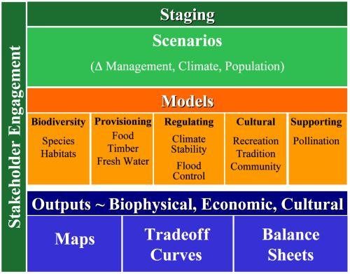

.. _the-need-for:

***********************
The Need for a New Tool
***********************

Introduction
============

Ecosystems, if properly managed, yield a flow of services that are vital to humanity, including the production of goods (e.g., food), life support processes (e.g., water purification), and life fulfilling conditions (e.g., beauty, recreation opportunities), and the conservation of options (e.g., genetic diversity for future use). Despite its importance, this natural capital is poorly understood, scarcely monitored, and—in many cases—undergoing rapid degradation and depletion. To better align ecosystem conservation with economic forces, the Natural Capital Project is developing models that quantify and map the values of environmental services. The modeling suite is best suited for analyses of multiple services and multiple objectives. The current models, which require relatively little data input, can identify areas where investment may enhance human well-being and nature. We are continuing development of the models and will release new, updated versions as they become available.

Who should use InVEST?
======================

InVEST is designed to inform decisions about natural resource management. Essentially, it provides information about how changes in ecosystems are likely to lead to changes in the flows of benefits to people.  Decision-makers, from governments to non-profits to corporations, often manage lands and waters for multiple uses and inevitably must evaluate trade-offs among these uses. ; InVEST’s multi-service, modular design provides an effective tool for exploring the likely outcomes of alternative management and climate scenarios and for evaluating trade-offs among sectors and services. For example, government agencies could use InVEST to help determine how to manage lands, coasts, and marine areas to provide a desirable range of benefits to people or to help design permitting and mitigation programs that sustain nature’s benefits to society. Conservation organizations could use InVEST to better align their missions to protect biodiversity with activities that improve human livelihoods. Corporations, such as timber companies, renewable energy companies, and water utilities, could also use InVEST to decide how and where to invest in natural capital to ensure that their supply chains are preserved.

InVEST can help answer questions like:

+ Where do environmental services originate and where are they consumed?
+ How does a proposed forestry management plan affect timber yields, biodiversity, water quality and recreation?
+ What kinds of coastal management and fishery policies will yield the best returns for sustainable fisheries, shoreline protection and recreation?
+ Which parts of a watershed provide the greatest carbon sequestration, biodiversity, and tourism values?
+ Where would reforestation achieve the greatest downstream water quality benefits while maintaining or minimizing losses in water flows?
+ How will climate change and population growth impact environmental services and biodiversity?
+ What benefits does marine spatial planning provide to society in addition to food from fishing and aquaculture and secure locations for renewable energy facilities?

Introduction to InVEST
======================

InVEST is a tool for exploring how changes in ecosystems are likely to lead to changes in benefits that flow to people. 

InVEST uses a simple framework delineating “supply, service, and value.”   

"Supply" represents what is potentially available from the ecosystem (ie. what the ecosystem structure and function can provide).  For example, this is the wave attenuation and subsequent reduction in erosion and flooding onshore provided by a particular location density of mangrove forest.  "Service" incorporates demand and thus uses information about beneficiaries of that service (e.g., where people live, important cultural sites, infrastructure, etc.). "Value" includes social preference and allows for the calculation of economic and social metrics (e.g., avoided damages from erosion and flooding, numbers of people affected).

The InVEST toolset described in this guide includes models for quantifying, mapping, and valuing the benefits provided by terrestrial, freshwater and marine systems.  We group models in InVEST into three primary categories: 1) supporting services, 2) final services, and 3) tools to facilitate environmental service analyses.  Supporting services underpin other environmental services, but do not directly provide benefits to people.  Final services provide direct benefits to people, and for our models we denote this distinction as Supporting Service/Supply: Final Service. 

Supporting Environmental Services:

+   Marine Water Quality
+   Habitat Risk Assessment
+   Habitat Quality

Final Environmental Services:

+	Wave Attenuation & Erosion Reduction: Coastal Protection (*only in ArcGIS version)

+	Unobstructed Views: Scenic Quality Provision

+	Blue Carbon Storage and Sequestration: Climate Regulation

+	Visitation: Recreation and Tourism

+ 	Wave Energy Production

+	Offshore Wind Energy Production

+	Marine Finfish Aquacultural Production

+	Marine Fisheries Production (*coming soon)

+	Carbon Storage and Sequestration: Climate Regulation

+	Water Yield: Reservoir Hydropower Production

+	Nutrient Retention: Water Purification

+	Sediment Retention: Avoided Dredging and Water Purification

+   Pollinator Abundance: Crop Pollination

+	Managed Timber Production

Tools to Facilitate Environmental Service Analyses:

+   Overlap Analysis

+   Coastal Exposure and Vulnerability

InVEST is most effectively used within a decision-making process that starts with a series of stakeholder consultations (illustrated in Figure 1). Through discussion, questions of interest to policy makers, communities and conservation groups are identified. These questions may concern service delivery on a landscape today and how these services may be affected by new programs, policies, and conditions in the future. For questions regarding the future, stakeholders develop “scenarios” to explore the consequences of expected changes on natural resources. These scenarios typically include a map of future land use and land cover or, for the marine models, a map of future coastal and ocean uses and coastal/marine habitats.

   Schematic of the decision-making process in which InVEST is embedded. Stakeholders create scenarios that are assessed for environmental service value by biophysical and economic models that produce several types of outputs.

Following stakeholder consultations and scenario development, InVEST can estimate the amount and value of environmental services that are provided on the current landscape or under future scenarios. InVEST models are spatially-explicit, using maps as information sources and producing maps as outputs. InVEST returns results in either biophysical terms (e.g., tons of carbon sequestered) or economic terms (e.g., net present value of that sequestered carbon). The spatial resolution of analyses is also flexible, allowing users to address questions at the local, regional or global scale. InVEST results can be shared with the stakeholders and decision-makers who created the scenarios to inform upcoming decisions. Using InVEST in an iterative process, these stakeholders may choose to create new scenarios based on the information revealed by the models until suitable solutions for management action are identified.

InVEST has a **tiered** design. **Tier 0** models map relative levels of environmental services and/or highlight regions where particular services are in high demand. For example, the coastal vulnerability model in InVEST maps regions of the coastline that are particularly susceptible to erosion and flooding. It does not use a production function to yield outputs of meters of shoreline eroded or to value coastal protection services provided by nearshore marine habitats. There is no valuation done in tier 0 models. **Tier 1** models are theoretically grounded but simple. They are suitable when more data are available than are required for Tier 0, but they still have relatively simple data requirements. Tier 1 models can identify areas of high or low environmental service production and biodiversity across the landscape, and the tradeoffs and synergies among services under current or future conditions. Tier 1 models give outputs in absolute terms and provide the option for economic valuation (except for biodiversity).  For example, the Finfish Aquaculture model can provide outputs in lbs. of fish or in $'s.

More complex **Tier 2** models are under development for biodiversity and some environmental services. Tier 2 models provide increasingly precise estimates of environmental services and values, which are especially important for establishing contracts for payments for environmental services programs or assessing scenarios that address change on a sub-annual basis. For example, scenarios that represent a change in the monthly or seasonal timing of fertilizer application or water extraction in agricultural systems cannot be assessed by Tier 1 models, but will be treated well by Tier 2 models.  

We expect users to mix and match Tier 0, 1 and (later) 2 models to create the best suite of models given past work, existing data, and the questions of interest. Although the more sophisticated models require substantial data and time to develop, once they are parameterized for a certain location, they will provide the best available science for new decisions.  In some cases (e.g. for fisheries), complex tier 3-type models already exist in a particular location. The Natural Capital Project will not develop new tier 3 models, but rather sees these as the sophisticated, dynamic models usually developed for individual sites or contexts. We aim to develop the capability of InVEST to communicate with such existing, complex models so that InVEST inputs (e.g. scenarios) can be fed in, and outputs from those complex models can be compared with other InVEST outputs.

InVEST includes a mixture of Tier 0 and Tier 1 models. Tier 2 models for several services have been formulated and documented in *Natural Capital: The Theory & Practice of Mapping Environmental Services*, a book just published by Oxford University Press. We will design the Tier 2 software platform as a space where Tier 0, 1, 2 and 3 models can be integrated as appropriate for different applications.

+------------------------------------------------------------------------------------------+--------------------------------------------------------------------------------------------------------+---------------------------------------------------------+--------------------------------------------------------------------------------+
| TIER 0 Models                                                                            | TIER 1 Models                                                                                          | TIER 2 Models                                           | TIER 3 Models                                                                  |
+==========================================================================================+========================================================================================================+=========================================================+================================================================================+
| Relative values                                                                          | Absolute values                                                                                        | Absolute values                                         | Absolute values                                                                |
+------------------------------------------------------------------------------------------+--------------------------------------------------------------------------------------------------------+---------------------------------------------------------+--------------------------------------------------------------------------------+
| No valuation                                                                             | Valuation done through a suite of approaches                                                           | Valuation done through a suite of approaches            | Valuation done through a suite of approaches                                   |
+------------------------------------------------------------------------------------------+--------------------------------------------------------------------------------------------------------+---------------------------------------------------------+--------------------------------------------------------------------------------+
| Generally not time-specific, or annual average                                           | Annual average time step, no temporal dynamics                                                         | Daily to monthly time step, some temporal dynamics      | Daily to monthly time step, temporal dynamics with feedbacks and thresholds    |
+------------------------------------------------------------------------------------------+--------------------------------------------------------------------------------------------------------+---------------------------------------------------------+--------------------------------------------------------------------------------+
| Appropriate spatial extent ranges from sub-watershed to global                           | Appropriate spatial extent ranges from sub-watershed to global                                         | Appropriate spatial extent ranges from parcel to global | Appropriate spatial extent ranges from parcel to global                        |
+------------------------------------------------------------------------------------------+--------------------------------------------------------------------------------------------------------+---------------------------------------------------------+--------------------------------------------------------------------------------+
| Good for identifying key areas (relatively high risk or environmental service provision) | Good for strategic decisions with absolute values, can be good for tactical decisions with calibration | Good for tactical decisions with absolute values        | More precise estimates of environmental service delivery                       |
+------------------------------------------------------------------------------------------+--------------------------------------------------------------------------------------------------------+---------------------------------------------------------+--------------------------------------------------------------------------------+
| Some environmental service interactions                                                  | Some environmental service interactions                                                                | Some environmental service interactions                 | Sophisticated environmental service interactions with feedbacks and thresholds |
+------------------------------------------------------------------------------------------+--------------------------------------------------------------------------------------------------------+---------------------------------------------------------+--------------------------------------------------------------------------------+

A work in progress
==================

InVEST is a free of cost software product licensed under the BSD open source license.

The development of InVEST is an ongoing effort of the Natural Capital Project. We release updated versions of the toolkit approximately every three months that can include updated science, performance and feature enhancements, bug fixes, and/or new models.  As a historical note, the original InVEST models were built within ArcGIS but now almost all models exist in a standalone form directly launchable from the Windows Operating system with no other software dependencies.  The exception is the "Wave Attenuation & Erosion Reduction: Coastal Protection" model which exists as an ArcGIS toolbox; this tool will be converted to the standalone platform.

A note on InVEST versioning: Integer changes will reflect major changes like the transition from 2.6.0 to 3.0.0 indicates a transition from the Arc-GIS modules to standalone version.  An increment in the digit after the primary decimal indicates major new features (e.g, the addition of a new model) or major revisions. The third decimal reflects minor feature revisions or bug fixes with no new functionality. 

This guide
==========

This guide will help you understand the basics of the InVEST models and start using them. The next chapter leads you through the installation process and provides general information about the tool and interface.

The remaining chapters present the environmental service models.  Each chapter:

+ briefly introduces a service and suggests the possible uses for InVEST results;

+ explains intuitively how the model works, including important simplifications, assumptions, and limitations;

+ describes the data needed to run the model, which is crucial because the meaning and value of InVEST results depend on the input data;

+ provides step-by-step instructions for how to input data and interact with the tool;

+ offers guidance on interpreting InVEST results;

+ includes an appendix of information on relevant data sources and data preparation advice (this section is variable among chapters, and will improve over time from user input).

This guide does not include detailed theoretical discussions of the scientific foundation of the models.  For the terrestrial and freshwater models, these can be found in the new book *Natural Capital: The Theory & Practice of Mapping Ecosystem Services* (Oxford University Press).

