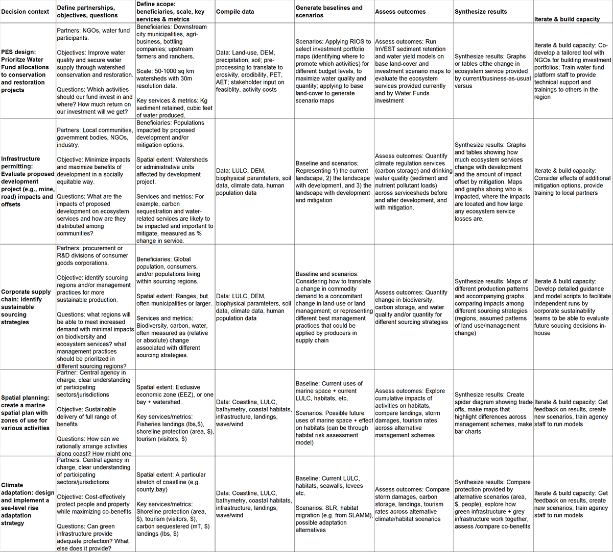

.. _the-need-for:

*****************************************************
Why We Need Tools to Map and Value Ecosystem Services
*****************************************************

Introduction
============

Ecosystems, if properly managed, yield a flow of services that are vital to humanity, including the production of goods (e.g., food), life support processes (e.g., water purification), and life fulfilling conditions (e.g., beauty, recreation opportunities), as well as the conservation of options (e.g., genetic diversity for future use). Despite its importance, this natural capital is poorly understood, scarcely monitored, and—in many cases—undergoing rapid degradation and depletion. To bring understanding of nature’s values into decisions, the Natural Capital Project is developing models that quantify and map the values of ecosystem services. The modeling suite is best suited for analyses of multiple services and multiple objectives. The current models, which have low data requirements relative to more complex tools, can identify areas where investment may enhance human well-being and nature. We are continuing to refine existing models and to develop new ones.

We use the Millennium Ecosystem Assessment (2005) definition of the term ecosystem services: “the benefits people obtain from ecosystems.” Ecosystems incorporate both biotic and abiotic components and we thus consider “ecosystem services” and “environmental services” to be equivalent. Natural capital is the living and non-living components of ecosystems that contribute to the provision of ecosystem services. Capital assets take many forms including manufactured capital (e.g., buildings and machines), human capital (knowledge, experience, and health), social capital (relationships and institutions), as well as natural capital.

Who Should Use InVEST?
======================

InVEST is designed to inform decisions about natural resource management. Essentially, it provides information about how changes in ecosystems are likely to lead to changes in the flows of benefits to people. Decision-makers, from governments to non-profits to corporations, often manage lands and waters for multiple uses and inevitably must evaluate trade-offs among these uses. InVEST’s multi-service, modular design provides an effective tool for exploring the likely outcomes of alternative management and climate scenarios and for evaluating trade-offs among sectors and services. For example, government agencies could use InVEST to help determine how to manage lands, coasts, and marine areas to provide a desirable range of benefits to people or to help design permitting and mitigation programs that sustain nature’s benefits to society. Conservation organizations could use InVEST to better align their missions to protect biodiversity with activities that improve human livelihoods. Corporations, such as consumer goods companies, renewable energy companies, and water utilities, could also use InVEST to decide how and where to invest in natural capital to ensure that their supply chains are sustainable and secure.

InVEST can help answer questions like:

+ Where do ecosystem services originate and where are they consumed?
+ How does a proposed forestry management plan affect biodiversity, water quality, and recreation?
+ What kinds of coastal management and fishery policies will yield the best returns for sustainable fisheries, shoreline protection, and recreation?
+ Which parts of a watershed provide the greatest carbon sequestration, biodiversity, and tourism values?
+ Where would reforestation achieve the greatest downstream water quality benefits while maintaining or minimizing losses in water flows?
+ How will climate change and population growth impact ecosystem services and biodiversity?
+ In addition to secure locations for renewable energy facilities and food from fishing and aquaculture, what benefits does marine spatial planning provide to society?

Introduction to InVEST
======================

InVEST is a tool for exploring how changes in ecosystems are likely to lead to changes in benefits that flow to people.

InVEST often employs a production function approach to quantifying and valuing ecosystem services. A production function specifies the output of ecosystem services provided by the environment given its condition and processes. Once a production function is specified, we can quantify the impact of changes on land or in the water on changes on the level of ecosystem service output.

InVEST uses a simple framework delineating “supply, service, and value” to link production functions to the benefits provided to people (Figure 1).

.. figure:: ./the_need_for/supply_service_value_new.png
   :alt: schematic
   :align: left
   :scale: 25 %

   The ecosystem service supply chain, linking ecological function to ecosystem services and the benefits provided to people

“Supply” represents what is potentially available from the ecosystem (ie. what the ecosystem structure and function can provide). For example, this would be the wave attenuation and subsequent reduction in erosion and flooding onshore provided by a particular location and density of mangrove forest. “Service” incorporates demand and thus uses information about beneficiaries of that service (e.g., where people live, important cultural sites, infrastructure, etc.). “Value” includes social preference and allows for the calculation of economic and social metrics (e.g., avoided damages from erosion and flooding, numbers of people affected).

The InVEST toolset described in this guide includes models for quantifying, mapping, and valuing the benefits provided by terrestrial, freshwater, and marine systems. We group models in InVEST into four primary categories: 1) supporting services, 2) final services, 3) tools to facilitate ecosystem service analyses and 4) supporting tools. Supporting services underpin other ecosystem services, but do not directly provide benefits to people. Final services provide direct benefits to people. For final services, we split the services into their biophysical supply and the service to people wherever possible. For some final services, we model the service directly, without modeling the supply separately. Supporting tools include helping to create watersheds, do hydrological processing on a digital elevation model and create scenarios that can be used as inputs to InVEST.

Supporting Ecosystem Services:
^^^^^^^^^^^^^^^^^^^^^^^^^^^^^^

+ Habitat Risk Assessment

+ Habitat Quality

+ Pollinator Abundance: Crop Pollination

Final Ecosystem Services:
^^^^^^^^^^^^^^^^^^^^^^^^^

+ Forest Carbon Edge Effect

+ Carbon Storage and Sequestration

+ Coastal Blue Carbon

+ Annual Water Yield

+ Nutrient Delivery Ratio

+ Sediment Delivery Ratio

+ Unobstructed Views: Scenic Quality Provision

+ Visitation: Recreation and Tourism

+ Wave Energy Production

+ Offshore Wind Energy Production

+ Crop Production

+ Seasonal Water Yield

Tools to Facilitate Ecosystem Service Analyses:
^^^^^^^^^^^^^^^^^^^^^^^^^^^^^^^^^^^^^^^^^^^^^^^

+ Overlap Analysis

+ Coastal Vulnerability

Supporting Tools:
^^^^^^^^^^^^^^^^^

+ RouteDEM

+ DelineateIT

+ Scenario Generator

+ Scenario Generator: Proximity Based

Using InVEST to Inform Decisions
================================

Information about changes in ecosystem services is most likely to make a difference when questions are driven by decision-makers and stakeholders, rather than by scientists and analysts. We have found that InVEST is most effective when used within a decision-making process. The Natural Capital Project has used InVEST in over 60 countries worldwide. See the Where We Work section of the NatCap website (https://naturalcapitalproject.stanford.edu/impact/where-we-work) for the latest map and description of our projects. Through our experience applying InVEST and helping to shape decisions, we have seen how the InVEST tool fits within the larger context of a natural capital approach.

Our approach (Figure 2) starts with a series of stakeholder consultations. Through discussion, questions of interest to policy makers, communities and conservation groups are identified. These questions may concern service delivery on a landscape today and how these services may be affected by new programs, policies, and conditions in the future. For questions regarding the future, stakeholders develop *scenarios* to explore the consequences of expected changes on natural resources. These scenarios typically include a map of future land use and land cover or, for the marine models, a map of future coastal and ocean uses and coastal/marine habitats. These scenarios that are assessed for ecosystem service value by biophysical and economic models that produce several types of outputs. Following stakeholder consultations and scenario development, InVEST can estimate the amount of ecosystem services that are provided on the current landscape or under future scenarios. InVEST models are spatially explicit, using maps as information sources and producing maps as outputs. InVEST returns results in either biophysical terms, whether absolute quantities or relative magnitudes (e.g., tons of sediment retained or % of change in sediment retention) or economic terms (e.g., value of carbon sequestration.)

.. figure:: ./the_need_for/NatCapApproach_revisedUG.png
   :alt: schematic
   :align: center

   Stages of a natural capital approach to informing decision making.

The spatial extent of analyses is also flexible, allowing users to address questions at the local, regional or global scale. InVEST results can be shared with the stakeholders and decision makers who created the scenarios to inform upcoming decisions. Using InVEST is an iterative process, and stakeholders may choose to create new scenarios based on the information revealed by the models until suitable solutions for management action are identified.

Figure 3 below provides some concrete examples of how the general approach can be used to inform different types of decisions.

   Examples of how the Natural Capital Project has used an ecosystem services approach to inform decisions across a variety of contexts. The columns in this table map onto the stages of the natural capital approach illustrated in Figure 2 above.

A Work in Progress
==================

InVEST is a free of cost software product licensed under the BSD open source license.

The development of InVEST is an ongoing effort of the Natural Capital Project. We release updated versions of the toolkit approximately every three months that can include updated science, performance and feature enhancements, bug fixes, and/or new models. As a historical note, the original InVEST models were built within ArcGIS but now all models exist in a standalone form directly launchable from the Windows or Mac perating system with no other software dependencies.

A note on InVEST versioning: Integer changes will reflect major changes. For example, the transition from 2.6.0 to 3.0.0 indicates a transition from the Arc-GIS modules to standalone version. An increment in the digit after the primary decimal indicates major new features (e.g, the addition of a new model) or major revisions. The third decimal reflects minor feature revisions or bug fixes with no new functionality.

This Guide
==========

This guide will help you to understand the basics of the InVEST models and to start using them. The next chapter leads you through the installation process and provides general information about the tool and interface.

The remaining chapters present the ecosystem service models. Each chapter:

+ briefly introduces a service and suggests the possible uses for InVEST results;

+ explains how the model works, including important simplifications, assumptions, and limitations;

+ describes the data needed to run the model, which is crucial because the meaning and value of InVEST results depend on the input data;

+ provides step-by-step instructions for how to input data and interact with the tool;

+ offers guidance on interpreting InVEST results;

+ includes an appendix of information on relevant data sources and data preparation advice (this section is variable among chapters, and will improve over time from user input).

Much of the theory related to the scientific foundation of many of these models can be found in the book Natural Capital: The Theory & Practice of Mapping Ecosystem Services (Oxford University Press). The models applied and discussed in that book are not identical to those presented in the InVEST toolset, however, and this user guide provides the most up-to-date description of the current versions of the models.
