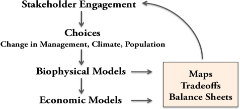

.. _the-need-for:

***********************
The Need for a New Tool
***********************

Introduction
============

Ecosystems, if properly managed, yield a flow of services that are vital to humanity, including the production of goods (e.g., food), life support processes (e.g., water purification), and life fulfilling conditions (e.g., beauty, recreation opportunities), and the conservation of options (e.g., genetic diversity for future use). Despite its importance, this natural capital is poorly understood, scarcely monitored, and—in many cases—undergoing rapid degradation and depletion. To better align ecosystem conservation with economic forces, the Natural Capital Project is developing models that quantify and map the values of ecosystem services. The modeling suite is best suited for analyses of multiple services and multiple objectives. The current models, which require relatively little data input, can identify areas where investment may enhance human well-being and nature. We are continuing development of the models and will release new, updated versions as they become available.  The next release is planned for May 2011.

Who should use InVEST?
======================

InVEST is designed to inform decisions about natural resource management. Decision-makers, from governments to non-profits to corporations, often manage lands and waters for multiple uses and inevitably must evaluate trade-offs among these uses; InVEST’s multi-service, modular design provides an effective tool for evaluating these trade-offs. For example, government agencies could use InVEST to help determine how to manage lands, coasts, and marine areas to provide an optimal mix of benefits to people or to help design permitting and mitigation programs that sustain nature’s benefits to society. Conservation organizations could use InVEST to better align their missions to protect biodiversity with activities that improve human livelihoods. Corporations, such as timber companies, renewable energy companies, and water utilities, could also use InVEST to decide how and where to invest in natural capital to ensure that their supply chains are preserved. 

InVEST can help answer questions like:

+ Where do ecosystem services originate and where are they consumed? 
+ How does a proposed forestry management plan affect timber yields, biodiversity, water quality and recreation?  
+ What kinds of coastal management and fishery policies will yield the best returns for sustainable fisheries, shoreline protection and recreation?
+ Which parts of a watershed provide the greatest carbon sequestration, biodiversity, and tourism values? 
+ Where would reforestation achieve the greatest downstream water quality benefits while maintaining or minimizing losses in water flows?  
+ How will climate change and population growth impact ecosystem services and biodiversity?
+ What benefits does marine spatial planning provide to society in addition to food from fishing and aquaculture and secure locations for renewable energy facilities?

Introduction to InVEST
======================

The InVEST 2.0 Beta package described in this guide includes the first models for quantifying, mapping, and valuing the benefits provided by marine systems.  Four marine models are included in this release (wave energy, coastal exposure, marine fish aquaculture, and aesthetic views).  Additional marine models (including those for fisheries, recreation and tourism, protection from erosion/flooding, and carbon storage and sequestration) will be included in the next release in May 2011.

Terrestrial and freshwater models within InVEST 2.0 Beta include those for carbon sequestration, crop pollination, managed timber production, water purification (for nutrients), reservoir hydropower production, and sediment retention for reservoir maintenance. It also includes a biodiversity model so that tradeoffs between biodiversity and ecosystem services can be assessed. Models are under development for other services. These include models for flood mitigation, irrigation, agricultural production, open access harvest of timber and non-timber products, recreation and tourism, and cultural benefits. 

To date, the marine and terrestrial/freshwater models are treated separately.  InVEST 2.0 and this version of the guide presents the models for the two systems in turn.  However, in future releases, models for the two systems will be more integrated.  This will occur in two primary ways.  First, some models will have the flexibility to be applied in either terrestrial or marine systems (e.g. carbon storage and sequestration, biodiversity, tourism and recreation, aesthetic views). (In fact, the terrestrial biodiversity model can be applied, as is, to nearshore marine systems).  Second, we are working to link freshwater and marine models so that effects of watershed activities on coastal and marine systems can be explored.  Such linkages will be included in later releases of InVEST (likely 2012).

InVEST is most effectively used within a decision-making process that starts with a series of stakeholder consultations (illustrated in Figure 1). Through discussion, questions of interest to policy makers, communities, and conservation groups are identified. These questions may concern service delivery on a landscape today and how these services may be affected by new programs, policies, and conditions in the future. For questions regarding the future, stakeholders develop “scenarios” to explore the consequences of expected changes on natural resources. These scenarios typically include a map of future land use and land cover or, for the marine models, a map of future coastal and ocean uses and coastal/marine habitats.

   Schematic of the decision-making process in which InVEST is embedded. Stakeholders create scenarios that are assessed for ecosystem service value by biophysical and economic models that produce several types of outputs.

Following stakeholder consultations and scenario development, InVEST can estimate the amount and value of ecosystem services that are provided on the current landscape or under future scenarios. InVEST models are spatially-explicit, using maps as information sources and producing maps as outputs. InVEST returns results in either biophysical terms (e.g., tons of carbon sequestered) or economic terms (e.g., net present value of that sequestered carbon). The spatial resolution of analyses is also flexible, allowing users to address questions at the local, regional or global scale. InVEST results can be shared with the stakeholders and decision-makers who created the scenarios to inform upcoming decisions. Using InVEST in an iterative process, these stakeholders may choose to create new scenarios based on the information revealed by the models until suitable solutions for management action are identified. 

InVEST has a **tiered** design. **Tier 0** models map relative levels of ecosystem services and/or highlight regions where particular services are in high demand. For example, the coastal exposure model in InVEST 2.0 maps regions of the coastline that are particularly susceptible to erosion and flooding. It does not use a production function to yield outputs of meters of shoreline eroded or to value coastal protection services provided by nearshore marine habitats. There is no valuation done in tier 0 models. **Tier 1** models are theoretically grounded but simple. They are the simplest models we could create that capture the essence of the key processes in question.  They are suitable when more data are available than are required for Tier 0, but they still have relatively simple data requirements. Tier 1 models can identify areas of high or low ecosystem service production and biodiversity across the landscape, and the tradeoffs and synergies among services under current or future conditions. All tier 1 models give outputs in absolute terms, and provide the option for economic valuation (except for biodiversity). Continuing the coastal protection example, the Tier 1 coastal protection model (to be released in May 2011), uses a production function to yield biophysical (meters not eroded or area of flooding avoided), economic (property damage avoided) and social (number of people protected) outputs that can be attributed to nearshore vegetation. 

More complex **Tier 2** models are under development for biodiversity and some ecosystem services. Tier 2 models provide increasingly precise estimates of ecosystem services and values, which are especially important for establishing contracts for payments for ecosystem services programs or assessing scenarios that address change on a sub-annual basis. For example, scenarios that represent a change in the monthly or seasonal timing of fertilizer application or water extraction in agricultural systems cannot be assessed by Tier 1 models, but will be treated well by Tier 2 models.  It is expected that users will be able to mix and match Tier 0, 1, and 2 models to create the best suite of models given past work, existing data, and the questions of interest. Although the more sophisticated models require substantial data and time to develop, once they are parameterized for a certain location, they will provide the best available science for new decisions.  In some cases (e.g. for fisheries), complex tier 3-type models already exist in a particular location. The Natural Capital Project will not develop new tier 3 models, but rather sees these as the sophisticated, dynamic models usually developed for individual sites or contexts. We aim to develop the capability of InVEST to communicate with such existing, complex models so that InVEST inputs (e.g. scenarios) can be fed in, and outputs from those complex models can be compared with other InVEST outputs.

Most of the models in InVEST 2.0 are tier 1 models (though there are some tier 0). Tier 2 models for several services have been formulated and documented in a book in press with Oxford University Press (available April 8, 2011)). We will design the Tier 2 software platform as a space where Tier 0, 1, 2 and 3 models can be integrated as appropriate for different applications.

+--------------------------------------------------------------------------------------+--------------------------------------------------------------------------------------------------------+---------------------------------------------------------+-----------------------------------------------------------------------------+
| TIER 0 Models                                                                        | TIER 1 Models                                                                                          | TIER 2 Models                                           | TIER 3 Models                                                               |
+======================================================================================+========================================================================================================+=========================================================+=============================================================================+
| Relative values                                                                      | Absolute values                                                                                        | Absolute values                                         | Absolute values                                                             |
+--------------------------------------------------------------------------------------+--------------------------------------------------------------------------------------------------------+---------------------------------------------------------+-----------------------------------------------------------------------------+
| No valuation                                                                         | Valuation done through a suite of approaches                                                           | Valuation done through a suite of approaches            | Valuation done through a suite of approaches                                |
+--------------------------------------------------------------------------------------+--------------------------------------------------------------------------------------------------------+---------------------------------------------------------+-----------------------------------------------------------------------------+
| Generally not time-specific, or annual average                                       | Annual average time step, no temporal dynamics                                                         | Daily to monthly time step, some temporal dynamics      | Daily to monthly time step, temporal dynamics with feedbacks and thresholds |
+--------------------------------------------------------------------------------------+--------------------------------------------------------------------------------------------------------+---------------------------------------------------------+-----------------------------------------------------------------------------+
| Appropriate spatial extent ranges from sub-watershed to global                       | Appropriate spatial extent ranges from sub-watershed to global                                         | Appropriate spatial extent ranges from parcel to global | Appropriate spatial extent ranges from parcel to global                     |
+--------------------------------------------------------------------------------------+--------------------------------------------------------------------------------------------------------+---------------------------------------------------------+-----------------------------------------------------------------------------+
| Good for identifying key areas (relatively high risk or ecosystem service provision) | Good for strategic decisions with absolute values, can be good for tactical decisions with calibration | Good for tactical decisions with absolute values        | More precise estimates of ecosystem service delivery                        |
+--------------------------------------------------------------------------------------+--------------------------------------------------------------------------------------------------------+---------------------------------------------------------+-----------------------------------------------------------------------------+
| No ecosystem service interactions                                                    | Some ecosystem service interactions                                                                    | Some ecosystem service interactions                     | Sophisticated ecosystem service interactions with feedbacks and thresholds  |
+--------------------------------------------------------------------------------------+--------------------------------------------------------------------------------------------------------+---------------------------------------------------------+-----------------------------------------------------------------------------+

A work in progress
==================

The development of InVEST is an ongoing effort of the Natural Capital Project. The models included in this Beta release are at different stages of development and testing, however they are all sufficiently developed to be applied. To date, the Beta terrestrial models have been applied in several sites and decision contexts, including to support: policy and conservation planning in the Willamette Basin USA, private landowners in Hawai’i USA, multi-stakeholder planning in Tanzania, permitting and licensing in Colombia, water fund design in Colombia and Ecuador, and priority setting for international aid in the Amazon Basin. Updated and new models for additional ecosystem services will be released as they become available.  

This is the first release of InVEST that includes the marine and coastal models.  We have made every effort to debug, to test the models for stability, and to make the models easy to use, but we know that improvements will be in order.  Please be patient and give us feedback (http://invest.ecoinformatics.org).  Also, because only 4 of many models under development are included in this release, we have included brief descriptions of the models we will release in May 2011.  (See :ref:`roadmap`).

InVEST is a freely available, open source product and as such the source code of each model can be inspected and modified by users. InVEST is subject to standard open source license and attribution requirements, which are described and must be agreed to in the installation process, As in other open source projects, it is hoped that users will submit improvements, error fixes, and suggestions to the Natural Capital Project so that improvements can be made to future versions. 

This guide 
==========

This guide will help you understand the basics of the InVEST models and start using them. The next chapter leads you through the installation process and provides general information about the tool and interface.  

The remaining chapters present the ecosystem service models.  Each chapter:

+ briefly introduces a service and suggests the possible uses for InVEST results; 

+ explains intuitively how the model works, including important simplifications, assumptions, and limitations;

+ describes the data needed to run the model, which is crucial because the meaning and value of InVEST results depend on the input data;  

+ provides step-by-step instructions for how to input data and interact with the tool;

+ offers guidance on interpreting InVEST results;

+ includes an appendix of information on relevant data sources and data preparation advice (this section is variable among chapters, and will improve over time from user input).

This guide does not include detailed theoretical discussions of the scientific foundation of each model, which will be published in an upcoming book from Oxford University Press (available April 2011).

