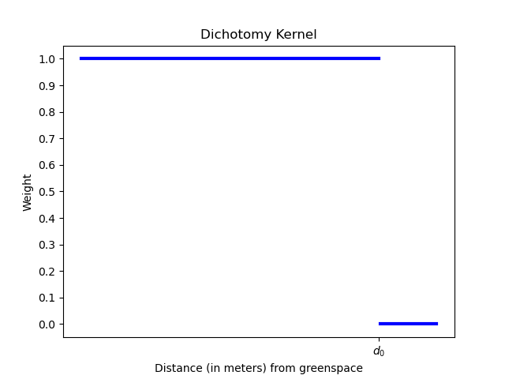
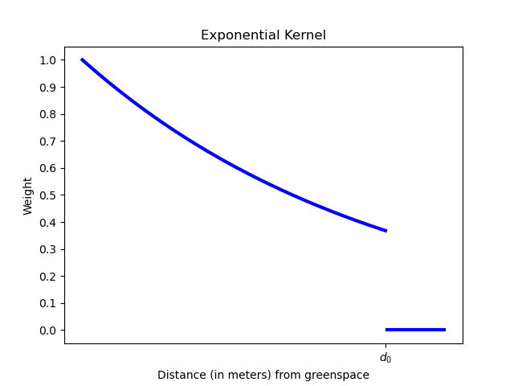
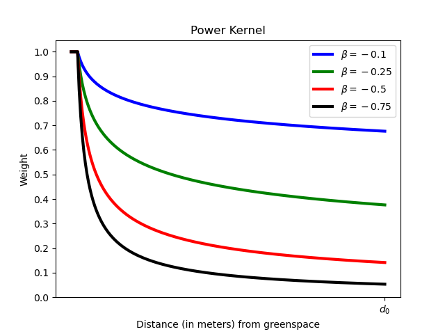
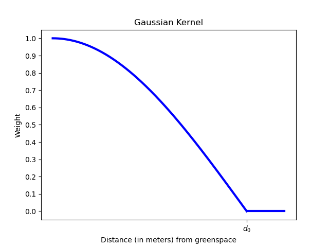
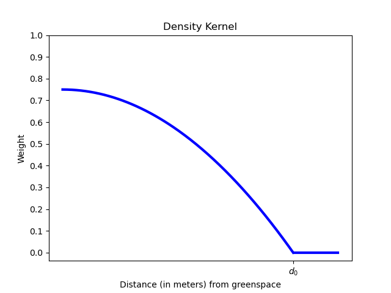

.. _urban_nature_access:

*******************
Urban Nature Access
*******************

TODOS
=====

- [ ] Add recommendations for guidance on per-capita greenspace requirements.
- [ ] Any specific data recommendations for the data needs section?
- [ ] Is there specific guidance for the power function's beta parameter?
- [ ] Is there specific guidance for a poisson distribution's lambda parameter?
- [ ] Could someone provide some specific guidance on how to select a decay function?

Summary
=======

Introduction
============

Nature in urban areas provides important opportunities for recreation.  The
model for urban nature access provides a measure of both the supply of urban
nature and the demand for nature by the urban population (optionally, different
groups within the urban population), ultimately calculating the balance between
supply and demand.  Supply is determined by the quantity and size of urban
nature that is accessible per capita for recreational purposes.  The demand is
determined per capita natural space that is required by policy.  The balance is
determined by assessing to what extent supply meets demand, at the individual,
administrative and city level.

The model consists of a core model, in which the number of inhabitants and
an aggregated metric of nature in the form of overall greenspace are used.
While the model is capable of modelling different types of urban nature,
including water edges, here we focus on the use of the model for greenspace to
refer to greenspace instead of urban nature from this point on.

Three options to develop a more detailed model are also provided:

* Search radii may be defined for each greenspace classification
* Search radii may be defined for individual population groups
* Results may be summarized to individual population groups regardless of the
  search radius mode selected.

The three additions for detailed modelling are optional.

The Model
=========

Greenspace area supplied to any pixel :math:`i` in the study area is calculated
using greenspace area :math:`S_j` in a green pixel, population in pixel
:math:`i`, :math:`P_i`.

Decay Function
--------------

Service decays with distance between greenspace and population which can be
described by the decay function :math:`f(d_{ij})` where :math:`d_{ij}` is the
distance between greenspace and a population pixel.  Several functions have
been used in previous studies and are provided in the model.  The user's
selection of decay function is applied consistently throughout the model,
regardless of the search radius mode selected.  Search distance is always
euclidean distance and assumes square pixels.

Dichotomy
*********

The dichotomous kernel considers all pixels within the search distance
:math:`d_0` to be equally accessible to greenspace.  More formally:

.. math::

        \begin{align*}
        f(d_{ij}, d_0) &= \left\{\begin{array}{lr}
                1 & \text{if} d_{ij} \leq d_0 \\
                0 & \text{if} d_{ij} \gt d_0 \\
        \end{array}\right\} \\
        \end{align*}

Exponential
***********

This kernel follows a distance-weighted exponential decay function, where
populations that are closer to greenspace are more likely to visit the
greenspace, with weights falling off exponentially out to the maximum
radius :math:`d_0`.

.. math::

        \begin{align*}
        f(d_{ij}, d_0) &= \left\{\begin{array}{lr}
                e^{(-d_{ij}/d_0)} & \text{if} d_{ij} \leq d_0 \\
                0 & \text{if} d_{ij} \gt d_0 \\
        \end{array}\right\} \\
        \end{align*}

Power
*****

The power kernel requires the user to define their own rate of decay, defined
by the user's selection of the parameter :math:`\beta`.

.. math::

        \begin{align*}
        f(d_{ij}, d_0) &= \left\{\begin{array}{lr}
                d_{ij}^{(-\beta)} & \text{if} d_{ij} \leq d_0 \\
                0 & \text{if} d_{ij} \gt d_0 \\
        \end{array}\right\} \\
        \end{align*}

Gaussian
********

.. math::

        \begin{align*}
        f(d_{ij}, d_0) &= \left\{\begin{array}{lr}
                \frac{e^{-\frac{1}{2}\left ( \frac{d_{ij}}{d_0} \right )^2}-e^{-\frac{1}{2}}}{1-e^{-\frac{1}{2}}} & \text{if} d_{ij} \leq d_0 \\
                0 & \text{if} d_{ij} \gt d_0 \\
        \end{array}\right\} \\
        \end{align*}

Density
*******

.. math::

        \begin{align*}
        f(d_{ij}, d_0) &= \left\{\begin{array}{lr}
                \frac{3}{4}\left(1-\left(\frac{d_{ij}}{d_{0}}\right)^{2}\right) & \text{if} d_{ij} \leq d_0 \\
                0 & \text{if} d_{ij} \gt d_0 \\
        \end{array}\right\} \\
        \end{align*}

Running the Core Model
----------------------

The core model assumes a uniform radius of travel ("search radius") that is
defined by the user.

Calculating Greenspace Supply
*****************************

The calculation of greenspace supply to each population pixel uses the Two-Step
Floating Catchment Area (2SFCA) method (Mao and Nekorchuk, 2013; Xing et al.,
2018).  Given a greenspace pixel :math:`j`, all population pixels with the
search radius :math:`d_0` are searched.  The greenspace-population ratio
:math:`R_j` for this pixel is calculated using the greenspace pixel's area
:math:`S_j` divided by the total population within the search radius, weighted
according to the selected search kernel's distance-based weighting.  Then,
centered on each pixel in the population raster, all the greenspace pixels
within its distance-weighted catchment are searched.  All of the :math:`R_j` of
these greenspace pixels are summed to calculate the greenspace supply
:math:`A_i` to every population pixel.

This can be graphically understood as:

.. figure:: ./urban_nature_access/2sfca-step1.png
        :align: center
        :figwidth: 500px

        Step 1: Locating populations within the search radius of greenspace.

.. figure:: ./urban_nature_access/2sfca-step2.png
        :align: center
        :figwidth: 500px

        Step 2: Locating greenspace within the search radius of populations.

More formally, the greenspace/population ratio :math:`R_j` is defined as:

.. math::

        \begin{align*}
        R_j &= \left\{\begin{array}{lr}
                \frac{S_j}{\sum_{k \in \left\{d_{jk} \leq d_0  \right\}} P_k \cdot f(d_{jk})} & \text{if} P_k \cdot f(d_{jk}) >= 1 \\
                S_j & \text{otherwise} \\
        \end{array}\right\} \\
        \end{align*}

Where:

* :math:`R_j` is the greenspace/population ratio of greenspace pixel :math:`j`.
* :math:`S_j` is the area of greenspace in pixel :math:`j`
* :math:`d_0` is the search radius
* :math:`k` is the population pixel within search radius of greenspace pixel :math:`j`
* :math:`d_jk` is the distance between greenspace pixel :math:`j` and population pixel :math:`k`.
* :math:`P_k` is the population of pixel :math:`k`.
* :math:`f(d)` is the selected decay function.

Then, the greenspace/population ratio is weighted by the selected decay
function and summed within the search radius to give greenspace supply,
:math:`A_i`:

.. math::

        A_i = \sum_{j \in \left\{d_{ij} \leq d_0  \right\}} R_j \cdot f(d_{ij})

Where:

* :math:`i` is any pixel in the population raster
* :math:`A_i` is the greenspace per capita supplied to pixel :math:`i` (square meters per person)
* :math:`d_ij` is the distance between pixel :math:`i` and greenspace pixel :math:`j`.
* :math:`d_0` is the search radius

Calculate Per-Capita Greenspace Demand
**************************************

Every resident in a region should be allocated a certain amount of greenspace,
:math:`g_{cap}` which is often defined in local planning documents or urban
planning goals.  The per-capita greenspace supply/demand budget
:math:`SUP\_DEM_{i,cap}` at pixel :math:`i`, is defined by assessing the
difference between the supplied greenspace and the planning goal for greenspace
per capita per pixel:

.. math::

        SUP\_DEM_{i,cap} = A_i - g_{cap}

To determine the budget for all people in every pixel, :math:`SUP\_DEM_{i,cap}`
is multiplied by the population :math:`P_i` at pixel :math:`i`:

.. math::

        SUP\_DEM_{i} = SUP\_DEM_{i,cap} \cdot P_i

Summarizing Outputs to Administrative Units
*******************************************

The user will input a vector with administrative unit boundaries that may
represent any district level that the user is interested in.  These boundaries
are needed to obtain administrative-level measurements.

The administrative level supply/demand budget is the sum of the budget of each
pixel :math:`i` within the administrative boundary :math:`adm`:

.. math::

        SUP\_DEM_{adm} = \sum_{i \in \left\{adm \right\}} SUP\_DEM_i

:math:`SUP\_DEM_{adm}` indicates how much greenspace, in square meters, is
under- or over-supplied in ad administrative unit.

The average per-capita greenspace supply/demand budget is also calculated at
the administrative level:

.. math::

        SUP\_DEM_{adm,cap} = \frac{SUP\_DEM_{adm}}{P_{adm}}

Where :math:`P_{adm}` is the total population within the administrative boundary.

When :math:`SUP\_DEM_{i,cap} < 0` on any given pixel :math:`i`, it indicates
that people in this pixel are under-supplied with greenspace.  Summing up these
populations across all pixels within an administrative unit provides the number
of people in an administrative unit with a greenspace deficit,
:math:`Pund_{adm}`, relative to the recommended greenspace :math:`g_{cap}`:

.. math::
        Pund_{adm} = \sum_{i \in \{adm\}}
                \left\{
                        \begin{array}{lr}
                        P_{i} & \text{if} SUP\_DEM_{i,cap} < 0 \\
                        0 & \text{otherwise} \\
                        \end{array}
                \right\}

Similarly, the same rationale is applied to find the number of people with a
greenspace surplus in an administrative unit, :math:`Povr_{adm}`, relative to the
recommended greenspace :math:`g_{cap}`:

.. math::
        Povr_{adm} = \sum_{i \in \{adm\}}
                \left\{
                        \begin{array}{lr}
                        P_{i} & \text{if} SUP\_DEM_{i,cap} > 0 \\
                        0 & \text{otherwise} \\
                        \end{array}
                \right\}

Running the Model with Radii Defined Per Greenspace Class
---------------------------------------------------------

Greenspace has different types. Pocket parks provide convenient recreation
experience nearby, while municipal parks attract people from more distant
places.  If the user has data to split the types of greenspace and the
adjusted travel distance for each type of greenspace, the accessibility of
each type of greenspace to pixel :math:`i` can be calculated using the
class-specific radius. These split greenspace types and their associated
search radii are provided to the model by user input in the LULC attribute
table.  Each type of Land Use Land Cover classification marked as greenspace
will be calculated separately in order to give more detailed results concerning
the accessible greenspace of each type.  Is is up to the user to decide how to
split the greenspace.

If :math:`r` is the type of greenspace, :math:`j` is a greenspace pixel of
:math:`r` type, :math:`d_{0,r}` is the search radius for :math:`r` type of
greenspace, then the greenspace/population ratio for this greenspace type
is calculated by the area of this greenspace divided by the population within
the radius weighted by the user's selection of distance-weighted decay
function:

.. math::
        R_{j,r} = \frac{S_{j,r}}{
                        \sum_{k \in \{d_{kj} \leq d_{0,r}\}}{P_k \cdot f(d_{jk})}
                }

The accessibility of greenspace type :math:`r`, :math:`A_{i,r}` to pixel
:math:`i` is calculated by summing up the distance-weighted :math:`R_{j,r}`
within the search radius:

.. math::
        A_{i,r} = \sum_{j \in d_{ij} \leq d_{0,r}}{R_{j,r} \cdot f(d_ij)}

The total greenspace supplied to pixel :math:`i`, :math:`A_i` is calculated by
adding up the :math:`A_{i,r}` across all types of greenspaces:

.. math::
        A_i = \sum_{r=1}^{r}{A_{i,r}}

Other steps and outputs are the same as in the core model.

Running the Model with Results Summarized by Population Groups
--------------------------------------------------------------

The user has the option to provide population characteristics indicating the
proportion of the total population that belong to the given population group
within each administrative unit.  Examples of population groups might be
age or income brackets.  The user will decide how to split the population
according to data availability and the study objective.

To analyze the supply-demand balance for certain groups within the general
population, an additional calculation is done for each group :math:`gn`,
given the proportion of the group in the total population of an administrative
unit, :math:`Rp,gn`.

For the undersupplied population within group :math:`gn` and administrative
unit :math:`adm`, this is defined as:

.. math::
        Pund_{adm,gn} = Pund_{adm} \cdot Rp,gn

And for the oversupplied population within group :math:`gn` and administrative
unit :math:`adm`:

.. math::
        Povr_{adm,gn} = Povr_{adm} \cdot Rp,gn

The user may wish to conduct further correlation analysis between population
characteristics and the above outputs to see if certain groups of people are
associated with deficit or surplus greenspace supply at different levels.

Running the model with Radii Defined per Population Group
---------------------------------------------------------

The search radius has an important impact on greenspace supply and different
populations have different radii. For example, people with a car can travel
further for recreation. This group-specific search radius :math:`d_{0,gn}`,
is defined by the user for each group :math:`gn` along with the proportion
of the total population within an administrative unit belonging to this group.
Given these two group-specific pieces of information, the greenspace supplied
to each group in a pixel, :math:`A_{i,gn}` can be obtained.

First, the greenspace area will be divided among the population within its
search radius, :math:`R_j`. Since different groups have different radii, the
total served population is the sum of each group within their respective search
radius.  Population at pixel :math:`i` consists of different groups.  The size
of the group :math:`gn` in pixel :math:`i` is calculated by:

.. math::
        P_{i,gn} = P_i \cdot Rp,gn

where :math:`P_i` is the population at pixel :math:`i`, and :math:`Rp,gn` is
the proportion of this group in the total population within each individual
administrative unit.

.. math::
        R_j  = \frac{S_j}{
                        \sum_{gn=1}^{gn} \left( \sum_{k \in \{d_{kj} \leq d_{0,gn} \}}{ P_{k,gn} \cdot f(d_{jk})} \right)
                }

Greenspace supply to group :math:`gn` by pixel :math:`i` is calculated by:

.. math::
        A_{i,gn} = \sum_{j \in \{d_{ij} \leq d_{0,gn}\}} R_j \cdot f(d_{ij})

The average greenspace supply per capita to pixel :math:`i` is calculated by a
weighted sum of :math:`A_{i,gn}`:

.. math::
        A_i = \sum_{n=1}^{n}{A_{i,gn} \cdot Rp,gn}

The per-capita greenspace budget at pixel :math:`i`, :math:`SUP\_DEM_{i,cap}`
is defined by assessing the difference between the supplied greenspace to pixel
:math:`i` and the user-defined planning goal for greenspace per capita,
:math:`g_{cap}`:

.. math::
        SUP\_DEM_{i,cap} = A_i - g_{cap}

The per-capita greenspace budget of group :math:`gn` at pixel :math:`i`
(:math:`SUP\_DEM_{i,cap,gn}`) is defined by assessing the difference between
the supplied greenspace to group :math:`gn` at pixel :math:`i` and the planning
goal for greenspace per capita, :math:`g_{cap}`:

.. math::
        SUP\_DEM_{i,cap,gn} = A_{i,gn} - g_{cap}

:math:`P_{i,gn}` is the population of group :math:`gn` at pixel :math:`i`. The
population of the group :math:`gn` in pixel :math:`i` multiplied by the
greenspace supply to the same group will give the greenspace area supplied to
that group at pixel :math:`i`.

.. math::
        SUP\_DEM_i = \sum_{gn=1}^{gn}{SUP\_DEM_{i,cap,gn} \cdot P_{i,gn}}

Summing the supply-demand budget at each pixel within administrative units will
result in the administrative level supply-demand balance.

.. math::
        SUP\_DEM_{adm} = \sum_{i=1}^{i}{SUP\_DEM_i}

To give an administrative level per capita greenspace supply-demand budget,
administrative level greenspace supply and demand budget :math:`SUP\_DEM_{adm}`
is divided by the total population of the administrative unit :math:`P_{adm}`:

.. math::
        SUP\_DEM_{adm,cap} = \frac{SUP\_DEM_{adm}}{P_{adm}}

To calculate the average per-capita supply-demand budget of group :math:`gn` with
an administrative unit :math:`adm`, the model multiplies the greenspace budget
:math:`SUP\_DEM_{i,cap,gn}` by the population of group :math:`gn` at pixel
:math:`i`, and then summed up for all pixels in :math:`adm` and divided by the
population of group :math:`gn` within :math:`adm`.

.. math::
        SUP\_DEM_{adm,cap,gn} = \frac{
                        \sum_{i \in \{adm\}}{SUP\_DEM_{i,cap,gn} \cdot P_{i,gn}}
                }{
                        P_{adm,gn}
                }

To analyze the supply-demand balance for certain groups within the general
population, an additional calculation is done.

The population of group :math:`gn` who has a greenspace deficit within
administrative unit :math:`adm` is given by:

.. math::
        Pund_{adm,gn} = \sum_{i \in \{adm\}}
                \left\{
                        \begin{array}{lr}
                        P_{i,gn} & \text{if} SUP\_DEM_{i,cap,gn} < 0 \\
                        0 & \text{otherwise} \\
                        \end{array}
                \right\}

The total under-supplied population within administrative unit :math:`adm` is
given by:

.. math::
        Pund_{adm} = \sum_{gn=1}^{gn}{Pund_{adm,gn}}

The population of group :math:`gn` who has a greenspace surplus within
administrative unit :math:`adm` is given by:

.. math::
        Povr_{adm,gn} = \sum_{i \in \{adm\}}
                \left\{
                        \begin{array}{lr}
                        P_{i,gn} & \text{if} SUP\_DEM_{i,cap,gn} > 0 \\
                        0 & \text{otherwise} \\
                        \end{array}
                \right\}

The total over-supplied population within administrative unit :math:`adm` is
given by:

.. math::
        Povr_{adm} = \sum_{gn=1}^{gn}{Povr_{adm,gn}}

Data Needs
==========

.. note:: All spatial inputs must be in the same projected coordinate system and in linear meter units.

- :investspec:`urban_nature_access workspace_dir`
- :investspec:`urban_nature_access results_suffix`
- :investspec:`urban_nature_access lulc_raster_path`
- :investspec:`urban_nature_access lulc_attribute_table`

   Columns:

   - :investspec:`urban_nature_access lulc_attribute_table.columns.lucode`
   - :investspec:`urban_nature_access lulc_attribute_table.columns.greenspace`
   - :investspec:`urban_nature_access lulc_attribute_table.columns.search_radius_m`

- :investspec:`urban_nature_access population_raster_path`
- :investspec:`urban_nature_access aoi_vector_path` A vector representing
  administrative units. Polygons representing administrative units should not
  overlap. Overlapping administrative geometries may cause unexpected results.
  For this reason, administrative unit geometries should not overlap.

   Fields:

   - :investspec:`urban_nature_access aoi_vector_path.fields.pop_[POP_GROUP]`

- :investspec:`urban_nature_access greenspace_demand`
- :investspec:`urban_nature_access decay_function`
- :investspec:`urban_nature_access search_radius_mode`
- :investspec:`urban_nature_access aggregate_by_pop_group`
- :investspec:`urban_nature_access search_radius`
- :investspec:`urban_nature_access population_group_radii_table`

   Columns:

   - :investspec:`urban_nature_access population_group_radii_table.columns.pop_group`
   - :investspec:`urban_nature_access population_group_radii_table.columns.search_radius_m`

- :investspec:`urban_nature_access decay_function_power_beta`

Interpreting Results
====================

Output Folder
-------------

* **output/greenspace_supply.tif**
  The calculated supply of greenspace.
* **output/aois.gpkg**
  A copy of the user's AOI vector with the following fields:

  * SUP_DEMadm_cap - the average greenspace budget available per person within this administrative unit.
  * Pund_adm - the total population within the administrative unit that is undersupplied with greenspace.
  * Povr_adm - the total population within the administrative unit that is oversupplied with greenspace.

  If the user has selected to aggregate results by population group or has elected to run the model
  with search radii defined per population group, these additional fields will be created:

  * SUP_DEMadm_cap_[POP_GROUP] - the average greenspace budget available per
    person in population group POP_GROUP within this administrative unit.
  * Pund_adm_[POP_GROUP] - the total population belonging to the population
    group POP_GROUP within this administrative unit that are undersupplied
    with greenspace.
  * Povr_adm_[POP_GROUP] - the total population belonging to the population
    group POP_GROUP within this administrative unit that are oversupplied
    with greenspace.

Intermediate Folder
-------------------

These files will be produced in every search radius mode:

* **intermediate/aligned_lulc.tif**
  A copy of the user's land use land cover raster, but with square pixels.
* **intermediate/aligned_population.tif**
  The user's population raster, aligned to the same resolution and dimensions
  as the aligned LULC.
* **intermediate/kernel_[SEARCH_RADIUS].tif**
  The weight kernel used for the search radius SEARCH_RADIUS, created with the
  user's selection of decay function.
* **intermediate/greenspace_supply.tif**
  The per-capita greenspace budget for the total population.
* **intermediate/greenspace_supply_demand_budget.tif**
  The per-capita greenspace supply/demand budget for the total population.
* **intermediate/undersupplied_population.tif**
  Each pixel represents the population in the total population that
  are experiencing a greenspace deficit.
* **intermediate/oversupplied_population.tif**
  Each pixel represents the population in the total population that
  are experiencing a greenspace surplus.

Other files found in the intermediate directory vary depending on the
selected search radius mode:

Uniform Search Radius
*********************

* **intermediate/decayed_population_within_[SEARCH_RADIUS].tif**
  A sum of the population within the given search radius SEARCH_RADIUS,
  weighted by the user's decay function.
* **intermediate/greenspace_area.tif**
  Pixels values represent the area of greenspace (in square meters)
  represented in each pixel.
* **intermediate/greenspace_population_ratio.tif**
  The calculated greenspace/population ratio.

Search Radii Defined per Greenspace Class
*****************************************

* **intermediate/decayed_population_within_[SEARCH_RADIUS].tif**
  A sum of the population within the given search radius SEARCH_RADIUS,
  weighted by the user's decay function.f
* **intermediate/greenspace_area_[LUCODE].tif**
  Pixels values represent the area of greenspace (in square meters)
  represented in each pixel for the greenspace class represented by the
  land use land cover code LUCODE.
* **intermediate/greenspace_population_ratio_lucode_[LUCODE].tif**
  The calculated greenspace/population ratio calculated for the
  greenspace class represented by the land use land cover code LUCODE.
* **intermediate/greenspace_supply_lucode_[LUCODE].tif**
  The greenspace supplied to populations due to the land use land cover
  class LUCODE.

Search Radii Defined per Population Group
*****************************************

* **intermediate/greenspace_area.tif**
  Pixels values represent the area of greenspace (in square meters)
  represented in each pixel.
* **intermediate/population_in_[POP_GROUP].tif**
  Each pixel represents the population of a pixel belonging to the population
  in population group POP_GROUP.
* **intermediate/proportion_of_aoi_in_[POP_GROUP].tif**
  Each pixel represents the proportion of the total population that belongs to
  population group POP_GROUP.
* **intermediate/decayed_population_in_[POP_GROUP].tif**
  Each pixel represents the total number of people within the search radius for
  this population group POP_GROUP, weighted by the user's selection of decay
  function.
* **intermediate/decayed_population_all_groups.tif**
  The total population, weighted by the appropriate decay function.
* **intermediate/greenspace_supply_to_[POP_GROUP].tif**
  The greenspace supply to the population group POP_GROUP.
* **intermediate/greenspace_budget_[POP_GROUP].tif**
  The per-person greenspace budget for the population group POP_GROUP.
* **intermediate/greenspace_supply_demand_budget_[POP_GROUP].tif**
  The per-person greenspace supply-demand budget for the population group
  POP_GROUP.
* **intermediate/undersupplied_population_[POP_GROUP].tif**
  Each pixel represents the population in population group POP_GROUP that
  are experiencing a greenspace deficit.
* **intermediate/oversupplied_population_[POP_GROUP].tif**
  Each pixel represents the population in population group POP_GROUP that
  are experiencing a greenspace surplus.

Appendix: Data Sources
======================

References
==========

Mao L. and Nekorchuk D., 2013. Measuring spatial accessibility to health care for populations with multiple transportation modes. Health &Place 24, 115–122.
Xing L.J, Liu Y.F, Liu X.J., 2018. Measuring spatial disparity in accessibility with a multi-mode method based on park green spaces classification in Wuhan, China. Applied Geography 94, 251–261.

