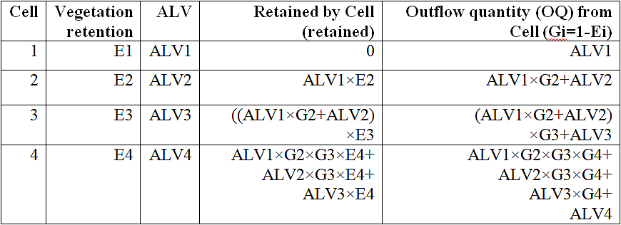
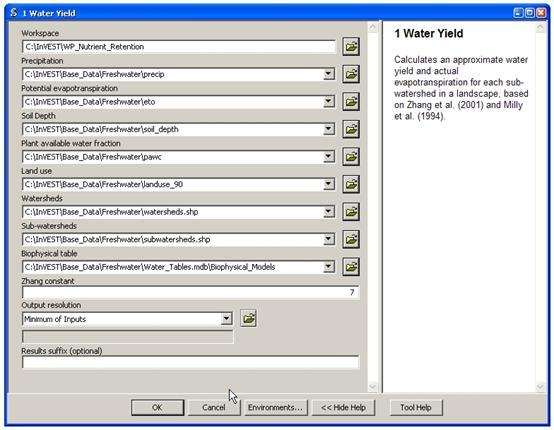
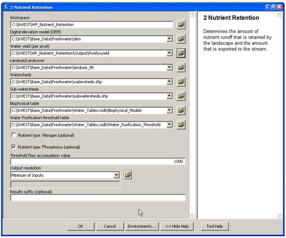
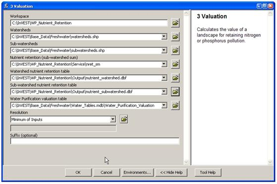

.. _waterpurification:

.. |addbutt| image:: ./shared_images/addbutt.png
             :alt: add
	     :align: middle 
	     :height: 15px

.. |toolbox| image:: ./shared_images/toolbox.jpg
             :alt: toolbox
	     :align: middle 
	     :height: 15px

**************************************
Water Purification: Nutrient Retention
**************************************

Summary 
=======

|
Water purification is an essential service provided by ecosystems. InVEST estimates the contribution of vegetation and soil to purifying water through the removal of nutrient pollutants from runoff.  The biophysical model uses data on water yield, land use and land cover, nutrient loading and filtration rates and water quality standards (if they exist) to determine nutrient retention capacity for current and future land use scenarios. The valuation model uses data on water treatment costs and a discount rate to determine the value contributed by the natural system to water purification. It does not address chemical or biological interactions besides filtration by terrestrial vegetation (such as in-stream processes) and is less relevant to locations with extensive tile drainage or ditching, strong surface water-ground water interactions, or hydrology dominated by infiltration excess (dry regions with flashy rains). 

Introduction
============

Clean water is a vital service provided by healthy streams, watersheds and river basins. Polluted water is especially harmful to human health. In fact, waterborne illnesses are the leading cause of human disease and death around the world killing more than 3.4 million people annually (World Health Organization). Clean water also provides habitat for aquatic life in streams, rivers and lakes but these habitats require a proper nutrient balance. If nutrients and toxins accumulate in water, fish and other aquatic creatures may be poisoned, along with the people consuming them.

Many of these harmful conditions are caused by non-point source pollution, which occurs when a pollution source is distributed over an area or discharged into the atmosphere and incorporated into hydrological flows through rainfall and runoff. There are numerous sources of non-point source pollution, including fertilizer used in agriculture and residential landscaping, and oil that leaks from cars onto roads. When it rains or snows, water flows over the landscape carrying pollutants from these surfaces into streams, rivers, lakes, and the ocean. 

One way to reduce non-point source pollution is to reduce the amount of pollutants that enter the water body. If this is not possible, ecosystems can provide this service by retaining some non-point source pollutants. For instance, vegetation can remove pollutants by storing them in tissue or releasing them back to the environment in another form. Soils can also store and trap some soluble pollutants. Wetlands can slow flow long enough for pollutants to be taken up by vegetation. Riparian vegetation is particularly important in this regard, often serving as a last defense against pollutants entering a stream. 

Land use planners from government agencies to environmental groups need information regarding the contribution of ecosystems to mitigating water pollution. Specifically, they require information pertaining to the value of every part of a watershed for maintaining water quality so that conservation may be targeted to the areas most important for protecting a safe water supply for people and aquatic life. They can also use this information to avoid impacts in areas that currently contribute the most to filtering out pollutants. The InVEST Tier 1 model provides this information for non-point source pollutants. We have designed the model to deal with nutrient pollutants (nitrogen and phosphorous), but the model can be used for other kinds of contaminants (persistent organics, pathogens etc.) if data are available on the loading rates and filtration rates of the pollutant of interest. 

The Model
=========

The InVEST Water Purification Nutrient Retention model calculates the amount of nutrient retained on every pixel then sums and averages nutrient export and retention per sub-watershed. The pixel-scale calculations allow us to represent the heterogeneity of key driving factors in water yield such as soil type, precipitation, vegetation type, etc. However, the theory we are using as the foundation of this set of models was developed at the sub-watershed to watershed scale. We are only confident in the interpretation of these models at the sub-watershed scale, so all outputs are summed and/or averaged to the sub-basin scale. We do continue to provide pixel-scale representations of some outputs for calibration and model-checking purposes only. **These pixel-scale maps are not to be interpreted for understanding of hydrological processes or to inform decision making of any kind.**

InVEST also calculates the economic value that nutrient retention provides through avoided treatment costs. It integrates data on the magnitude of overland flow, pollutant loading, the capacity of different vegetation types to filter pollutants, the cost of water treatment (for pollutants of interest), and  feasibility to meet water quality standards. 

The model's limitations are that it runs on an annual average basis, can only assess one pollutant per run, does not address chemical or biological interactions besides filtration by terrestrial vegetation, and it may provide an inaccurate marginal cost for pollutant removal when pollutant costs relative to pollutant concentration are non-linear. The model assumes that non-point sources of water pollution result from export that can be mitigated by vegetation serving as intercepting filters. It also assumes that water flows downslope along natural flowpaths, so it may be less relevant in areas with tile drainage and extensive ditching practices. It does not consider the role of ecosystems in affecting point-source pollutants. It also may be less relevant where there is significant groundwater surface water interaction and in dry eco-regions. 

How it Works
------------

The model runs on a gridded map.  It estimates the quantity and value of pollutants retained for water purification from a landscape in three components. 

The first step calculates annual average runoff from each parcel. See the Hydropower chapter for information on water yield. 

In the second step, we determine the quantity of pollutant retained by each parcel on the landscape. First, we estimate how much pollutant is exported from each parcel, based on export coefficients the user inputs. Export coefficients, developed by Reckhow et al. 1980, are annual averages of pollutant fluxes derived from various field studies that measure export from parcels within the United States. Since these coefficients are average fluxes, we include a hydrological sensitivity score that accounts for differences in condition between the fields where the measures were developed and the conditions where the user is applying the model. We do this with the following equation:

.. math:: ALV_x=HSS_x\cdot pol_x
					 
where :math:`ALV_x` is the Adjusted Loading Value at pixel x, polx is the export coefficient at pixel x, and HSSx  is the Hydrologic Sensitivity Score at pixel x which is calculated as:  

.. math:: HSS_x = \frac{\lambda_x}{\bar{\lambda_W}}

where :math:`\lambda_x` is the runoff index at pixel x, calculated using the following equation, and :math:`\bar{\lambda_W}` is the mean runoff index in the watershed of interest.  

.. math:: \lambda_a = \log\left(\sum_U Y_u\right)

where :math:`\sum_U Y_u` is the sum of the water yield of pixels along the flow path above pixel x (it also includes the water yield of pixel x).

Once we know how much pollutant leaves each pixel, we can determine how much of that load is retained by each downstream pixel, as surface runoff moves the pollutant toward the stream. The model routes water down flow paths determined by slope, and allows each pixel downstream from a polluting pixel to retain pollutant based on its land cover type and that land cover type's ability to retain the modeled pollutant. We do not account for saturation of uptake. By following the pollutant load of each pixel all the way downstream to a water body, the model also tracks how much pollutant reaches the stream. The table below describes how this removal from routing and hydraulic connectivity is done:

The model then aggregates the loading that reaches the stream from each pixel to the sub-watershed then to the watershed level. The user can then compare this load (adding the point sources loadings if any) to a known (observed or simulated using another water quality model) measurement and adjust export coefficients and removal efficiencies (vegetation retention) as needed until the modeled load matches the measured load for each point of interest. The user should consider the likely impact of in-stream processes in any calibration work as this model does not include in-stream processes. 
pixel

To calculate the amount of service delivered, the model decreases retention by the amount of 'allowed' pollution in the water body of interest, if an allowed amount is given. This step accounts for regulations that define a concentration of contaminants of concern. In other words, in water bodies where there is a water quality standard, watershed retention of nutrients that would lead to river concentrations below that standard should not be counted as an environmental service since people in effect do not care if that low amount of pollution occurs. In that sense, the model does not give credit to retention of nutrients below the user-defined threshold. If a threshold is given, the service level is calculated in biophysical terms as follows:

.. math:: net_x = retained-x-\frac{thresh}{contrib}

where :math:`retained_x` is the amount of retention calculated as in the table above, *thresh* is the total allowed annual load for the pollutant of interest (*thresh_p* for phosphorous, *thresh_n* for nitrogen) and contrib is the number of pixels on the landscape. Pixel values are then summed (*nret_sm*) or averaged (*nret_mn*) to the sub-watershed scale to give sub-watershed service outputs in biophysical terms.

Once the service level (*nret*) is determined, we can (optionally) calculate the value of this service provided by each sub-watershed based on the avoided treatment costs that retention by natural vegetation and soil provides. We make this calculation as follows:

.. math:: wp\_Value_x = Cost(p)*retained_x*\sum^{T-1}_{t=0}\frac{1}{(1+r)^t}

Where:

 :math:`wp\_Value_x` is the value of retention for sub-watershed x. 

 *Cost(p)* is the annual treatment cost in $(currency)/kg for  the pollutant of interest (p). 

 :math:`retained_x` is the total pollutant retained by sub-watershed x 

 *T* is the time span being considered for the net present value of water treatment 

 *r* is the discount rate used for calculating net present value

The sub-watershed values are then summed to the watershed to determine the water purification value per watershed.

Limitations and Simplifications
-------------------------------

The model has a number of assumptions. First, since the model was developed for watersheds and landscapes dominated by saturation excess runoff hydrology, it may be less applicable to locations where the hydrology is determined by rainfall intensity; in areas where flashy rains are predominant and where infiltration excess runoff occurs. This kind of runoff is the result of intense rains that saturate only the top soil layer, not the entire profile. However, the model's use of a runoff index and hydraulic routing should sufficiently adjust for this.
 
Second, the model can only assess one pollutant per run. If the user wishes to model several pollutants, but does not have data on loadings and filtration rates for each pollutant, choose a pollutant that acts as a surrogate in predicting loadings for other pollutants. The most common surrogate is phosphorus because heavy phosphorus loadings are often associated with other pollutants such as nitrogen, bacteria and suspended solids. However, using a pollutant surrogate should be approached with caution. Alternatively, the user can run the model multiple times using export values and retention coefficients for each pollutant. In general, the model can only assess pollutants that are susceptible to export via surface and subsurface flows. 
Third, the model does not address any chemical or biological interactions that may occur from the point of loading to the point of interest besides filtration by terrestrial vegetation. In reality, pollutants may degrade over time and distance through interactions with the air, water, other pollutants, bacteria or other actors. 
Fourth, the model assumes that there is continuity in the hydraulic flow path. The user should be aware of any discontinuity in the flow path. Tile drainage and ditches could create short cuts for pollutant movement and run pollutant directly to streams.

Finally, in some cases the model may provide an inaccurate marginal cost for pollutant removal. The full marginal cost of removing a unit volume of pollutants is difficult to estimate due to the complexity of the treatment process. The marginal cost may not be a constant value but instead a function of decreasing cost per additional unit volume of pollutant as the total volume increases. Also, the cost of treatment may change over time as technology improves or water quality standards evolve. 

Data Needs
==========

Here we outline the specific data used by the model. See the appendix for detailed information on data sources and pre-processing.  For all raster inputs, the projection used should be defined, and the projection's linear units should be in meters.

1. **Digital elevation model (DEM) (required)**. A GIS raster dataset, with an elevation value for each cell.  Make sure the DEM is corrected by filling in sinks, and if necessary 'burning' hydrographic features into the elevation model (recommended when you see unusual streams).   See the Working with the DEM section of this manual for more information.

 *Name:* File can be named anything, but avoid spaces in the name and less than 13 characters

 *Format:* Standard GIS raster file (e.g., ESRI GRID or IMG), with an elevation value for each cell given in meters above sea level. 

 *Sample data set:* \\InVEST\\Base_Data\\Freshwater\\dem 

2. **Soil depth (required)**. A GIS raster dataset with an average soil depth value for each cell. The soil depth values should be in millimeters .

 *Name:* File name can be anything, but avoid spaces in the name and less than 13 characters. 

 *Format:* Standard GIS raster file, with an average soil depth in millimeters for each cell. 

 *Sample data set:* \\InVEST\\Base_Data\\Freshwater\\soil_depth 

3. **Precipitation (required)**. A GIS raster dataset with a non-zero value for average annual precipitation for each cell.  The precipitation values should be in millimeters.

 *Name:* File can be named anything, but avoid spaces in the name and less than 13 characters. 

 *Format:* Standard GIS raster file (e.g., ESRI GRID or IMG), with precipitation values for each cell.  

 *Sample data set:* \\InVEST\\Base_Data\\Freshwater\\precip 

4. **Plant Available Water Content (required)**. A GIS raster dataset with a plant available water content value for each cell.  Plant Available Water Content fraction (PAWC) is the fraction of water that can be stored in the soil profile that is available for plants' use. 

 *Name:* File can be named anything, but avoid spaces in the name and less than 13 characters. 

 *Format:* Standard GIS raster file (e.g., ESRI GRID or IMG), with available water content values for each cell.  

 *Sample data set:* \\InVEST\\Base_Data\\Freshwater\\pawc

5.  **Average Annual Potential Evapotranspiration (required)**. A GIS raster dataset, with an annual average evapotranspiration value for each cell. Potential evapotranspiration is the potential loss of water from soil by both evaporation from the soil and transpiration by healthy Alfalfa (or grass)  if sufficient water is available.  The evapotranspiration values should be in millimeters.

 *Name:* File can be named anything, but avoid spaces in the name and less than 13 characters. 

 *Format:* Standard GIS raster file (e.g., ESRI GRID or IMG), with potential evapotranspiration values for each cell.  

 *Sample data set:* \\InVEST\\Base_Data\\Freshwater\\eto

6.  **Land use/land cover (required)**. A GIS raster dataset, with an LULC code for each cell.  The LULC code should be an integer.

 *Name:* File can be named anything, but avoid spaces in the name and less than 13 characters. 

 *Format:* Standard GIS raster file (e.g., ESRI GRID or IMG), with an integer LULC class code for each cell (e.g., 1 for forest, 3 for grassland, etc.). These codes must match LULC codes in the Biophysical Table. 

 *Sample data set:* \\InVEST\\Base_Data\\Freshwater\\landuse_90 

7. **Watersheds (required)**. A shapefile of polygons. This is a layer of watersheds such that each watershed contributes to a point of interest where water quality will be analyzed.  See the Working with the DEM section for information on creating watersheds.  

 *Name:* File can be named anything, but avoid spaces. 

 *Format:* Standard GIS shapefile , with unique integer values for each watershed in the ws_id field

 *Sample data set:* \\InVEST\\Base_Data\\Freshwater\\watersheds.shp

8. **Sub-watersheds (required)**. A shapefile of polygons. This is a layer of sub-watersheds, contained within the Watersheds (described above) which contribute to the points of interest where water quality will be analyzed.  See the Working with the DEM section for information on creating sub-watersheds. Due to limitations in ArcMap geoprocessing, the maximum size of a sub-watershed that can be used in the Water Purification model is approximately the equivalent of 4000x4000 cells, with cell size equal to the smallest cell size of your input layers. 
 
 *Name:* File can be named anything, but avoid spaces. 

 *Format:* A shapefile of polygons with unique integers for each sub-watershed in the subws_id field.

 *Sample data set:* \\InVEST\\Base_Data\\Freshwater\\subwatersheds.shp

9. **Biophysical Table (required)**. A table of land use/land cover (LULC) classes, containing data on water quality coefficients used in this tool. NOTE: these data are attributes of each LULC class rather than attributes of individual cells in the raster map. 

 *Name:* File can be named anything. 

 *File type:* ``*``.dbf or ``*``.mdb 

 *Rows:* Each row is an LULC class. 

 *Columns:* Each column contains a different attribute of each land use/land cover class, and must be named as follows: 

 a. *lucode (Land use code)*: Unique integer for each LULC class (e.g., 1 for forest, 3 for grassland, etc.), must match the LULC raster above. 

 b. *LULC_desc*: Descriptive name of land use/land cover class (optional) 

 c. *root_depth*: The maximum root depth for vegetated land use classes, given in integer millimeters.  Non-vegetated LULCs should be given a value of 1.

 d. *etk*: The evapotranspiration coefficient for each LULC class, used to obtain actual evapotranspiration by using plant energy/transpiration characteristics to modify the reference evapotranspiration, which is based on alfalfa (or grass).  Coefficients should be multiplied by 1000, so that the final etk values given in the table are integers ranging between 1 and 1500 (some crops evapotranspire more than alfalfa in some very wet tropical regions and where water is always available). 

 c. *load_n / load_p*: The nutrient loading for each land use. If nitrogen is being evaluated, supply values in load_n, for phosphorus, supply values in load_p. The potential for terrestrial loading of water quality impairing constituents is based on nutrient export coefficients. The nutrient loading values are given as integer values and have units of         g. Ha\ :sup:`-1`\  yr \ :sup:`-1`\ . 

 d. *eff_n / eff_p*: The vegetation filtering value per pixel size for each LULC class, as an integer percent between zero and 100. If nitrogen is being evaluated, supply values in eff_n, for phosphorus, supply values in eff_p. This field identifies the capacity of vegetation to retain nutrient, as a percentage of the amount of nutrient flowing into a cell from upslope. For example if the user has data describing that wetland of 5000 m2 retains 82% of nitrogen, then the retention efficiency that the he should input into this field for eff_n is equal to (82/5000 * (cell size)2). In the simplest case, when data for each LULC type are not available, high values (60 to 80) may be assigned to all natural vegetation types (such as forests, natural pastures, wetlands, or prairie), indicating that 60-80% of nutrient is retained. An intermediary value also may be assigned to features such as contour buffers.  All LULC classes that have no filtering capacity, such as pavement, can be assigned a value of zero. 

 *Sample data set:* \\InVEST\\Base_Data\\Freshwater\\Water_Tables.mdb\\Biophysical_Models

Example : Case with 6 LULC categories, where potential evapotranspiration, root depth and nutrient (both N and P) filtration efficiencies do not vary among LULC categories, while nutrient loadings do.

============================= ====== ==== ========== ======= ===== ======= =====
LULC_desc                     lucode etk  root_depth load_n  eff_n load_p  eff_p
============================= ====== ==== ========== ======= ===== ======= =====
Low Density Residential       1      1    1          7000    0     1000    0
Mid Density Residential       2      1    1          7250    0     1100    0
High Density Residential      3      1    1          7500    0     1200    0
Very High Density Residential 4      1    1          7750    0     1300    0
Vacant                        5      1    1          4000    0     100     0
Commercial                    6      1    1          13800   0     3000    0
============================= ====== ==== ========== ======= ===== ======= =====

|
9. **Threshold flow accumulation value (required)**. Integer value defining the number of upstream cells that must flow into a cell before it's considered part of a stream.  This is used to generate a stream layer from the DEM. The default is 1000. If the user has a map of stream lines in the watershed of interest, he/she should compare it with the Outpuv_stream map that is output by the model. This value also needs to be well estimated in watersheds where tile drainage and ditches are present. This threshold expresses where hydraulic routing is discontinued and where retention stops and the remaining of the pollutant will be exported to the stream. 

10.  **Water Purification Valuation table**. This is a table containing valuation information for each of the points of interest. There must be one row for each watershed in the Watersheds layer. 

 *Name:* File can be named anything. 

 *File type:* ``*``.dbf or ``*``.mdb

 *Rows:* Each row corresponds to a watershed.

 *Columns:* Each column contains a different attribute of each watershed and must be named as follows: 

 a. *ws_id (watershed ID)*: Unique integer value for each watershed, which must correspond to values in the Watersheds layer.

 b. *cost*: Annual cost of nutrient removal treatment in $ / kg removed.  Floating point value.

 c. *time_span*: Number of years for which net present value will be calculated.  Integer value. This could be the time span (number of years) of either the same LULC scenario or the water treatment plant life span. 

 d. *discount*: The rate of discount over the time span, used in net present value calculations.  Floating point value.

 *Sample data set:* \\InVEST\\Base_Data\\Freshwater\\Water_Tables.mdb\\Water_Purification_Valuation 

 Example for 3 watersheds/points of interest, from the sample data set:
 
 ===== ==== ========= ========
 ws_id cost time_span discount
 ===== ==== ========= ========
 0     24   15        5
 1     24   25        5
 2     24   15        5
 ===== ==== ========= ========

|
11.  **Water Purification threshold table**. A table containing annual nutrient load threshold information for each of the points of interest. There must be one row for each watershed in the Watersheds layer. 

 *Name:* File can be named anything. 

 *File type:* ``*``.dbf  or ``*``.mdb

 *Rows:* Each row corresponds to a watershed.

 *Columns:* Each column contains a different attribute of each watershed and must be named as follows: 

 a. *ws_id (watershed ID)*: Unique integer value for each watershed, which must correspond to values in the Watersheds layer.

 b. *thresh_n / thresh_p*: The total critical annual nutrient loading allowed for the nutrient of interest at the point of interest. Floating point value. It has units of Kg.yr\ :sup:`-1`\ .

 *Sample data set:* C:\\Invest\\Base_Data\\Freshwater\\Water_Tables.mdb\\Water_Purification_Threshold

Running the Model
=================

Before running the Water Purification Nutrient Retention model, make sure that the InVEST toolbox has been added to your ArcMap document, as described in the Getting Started chapter of this guide. Second, make sure that you have prepared the required input data files according to the specifications in Data Needs. 

* Create a workspace on your computer hard drive if you are using your data. The pathname to the workspace should not have spaces. All your output files will be saved here.  For simplicity, you could create a folder in your workspace called "Input" and place all your input files here.  It is not necessary to place input files in the workspace, but this will make it easier to view the data you use to run your model.  If this is your first time using InVEST and you wish to use sample data, you can use the data provided in InVEST-Setup.exe.  If you installed the InVEST files on your C drive (as described in the **Getting Started** chapter), you should see a folder named /InVEST/WP_Nutrient_Retention. This folder will be your workspace. The input files are in /InVEST/Base_Data/Freshwater/.

* Open an ArcMap document to run the model.  

* Locate the InVEST toolbox in ArcToolbox. ArcToolbox should be open in ArcMap, but if it is not, click on the ArcToolbox symbol.  See the Getting Started chapter if you do not see the InVEST toolbox.  

* Click the plus sign on the left side of the InVEST toolbox to expand the list of tools.  Double-click on Nutrient_Retention. Three options will appear: Water Yield, Nutrient Removal, and Valuation.  Water Yield must be run first, Nutrient Removal second, and Valuation last. The scripts MUST be run in this order because the output from a previous script is required for the next script.

* Click on Water Yield.

| 

|
* An interface will appear like the one above that indicates default (sample data) file names, but you can use the file buttons or drop-down arrows to browse to your data.  When you place your cursor in each space, you can read a brief description of the data requirements in the right side of the interface.  Refer to the Data Needs section for information on data formats.  

* Fill in data file names and values for all required prompts.  Unless the space is indicated as optional, it requires data.  

* After entering all required data, click OK.  The script will run, and its progress will be indicated by a "Progress dialogue".  

* Load the output files into ArcMap using the ADD DATA button.

* To view the attribute data of output files, right click a layer and select OPEN ATTRIBUTE TABLE.

* Now you are ready to run Nutrient Removal. Follow the same steps as for Water Yield. Note that an output from Water Yield,  Output\\Pixel\\wyield, is a required input to Nutrient Retention. Make sure to select one of the Nutrient Type boxes, the model needs one of the two to be checked to run  You may see (optional) after Nitrogen or Phosphorus, but you still need to check the box of the nutrient you are interested in.  The interface is below:

|

|
* When the script completes running, its results will be saved in the Output and Service folders. 

* Load the output files into ArcMap using the ADD DATA button.  

* Finally, you have the option to run Valuation.  Three outputs from Nutrient Removal are required, Service\\nret_sm, Output\\nutrient_watershed.dbf, and Output\\nutrient_ subwatershed.dbf.  The interface is below: 

|

 
|
* When the script completes running, its results will be saved in the Service folder. 

* Load the output files into ArcMap using the ADD DATA button.  

* To view the attribute data of output files, right click a layer and select OPEN ATTRIBUTE TABLE.

Interpreting Results
====================

The following is a short description of each of the outputs from the Water Purification model.  Final results are found in the *Output* and *Service* folders within the *Workspace* specified for this model.

* **Parameter log**: Each time the model is run, a text (.txt) file will appear in the *Output* folder. The file will list the parameter values for that run and will be named according to the service, the date and time, and the suffix. 

* **Output\\adjl_mn** (kg/ha): Mean adjusted load per sub-watershed.  

* **Output\\adjl_sm** (kg/sub-watershed, not /ha): Total adjusted load per sub-watershed. 

* **Service\\nret_sm** (kg/sub-watershed, not /ha): Total amount of nutrient retained by each sub-watershed. 

* **Service\\nret_mn** (kg/ha): Mean amount of nutrient retained by each sub-watershed.

* **Output\\nexp_mn** (kg/ha): Mean amount of nutrient per sub-watershed that is exported to the stream.

* **Output\\nexp_sm** (kg/sub-watershed, not /ha): Total amount of nutrient per sub-watershed that is exported to the stream.

* **Output\\nutrient_subwatershed.dbf**: Table containing biophysical values per sub-watershed, with fields as follows:

	* *nut_export* (kg/sub-watershed, not /ha): Total amount of nutrient exported to the stream per sub-watershed. 
	
	* *nut_retain* (kg/sub-watershed, not /ha): Total amount of nutrient retained by the landscape in each sub-watershed.

* **Output\\nutrient_watershed.dbf**: Table containing biophysical values per watershed, with fields as follows:

	* *nut_export* (kg/watershed, not /ha): Total amount of nutrient exported to the stream per watershed. 
	
	* *nut_retain* (kg/watershed, not /ha): Total amount of nutrient retained by the landscape in each watershed.

* **Service\\nut_val** (currency/timespan): The economic benefit per sub-watershed of filtration by vegetation delivered at the downstream point(s) of interest over the specified timespan. THIS OUTPUT REPRESENTS THE ENVIRONMENTAL SERVICE OF WATER PURIFICATION IN ECONOMIC TERMS. It may be useful for identifying areas where investments in protecting this environmental service will provide the greatest returns. Variation in this output with scenario analyses (by running and comparing different LULC scenarios) will indicate where land use changes may have the greatest impacts on service provision. 

* **Service\\nutrient_value_subwatershed.dbf**: Table containing economic values per sub-watershed, with fields as follows:

	* *nut_export/nut_retain*: Same as for *nutrient_subwatershed.dbf*.
	
	* *nut_value* (currency/timespan): Value of the sub-watershed landscape for retaining nutrient over the specified timespan.

* **Service\\nutrient_value_watershed.dbf**: Table containing economic values per watershed, with fields as follows:

	* *nut_export/nut_retain*: Same as for *nutrient_watershed.dbf*.
	
	* *nut_value* (currency/timespan): Value of the watershed landscape for retaining nutrient over the specified timespan.

These outputs provide an interim insight into the dynamics of pollutant loading, transport and filtration in a watershed. The model will be most informative if it is used in collaboration with experts in hydrology familiar with the watershed. In case model coefficients require adjustment and to guard against erroneous data input, it is recommended that model outputs are verified with field data mimicking pollutant loading and watershed transport processes. 

Appendix: Data Sources
======================

This is a rough compilation of data sources and suggestions about finding, compiling, and formatting data. This section should be used for ideas and suggestions only. It will be updated as new data sources and methods become available. 

In general, the FAO Geonetwork could be a valuable data source for different GIS layers for users outside the United States: http://www.fao.org/geonetwork/srv/en/main.home. 

1. **Digital elevation model (DEM)**

 DEM data is available for any area of the world, although at varying resolutions. 
 
 Free raw global DEM data is available on the internet from the World Wildlife Fund - http://www.worldwildlife.org/freshwater/hydrosheds.cfm.  
 
 NASA provides free global 30m DEM data at http://asterweb.jpl.nasa.gov/gdem-wist.asp.
 
 As does USGS - http://eros.usgs.gov/#/Find_Data/Products_and_Data_Available/Elevation_Products and http://hydrosheds.cr.usgs.gov/.   
 
 Or, it may be purchased relatively inexpensively at sites such as MapMart (www.mapmart.com).  
 
 The hydrological aspects of the DEM used in the model must be correct. Please see the Working with the DEM section of this manual for more information. 

2. **Soil depth**

 Soil depth may be obtained from standard soil maps. Coarse, yet free global soil characteristic data are available at http://www.ngdc.noaa.gov/seg/cdroms/reynolds/reynolds/reynolds.htm. The FAO also provides global soil data in their Harmonized World Soil Database:  http://www.iiasa.ac.at/Research/LUC/External-World-soil-database/HTML/. 

 In the United States free soil data is available from the U.S. Department of Agriculture's NRCS in the form of two datasets: SSURGO http://soils.usda.gov/survey/geography/ssurgo/ and STATSGO http://soils.usda.gov/survey/geography/statsgo/ . Where available SSURGO data should be used, as it is much more detailed than STATSGO. Where gaps occur in the SSURGO data, STATSGO can be used to fill in the blanks. 

 Soil depth should be calculated as the maximum depth of all horizons within a soil class component, and then a weighted average of the components should be estimated. This can be a tricky GIS analysis: In the US soil categories, each soil property polygon can contain a number of soil type components with unique properties, and each component may have different soil horizon layers, also with unique properties. Processing requires careful weighting across components and horizons. The Soil Data Viewer (http://soildataviewer.nrcs.usda.gov/), a free ArcMap extension from the NRCS, does this soil data processing for the user and should be used whenever possible. 

 Ultimately, a grid layer must be produced. Data gaps, such as urban areas or water bodies need to be given appropriate values. Urban areas and water bodies can be thought of having zero soil depth. 

3. **Land use and land cover**

 A key component for all water models is a spatially continuous land use and land cover raster grid. That is, within a watershed, all land use and land cover categories should be defined. Gaps in data that break up the drainage continuity of the watershed will create errors. Unknown data gaps should be approximated. The more detailed and descriptive these files are the better accuracy and modeling results.   Global land cover data is available from the University of Maryland's Global Land Cover Facility: http://glcf.umiacs.umd.edu/data/landcover/.  This data is available in 1 degree, 8km and 1km resolutions.  Data for the U.S. for 1992 and 2001 is provided by the EPA in their National Land Cover Data product: http://www.epa.gov/mrlc/.

 The simplest categorization of LULCs on the landscape involves delineation by land cover only (e.g., cropland, temperate conifer forest, prairie). Several global and regional land cover classifications are available (e.g., Anderson et al. 1976), and often detailed land cover classification has been done for the landscape of interest. A slightly more sophisticated LULC classification could involve breaking relevant LULC types into more meaningful types. For example, agricultural land classes could be broken up into different crop types or forest could be broken up into specific species. 

 The categorization of land use types depends on the model and how much data is available for each of the land types. The user should only break up a land use type if it will provide more accuracy in modeling. For instance, for the Water Purification: Nutrient Retention model the user should only break up 'crops' into different crop types if they have information on the difference in nutrient loading between crops. Along the same lines, the user should only break the forest land type into specific species for the water supply model if information is available on the root depth and evapotranspiration coefficients for the different species. 

4. **Watersheds / Sub-watersheds**

 Watersheds should be delineated by the user, based on the location of reservoirs or other points of interest. Exact locations of specific structures, such as reservoirs, should be obtained from the managing entity or may be obtained on the web at sites such as the National Inventory of Dams (http://crunch.tec.army.mil/nidpublic/webpages/nid.cfm). 

 Watersheds that contribute to the points of interest must be generated.  If known correct watershed maps exist, they should be used.  Otherwise, watersheds and sub-watersheds can be generated in ArcMap using a hydrologically-correct digital elevation model. Due to limitations in ArcMap geoprocessing, the maximum size of a sub-watershed that can be processed by the Nutrient Retention tool is approximately the equivalent of 4000x4000 cells, at the smallest cell size of all input grids. See the Working with the DEM section of this manual for more information on generating watersheds and sub-watersheds.

5. **Nutrient Loading Coefficients**

 Examples of export and loading coefficients can be found in the EPA PLOAD User's Manual http://www.epa.gov/waterscience/basins/b3docs/PLOAD_v3.pdf and in the Wetlands Regulatory Assistance Program publication http://el.erdc.usace.army.mil/elpubs/pdf/tnwrap04-3.pdf. Note that the examples in the EPA guide are in lbs/ac/yr and would need to be converted to kg/ha/yr. 

 Phosphorus is a common water quality proxy because it incorporates both dissolved and particulate nutrient loadings, is well associated with surface runoff, and is usually the limiting nutrient for fresh water systems. The table below shows default phosphorus export coefficients largely based on values from USEPA manuals, and research studies in the US. The bottom three rows are used solely for direct untreated waste water discharge (i.e. untreated sewage piped into water systems) from urban areas commonly found in developing countries. 

 If local data / approximations for Phosphorus export coefficients exist they can be used to replace default values in the table. 

 *Table : Example Phosphorus and Nitrogen export coefficients (Reckhow et al. 1980)*

================= ====================================== ========================================
Landuse           Nitrogen Export Coefficient (kg/ha/yr) Phosphorus Export Coefficient (kg/ha/yr)
================= ====================================== ========================================
Forest            1.8                                    0.011
Corn              11.1                                   2
Cotton            10                                     4.3
Soybeans          12.5                                   4.6
Small Grain       5.3                                    1.5
Pasture           3.1                                    0.1
Feedlot or Dairy  2900                                   220
Idle              3.4                                    0.1
Residential       7.5                                    1.2
Business          13.8                                   3
Industrial        4.4                                    3.8
================= ====================================== ========================================

 The loading proxy may also aggregate several indicators, agreed upon between managers, such as an algorithm that aggregates phosphorus, nitrates, and other constituents. Alternatively, a manager may begin using values from EPA table as a starting point to generate discussion, and then alter values based on local expert opinion and stakeholder feedback. 

6. **Removal Efficiencies  (*eff_n*, *eff_p*)**

 These values are used to incorporate the effects of natural vegetation that buffer potential water quality impairment downhill from sources. To develop these values, all land class pixels that contain natural vegetation (such as forests, natural pastures, wetlands, or prairie) are assigned high values and vegetation that has no or little filtering value receives a value of zero. All values should fall between 0 and 100. Consult with a hydrologist if you're not certain about the assignment of specific values. 

7. **Calibration Data (calib)**

 Calibration data is needed for ensuring that the Tier 1 Water Purification: Nutrient Retention model results match well with reality. Most often calibration data may be obtained from water quality monitoring that is already in place. If the point of interest is a water supply intake, the drinking water entity will most likely collect water quality at the point of intake. If the point of interest is in a stream or lake, the water quality may have been tested by a public agency. Most likely if the location is of interest in terms of meeting a water quality standard, data should be available. In the U.S. the user may contact or look up online their state environmental agency, EPA, fish and wildlife service, or any local universities conducting research on the water body. 

 Once data is collected, the user may have to convert the values into actual pollutant loads and/or correlate a measured pollutant with a proxy modeled pollutant. In addition to correlation analysis, other calibration methods such as Nash Coefficient, ranking analysis, and graphical comparison could be used. 

8. **Critical Annual Load (*Ann_Load*)**

 Gathering information on water quality standards or targets should be part of the formulation of modeling objectives. If the target to be met is a drinking water target, standards may be set by the federal, state or local level (whichever standard is the most stringent). The table below provides some general drinking water standards set by global and national agencies. 

 Selected Drinking Water Standards by World Health Organization, European Union, and US EPA. (Ashbolt et al. 2001) 

 .. figure:: waterpurification_images/drinking_water_table.png

|
These standards are set for point of use, meaning that the standard at the point of interest, where water supply will be drawn, may be more relaxed than these standards if water treatment is in place. In-situ water quality standards (for rivers, lakes and streams) may also be set at the national, state and local level. They may be the same across all water bodies of the same type (in rivers, for example) or they may vary depending on the established use of the water body or the presence of endangered species. In the U.S. Total Maximum Daily Loads of various pollutants are typically established by state regulatory agencies in compliance with the Clean Water Act. States report information on TMDLs to the U.S. EPA on specific waterways http://www2.ctic.purdue.edu/kyw/tmdl/statetmdllists.html. 

|
9. **Marginal pollutant removal costs (cost)**

 The cost to remove pollutants may vary greatly for each point of interest. If the point of interest is a water supply outtake, this value should be obtained from the water treatment entity who uses and treats the water. Calculations may need to be performed to transform actual costs to cost per unit volume of pollutant, and correlations may need to be run between a proxy pollutant and other pollutants that the treatment process removes. If a more general cost of treatment is sought, the user may consult engineering texts or literature to obtain average costs. The user must be sure to bring these costs into present value and make adjustments as necessary depending on the location and type of treatment. 

 If the point of interest is an in situ water quality target, the marginal pollutant removal cost is much more difficult to obtain. The user may be able to estimate the cost of an additional unit volume of pollutant in terms of fish populations, lost revenue for recreation, or a fine, but this may be a complicated calculation not worth the effort at this level of modeling. The user may choose to assign a cost of one to save time while still obtaining relative results useful in comparing scenarios. 

References
==========

Anderson, J. R., et al. 1976. A Land Use And Land Cover Classification System For Use with Remote Sensor Data: Geological Survey Professional Paper 964. Edited by NJDEP, OIRM, BGIA, 1998, 2000, 2001, 2002, 2005. 

Ashbolt, N.J., Grabow, W.O.K. and Snozzi, M. 2001. "Indicators of microbial water quality," in Water Quality: Guidelines, Standards and Health, L. Fretwell and J. Bartram, Editors. 2001, World Health Organization (WHO), IWA Publishing: London, U.K. 

Reckhow, K.H., Beaulac, M.N. & Simpson, J.T. 1980, Modeling Phosphorus loading and lake response under uncertainty: A manual and compilation of export coefficients., U.S. Environmental Protection Agency, Washington, D.C. 

Uusi Kamppa, J., E. Turtola, H. Hartikainen, T. Ylaranta. 1997. The interactions of buffer zones and phosphorous runoff. In Buffer zones: Their processes and potential in water protection, eds. 

N. Haycock, T. Burt, K. Goulding, and G. Pinay, 43--53. Hertfordshire, UK: Quest Environmental. 
 

