.. _wave-energy:

.. |openfold| image:: ./shared_images/openfolder.png
              :alt: open
	      :align: middle 

.. |addbutt| image:: ./shared_images/addbutt.png
             :alt: add
	     :align: middle 
	     :height: 15px

.. |okbutt| image:: ./shared_images/okbutt.png
            :alt: OK
	    :align: middle 

.. |adddata| image:: ./shared_images/adddata.png
             :alt: add
	     :align: middle 

*****************
Wave Energy Model
*****************

Summary
=======

Decision-makers and the public are increasingly interested in converting wave energy into electricity, with the hope that ocean waves will be a source for clean, safe, reliable, and affordable energy. The goals of the InVEST wave energy model (WEM) are to map and value the energy provisioning service provided by ocean waves and to allow for the evaluation of trade-offs that might arise when siting wave energy conversion (WEC) facilities. The WEM assesses potential wave power and harvested wave energy based on wave conditions (e.g., significant wave height and peak wave period) and technology-specific information of WEC devices (e.g., performance table and maximum capacity). The model then evaluates the net present value (NPV) of building and operating a WEC facility over its life span using economic parameters (e.g., price of electricity, discount rate, as well as installation and maintenance costs). Obtaining accurate input data and parameters for the economic valuation portion of the model is a significant challenge because there have been no commercial-scale wave energy facilities implemented to date. We recommend using the NPV values of a wave energy facility computed with the default values be used to only to make relative comparisons between sites.  The outputs of the WEM provide spatially explicit information, showing potential areas for siting WEC facilities with the greatest energy production and value. This site- and device-specific information for the WEC facilities can then be used to identify and quantify potential trade-offs that may arise when siting WEC facilities. Decision-makers and stakeholders can use the WEM to better understand where to install a WEC facility with greatest harvested wave energy and least effect on coastal and ocean ecosystems and other human uses. This is a "Tier 1" model.

Introduction
============

Wave energy has many characteristics important to the efficient generation of electricity and is considered a potentially significant contributor to the effort to meet growing human energy demands (Barstow et al. 2008). Among various renewable energy resources, wave energy has the greatest power density and provides relatively continuous and predictable power-significant advantages for electrical grid operation (Bedard et al. 2005). The cost of electricity generated by wave energy has decreased since the 1980s and is likely to decrease further as the technology develops and the wave energy industry expands (Thorpe 1999). Considering the increasing cost of fossil fuel energy and concomitant interest in renewable energy sources, wave energy may be economically feasible in the near feature. As a consequence, decision-makers and the public are increasingly interested in converting wave energy into electricity with the hope that ocean waves will be a source for clean, safe, reliable, and affordable energy source without significant greenhouse gas emissions. With this increasing interest in wave energy as a renewable energy resource, there is a growing need for a framework to help decision-makers site wave energy facilities. The WEM we articulate here will provide planners with information that can be used to balance the harvesting of energy from waves with existing uses of marine and coastal ecosystems.

Globally, exploitable wave energy resources are approximately equal to 20% of current world electricity consumption, but their potential varies considerably by location (Cornett 2008). In addition, in areas close to the shore, "hot spots" (characterized by condensed wave energy) provide the highest potential for wave energy harvesting (Cornett and Zhang 2008, Iglesias and Carballo 2010). Therefore, indentifying wave-power-rich areas is the first step in siting a wave energy conversion (WEC) facility.

A variety of technologies for WEC devices have been proposed to capture the energy from waves, and the particular characteristics of these devices play a critical role in quantifying the amount of energy that can be captured. Therefore, the choice of WEC device is also an essential component in efficiently harvesting wave energy under different wave conditions by location.

The economic valuation of a wave energy facility can be used to compare the net benefits across sites and device-specific technologies. As with most renewable energy projects, many different factors can be included in the economic valuation. These include: the value of energy provided to the electricity grid, reduction in pollution associated with wave energy projects as compared to traditional sources, costs to those who lose access to coastal and marine locations, and environmental costs associated with the construction and operation of these facilities. In practice, including all the relevant benefits and costs, particularly those related to environmental benefits and costs, can be difficult to measure and include in a formal cost-benefit analysis. Rather than ignoring these potential impacts, we have taken a simple approach to incorporating some of this information in a simple framework that can be used in parallel to a formal cost-benefit analysis.

While wave energy may provide clean and renewable energy without significant greenhouse gas emissions, wave energy projects may conflict with existing ocean uses or conservation strategies for protecting marine species and habitats. WEC facilities have the potential to impact fishing opportunities, pelagic and benthic habitat, recreational activities, aesthetic views, hydrodynamic and wave environments, navigation, and the bioaccumulation of toxic materials (Boehlert et al. 2007, Nelson et al. 2008, Thorpe 1999). The severity of these potential impacts is likely to be site specific.  Also, given limited experience with wave energy projects to date, there is little empirical evidence describing impacts. Therefore, identifying and evaluating the potential trade-offs associated with siting WEC facilities is an essential component of marine spatial planning and other forms of decision-making in marine and coastal environments.

The WEM presented here assesses: 1) potential wave power, 2) harvested wave energy, and 3) the net present value of a WEC facility. The outputs of the WEM provide spatially explicit information, showing potential areas for siting WEC facilities with the greatest energy production and benefits. This site- and facility-specific information then can be used to evaluate how siting a WEC facility might influence and/or change existing coastal and marine uses. For example, the WEM allows users to explore potential trade-offs by mapping and quantifying spatial competition with existing ocean uses for commercial and recreational activities (e.g., fishing, navigation, whale watching, kayaking, etc.).

The model
=========

The objective of the WEM is to help decision-makers and stakeholders inform marine spatial planning in the context of wave energy projects by exploring potential costs and benefits of siting wave energy facilities. The model can run using default input data sets that are globally and regionally available or with local input data.

How it works
------------

Potential wave power resource assessment
^^^^^^^^^^^^^^^^^^^^^^^^^^^^^^^^^^^^^^^^

Wave power per unit width of wave crest length transmitted by irregular waves can be approximated as

.. math:: P_n = {{\rho * g}\over 16} H^2_s C_g (T_e,h)
   :label: eq1

where, :math:`P_n` is wave power (kW/m), :math:`\rho` is sea water density (1,028 kg m\ :sup:`-3`), :math:`g` is gravitational acceleration (9.8 m s\ :sup:`-2`), :math:`H_s` is significant wave height (m), and :math:`C_g` is wave group velocity (m s\ :sup:`-1`) as a function of wave energy period, :math:`T_e` (sec), and water depth :math:`h` (m) (Cornett 2008). :math:`C_g` can be estimated as

.. math:: C_g = { {\left(1 + {{2kh}\over \sinh(2kh)}\right) \sqrt{{g\over k} \tanh(kh)}}\over 2 }
   :label: eq2

where the wave number :math:`k` is calculated using a dispersion relationship expressed as a function of wave frequency (:math:`w = 2\pi / T_e`) and water depth :math:`h`:

.. math:: w^2 = {gk * \tanh(kh)}
   :label: eq3

An iterative numerical solution scheme can be applied to solve Equation :eq:`eq3` with initial estimates of :math:`k = {w^2 / {(g \cdot \sqrt{tanh(w^2 \cdot h/g)})}}`.  The wave period of measured or modeled sea states are rarely expressed as :math:`T_e`, rather, they are often specified as peak wave period, :math:`T_p`. Therefore, the peak energy period is estimated as :math:`T_e = \alpha \cdot T_p`. Where, :math:`\alpha` is constant determining the shape of a wave spectrum. We use :math:`\alpha` = 0.90 as a default value assuming standard JONSWAP spectrum, which works well when sea state is dominated by waves from a single source and the spectrum is unimodal (Cornett 2008). The same assumption was also applied to global wave power resource estimation (Cornett 2008) and wave power calculations in the west coast of Canada (Cornett and Zhang 2008, Dunnett and Wallace 2009).

We prepared globally and regionally available input data layers for the potential wave power resources calculation. We used NOAA WAVEWATCH III (NWW3) model hindcast reanalysis results (version 2.22) to obtain wave characteristics defined by :math:`H_s` and :math:`T_p`. NWW3 spatial resolution ranges from 4 to 60 minutes depending on the global and regional grid systems. We used ETOPO1 to obtain the water depth (:math:`h`), which provides 1 arc-minute global ocean bathymetry information (Amante and Eakins 2009). When using the default input data layers, model results provide the first approximation of potential wave power resources for any target area in the world. However, the spatial resolution of the model results may not be fine enough to assess wave power resources near coastal areas. So, this module will allow users to add their own wave input based on local studies (e.g., nearshore wave model results) in the next version.

.. _captured-wave-energy-assessment:

Captured wave energy assessment
"""""""""""""""""""""""""""""""
Captured wave energy can be estimated as a function of sea states and the wave energy absorption performance of a WEC device (Previsic 2004a, Previsic 2004b). A seastate is the general condition of the ocean surface and often characterized by two parameters, a significant wave height :math:`H_s` and a peak period :math:`T_p`. Long-term wave time-series data can be used to calculate the number of hours that each seastate occurs over a particular time period.  We prepared globally and regionally available seastate tables using 3-hour interval NWW3 model results over a period of 5 years. Table 3.1 is an example of yearly occurrence of hours at each seastate bin in the west coast of Vancouver Island. In this example, a seastate with :math:`H_s` = 2.5 m and :math:`T_p` = 10.0 sec is most dominant, occurring 115 hours per year.

.. figure:: ./wave_energy_images/table_seastateoccurrence.png
   :align: center
   :figwidth: 500px

   Occurrence of hours (hr/yr) in each seastate bin in the west coast of Vancouver Island.

.. image002_800x475_700gimp.png

.. Table 3.1. Occurrence of hours (hr/yr) in each seastate bin in the west coast of Vancouver Island.

The ability of a WEC device to harvest wave energy can be expressed by wave energy absorption performance that is available from WEC device manufacturers. We have conducted a literature review of WEC devices for which there is public information and prepared wave energy absorption performance tables for several WEC devices that have undergone full-scale testing and verification in the ocean. Currently, the InVEST WEM includes as default input parameters performance tables for:

+ PWP-Pelamis (Pelamis Wave Power Ltd 2010; Previsic 2004b)
+ Energetech-OWC (Previsic 2004a)
+ AquaBuOY (Dunnett and Wallace 2009)
+ WaveDragon (Dunnett and Wallace 2009)

.. Table 3.2 shows an example of wave energy absorption performances in each seastate bin for Pelamis.
 
.. figure:: ./wave_energy_images/table_energyabsorption.png
   :align: center
   :figwidth: 500px

   Wave energy absorption performance (kW) in each seastate bin for Pelamis.

By multiplying each cell in the annual occurrence of hours table by each corresponding cell of the wave energy absorption performance table, captured wave energy is calculated for each sea state bin. The annual captured wave energy (kWh/yr) per WEC device is calculated by summing up all the captured wave energy in each seastate bin. As technology progresses, the device-specific parameters will likely need to be updated and new devices added. Some WEC devices have an ability to optimize their performance in response to site-specific conditions (Previsic 2004b) and users may need to adjust the default parameters of a WEC device or apply their own machine-dependent values for more accurate assessments of harvested wave energy.

Net present value assessment
""""""""""""""""""""""""""""
We used a cost-benefit analysis framework to evaluate the construction and operation of a wave energy facility.  We combined the most relevant measures of benefits (:math:`B_t`) and costs (:math:`C_t`) to compute the NPV for a wave energy facility located at a specific location in marine space. The NPV of a particular wave energy facility is:

.. math:: \sum^T_{t=1}{(B_t - C_t)}{(1 + i)}^{-t}
   :label: eq4

and is evaluated over a life span, :math:`T`, of a WEC facility. To discount the value of future benefits and costs, we use a default discount rate, :math:`i`, of 5 percent. Annual benefits are computed as the product of the price of electricity per kWh and annual captured wave energy in kWh [#f1]_. We assume no revenue in the initial year of the project.

The annual costs can be broken down into initial installation costs and annual operating and maintenance costs. The initial costs of installing the wave energy devices include the following costs: 1) capital cost per installed kW, which is device dependent, 2) cost of mooring lines, 3) cost of underwater transmission cables, 4) cost of overland transmission cables [#f2]_. Because the costs of underwater and overland transmission cables depend on the distance of the facility to the nearest grid connection point, calculation of NPV allows users to evaluate the tradeoff between locating a facility in a particular location for its wave energy resources and the distance-dependent costs of installing the devices at that location.  We provide default economic parameters tables for economic valuation of wave energy using three of the four machines described in the :ref:`previous section <captured-wave-energy-assessment>`: PWP-Pelamis, AquaBuOY and WaveDragon.

Limitations and simplifications
-------------------------------

Some words of caution about limitations and simplifications of the model and guidance on model interpretation:

1. The quality of wave input data determines the accuracy of model results. So, a user needs to understand the quality of wave input data for proper interpretation of the WEM results. For example, the default wave input data are more appropriate for global and regional scale applications at 4 or 60 minutes spatial resolution.  For a more detailed analysis of wave power in a region of interest, the user may want to provide wave model results obtained at a finer spatial resolution.

2. Captured wave energy indicates the yearly averaged energy absorbed per WEC device. For estimation of actual energy production from a WEC device, users may need to consider additional technology-specific information, such as device availability, power conversion efficiency, and directional factors. For some WEC devices, an increase in performance is possible without significant changes in the device structure and users may apply adjustment factors to the performance table. Please consult Previsic (2004a, 2004b) for further discussion about the estimation of actual wave energy production from a WEC facility.

3. Because there have been no commercial-scale wave energy facilities implemented to date, obtaining accurate cost data is a challenge. We provide default values for several wave energy devices that are publicly available. Because these costs may be inaccurate and/or out of date, we recommend that NPV values of a wave energy facility computed with the default values be used to only to make relative comparisons between sites. These relative comparisons will highlight that potential wave power resources and distance to the grid will have a significant influence on the estimated project cost. The magnitude of the NPV computations should be interpreted with caution.

4. The cost estimates provided are scaled for a small to moderately sized wave farm [#f3]_. Larger farms would likely experience some cost savings from having to produce more machines, but might also require higher capacity and/or additional transmission cables. If you want to simulate the amount of energy harvested or the costs associated with a larger farm, you should carefully evaluate these factors.

5. The distance measure from a WEC facility to an underwater cable landing point is based on Euclidean metric and does not recognize any landmass within two target points. Users should be careful about distance estimation in regions with complex bathymetry.

.. _wem-data-needs:

Data needs
==========

The model uses an interface to input all required and optional model data.  Here we outline the options presented to the user via the interface as well as the maps and data tables used by the model.  See the appendix for detailed information on data sources and pre-processing.

Required inputs
---------------

First we describe required inputs.  The required inputs are the minimum data needed to run this model.  The minimum input data allows the model to run globally without conducting economic analysis.

1. **Workspace Location (required).** Users are required to specify a workspace folder path.  It is recommended that the user create a new folder for each run of the model.  For example, by creating a folder called "runBC" within the "WaveEnergy" folder, the model will create "intermediate" and "output" folders within this "runBC" workspace.  The "intermediate" folder will compartmentalize data from intermediate processes.  The model’s final outputs will be stored in the "output" folder.::

    Name: Path to a workspace folder.  Avoid spaces. 
    Sample path: \InVEST\WaveEnergy\runBC

2. **Path to Folder with Wave Base Data (required).** Users are required to specify the path on their system to the folder with input data for the Wave Energy model.  When installing InVEST, about 1GB of global Wave Watch III wave data will be included.::

    Name: Path to a workspace folder. Avoid spaces. 
    Sample path (default): \InVEST\WaveEnergy\Input\WaveData\

3. **Analysis Area (required).**  This drop down box allows users to select the scale of their analysis and instructs the model as to the appropriate wave input data.  Users will also have the option of selecting an area of interest (AOI, input #7, see optional inputs below).  The AOI input serves to clip these larger areas in order to perform more detailed, local analysis.  If an AOI is not specified, the model will conduct wave energy calculations for the entire analysis area.  There are four preset areas: West Coast of North America and Hawaii, East Coast of North America and Puerto Rico, Global (Eastern Hemisphere), and Global (Western Hemisphere)::

      File type: drop down options
      Sample (default): West Coast of North America and Hawaii

4. **Machine Performance Table (required).** This table indicates a machine’s
"performance", or its ability to capture wave energy given seastate conditions.
:::::::::::::::::::::::::::::::::::::::::::::::::::::::::::::::::::::::::::::::

    Table Names: File can be named anything, but no spaces in the name File type: *.xls or .xlsx (if user has MS Excel 2007 or newer) First row: wave period bins (Tp) in second First column: wave height bins (Hs) in meter The numbers in the table indicates captured wave energy for the given seastate condition defined by wave height (Hs) and period (Tp). Sample data set:  \InVEST\WaveEnergy\Input\Machine_Pelamis.xls\Pelamis_performance$

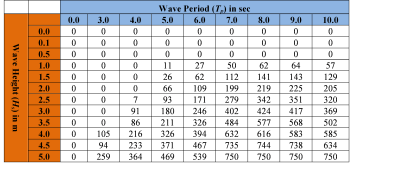

5. **Machine Parameters Table (required).** This table indicates a machine’s maximum capacity and limits (wave height and period) to capturing wave energy given seastate conditions.::

    Table Names: File can be named anything, but no spaces in the name
    File type: *.xls or .xlsx (if user has MS Excel 2007 or newer)
    Sample data set: \InVEST\WaveEnergy\Input\Machine_Pelamis.xls\Pelamis_parameter$

6. **Global Digital Elevation Model (DEM) (required).** A bathymetric raster layer is required to calculate ocean depths in meters.  This information is incorporated into potential wave power calculation and the economic analysisvaluation to determine the cost to send mooring cables to the ocean floor before running them to landing points.  If the user specifies a raster input that doesn’t cover the entire AOI, then wave output results outside this coverage will not include wave power calculations.  To ensure the model runs properly, make sure this input covers the analysis area specified in input #2 and #7. The default bathymetry data, global_dem, provides 1 arc-minute global bathymetry data. If you are using wave input data coarser than 1arc1 arc-minute resolution, we recommend using the global demDEM data.::

    Name: File can be named anything, but no spaces in the name and less than 13 characters
    Format: GIS raster file (e.g., ESRI GRID or IMG) with depth information in meters
    Sample data set (default): \InVEST\Base_Data\Marine\DEMs\global_dem

Optional inputs
---------------

The next series of inputs are optional, but may be required depending on other decision inputs.

7. **Area of Interest (AOI) (required for economic valuation).**  If you would like to further narrow your analysis area, you can create a polygon feature layer that defines your area of interest.  It instructs the model where to clip the input data and defines the exact extent of analysis.  This input is only required, however, when running the economic valuation. At the start, the model will check that the AOI is a polygon feature.  If not, it will stop and provide feedback.::

    Name: File can be named anything, but no spaces in the name
    File type: polygon shapefile (.shp)
    Sample path: \InVEST\WaveEnergy\Input\AOI_WCVI.shp

8. **Compute Economic Valuation?**  By checking this box, users will instruct the model to run the economic valuation of the model.  Currently, valuation is only permitted for runs where there is an AOI (input #7).  Additionally, the following inputs (#9-12) must be also be specified in order to output economic analysis.

9. **Landing and Power Grid Connection Point Table (optional, but required for economic valuation).** When running the economic analysis, you must provide an Excel spreadsheet that specifies locations where machine cables would reach land and eventually the energy grid.  A point ID, latitude and longitude coordinates and the type of point are required.  Currently, the model allows for multiple landing points, but only one grid-connection point.  The model will use this input to create a point feature class and project it based on the projection file specified in input #12.::

     Table Names: File can be named anything, but no spaces in the name
     File type: *.xls or .xlsx (if user has MS Excel 2007 or newer)
     Sample data set: \InVEST\WaveEnergy\Input\LandGridPts_WCVI.xls\WCVI$

  When filling out the tables with your own data, make sure to:

  + Specify latitude and longitude in decimal degrees (as shown below)
  + Only include the words "LAND" or "GRID" in the "TYPE" column.  Use the "TYPE" field to differentiate between the two landing types.  The input is not case sensitive, but does require exact wordings to differentiate the two types.

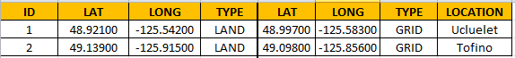

10. **Economic Parameter Table (optional, but required for economic valuation).** When running the economic analysis, the user must enter a table that includes the price of electricity, machine setup and cable costs, and other valuation parameters for net present value (NPV) calculations.::

      Table Names: File can be named anything, but no spaces in the name
      File type: *.xls or .xlsx (if user has MS Excel 2007 or newer)
      Sample data set: \InVEST\WaveEnergy\Input\Machine_Pelamis.xls\Pelamis_econ$

11. **Number of Machine Units (optional, but required for economic valuation).** When running the economic analysis, the user must enter an integer value for the number of devices per wave energy facility. This value is used for determining total energy generated during the life span (25 years) of a wave energy conversion facility.

    To determine a reasonable number of machines to enter, we recommend that the user divide the maximum capacity of the machine (see input #5) by the desired amount of energy captured.  For example, if the user desires 21,000 kW of captured wave energy, then the wave energy farm would have 28 Pelamis (maximum capacity is 750kW), or 84 AquaBuoy (maximum capacity is 250kW), or 3 WaveDragon (maximum capacity is 7000kW).

12. **Projection (optional, but required for economic valuation).**  The model uses this input projection file to accurately project the wave points (contained within the folder from input #2) into a projection with meters as the units.  Initially, the input points are unprojected (Geographic - WGS84). In order to accurately calculate the distance and resulting cable costs for wave machine facility sites to land, the model must project all facility site points within the clipped AOI extent.  Additionally, so that the model does not have to anticipate datum transformations, the projection file must have a WGS84 datum.  At the start, the model will check that this projection input meets these criteria.  If not, it will stop and provide feedback.::

      File type: projection files provided by ArcGIS (.prj)
      Sample path: Coordinate Systems\Projected Coordinate Systems\UTM\WGS 1984\
		    WGS 1984 UTM Zone 10N.prj

Running the model
=================

.. note:: The word 'path' means to navigate or drill down into a folder structure using the Open Folder dialog window that is used to select GIS layers or Excel worksheets for model input data or parameters. 

Exploring the workspace and input folders
-----------------------------------------

These folders will hold all input, intermediate and output data for the model. As with all folders for ArcGIS, these folder names must not contain any spaces or symbols. See the sample data for an example.

Exploring a project workspace and input data folder
^^^^^^^^^^^^^^^^^^^^^^^^^^^^^^^^^^^^^^^^^^^^^^^^^^^
The */InVEST/WaveEnergy* folder holds the main working folder for the model and all other associated folders. Within the *WaveEnergy* folder there will be a subfolder named *'Input'*. This folder holds most of the GIS and tabular data needed to setup and run the model.

The following image shows the sample folder structure and accompanying GIS data. We recommend using this folder structure as a guide to organize your workspaces and data. Refer to the screenshots below for examples of folder structure and data organization.

+-------------------------------------------------+-------------------------------------------------+-+
| .. image:: ./wave_energy_images/wemdataorgA.png | .. image:: ./wave_energy_images/wemdataorgB.png | |
+-------------------------------------------------+-------------------------------------------------+-+

Creating a run of the model
---------------------------
The following example describes how to set up the Wave Energy model using the sample data provided with the InVEST download. We expect users to have location-specific data to use in place of the sample data. These instructions provide only a guideline on how to specify to ArcGIS the various types of data needed and do not represent any site-specific model parameters. See the :ref:`wem-data-needs` section for a more complete description of the data specified below.

.. 
.. FROM HERE ONWARD, THERE ARE MANY LITTLE ICONS THAT AREN'T INCLUDED YET
.. 

1. Click the plus symbol next to the InVEST toolbox.

.. figure:: ./shared_images/investtoolbox.png
   :align: center
   :figwidth: 500px

2. Expand the Marine toolset and click on the Wave Energy script to open the model.

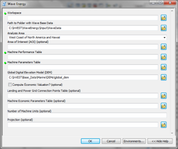

3. Specify the Workspace. Open |openfold| the *InVEST* workspace. If you created your own workspace folder (Step 1), then select it here.

   Select the *WaveEnergy* folder and click |addbutt| to set the main model workspace. This is the folder in which you will find the intermediate and final outputs when the model is run.

4. Specify the Folder with Wave Base Data. The model requires the folder location of the wave data. Click |openfold| and path to the *InVEST/WaveEnergy/Input folder*. Select the *WaveData* folder and click |addbutt| to set the wave data folder.

5. Specify the Analysis Area. You can run the model at one of two scales: Regional (West or East Coast of NA), or Global (Eastern or Western Hemispheres).

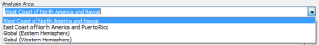

6. Specify the Area of Interest (AOI). The model does not require an AOI, unless the user chooses to run the economic valuation.  However, the AOI does permit the user to perform more local analysis if the analysis area (specified above) is too large.  This example refers to the AOI_WCVI.shp shapefile supplied in the sample data. You can create an AOI shapefile by following the **Creating an AOI** instructions in the :ref:`FAQ`.  Click |openfold| and path to the *InVEST/WaveEnergy/Input* data folder.

   If you created your own Input folder in Step 2, then select it here. Select the AOI_WCVI.shp shapefile and click |addbutt| to make the selection.

7. Specify the Machine Performance Table. The model requires an Excel table of machine performance characteristics. Click |openfold| and path to the *InVEST/WaveEnergy/Input* data folder. Double left-click *Machine_AquaBuOY.xls* and select the worksheet *AquaBuOY_performance$*.  Then click |addbutt| to make the selection.

.. note:: ArcGIS and the model may not recognize the Excel sheet as valid data if it is added to the ArcMap Data View. It is best to add Excel data directly to the model using the Open and Add buttons and navigating to the data.

8. Specify the Machine Parameters Table. The model requires an Excel table of the physical specifications for a specific type of wave machine. Click |openfold| and path to the *InVEST/WaveEnergy/Input* data folder. Double left-click *Machine_AquaBuOY.xl*s and select *AquaBuOY_parameter$*. Click |addbutt| to make the selection.

9. Specify the Digital Elevation Model. The digital elevation model provides the base data for the Wave Energy model. Click |openfold| and path to the *InVEST/BaseData/Marine/DEMs* data folder. Select the *global_dem* raster, click |addbutt| to make the selection and add it to the Wave Energy model dialog window.

10. Specify the Economic Valuation (Optional). To conduct economic valuation of the wave energy conversion machines, click the checkbox. Economic analysis is only available if an AOI was specified.

11. Specify the Landing and Grid Points Table (Optional). To conduct the economic analysis the model requires an Excel table of machine locations. Click |openfold| and path to the *InVEST/WaveEnergy/Input* data folder. Double left-click *WCVI_LandGridPts.xls* and select *WCVI$*. Click |addbutt| to make the selection.

12. Specify the Machine Economic Parameters Table (Optional). To conduct the economic analysis the model requires a table of economic valuation parameters. Click |openfold| and path to the *InVEST/WaveEnergy/Input* data folder. Double left-click *Machine_AquaBuOY.xls* and select *AquaBuOY_econ$*. Make sure you select the worksheet that corresponds to the correct wave machine specified in Steps 7 and 8. Click |addbutt| to make the selection.

13. Specify the Number of Machine Units (Optional). The model requires the number of machines to perform the economic valuation. Enter the number of machines as an integer by typing directly into the text box.

14. Specify the Projection file. The Projection file is specified to set the projection and coordinate information necessary to run the economic valuation. Open |openfold| the Coordinate Systems folder near the bottom of the Look In list and path to the *UTM/WGS 1984* folder.

    Select the WGS 1984 UTM Zone 10N.prj projection file and click |addbutt| to add it to the model dialog window.

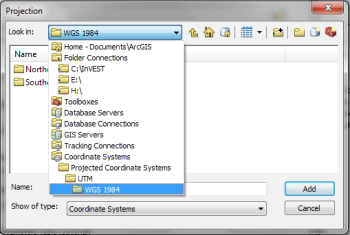

.. note:: It is assumed that all of your input data are in the same projection and coordinate systems with matching datum. If you need to (re-)project your data, see the Projection section in the :ref:`FAQ`.

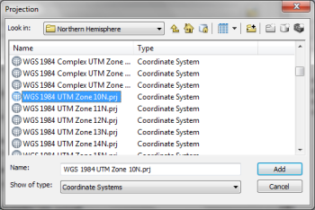

15. At this point the model dialog box is completed for a complete run of the Wave Energy model.

   Click |okbutt| to start the model run. The model will begin to run and will show a progress window with progress information about each step in the analysis. Once the model finishes, the progress window will show all the completed steps and the amount of time necessary for the model run.

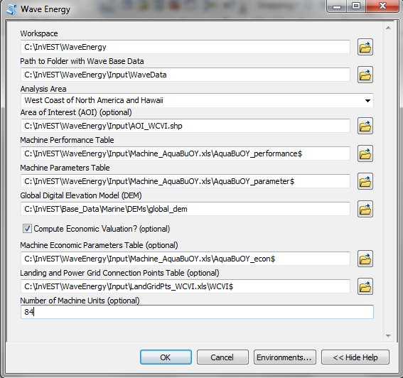

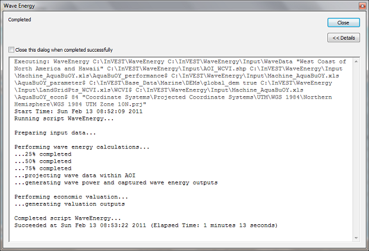

Viewing output from the model
-----------------------------
Upon successful completion of the model run, you will see new folders in your Workspace called *"intermediate"* and *"Output"*. The *Output* folder, in particular, may contain several types of spatial data, which are described in the :ref:`wem-interpreting-results` section of this guide.

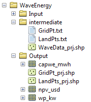

You can view the output spatial data in ArcMap (from either the Intermediate or Output folders) using the "Add Data" button |adddata|.

You can change the symbology of a layer by right-clicking on the layer name in the table of contents, selecting "Properties", and then "Symbology".  There are many options here to change the way the data appear in the map.

You can also view the attribute data of output files by right clicking on a layer and selecting "Open Attribute Table".

.. _wem-interpreting-results:

Interpreting results
====================

Model outputs
-------------

The following is a short description of each of the outputs from the Wave Energy model.  Each of these output files is automatically saved in the "Output" & "Intermediate" folders that are saved within the user-specified workspace directory:

Output folder
^^^^^^^^^^^^^

+ Output\\wp_kw

  + This raster layer depicts potential wave power in kW/m for the user-specified extent.
  + The potential wave power map indicates wave power resources based on wave conditions.  These often provide the first cut in the siting process for a wave energy project.

+ Output\\capwe_mwh

  + This raster layer depicts captured wave energy in MWh/yr per WEC device for the user-specified extent.
  + The captured wave energy map provides useful information to compare the performance of different WEC devices as a function of site-specific wave conditions.

+ Output\\npv_usd

  + This raster layer depicts net present value in thousands of $ over the 25 year life-span of a WEC facility for the user-specified extent.
  + The NPV map indicates the economic value of a WEC facility composed of multiple devices.  A positive value indicates net benefit; a negative value indicates a net loss. Such information can be used to locate potential areas where a wave energy facility may be economically feasible.
  + This is only an output if you have chosen to run economic valuation.

+ Output\\LandPts_prj.shp and GridPt_prj.shp

  + These feature layers contain information on underwater cable landing location and power grid connection points, which have been projected based on the projection specified (input #12) and the coordinates specified in the Excel table for input #10.
  + The landing and grid connection points provide useful information for interpreting the NPV map.
  + It is only an output if the user chooses to run the economic valuation.

+ Parameters_[yr-mon-day-min-sec].txt

  + Each time the model is run a text file will appear in the workspace folder.  The file will list the parameter values for that run and be named according to the date and time.
  + Parameter log information can be used to identify detailed configurations of each of scenario simulation.

Intermediate folder
^^^^^^^^^^^^^^^^^^^

+ intermediate\\WaveData_prj.shp or WaveData_clipZ.shp (depending on whether economic valuation is conducted)

  + These point layers from the selected wave data grid are based on inputs #2-4.
  + They contain a variety of input and output information, including:

    + I and J – index values for the wave input grid points
    + LONG and LAT – longitude and latitude of the grid points
    + HSAVG_M – wave height average [m]
    + TPAVG_S – wave period average [second]
    + DEPTH_M – depth [m]
    + WE_KWM – potential wave power [kW/m]
    + CAPWE_MWHY –  captured wave energy [MWh/yr/WEC device]
    + W2L_MDIST – Euclidean distance to the nearest landing connection point [m]
    + LAND_ID – ID of the closest landing connection point that is closest
    + L2G_MDIST – Euclidean distance from LAND_ID to the nearest power grid connection point [m]
    + UNITS – number of WEC devices assumed to be at this WEC facility site
    + CAPWE_ALL –  total captured wave energy for all machines at site [MWh/yr/WEC facility]
    + NPV_25Y –  net present value of 25 year period [thousands of $]

  + The model outputs in raster format are interpolated results based on these point data. So, you can use this point information to explore the exact values of essential inputs and outputs at wave input data point locations.

+ intermediate\\GridPt.txt and LandPts.txt
  + These text files log records of the grid and landing point coordinates specified in the Excel table for input #9
  + This is only an intermediate output if you choose to run economic valuation.

Case example illustrating results
=================================

The following example illustrates the application of the wave energy model to the west coast of Vancouver Island (WCVI). The figures and maps are for example only, and are not necessarily an accurate depiction of WCVI. In this example, we use input data layers including:

1. Wave base data = West Coast of North America with 4-minute resolution 2. Area of Interest = AOI_WCVI.shp 3. WEC device = Pelamis 4. Digital Elevation Model = global_dem 5. Landing and Power Grid Connection Points = LandGridPts_WCVI.shp 6. Number of Machine Units = 28 7. Projection = WGS 1984 UTM Zone 10N.prj

In order to generate a grid-scale power producing facility, it is necessary to capture a minimum of 10 kW/m of wave power (Spaulding and Grille 2010). Along the WCVI, this threshold is generally met, with the annual mean wave power >10 kW/m in most areas.  Wave power gradually increases offshore.  Approximately 20 kW/m wave power is available within 10 km of the shore, but the maximum wave power, 30-40 kW/m, is available 20-60 km offshore where depth is > 150 m.

.. figure:: ./wave_energy_images/examplepotential350.png
   :align: center
   :figwidth: 500px

   Wave power potential (kW/m) in the west coast of Vancouver Island.

Captured wave energy in this example is calculated based on Pelamis devices with 750 kW power rating. The overall patterns of the captured wave energy are similar to those of potential wave power.  A Pelamis device located at the 50-70 m depth contour produces approximately 2,000-2,300 MWh/yr of energy. Assuming 15 MWh/yr energy use per household in the WCVI (Germain 2003), each Pelamis unit produces enough energy to support 133-153 households.

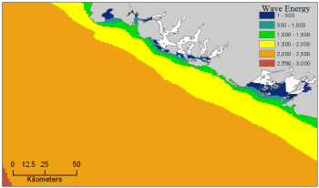

   Captured wave energy (MWh/yr) using a Pelamis device with a 750 kW power rating.

For the economic valuation of harvested wave energy, we calculate and map NPV over the 25-yr life-span of a WEC facility.  For this example model run, each of the WEC facilities is composed of 28 Pelamis devices. We used an estimate of $100,000 for the underwater cable cost and 20 cents/kW for the price of electricity.  Positive NPV occurs from 5-10 km offshore from the shoreline. It increases offshore and the highest NPV (the top 20% of all calculated NPV values ($4668k - $7307k)) occurs between 25-90 km from the shore.

.. figure:: ./wave_energy_images/examplenpv350.png
   :align: center
   :figwidth: 500px

   Net present value (thousand $) over a 25-yr life-span, using $100,000 per km for the cost of underwater transmission cables. Two underwater cable landing points are located in Tofino and Ucluelet (×) and the power grid connection point is located in Ucluelet (o). Each of the WEC facilities is composed of 28 Pelamis devices and the price of electricity is set at 20 cents per kW.  

Because there have been no commercial-scale wave energy facilities implemented to date, large uncertainties exist in the economic parameters.  In particular, the cost of underwater transmission cables is highly uncertain, ranging from $100,000 to $1,000,000 per km.  The NPV uses a lower bound of $100,000 per km for the cable cost.  When we use a median cost of underwater transmission cables ($500,000 per km), the area with a positive NPV is significantly reduced.

In this example, positive NPV only occurs within a 50 km radius around the two underwater cable landing points in Tofino and Ucluelet.  The upper 20% NPV exists between 10-40 km distances from the two landing points.  When the upper bound ($1,000,000 per km) of transmission cable costs is used, no positive NPV exist in the WCVI.  Considering uncertainties in economic parameters, users should be cautious in interpreting the magnitude of the NPV.  We recommend that the NPV of a wave energy facility computed with the default values be used only to make relative comparisons between sites.

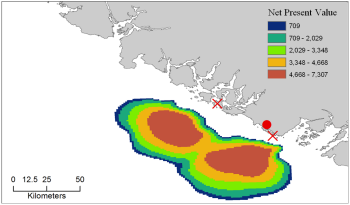

   Net present value (thousand $) over a 25-yr life-span, using $500,000 per km for the cost of underwater transmission cables. Two underwater cable landing points are located in Tofino and Ucluelet (×) and power grid connection point is located in Ucluelet (o). Each of the WEC facilities is composed of 28 Pelamis devices.  The price of electricity is set at 20 cents per kW.

Appendix A
==========

Data sources
------------

This is a rough compilation of data sources and suggestions for finding, compiling, and formatting data. This section should be used for ideas and suggestions only. We will continue to update this section as we learn about new data sources and methods.

+ Wave data: significant wave height (:math:`H_s`) and peak wave period (:math:`T_p`)

  + Global ocean wave buoy data are available from NOAA’s National Data Buoy Center (http://www.ndbc.noaa.gov/). Although ocean wave buoy provides the most accurate wave time series data, their spatial resolution is very coarse and it may not be appropriate for local scale analysis.
  + NOAA's National Weather Service provides WAVEWATCH III model hindcast reanalysis results (http://polar.ncep.noaa.gov/waves/index2.shtml). The spatial resolution of the model results ranges from 4 to 60 minutes depending on the global and regional grid systems. The model outputs have been saved at 3-hour interval from 1999 to the present. The model results have been validated with ocean buoy data at many locations and provide good quality wave information.

+ Water depth

  + NOAA’s National Geophysical Data Center (NGDC) provides global bathymetry data with various spatial resolutions at http://www.ngdc.noaa.gov/mgg/bathymetry/relief.html.
  + ETOPO1 is a 1 arc-minute global relief model of Earth's surface that integrates land topography and ocean bathymetry. It was built from numerous global and regional data sets, and is available in "Ice Surface" (top of Antarctic and Greenland ice sheets) and "Bedrock" (base of the ice sheets) versions. NGDC also provides regional and other global bathymetry datasets.

+ Wave energy absorption performance

  + EPRI wave energy conversion project provides a review of several WEC devices: http://oceanenergy.epri.com/waveenergy.html
  + Recent updates on technology may be available from the WEC device manufactures.

    + PWP-Pelamis: http://www.pelamiswave.com/
    + AquaBuOY: http://www.finavera.com/
    + WaveDragon: http://www.wavedragon.net/
    + DEXAWAVE: http://www.dexawave.com/

References
==========

Amante, C., and B. W. Eakins. 2009. ETOPO1 1 Arc-minute global relief model: procedures, data sources and analysis, p. 19. NOAA Technical Memorandum NESDIS NGDC-24.

Barstow, S., G. Mørk, D. Mollison, and J. Cruz. 2008. The wave energy resource, p. 94-131. In J. Cruz [ed.], Ocean Wave Energy: current status and future prepectives. Springer.

Bedard, R., G. Hagerman, M. Previsic, O. Siddiqui, R. Thresher, and B. Ram. 2005. Offshore wave power feasibility demonstration project: final summary report, p. 34. Electric Power Research Institute Inc.

Boehlert, G. W., G. R. Mcmurray, and C. E. Tortorici. 2007. Ecological effects of wave energy development in the Pacific Nothwest, p. 174. U.S. Dept. Commerce, NOAA Tech. Memo.

Cornett, A., and J. Zhang. 2008. Nearshore wave energy resources, Western Vancouver Island, B.C., p. 68. Canadian Hydraulics Centre.

Cornett, A. M. 2008. A global wave energy resource assessment. Proc. ISOPE 2008.

Dunnett, D., and J. S. Wallace. 2009. Electricity generation from wave power in Canada. Renewable Energy 34: 179-195.

Germain, L. A. S. 2003. A case study of wave power integration into the Ucluelet area electrical grid. Master Thesis. University of Victoria.

Iglesias, G., and R. Carballo. 2010. Wave energy and nearshore hot spots: the case of the SE Bay of Biscay. Renewable Energy 35: 2490-2500.

Nelson, P. A. and others 2008. Developing wave energy in coastal California: potential socio-economic and environmental effects, p. 182. California Energy Commission, PIER Energy-Related Environmental Research Program, and California Ocean Protection Council.

Pelamis Wave Power Ltd. 2010. Pelamis Wave Power. http://www.pelamiswave.com/.

Previsic, M. 2004a. System level design, performance and costs - San Francisco California Energetech offshore wave power plant. EPRI.

---. 2004b. System level design, performance and costs for San Francisco California Pelamis offshore wave power plant, p. 73. EPRI.

Spaulding, M. L., and A. Grilli. 2010. Application of technology development index and principal component analysis and cluster methods to ocean renewable energy facility siting. Marine Technology Society Journal 44: 8-23.

Thorpe, T. W. 1999. A brief review of wave energy, p. 186. The UK department of trade and industry.

Wilson, J. H., and A. Beyene. 2007. California wave energy resource evaluation. Journal of coastal research 23: 679-690.

.. rubric:: Footnotes

.. [#f1] Both the discount rate and the wholesale price of electricity are user-defined inputs. We provide a default value of 5% for the discount rate and .20 cents for the wholesale price of electricity. In many cases, fixed tariff or feed-in tariffs are being discussed to help promote development of renewable energy projects.

.. [#f2] We do not consider the costs of additional land-based infrastructure that may be required to connect an offshore facility to the grid, nor do we consider the costs of permitting a wave energy project. Costs estimates for different wave energy conversion devices were derived from Dunnett and Wallace (2009) and converted to 2009 $USD.

.. [#f3] Wallace and Dunnett (2009) model 24 devices in their application.

