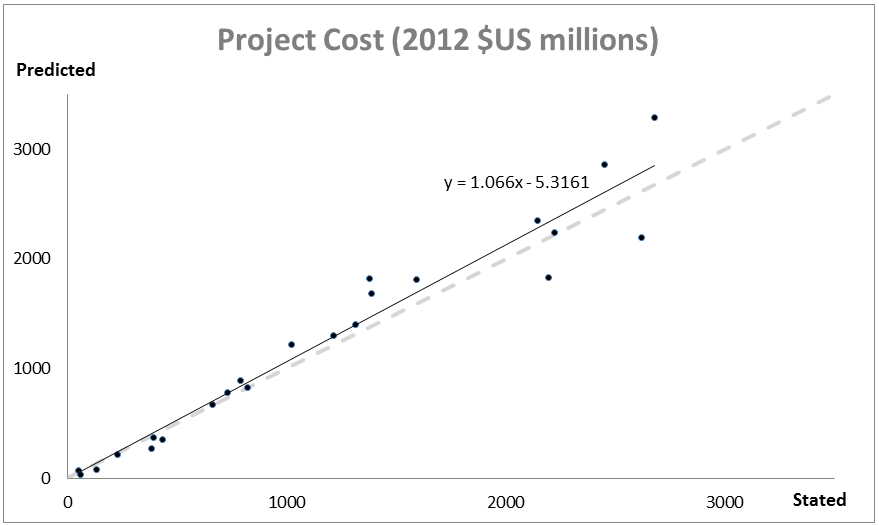

.. _wind-energy:

*******************************
Offshore Wind Energy Production
*******************************

Summary
=======

Offshore wind energy is gaining interest worldwide, with 5,400 megawatts (MW) installed as of January 2013 and a growth rate around 25% per year (GWEC, 2013). Consistently higher offshore winds and proximity to coastal load centers serve as two of the major reasons wind energy developers are looking offshore. The goal of the InVEST offshore wind energy model is to provide spatial maps of energy resource availability, energy generation potential, and (optionally) energy generation value to allow users to evaluate siting decisions, use tradeoffs, and an array of other marine spatial planning questions. The model was developed to allow maximum flexibility for the user, in that it can be run with default data and parameters, but it can just as easily be updated with new turbine and foundation information, grid connection information, and parameter values that fit the user’s context. Model outputs include wind power potential, energy generation, offset carbon emissions, net present value, and levelized cost of energy, all given at the farm level.

Peer-reviewed references for this model are http://dx.doi.org/10.1016/j.aquaculture.2014.10.035 for the financial portion of the model and http://dx.doi.org/10.1016/j.marpol.2015.09.024 for the physical portion.

Introduction
============

This wind energy model provides an easily replicable interface to assess the viability of wind energy in your region under different farm design scenarios. The outputs are raster maps, whose point values represent the aggregate value of a farm centered at that point. This allows for detailed analysis of siting choices at a fine scale, though it comes at the cost of assuming that conditions are sufficiently symmetric around the center point so that the center point represents the median conditions of all turbines in the farm. Since the user can select the number of turbines for the farm, and the raster maps do not give an indication of farm size, the model also outputs a representative polyline polygon at a randomly selected wind data point that indicates the size of the farm.

To run the model, you are asked to supply information into the graphical user interface. This includes information about wind energy conditions, the type of turbine, number of turbines, the area of interest, etc. To make the model easier to run, it includes default data in `.csv` tables on two common offshore wind turbines: 3.6 MW and 5.0 MW. We also include two wind speed datasets: a global dataset and a dataset covering the Northwest Atlantic. Finally, it includes a table of less commonly changed default values used to parameterize various parts of the model, called the "Global Wind Energy Parameters" file. These `.csv` files are required inputs, and may be modified if alternate values are desired by directly editing the files using a text editor or Microsoft Excel. When modifying these files, it is recommended that the user make a copy of the default `.csv` file so as not to lose the original default values.

The Model
=========

Wind Energy Potential
---------------------

The wind energy model estimates wind power density (wind power potential) to identify offshore areas with high energy potential. The wind power density :math:`PD (Wm^{-2}`) at a certain location can be approximated as a function of wind statistics (Elliott et al., 1986)

.. math:: \frac{1}{2}\rho\sum^c_{j=1}f(V_j)V_j^3
   :label: wind_power_density

where, :math:`\rho` is mean air density (:math:`kg\,m^{-3}`), :math:`j` is the index of wind speed class, :math:`c` is the number of wind speed classes, :math:`V_j` is wind speed of the jth class (:math:`ms^{-1}`), and :math:`f(V_j)` is probability density function of :math:`V_j`. Two probability distributions are commonly used in wind data analysis: 1) the Rayleigh and 2) the Weibull distributions (Manwell et al. 2009). The Weibull distribution can better represent a wider variety of wind regimes (Celik 2003; Manwell et al. 2009), and is given as

.. math:: f(V_j) = \frac{k}{\lambda}\left(\frac{V_j}{\lambda}\right)^{k-1}e^{-\left(\frac{V_j}{\lambda}\right)^k}
   :label: weibull_dist

where, :math:`k` and :math:`\lambda` are the shape and scale factors, respectively. The shape factor, :math:`k`, determines the shape of the Weibull probability density function (:numref:`weibull-fig`). The probability density function shows a sharper peak as :math:`k` increases, indicating that there are consistent wind speeds around the mean wind speed. On the other hand, the function becomes smoother as k decreases, indicating more variation in wind speed and more frequent low and high wind speeds. The model requires wind speed inputs to be in terms of the estimated Weibull parameters, versus taking in raw wind speed data. For our sample data we used a MATLAB function, `wblfit`, to estimate :math:`k` and :math:`\lambda` at the wind speed reference height (height at which wind speeds were observed or estimated), which returns the maximum likelihood estimates of the parameters of the Weibull distribution given the values in the wind time series data. This was done for each wind speed observation point. The model For more details of `wblfit` function, please consult https://kr.mathworks.com/help/stats/wblfit.html. This can also be accomplished in R (see here for tutorial: https://stats.stackexchange.com/questions/60511/weibull-distribution-parameters-k-and-c-for-wind-speed-data).

.. _weibull-fig:

.. figure:: ./wind_energy/weibull_curves.png
   :align: center

   Example of Weibull probability density function with various shape factors (:math:`k`), where mean wind velocity = :math:`6 ms^{-1}` (Manwell et al., 2009).

Wind power density is calculated at the hub height :math:`Z` (m) of a wind turbine (:numref:`weibull-fig`), which means all variables in :eq:`wind_power_density` and :eq:`weibull_dist` need to be converted into the appropriate value at hub height. Mean air density :math:`\rho` was estimated as :math:`\rho=1.225-(1.194\cdot 10^{-4})Z`, which approximates the U.S. Standard Atmosphere profile for air density (National Oceanic and Atmospheric Administration, 1976). We applied the wind profile power law to estimate wind speed (:math:`V`) at hub height :math:`Z` (Elliott et al., 1986).

.. math:: \frac{V}{V_r} = \left(\frac{Z}{Z_r}\right)^\alpha

where :math:`V` is wind speed (:math:`ms^{-1}`) at the hub height :math:`Z` (m) of a wind turbine, and :math:`V_{r}` is wind speed (:math:`ms^{-1}`) at the reference height :math:`Z_r` (m) where wind data are obtained. :math:`\alpha` is power law exponent, which is an empirically derived coefficient and varies with the stability of the atmosphere. For neutral stability condition, α is approximately 1/7 (0.143) for land surfaces, which is widely applicable to adjust wind speed on land (Elliott et al., 1986). The power law exponent has different value on ocean surfaces. Hsu et al. (1994) found that :math:`\alpha = 0.11\pm0.03` for ocean surface under near-neutral atmospheric stability conditions. The wind energy model uses :math:`\alpha = 0.11` as a default value to adjust wind speed on the ocean surface. The wind profile of the atmospheric boundary layer can be approximated more accurately using the log wind profile equation that accounts for surface roughness and atmospheric stability (Manwell et al. 2009).

.. _wind-turbine-fig:

.. figure:: ./wind_energy/wind_turbine.png
   :align: center

   A schematic diagram of a wind turbine (https://www.daviddarling.info/encyclopedia/H/AE_hub_height.html)

Wind power density (PD) outputs provide suitability information for a wind energy development project in terms of wind resource. Pacific Northwest Laboratories categorized wind power density and wind speed into seven classes based on United States wind atlas (:numref:`wind-power-density-fig`) (Manwell et al. 2009). Areas designated as class 4 or greater are considered to be suitable for most wind energy development. Class 3 areas are suitable for wind energy development if large turbines are used. Class 1 and 2 are rarely considered as suitable areas for wind energy development in terms of energy potential. Wind resources vary considerably over space and a more detailed categorization of wind power density for five topographical conditions was developed in Europe, which includes sheltered terrain, open plain, sea coast, open sea, hills and ridges (:numref:`wind-power-density-fig`) (Manwell et al. 2009). The wind resource classification for sea coast and open sea may provide better information on the suitability of offshore wind energy projects.

.. _wind-power-density-fig:

.. figure:: ./wind_energy/wind_power_density.png
   :align: center

   Wind power density (PD) and wind speed classes based on European wind atlas (Modified from Table 2.6 in Manwell et al. 2009).

Energy Generation
-----------------

The amount of energy harvestable from a wind turbine in a particular location depends on the characteristics of the wind turbine as well as wind conditions (Pallabazzer 2003; Jafarian & Ranjbar 2010). The wind energy model quantifies the harvestable energy based on the output power curve of a wind turbine and wind speed statistics. :numref:`power-output-curve-fig` shows an output power curve of a wind turbine (pitch control type). The wind turbine starts to generate power at the cut-in wind speed (:math:`V_cin`). The output power increases up to the rated power (Prate) as wind speed increases to the rated wind speed (:math:`V_rate`). The wind turbine keeps producing the maximum power (i.e., Prate) until wind speed reaches the cut-out wind speed (:math:`V_cout`). If wind speed increases beyond the cut-out wind speed, the wind turbine stops generating power for safety purposes. Currently, more than 74 offshore wind farms are operating globally and technology specific information of the wind turbine at each wind farm are available at LORC Knowledge (2012).

.. _power-output-curve-fig:

.. figure:: ./wind_energy/power_output_curve.png
   :align: center

   Output power (P) curve of a wind turbine (pitch control type) as a function of wind speed (V) (Modified from Fig.1 in Pallabazzer 2003)

To provide flexibility for a variety of different turbine types without requiring the user to manually enter a power curve, we estimate the output power :math:`P` (kW) of a wind turbine using a polynomial modeling approach (Jafarian & Ranjbar 2010):

.. math:: P(V) = \left\{\begin{array}{ll} 0 & V < V_{cin} \mathrm{\ or\ } V>V_{cout}\\
              P_{rate} & V_{rate} < V < V_{cout}\\
	      (V^m - V^m_{in})/(V^m_{rate} - V^m_{in}) & V_{cin} \leq V \leq V_{rate}\\
	      \end{array}\right.

where, :math:`m` is an exponent of the output power curve (usually 1 or 2). Using this approach, the energy output, O (MWh), generated by a wind turbine can be calculated using

.. math:: O = nday\cdot \frac{\rho}{\rho_0} P_{rate}\left(\int^{V_rate}_{V_{cin}} \frac{V^m - V^m_{cin}}{V^m_r-V^m_{cin}} f(V)dV
     + \int^{V_{cout}}_{V_{rate}} f(V) dV\right)(1- lossrate)

where, :math:`nday` is the number of days for energy output (e.g. :math:`nday = 365` days for annual energy output), :math:`\rho_0` is air density of standard atmosphere (e.g. :math:`1.225 kg m^{-3}` for U.S. standard atmosphere air density at sea level), and :math:`lossrate` is a decimal value which represents energy losses due to a combination of downtime, power conversion efficiency, and electrical grid losses (default value is .05).  All of these parameters are included in the global parameters `.csv` file and may be changed by the user from their defaults. Total farm energy output is equal to the individual turbine output multiplied by the number of turbines, :math:`n`,

.. math:: E = nO

The InVEST software comes with default technical and financial information about two common turbine sizes, the 3.6 MW and 5.0 MW turbines. The information for each turbine is given in `.csv` files in the `\Input` directory and is a required input into the model. The user can use the default data, edit a file, or create a new file to assess different turbine sizes or update specific characteristics. The files must retain the same format - only parameter values may safely be modified. It is recommended to save edits as new `.csv` files rather than overwriting the default data.

Offset Carbon
-------------

Since wind turbines create no greenhouse gasses when generating energy, the user may be interested in assessing the amount of carbon dioxide emissions avoided by building a wind farm versus a conventional energy generation plant. To translate carbon-free wind power to a representative amount of annual avoided :math:`\mathrm{CO}_2` emissions, we use the following default conversion factor: :math:`6.8956\cdot 10 ^{-4} \mathrm{metric\ tons\ CO}_2/kWh`

This is obtained from the EPA (https://www.epa.gov/energy/greenhouse-gases-equivalencies-calculator-calculations-and-references) and is based on 2007 data. See their website for limitations of this approach. The parameter is representative of the carbon emitted by the energy portfolio of the United States and may not be appropriate for your context. This value is changeable in the global parameters `.csv` file.

Value of Power
--------------

The value of wind power is measured as the discounted pre-tax net revenue from power generation that would accrue to a wind power developer/operator over the expected lifetime of a wind farm. The Net Present Value (https://en.wikipedia.org/wiki/Net_present_value) (NPV) of energy for a given wind farm is:

.. math:: NPV = \sum^T_{t=1}(R_t-C_t)(1+i)^{-t}

Where :math:`R_t` is the gross revenue collected in year :math:`t`, and :math:`C_t` are the aggregate costs in year :math:`t`. :math:`T` represents the expected lifetime of the facility, and :math:`i` represents the discount rate (https://en.wikipedia.org/wiki/Discount_rate) or weighted average cost of capital (WACC, https://en.wikipedia.org/wiki/Weighted_average_cost_of_capital). Both :math:`T` and :math:`i` can be changed by the user; :math:`T` can be found in the global parameters `.csv` file and :math:`i` is entered in the valuation section of the user interface. For projects that are financed by both debt and equity and where there is a significant amount of risk associated with establishing and maintaining the projected stream of revenues, WACC is a more appropriate method for establishing the time value of money. As this parameter enters into the calculation in the same way as a discount rate would, if you prefer you can input an appropriate discount rate and interpret the results accordingly. We do not supply a default value, but Levitt et al. (2011) suggest a WACC value of .116 based on a comprehensive analysis of industry specific discount rates and different debt/equity structures in Europe and the U.S. This is higher than discount rates typically used elsewhere, such as in standard cost benefit analysis, so you may find your application justifies a different rate.

Annual gross revenue is calculated by multiplying the price per kWh, :math:`s`, by the annual amount of kWh supplied to the grid by a wind farm, :math:`E_t`, thus :math:`R_t=sE_t`. It is assumed that energy is not collected in the first year during the construction phase.

Costs can be separated into one-time capital costs and ongoing operations and management costs. During the construction phase, expenditures are made on turbines, foundations, electrical transmission equipment, and other miscellaneous costs associated with development, procurement, and engineering. At the end of the farms usable lifetime, the firm must remove their equipment. The default information supplied is based on an extensive review of peer-reviewed publications, industry reports, and press releases. This information is summarized below.

Turbines
^^^^^^^^

Turbines and foundations are modeled with unit costs. We have supplied cost data on 3.6 MW and 5.0 MW class turbines as well as monopile and jacketed foundations, though you may enter your own turbine- or foundation-specific information. Note all default costs below are given in 2012 US dollars.  Assuming one foundation per turbine, the total cost of turbines and foundations is simply the number of wind turbines multiplied by the unit cost. Table 1 gives a summary of existing turbine costs.

.. csv-table::
  :file: ./wind_energy/turbine_costs.csv
  :header-rows: 1

*Table 1: Turbine costs.*

Foundations
^^^^^^^^^^^

This model can flexibly include valuation for both foundation-based and floating turbine designs. This is accomplished by letting the user enter the appropriate unit cost information for their farm design. Outputs are constrained by user-editable depth and distance parameters, so it is important to adjust these to reflect the appropriate technological constraints of your design choice. Foundation-based turbines have conventionally been limited to a depth of around 60 meters.

Foundation cost information is relatively difficult to come by. Monopile foundations are the most common foundation type and are typically mated to 3.6 MW turbines. Ramboll, a major foundation manufacturer, estimates that monopile foundations with a 3.6 MW turbine are $2 million per foundation. Monopile costs at Burbo and Rhyl Flats in the UK were given in press releases as $1.9 million $2.2 million respectively. Jacketed foundations are more robust than monopile foundations and are typically used with 5.0 MW turbines and/or in deep water. Two press releases for Nordsee Ost (Germany) and Ormonde (UK) put the unit costs for this type of foundation at $2.74 million and $2.43 million respectively. A 2012 release by the European Energy Programme for Recovery put the cost of deepwater (40 meters) gravity foundations at Global Tech 1 (Germany) as $6.65 million per foundation.

All foundations should feature an increasing cost with depth as material costs will necessarily be higher; however, this is not captured in this model currently due to the paucity of project cost data to estimate such a relationship. Jacquemin et al. (2011) used field data to estimate foundation weight as a function of water depth; however the data and functions are not given making it impossible to replicate their work. Nonetheless, this source does provide a means to approximate different foundation technology costs including floating foundation technology. Samoteskul et al. (2014) demonstrate how the data from Jacquemin et al. (2011) can be used in this way.

Electricity Transmission
^^^^^^^^^^^^^^^^^^^^^^^^

Electricity transmission equipment is much harder to model at the component level because the optimal transmission system design varies considerably with local conditions and wind farm design. Depending on the size of the farm and its distance from shore, offshore platforms with voltage transformers, converters, and switchgear may be needed. Additionally, there is a critical point where a wind farm's distance from the grid requires a switch from alternating current (AC) power to direct current (DC) power to overcome line losses which reduce the amount of energy delivered. Given design variation across different contexts, we utilized a top-down modeling approach for transmission costs to allow the model to be used broadly without the need for exhaustive system modeling and unit cost information. We collected information about electricity transmission costs (including installation) from 20 wind farms and used it to estimate a relationship between total costs and farm characteristics. This data was collected from the U.K. Ofgem tender process (https://www.ofgem.gov.uk/electricity/transmission-networks/offshore-transmission) and is shown in Table 2.

.. csv-table::
  :file: ./wind_energy/transmission_table.csv
  :header-rows: 1

*Table 2: Offshore energy transmission infrastructure.*

Using an ordinary least squares regression, we estimated the following equation that relates total transmission costs to farm capacity and total transmission cable distance:

.. math:: TransCost = \beta_0 MW + \beta_1 TotCable + \epsilon

To capture the effect of transmission losses due to resistance, we estimated this separately for each current type (AC and DC). Since our data suggest a critical threshold of greater than 54.8km for DC transmission, we adopt 60km as the transition point. This is also consistent with published figures regarding the cost effectiveness of transitioning from AC to DC transmission (Carbon Trust, 2008; UMaine, 2011); see Table 3

.. csv-table::
  :file: ./wind_energy/ac_dc_transmission_cost.csv
  :header-rows: 1

*Table 3, AC DC transmission costs. \*p<.10, \*\*p<.05, \*\*\*p<.01*

These results provide a predictive model of transmission costs as a function of current type, total farm capacity in MW, and the total length of transmission cable in km. To calculate the total length of transmission cable from any given offshore location, the model requires some information about the onshore grid. The provided options are meant to provide the user flexibility based on data availability and common analysis questions. The user has two options:

 * Create a `.csv` table that includes latitude and longitude details for all grid connection points in the area of interest
 * Use a fixed parameter to model grid location

The table option gives the user the ability to indicate both landing points on the coastline and grid connection points. For each potential wind farm site (each ocean pixel that fits the other constraints of the model and is in the AOI), the model identifies the closest specified land point and calculates the straight-line distance to that point. It then finds the closest grid connection point and calculates the straight-line distance to that point. Summing these two distances yields the total length of the transmission cables used in the calculation for transmission costs in Table 3. The user can optionally omit landing points from the table and only include grid points: in this case the model simply calculates total length of the transmission cable as the straightline distance from each potential wind farm location to the nearest grid point.

The fixed parameter option specifies a mean distance inland along the entire coast that represents the expected distance that overland cables may have to travel to reach a grid connection. Since grid connection points for large farms are very opportunistic and represent a relatively small portion of capital costs, it is not unrealistic to model grid connection this way in the absence of a detailed grid connection scheme. The default parameter included, 5.5 km, is the mean overland cable distance from the UK from the transmission infrastructure table above.

Above and beyond the cost of sending the energy to shore, wind farms also require cables which connect turbines to each other, called array cables. We estimated a simple linear relationship between array cables and the number of turbines based on the data given below:

.. csv-table::
  :file: ./wind_energy/example_farms.csv
  :header-rows: 1

*Table 4. Array cabling*

The data above suggest that .91km of cable is required per turbine at a cost of $260,000 per km. This establishes a relationship of array cable to wind turbines which can retrieve the total cost of array cable based only on the number of turbines in the farm.

Other Costs
^^^^^^^^^^^

There are a variety of additional costs associated with the construction phase, such as those for development, engineering, procurement, and royalties. AWS Truewind (2010) estimate these costs to amount to 2% of total capital expenditures; Blanco (2009) indicates it could be as high as 8%. We adopt their method of using a ratio of capital costs for calculating these costs and use the mean value of 5% as the default .

Installation of foundations, turbines, and transmission gear (cables and substations) comprises its own cost category. Kaiser and Snyder (2012) take a comprehensive view of installation costs and find that installation costs make up approximately 20% of capital expenditures in European offshore wind farms. Accordingly, this model treats installation costs as a fixed percentage of total capital costs and uses the default value suggested by Kaiser and Snyder (2012).

Decommissioning the facility at the end of its useful life (:math:`t=T`) enters into the model in a similar way as installation costs, in that it is a fixed fraction of capital expenditures. Kaiser and Snyder (2012) put this one-time cost at 2.6% to 3.7% of initial expenditures (net of scrap value) for the Cape Wind farm using a sophisticated decommissioning model. The default value used in this model is 3.7%.

Most of the costs of an offshore wind energy farm are related to the initial capital costs; however, there are ongoing costs related to maintenance and operations (O&M) as well. Boccard (2010) uses a methodology consistent with the rest of our modeling by calculating annual O&M cost as a % of original capital costs, and puts the costs somewhere between 3 and 3.5. The default value used in this model is 3.5%, and can be changed along with all the other costs in this section by editing the global parameters `.csv` file.

Energy Prices
^^^^^^^^^^^^^

This model is designed to accept a fixed unit price for a kilowatt hour (kWh) of energy over the lifetime of the wind farm, OR a .csv table where the price/kWh can be specified for each year over the lifetime of the wind farm. In some locations, wind farm operators receive a subsidized rate known as a feed-in tariff which guarantees them a set price for their energy over some time horizon. In other locations, wind farm operators must negotiate with energy providers and public utility commissions to secure a power purchase agreement. These are contracts that specify a unit price for energy delivered and may feature variable rates over time, which makes the flexibility of the price table essential.

Levelized Cost of Energy
------------------------

The levelized cost of energy (https://en.wikipedia.org/wiki/Cost_of_electricity_by_source) (LCOE) is the unit price that would need to be received for energy that would set the present value of the project equal to zero. As such, it gives the lowest price/kWh that a wind farm developer could receive before they considered a project not worthwhile. The output given by the model is in terms of currency/kWh and is calculated as:

.. math:: LCOE = \frac{\sum^T_{t=1}\frac{O\&M\cdot CAPEX}{(1+i)^t}+\frac{D\cdot CAPEX}{(1+i)^T}+CAPEX}{\sum^T_{t=1}\frac{E_t}{(1+i)^t}}

Where :math:`CAPEX` is the initial capital expenditures, :math:`O\&M` is the operations and management parameter, :math:`D` is the decommissioning parameter, :math:`E_t` is the annual energy produced in kWh, :math:`i` is the discount or WACC rate, and :math:`t` is the annual time step, where :math:`t=\{1\ldots T\}`.

Validation
----------

Capital Cost Model
^^^^^^^^^^^^^^^^^^

Since capital expenditures represent the largest proportion of costs, and much of the ancillary costs are fixed fractions of capital costs, it is critically important to validate our model against stated offshore wind farm costs worldwide. To do so, we collected data from https://www.4coffshore.com/ and https://www.lorc.dk/offshore-wind-farms-map/statistics on stated capital costs and designs for wind farms that are in construction or currently operational. We constrained the data collection to only those employing 3.6 MW and 5.0 MW turbines, for which we have provided default data with the InVEST model. Stated capital costs gathered from 4Coffshore were inflated to 2012 $US using their supplied financial close information as the basis for when the cost estimate was collected. To generate predictions, the design of each farm was input into the InVEST model using appropriate default cost parameters for all components. Most farms have their own electrical transmission equipment, though some deepwater farms are beginning to used centralized offshore substations that aggregate energy for transport from multiple farms. To predict electrical transmission costs for these farms, it was first necessary to estimate the cost of the entire offshore substation and then attribute a prorated capital cost to each farm based on their relative contribution to exported energy capacity. For example, an offshore substation with a 800 MW export capacity that is connected to Farm A (200 MW) and Farm B (600 MW) would contribute 25% of capital costs to Farm A and 75% to Farm B. The results of our validation show a very strong correlation between predictions and stated capital costs for 3.6 MW and 5.0 MW turbines using the default data (see Figure 5.6).

.. _project-costs-fig:

   Predicted capital costs versus stated capital costs.

Since this model was released in early 2013, it has been tested against other modeling approaches. They are noted below for reference:

1. The InVEST model was compared alongside model estimates from the National Renewable Energy Laboratory (NREL) and a consulting firm in a report out of the University of California, Santa Barbara, that measured the levelized cost of wind energy in Bermuda. InVEST was within 3% of the NREL estimate and 12% of the estimate made by the consulting firm. http://trapdoor.bren.ucsb.edu/research/2014Group_Projects/documents/BermudaWind_Final_Report_2014-05-07.pdf

Limitations and Simplifications
-------------------------------

Energy Production
^^^^^^^^^^^^^^^^^

The quality of wind input data determines the accuracy of model results. So, users need to understand the quality of wind input data for proper interpretation of the model results. The default wind input data are more appropriate for global and regional scale applications at 4 or 60 minutes spatial resolution.

Harvested wind energy indicates the averaged energy output for a given period based on the output power curve of a wind turbine. Users may want to consider additional technology-specific information, such as device availability, power conversion efficiency, and directional factors by applying adjustment factors to the harvested energy output.

Energy Valuation
^^^^^^^^^^^^^^^^

As the validation section demonstrates, the model and the default data reliably predict capital costs using the supplied inputs. Revenues are linked to energy production and a user-entered price. More reliable cost projections over space could likely be attained by:

 * Creating a foundation cost function that accounts for higher costs in deeper waters
 * Having installation costs vary as a function of bottom geology

These are features that are being explored for subsequent model updates conditional on data availability.

The model is amenable to producing valuation outputs for floating turbines, but was not designed specifically for this task. To produce outputs, the user needs to input reasonable values for depth and distance constraints as well as "foundation" costs equal to the unit cost of the aggregate equipment needed to float a turbine. The electrical transmission cost model was derived using technologies that are suitable to roughly 60 meters depth and 200 kilometers distance from shore and will likely produce less accurate cost projections outside of those bounds.

Data Needs
==========

1. **Workspace** Select a folder to be used as your workspace.  If the folder you select does not exist, a new one will be created.  This folder will contain the rasters produced by this model. If datasets already exist in this folder, they will be overwritten.  The output will be contained in an folder named `output` inside the workspace directory.

2. **Results Suffix (Optional)** A string that will be added to the end of the output file paths.

3. **Wind Data Points**  A .csv file that represents the wind input data (Weibull parameters). The column headers are: `LONG`, `LATI`, `LAM`, `K`, `REF`. `LAM` is the Weibull scale factor at the reference hub height. `K` is the Weibull shape factor. `REF` is the reference height at which wind speed data was collected and `LAM` was estimated at. Sample data files are found in the `WindEnergy\input` direction inside the InVEST installation directory.

  * Global Data: `GLobal_EEZ_WEBPAR_90pct_100ms.csv`
  * East Coast of the US: `ECNA_EEZ_WEBPAR_Aug27_2012.csv`

4. **Area Of Interest (Optional)**  An optional polygon shapefile that defines the area of interest. The AOI must be projected with linear units equal to meters. If the AOI is provided it will clip and project the outputs to that of the AOI. The distance inputs are dependent on the AOI and will only be accessible if the AOI is selected. If the AOI is selected and the distance parameters are selected, then the AOI should also cover a portion of the land polygon to calculate distances correctly. An AOI is required for valuation.

5. **Bathymetric DEM** A raster dataset for the elevation values in meters of the area of interest. The DEM should cover at least the entire span of the area of interest and if no AOI is provided then the default global DEM should be used.

6. **Land Polygon for Distance Calculation** A polygon shapefile that represents the land and coastline that is of interest. For this input to be selectable the AOI must be selected. The AOI should also cover a portion of this land polygon to properly calculate distances. This coastal polygon, and the area covered by the AOI, form the basis for distance calculations for wind farm electrical transmission. This input is required for masking by distance values and for valuation.

7. **Global Wind Energy Parameters** A .csv file that holds wind energy model parameters for both the biophysical and valuation modules. These parameters are defaulted to values that are reviewed in the **The Model** section of this guide.  We recommend careful consideration before changing these values.

Turbine Properties
------------------

8. **Turbine Type** A .csv file that contains parameters corresponding to a specific turbine type. The InVEST package comes with two turbine model options, 3.6 MW and 5.0 MW. You may create a new turbine class (or modifying existing classes) by using the existing file format conventions and filling in your own parameters. It is recommended that you do not overwrite the existing default .csv files. These files are found in the `WindEnergy\input` direction inside the InVEST installation directory and named

  * 3.6 MW: `3_6_turbine.csv`
  * 5.0 MW: `5_0_turbine.csv`

9. **Number Of Turbines** An integer value indicating the number of wind turbines per wind farm.

10. **Minimum Depth for Offshore Wind Farm Installation (m)** A floating point value in meters for the minimum depth of the offshore wind farm installation.

11. **Maximum Depth for Offshore Wind Farm Installation (m)** A floating point value in meters for the maximum depth of the offshore wind farm installation.

12. **Minimum Distance for Offshore Wind Farm Installation (m)** A floating point value in meters that represents the minimum distance from shore for offshore wind farm installation. Required for valuation.

13. **Maximum Distance for Offshore Wind Farm Installation (m)** A floating point value in meters that represents the maximum distance from shore for offshore wind farm installation. Required for valuation.

Valuation
---------

14. **Cost of the Foundation Type (millions of currency)** A floating point number for the unit cost of the foundation type (in millions of your chosen currency). The cost of a foundation will depend on the type of foundation selected, which itself depends on a variety of factors including depth and turbine choice. Any currency may be used, as long as it is consistent across the different valuation inputs.

15. **Discount Rate** The discount rate reflects preferences for immediate benefits over future benefits. Enter in decimal form (Ex: 1% as 0.01, 100% as 1.0).

16. **Grid Connection Points** An optional .csv file with grid and land points to determine energy transmission cable distances from. Each point location is represented as a single row with columns being `ID`, `TYPE`, `LATI`, and `LONG`. The `LATI` and `LONG` columns indicate the coordinates for the point. The `TYPE` column relates to whether it is a land or grid point. The `ID` column is a simple unique integer. The shortest distance between respective points is used for calculations. An example:

   .. csv-table::
     :file: ../invest-sample-data/WindEnergy/input/NE_sub_pts_modified.csv
     :header-rows: 1
     :widths: auto

17. **Average Shore to Grid Distance (km)** A number in kilometers that is only used if grid points are NOT used in valuation. When running valuation using the land polygon to compute distances, the model uses an average distance to the onshore grid from coastal cable landing points instead of specific grid connection points.

18. **Use Price Table** If selected, then the model uses a price table to value energy produced over the lifetime of the farm. If not, the model uses a constant price/kWh (with potential inflation).

19. **Wind Energy Price Table** A .csv file that indicates the price received for each annual time period over the life of the wind farm. See sample price table "price_table_example.csv" for proper formatting. Any currency may be used, as long as it is consistent across the different valuation inputs.

20. **Price of Energy per Kilowatt Hour (currency/kWh)** The price of energy per kilowatt hour. This is only available if "Use Price Table" is unchecked. Any currency may be used, as long as it is consistent across the different valuation inputs.

21. **Annual Rate of Change in the Price of Wind Energy** This represents the inflation rate for the price of wind energy and refers to the price entered directly above. Enter in decimal form (Ex: 1% as 0.01, 100% as 1.0). This is only available if "Use Price Table" is unchecked.

Interpreting Results
====================
All output resolutions are based on the resolution of the supplied digital elevation model raster. When the resolution of the DEM exceeds the resolution of the wind data layers, pixel values are determined by using bilinear interpolation.

 * `carbon_emissions_tons.tif`: a GeoTIFF raster file that represents tons of offset carbon emissions for a farm built centered on a pixel per year.

 * `density_W_per_m2.tif`: a GeoTIFF raster file that represents power density (W/m^2) centered on a pixel.

 * `example_size_and_orientation_of_a_possible_wind_farm.shp`: an ESRI shapefile that represents the outer boundary of a sample windfarm.  The position of this polygon is random and is meant to give the user a sense of scale of the potential wind farm.

 * `harvested_energy_MWhr_per_yr.tif`: a GeoTIFF raster file that represents the annual harvested energy from a farm centered on that pixel.

 * `levelized_cost_price_per_kWh.tif`: a GeoTIFF raster file that represents the unit price of energy that would be required to set the present value of the farm centered at that pixel equal to zero. Values are given in the unit of currency used as model input.

 * `npv_US_millions.tif`: a GeoTIFF raster file that represents the net present value of a farm centered on that pixel. Values are millions of the unit of currency used as model input.

 * `wind_energy_points.shp`: an ESRI Shapefile that summarizes the above outputs for each point...

Data Sources
============

Wind Time Series data
-----------------------------
NOAA’s National Weather Service provides hindcast reanalysis results for wind time series; https://polar.ncep.noaa.gov/. The spatial resolution of the model results ranges from 4 to 60 minutes depending on the global and regional grid systems. The model outputs have been saved at 3-hour interval from 1999 to the present. The model results have been validated with ocean buoy data at many locations and provide good quality wind information.

Turbine Parameters
------------------
LORC provides the parameter information of offshore wind turbines that are currently operating in the world. https://www.lorc.dk/offshore-wind-farms-map/list?sortby=InstalledCapacity&sortby2=&sortorder=desc

Valuation
---------
Data sources are largely cited above, except for figures that were derived from press releases. Press releases were found by an exhaustive Google keyword search on “offshore wind energy” contract and several variants of that theme. All costs were recorded and inflated in their original currency and exchanged to $US at the spot rate on March 30th, 2012.

This file (https://www.dropbox.com/s/p4l36pbanl334c2/Wind_Sources.zip?dl=0) contains an archive of the sources sited for costs and a spreadsheet that links each cost figure to the relevant press release, conference proceeding, etc.

References
==========

AWS Truewind. 2010. New York’s Offshore Wind Energy Development Potential in the Great Lakes. Feasibility Study for New York State Energy Research and Development Authority.

Blanco, M. 2009. The Economics of Wind Energy. Renewable and Sustainable Energy Reviews, 13, 1372-82. http://dx.doi.org/10.1016/j.rser.2008.09.004

Boccard, N. 2010. Economic Properties of Wind Power: A European Assessment. Energy Policy, 38, 3232-3244. http://dx.doi.org/10.1016/j.enpol.2009.07.033

Carbon Trust. 2008. Offshore Wind Power: Big Challenge, Big Opportunity. Report on behalf of the Government of the United Kingdom.

Celik, A. N. 2003. A statistical analysis of wind power density based on the Weibull and Rayleigh models at the southern of Turkey. Renewable Energy 29:509-604. http://dx.doi.org/10.1016/j.renene.2003.07.002

Elliott, D. L., C. G. Holladay, W. R. Barchet, H. P. Foote, and W. F. Sandusky. 1986. Wind energy resource atlas of the United States. DOE/CH 10093-4. Solar Technical Information Program, Richland, Washington.

Global Wind Energy Council (GWEC). 2013. Global Wind Statistics, 2012. Accessed at: http://www.gwec.net/wp-content/uploads/2013/02/GWEC-PRstats-2012_english.pdf

Griffin, R., Buck, B., and Krause, G. 2015a. Private incentives for the emergence of co-production of offshore wind energy and mussel aquaculture.  Aquaculture, 346, 80-89. http://dx.doi.org/10.1016/j.aquaculture.2014.10.035

Griffin, R., Chaumont, N., Denu, D., Guerry, A., Kim, C., and Ruckelshaus, M. 2015b. Incorporating the visibility of coastal energy infrastructure into multi-criteria siting decisions. Marine Policy, 62, 218-223. http://dx.doi.org/10.1016/j.marpol.2015.09.024

Hsu, S. A., E. A. Meindl, and D. B. Gilhousen. 1994. Determining the power-law wind-profile exponent under near-neutral stability conditions at sea. Journal of applied meteorology 33:757-765. http://dx.doi.org/10.1175/1520-0450(1994)033%3C0757:DTPLWP%3E2.0.CO;2

Jacquemin, J., Butterworth, D., Garret, C., Baldock, N., and A. Henderson. 2011. Inventory of location specific wind energy cost. WP2
Report D2.2. Spatial deployment of offshore wind energy in Europe (Wind-Speed). Garrad Hassan & Partners Ltd. Supported by Intelligent Energy Europe.

Jafarian, M., and A. M. Ranjbar. 2010. Fuzzy modeling techniques and artificial neural networks to estimate annual energy output of a wind turbine. Renewable Energy 35:2008-2014. http://dx.doi.org/10.1016/j.renene.2010.02.001

Kaiser, M. and B. Snyder. 2012. Offshore wind capital cost estimation in the U.S. Outer Continental Shelf: A reference class approach. Marine Policy, 36, 1112-1122. http://dx.doi.org/10.1016/j.marpol.2012.02.001

Levitt, A., Kempton, W., Smith, A., Musial, W., and J. Firestone. 2011. Pricing offshore wind energy. Energy Policy, 39, 6408-6421. http://dx.doi.org/10.1016/j.enpol.2011.07.044

Lorc Knowledge. 2012. List of offshore wind farms. https://www.lorc.dk/offshore-wind-farms-map/list Accessed at December 31, 2012.

Manwell, J. F., J. G. Mcgowan, and A. L. Rogers. 2009. Wind energy explained: Theory, design and application. John Wiley & Sons Ltd., West Sussex, United Kingdom.

National Oceanic and Atmospheric Administration. 1976. U. S. Standard Atmosphere. NOAA- S/T76-1562, Washington, DC.

Pallabazzer, R. 2003. Provisional estimation of the energy output of wind generators. Renewable Energy, 29, 413-420. http://dx.doi.org/10.1016/S0960-1481(03)00197-6

Samoteskul, K., Firestone, J., Corbett, J., and J. Callahan. 2014. Changing vessel routes could significantly reduce the cost of future offshore wind projects. Journal of Environmental Management, 141, 146-154. http://dx.doi.org/10.1016/j.jenvman.2014.03.026

UMaine. 2011. Maine deepwater offshore wind report. https://composites.umaine.edu/research/offshore-wind-report/
