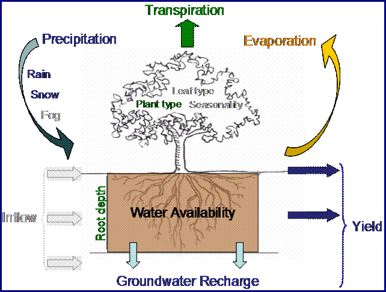

.. _annual_water_yield:

******
年产水
******

总结
====

水电占全球能源生产的百分之二十，其中大部分是由水库系统产生的。InVEST估计水库产生的水电的年平均数量和价值，并确定景观的每个部分每年为水力发电贡献多少水产量或价值。该模型有三个组成部分：产水量、用水量和水电估值。生物物理模型不考虑地表-地下水相互作用或供水的时间维度。估值模型假设能源定价随时间推移是静态的。

介绍
====

淡水的提供是一种生态系统服务，它以多种方式为社会福利做出贡献，包括通过生产水电，这是世界上使用最广泛的可再生能源形式。大多数水力发电来自流域供水的水库系统，这些水库系统通常以一致和可预测的方式提供能量。考虑到给定流域的可能水位，这些系统旨在解释水量的年度变化，但容易受到土地利用和土地覆盖（LULC）变化引起的极端变化影响。LULC 的变化可以改变水文循环，影响蒸散、渗透和保水模式，并改变可用于水力发电的时间和水量（世界水坝委员会，2000年; Ennaanay，2006年）。
影响水电设施上游年平均出水量的景观变化可以增加或减少水电生产能力。绘制用于水力发电的产水量地图有助于避免对水电生产的意外影响，或有助于指导希望维持电力生产的土地使用决策，同时平衡其他用途，如保护或农业。这些地图还可用于为下游利益相关者（如水电公司）的恢复或管理投资提供信息，以期改善或维持产水量这一重要的生态系统服务。在具有多个水库用于水力发电的大型流域中，向更高价值市场出售发电厂上游区域将具有更高的服务价值。每个地块对水电生产的贡献价值的地图可以帮助管理人员避免在水电价值最高的地区进行开发，了解不同的管理方案将损失或获得多少价值，或确定哪些水电生产商在维持整个景观产水量方面拥有最大的利益。

模型
====

InVEST产水量模型估计了景观不同部分的水的相对贡献，提出对土地利用模式变化如何影响年度地表水产量和水力发电的深刻见解。

对景观变化与水文过程之间的联系进行建模并不简单。这些连接和相关流程的复杂模型（如 WEAP 模型）是资源和数据密集型的，需要大量的专业知识。为了适应更多数据可用的环境，InVEST绘制并模拟了用于水力发电的景观的年平均产水量，而不是直接解决LULC变化对水电的影响，因为这个过程与每天到每月时间尺度上的进水量变化密切相关。相反，InVEST计算每个地块对年平均水电产量的相对贡献以及该贡献在能源生产方面的价值。水库寿命期间水电生产的净现值也可以通过对折价的年收入求和来计算。

工作原理
--------

模型在格网地图上运行。它估计了关注地区每个子流域用于水力发电的水的数量和价值。它有三个组件，按顺序运行。首先，它确定从每个像素流出的水量，因为降水减去经历蒸散的水的比例。该模型不区分地表、地下和基流，但假设一个像素的所有产水量都通过这些路径之一到达关注点。然后，此模型对流域水平的产水量求和并平均。像素尺度计算使我们能够表示产水量中关键驱动因素的异质性，例如土壤类型、降水、植被类型等。然而，我们用作这组模型基础的理论是在子流域到流域尺度上开发的。我们只对这些模型在子流域尺度上的解释有信心，因此所有输出都被求和和/或平均到子流域尺度。我们继续提供某些输出的像素比例表示，仅用于校准和模型检查目的。**这些像素比例尺的地图不得用于理解水文过程或为任何类型的决策提供信息。**

其次，除了年平均径流量之外，它还通过减去用于其他用途的地表水来计算可用于水力发电的地表水的比例。第三，它估计到达水电站水库的水所产生的能量以及该能量在水库生命周期内的价值。
|

图1.年产水量模型中使用的简化水平衡方法的概念图。颜色的水平衡方面包含在模型中，灰色的方面不包括在模型中。

产水量模型
^^^^^^^^^^

产水量模型基于Budyko曲线和年平均降水量。我们确定景观上每个像素的年产水量:math:`Y(x)` 如下：

.. math:: Y(x) = \left(1-\frac{AET(x)}{P(x)}\right)\cdot P(x)

式中:math:`AET(x)` 是像素:math:`x` 的年实际蒸散量，:math:`P(x)` 是像素:math:`x` 上的年降水量。

对于植被土地利用/土地覆盖（LULC）类型，水平衡的蒸散部分:math:`\frac{AET(x)}{P(x)}` 是基于Fu (1981)和Zhang (2004)等人提出的Budyko曲线的表达式：

.. math:: \frac{AET(x)}{P(x)} = 1+\frac{PET(x)}{P(x)} - \left[1+\left(\frac{PET(x)}{P(x)}\right)^\omega\right]^{1/\omega}
	:label: aet_vegetated

式中:math:`PET(x)` 是潜在的蒸散量，:math:`\omega(x)` 是表征自然气候-土壤特性的非物理参数，具体内容如下。

潜在蒸散量:math:`PET(x)` 定义为：

.. math:: PET(x) = K_c(\ell_x)\cdot ET_0(x)

式中:math:`ET_0(x)` 是来自像素:math:`x` 的参考蒸散发量，:math:`K_c(\ell_x)` 是与像素:math:`x` 上LULC :math:`\ell_x` 相关的植物(植被)蒸散发系数。:math:`ET_0(x)` 反映了当地的气候条件，其依据是生长在该地区的草或苜蓿等参考植被的蒸散发。:math:`K_c(\ell_x)` 在很大程度上取决于该像素上发现的土地利用/土地覆盖的营养特征(Allen et al. 1998)。:math:`K_c` 将:math:`ET_0` 的值调整为作物或植被类型。

:math:`\omega(x)` 是一个经验参数，可以表示为:math:`\frac{AWC*N}{P}` 的线性函数，其中N为每年的降雨事件数，AWC为植物有效含水量的体积(详见附录1)。虽然正在进行进一步的研究，以确定最能描述全局数据的函数，但我们在InVEST模型中使用Donohue等人(2012)提出的表达式，从而定义:

.. math:: \omega(x) = Z\frac{AWC(x)}{P(x)} + 1.25
   :label: omega

式中:

+ :math:`AWC(x)` 是体积(mm)植物有效含水量。土壤质地和有效生根深度定义 :math:`AWC(x)`，它确定了土壤中可容纳和释放的水量，供植物使用。用植物有效水分能力(PAWC)与根系约束层深度和植被生根深度最小值的乘积来估计:

	.. math:: AWC(x)= Min(Rest.layer.depth, root.depth)\cdot PAWC

  
根系限制层深度是由于物理或化学特性而抑制根系渗透的土壤深度。植被的生根深度通常是指某一植被类型95%的根系生物量发生的深度。PAWC为植物有效水量，即田间水量与萎蔫点之差。

+ :math:`Z` 是一个经验常数，有时被称为“季节性因子”，它捕捉了当地的降水模式和其他水文地质特征。它与每年降雨事件数N正相关。1.25项是:math:`\omega(x)` 的最小值，它可以被视为裸土的值(当根系深度为0时)，正如Donohue等人(2012)所解释的那样。根据文献(Yang et al.， 2008;Donohue et al. 2012)，:math:`\omega(x)` 的值上限为5。

对于其他LULC类型(开放水域、城市、湿地)，实际蒸散发直接由参考蒸散发计算:math:`ET_0(x)`，其上限由降水定义:

.. math:: AET(x) = Min(K_c(\ell_x)\cdot ET_0(x),P(x))
	:label: aet_non_vegetated

式中:math:`ET_0(x)` 为参考蒸散发量，:math:`K_c(\ell_x)` 为每个LULC的蒸发因子。

产水量模型在小流域层面生成并输出总产水量和平均产水量。

已实现供应
^^^^^^^^^^^^^^^

模型的已实现供应选项（在工具界面中称为缺水）根据计算出的产水量和相关流域的耗水量来计算流入水库的水量。用户以表格格式输入每种土地利用/土地覆被类型的用水量。消费性使用的例子包括未返回出口上游溪流的市政或工业取水。此选项还可用于表示流域外的流域间转移。

例如，在城市地区，消费性使用量可以计算为人口密度与人均消费量乘积。这些基于土地利用的价值仅与需求的消费部分有关;一些用水是非消耗性的，例如用于工业过程的水或使用后返回溪流的废水，在出口的上游。因此，消费性使用量估算应考虑到流向流域出口上方溪流的任何回流：

.. math:: C = \frac{W-R}{n}

其中:math:`C` =消费使用(:math:`m^3/yr/pixel`)，:math:`W` =提取(:math:`m^3/yr`)，:math:`R` =回流(:math:`m^3/yr`)，和:math:`n` =给定土地覆盖的像素数。

为了简单起见，流域中的每个像素要么是“贡献”像素，即对水电生产做出贡献，要么是“使用”像素，即将水用于其他消费用途。这一假设意味着与消费用途有关的土地利用不会为下游用途贡献任何产量。实际到达水库用于大坝的水量:math:`d` (称为实现供应量)被定义为流域总产水量与流域总耗水量之差:

.. math:: V_{in} = Y-u_d

其中:math:`V_{in}` 是实现的供水量(水库入水量)，:math:`u_d` 是大坝上游流域的总耗水量:math:`d`，:math:`Y` 是大坝上游流域的总产水量:math:`d`。

请注意，这里只考虑人为的利用，因为蒸散发(包括农田的耗水量)是由产量模型中的:math:`K_c` 参数计算的。用户应注意，该模型假设所有可用于蒸散发的水都来自流域内(如降雨量)。如果农业是由雨水灌溉，或者灌溉水源在研究流域内(不是来自流域间转移或断开的深层含水层)，这一假设是成立的。有关更多信息，请参阅限制部分。

如果观测数据可用于大坝水库的实际年入流率:math:`d`，则可与:math:`V_{in}` 进行比较。

水电生产和评估
^^^^^^^^^^^^^^^^^^^^^^^^^^^^^^^^^^^
模型的“估值”选项既估计了水力发电用水的估计实际供水量，又估计了该能源的价值。给出了水库整个剩余寿命的现值货币估计。如果有水电生产成本数据，可以计算净现值。然后，根据每个子流域对能源生产的比例，将产生的能源和收入重新分配给景观。最终的输出地图显示了在水库生命周期内每个子流域的产水量可以归因于多少能源生产和水电价值。

有关为任何服务分配货币值的重要注意事项是，应仅对已校准和验证的模型输出进行评估。否则，就不知道模型表示关注区域的好坏，这可能会导致对确切值的错误表示。如果模型尚未校准，则仅应使用相对结果（例如增加 10%），而不是绝对值（例如 1，523 立方米或 42，900 美元）。

在大坝:math:`d` 中，功率计算公式如下:

.. math:: p_d = \rho\cdot q_d \cdot g \cdot h_d

式中:math:`p_d` 是功率，单位为瓦，:math:`\rho` 是水密度(1000 Kg/m\ :sup:`3`\ )，:math:`q_d` 是流速(m\ :sup:`3`\ /s)，:math:`g` 是重力常数(9.81 m/s\ :sup:`2`\ )，和:math:`h_d` 是涡轮机大坝后的水高度(m)。在这个模型中，我们假设每年的总流入水量是均匀连续释放的。

发电量方程通过将根据消耗调整的年流入量(:math:`V_{in}`)转换为每秒速率将其与产水量模型连接起来。由于电能通常用千瓦时来衡量，功率:math:`p_d` 乘以一年的小时数。所有水力水库的建造都是为了最大限度地发电。这被称为能量生产等级，它代表了如果涡轮机100%高效，并且所有进入水库的水都用于发电，那么可以生产多少能量。在现实世界中，涡轮机效率低下，水库中的水可能被用于灌溉等其他用途，也可能被保留在水库中用于娱乐等其他用途，或者从水库中释放出来用于非电力生产用途，如维持下游的环境流动。为了解释这些低效率和流量和功率单元调整，水库:math:`d` 的年平均能源生产:math:`\varepsilon_d` 计算如下:

.. math:: \varepsilon_d= 0.00272\cdot \beta \cdot \gamma_d \cdot h_d \cdot V_{in}

式中:math:`\varepsilon_d` 是水电发电量(KWH)，:math:`\beta` 是涡轮效率系数(%)，:math:`\gamma_d` 是大坝水库的流入水量的百分比:math:`d` 将用于发电。

为了将:math:`\varepsilon_d`，大坝每年产生的能量:math:`d`，转换为产生的能量(使用点价值)的净现值(NPV)，

.. math:: NPVH_d=(p_e\varepsilon_d-TC_d)\times \sum^{T-1}_{t=0}\frac{1}{(1+r)^t}
   :label: net_present_value

式中:math:`TC_d` 是大坝的年度运行成本总额:math:`d`，:math:`p_e` 是大坝水电站提供的电力(每千瓦时)的市场价值:math:`d`，:math:`T_d`表示当前景观条件预计将持续的年数或大坝电站的预期剩余寿命:math:`d` (设置:math:`T`为最小值，如果两个时间值不同)，和:math:`r` 是市场折价率。上面方程的形式假设:math:`TC_d`，:math:`p_e`，和:math:`\varepsilon_d`，随着时间的推移是常数。任何货币都可以使用，只要它在不同的输入之间是一致的。

该模型不执行以下计算，但在大坝的生命周期内的能源生产:math:`d` 可以归因于每个小流域如下:

.. math:: \varepsilon_x = (T_d\varepsilon_d)\times(c_x / c_{tot})

括号中的第一项表示大坝整个生命周期的发电量:math:`d`。第二项表示用于水电生产的水量中来自小流域的比例:math:`x` 相对于整个流域的总水量。在大坝的生命周期内，每个小流域的水力生产价值:math:`d` 可以类似地计算:

.. math:: NPVH_x=NPVH_d\times (c_x/c_{tot})

限制和简化
^^^^^^^^^^^^^^^^^^^^^^^^^^^^^^^

该模型有许多限制。首先，它不是为了制定详细的水计划，而是为了评估流域的变化如何影响水库系统的水力发电。它基于年平均值，忽略了极端情况，没有考虑供水和水力发电的时间维度。

其次，该模型没有考虑土地利用/土地覆被的空间分布。用于水平衡的经验模型（基于Budyko理论）已经在比InVEST中使用的像素尺寸更大的尺度上进行了测试（Hamel & Guswa，in review）。复杂的土地利用模式或基础地质可能引起复杂的水平衡，可能无法被模型很好地捕捉到。

第三，该模型没有考虑次年度供水时间模式。产水量是一项供应功能，但水电效益也受到流量调节的影响。全年高峰流量的时间和最低运营流量的交付决定了水电的产量和年收入。景观情景的变化可能影响流量的时间与年产水量一样大，在考虑气候变化等驱动因素时尤其令人关切。对陆上流动的时间模式进行建模需要不适合我们方法的详细数据。尽管如此，该模型还是对景观情景如何影响水电生产的年度供水提供了有用的初步评估。

第四，该模式大大简化了消费需求。对于每个LULC，使用单个变量(:math:`\gamma_d`)来表示水资源分配的多个方面，这可能会错误地表示水在用途之间和随时间推移的复杂分布。实际上，同一LULC类别的宗地之间的用水需求可能差异很大。大部分用水需求也可能来自大点源取水口，这些取水口根本不用 LULC 等级来代表。该模型通过将用水分布在景观中来简化用水需求。例如，城市区域的用水需求可能很大，模型通过在城市 LULC 类上分布来表示此需求。然而，实际的供水量可能在农村地区的上游。实际需求点和建模需求点的空间差异可能会导致已实现供应输出网格中的表示不正确。在能源生产和水电价值的重新分配中，消耗的分布也得到了简化，因为假设沿流路消耗的水从上游的每个像素中平均抽取。因此，水资源短缺、能源生产模式和水电价值可能被误判。

第五，该模型没有很好地捕捉到用于灌溉的水转移，无论是在子流域之间还是在季节之间。在将经验方法应用于农田时，应考虑灌溉模式，这通常属于以下情况之一：

1)如果除了直接降雨之外没有灌溉，则可以假设农田对气候强迫的反应与自然植被类似（即InVEST模型中使用的生态水文模型背后的理论，将植物有效水分和气候强迫联系起来，适用，参见Donohue等人，2012）

2)如果小型水库在雨季储存水以在旱季灌溉作物，则在灌溉季节，AET应等于PET。然而，该模型预测了AET<PET，因为未受干扰的集水区（除了土壤储存外没有其他水库）的保水性有限。这可能导致对蒸散量的低估，从而高估产量。为避免此问题，您可以使用 AET 的替代公式（公式 2），该公式将 AET 直接设置为 ETo 的函数。（在这种情况下，请记住AET以P为上限，以避免预测负产水量，这可能会导致产量过高）。

3)如果研究区域包含用集水区外部的水灌溉的农田（通过盆地间调水或从断开的地下水源抽水），则 AET 在灌溉季节也等于 PET。由于该模型假设蒸散量来自降雨，因此产水量可能被高估了。这种情况也可以通过使用AET的替代方程（公式2）来表示。假设作物得到有效灌溉（即进口水的总量等于作物像素的缺水量或PET – P），那么可以将已知的灌溉水量添加到建模的产水量中，以更好地了解实际产量。

4)由于季节性在灌溉用水中起着重要作用，因此在具有大片灌溉田地的集水区应用年度模型时要谨慎。对于上述未涵盖的选项或复杂的调水可能严重影响水平衡的备选方案，鼓励用户使用能够更好地代表空间和时间调水的替代模型。特别是，在没有研究区域内不同水平衡分量（即降雨量、溪流、灌溉速率和时间）的良好数据的情况下校准模型时，应格外谨慎。

最后，该模型假设水电生产和价格随着时间的推移保持不变。它没有考虑能源生产的季节性变化或能源价格的波动，这可能会影响水电的价值。然而，即使次年产量或能源价格发生变化，同一流域内地块之间的相对价值也应该是准确的。

数据需求
==========

.. note:: *所有空间输入必须具有完全相同的投影坐标系* (线性米单位), *而不是* 地理坐标系 (以度为单位).

.. note:: 栅格输入可能具有不同的像元大小，并且将对其进行重采样以匹配土地利用/土地覆被栅格的像元大小。因此，所有模型结果的像元大小将与土地利用/土地覆被栅格相同。

- :investspec:`annual_water_yield workspace_dir`

- :investspec:`annual_water_yield results_suffix`

- :investspec:`annual_water_yield precipitation_path`

- :investspec:`annual_water_yield eto_path`

- :investspec:`annual_water_yield depth_to_root_rest_layer_path`

- :investspec:`annual_water_yield pawc_path`

- :investspec:`annual_water_yield lulc_path`

- :investspec:`annual_water_yield watersheds_path`

  字段：

  - :investspec:`annual_water_yield watersheds_path.fields.ws_id`

- :investspec:`annual_water_yield sub_watersheds_path`

  字段：

  - :investspec:`annual_water_yield sub_watersheds_path.fields.subws_id`

- :investspec:`annual_water_yield biophysical_table_path`

列:

  - :investspec:`annual_water_yield biophysical_table_path.columns.lucode`

  - :investspec:`annual_water_yield biophysical_table_path.columns.lulc_veg`.值为1的类将根据eq. :eq:`aet_vegetated` 计算AET。值为0的类将根据eq. :eq:`aet_vegetated` 计算AET。

  - :investspec:`annual_water_yield biophysical_table_path.columns.root_depth` 这通常被给出为一种植被类型95%的根系生物量发生的深度。对于不使用一般Budyko曲线的土地用途(即蒸散量由eq.:eq:`aet_non_vegetated` 计算)，不需要根深。在这些情况下，根深度字段将被忽略，并可能被设置为一个值，例如-1，以指示不使用该字段。

  - :investspec:`annual_water_yield biophysical_table_path.columns.kc` 用于计算潜在蒸散发，以修正参考蒸散发。

- :investspec:`annual_water_yield seasonality_constant` 这是:math:`Z`在eq. :eq:`omega`。更多信息请参见附录。
- :investspec:`annual_water_yield demand_table_path` 耗水量是指被纳入产品或作物、被人类或牲畜消耗或从流域水平衡中去除的那部分水。

	列:

	- :investspec:`annual_water_yield demand_table_path.columns.lucode`
	- :investspec:`annual_water_yield demand_table_path.columns.demand` 注意，考虑像素面积是很重要的，因为对于相同的土地覆盖类型，较大的像素将消耗更多的水。

- :investspec:`annual_water_yield valuation_table_path`

 	列:

 	- :investspec:`annual_water_yield valuation_table_path.columns.ws_id`
 	- :investspec:`annual_water_yield valuation_table_path.columns.efficiency` 可向水力发电厂经理获得。数值一般在0.7到0.9之间。
 	- :investspec:`annual_water_yield valuation_table_path.columns.fraction` 可向水力发电厂经理获得。管理者可以在不发电的情况下放水，以满足灌溉、饮用水或环境需求。 	- :investspec:`annual_water_yield valuation_table_path.columns.height`
 	- :investspec:`annual_water_yield valuation_table_path.columns.kw_price`
 	- :investspec:`annual_water_yield valuation_table_path.columns.cost`
 	- :investspec:`annual_water_yield valuation_table_path.columns.time_span` This is :math:`T` in equation :eq:`net_present_value`.
 	- :investspec:`annual_water_yield valuation_table_path.columns.discount` This is :math:`r` in equation :eq:`net_present_value`.

解释结果
====================

输出栅格的分辨率将与作为输入提供的土地利用/土地覆被栅格的分辨率相同。
* **参数日志**: 每次运行模型时，都会在工作区中创建一个文本 （.txt） 文件。该文件将列出该运行的参数值和输出消息，并根据服务、日期和时间进行命名。联系 NatCap 了解模型运行中的错误时，请提供参数日志。

* *per_pixel* 文件夹中的输出可用于中间计算，但不应在像素级别进行解释，因为模型假设基于在子流域尺度上理解的过程。
	* **output\\per_pixel\\fractp_[Suffix].tif** (fraction): 每像素估计的实际蒸散降水量分数（实际蒸散量/降水量）。它是在像素水平上实际蒸发的降水的平均比例。
	* **output\\per_pixel\\aet_[Suffix].tif** (mm): 每像素估计的实际蒸散量。
	* **output\\per_pixel\\wyield_[Suffix].tif** (mm): 每像素的估计产水量。
* **output\\subwatershed_results_wyield_[Suffix].shp** and **output\\subwatershed_results_wyield_[Suffix].csv**:Shapefile和包含每个小流域生物物理输出值的表格，具有以下属性:

	* *precip_mn* (mm): 小流域每像素平均降水量。
	* *PET_mn* (mm): 流域每像素平均潜在蒸散量。
	* *AET_mn* (mm): 流域每像素平均实际蒸散量。
	* *wyield_mn* (mm): 小流域每像素平均产水量。
	* *wyield_vol* (m\ :sup:`3`\):小流域总产水量。

* **output\\watershed_results_wyield_[Suffix].shp** and **output\\watershed_results_wyield_[Suffix].csv**: Shapefile和包含每个流域输出值的表，具有以下属性:

	* *precip_mn* (mm): 流域每像素平均降水量。
	* *PET_mn* (mm): 流域每像素平均潜在蒸散量。
	* *AET_mn* (mm): 流域每像素平均实际蒸散量。
	* *wyield_mn* (mm): 流域每像素平均产水量。
	* *wyield_vol* (m\ :sup:`3`\): 流域总产水量。

	如果运行缺水选项，则流域和子流域还将包含以下属性：

	* **consum_vol** (m\ :sup:`3`\):每个流域的总用水量。
	* **consum_mn** (m\ :sup:`3`\ /ha): 流域每像素平均耗水量。
	* **rsupply_vl** (m\ :sup:`3`\): 每个流域实现的总供水量(产水量-用水量)。	
* **rsupply_mn** (m\ :sup:`3`\ /ha): 每个流域每像素的平均实现供水(产水量-耗水量)体积。

	如果运行了评估选项，下面的属性也将包含在流域中，但不包括子流域:

	* **hp_energy** (kWh): 从能源生产的角度来看，生态系统服务的数量。这是根据每个流域的产水量贡献，可归为每个流域的水电站每年发电量。
	* **hp_val** (货币/时间跨度):用经济术语表示生态系统服务的数量。这显示了每个流域景观的价值，根据其在规定的时间跨度内为水力发电生产提供水的能力，并与折价率有关。
* **intermediate**:此目录包含表示输出文件夹中最终数据计算的中间步骤的数据。它还包含子目录，这些子目录存储内部使用的元数据，以避免重新计算。

这些结果的应用完全取决于建模工作的目标。用户可能对所有这些结果感兴趣，也可能只对其中的一两个感兴趣。如果无法获得估价信息或不感兴趣，您可以选择简单地运行水产量模型并比较生物物理结果。
 
前几个模型的结果提供了水是如何分布在整个景观的见解。*aet_mn* 描述了水文循环的实际蒸散发深度，显示了整个流域或小流域每年因蒸散发而损失的水(降水)。

*wyield_vol* 字段包含感兴趣的流域内每个小流域“产出”的估计年平均水量。这个值可以用来确定哪些流域对年总水量最重要——尽管在这个步骤中，用户仍然不知道有多少水使任何类型的下游用户受益。消费使用(*consum_vol*)字段显示了每年每个流域的消费活动(如饮水、装瓶等)使用了多少水。已实现的供应(*rsupply_vl*)字段包含累计产水量和累计耗水量之间的差额。该值显示了水电生产用水的丰富性和稀缺性。请记住，消费使用价值可能并不真正代表用水的地方，而只代表用水的地方。这可能会导致对某些地区水资源稀缺的错误描述，但这个值提供了一个关于水资源平衡的总体感觉，以及有关流域的水资源是缺乏还是充足。

*hp_energy* 和*hp_val* 值是最相关的模型输出，用于为希望维持水力发电产量的投资确定景观优先级。*hp_val* 字段包含这方面的大部分信息，因为它表示在水电站的预期生命周期内每个流域的收入，或用户选择建模的年数。这个值解释了这样一个事实:一个大流域内的不同水电站可能有不同的客户，他们为能源生产支付不同的费率。如果是这样的话，这个结果将显示哪些流域为能源生产贡献了最高价值的水。如果能量值在不同区域变化不大，则*hp_energy* 输出在规划和确定优先级时同样有用。在土地利用情景之间比较这些值可以让您了解在不同的管理计划下景观的作用可能发生的变化。

附录 1: 数据源
========================

:ref:`Precipitation <precipitation>`
------------------------------------

:ref:`Reference Evapotranspiration <et0>`
-----------------------------------------

:ref:`Kc <kc>`
--------------

:ref:`Land Use/Land Cover <lulc>`
---------------------------------

:ref:`Watersheds/Subwatersheds <watersheds>`
--------------------------------------------

根限制层深度
----------------------------

根系限制层深度是指由于物理或化学特性，根系渗透受到强烈抑制的土壤深度。从一些土壤图中可以得到根系限制层的深度。如果根系限制层深度或土壤类型的根系深度不可用，土壤深度可以作为一个代理。如果对多个土壤层进行细化，则根系约束层深度为非约束土层深度的总和。

全球土壤数据可从土壤与地形数据库(SOTER)规划(https://data.isric.org:443/geonetwork/srv/eng/catalog.search)获得。它们提供了一些特定地区的土壤数据库，以及全球的土壤网格。在他们的搜索引擎中输入“depth”可以看到层的列表。对于ISRIC SoilGrids 250m(版本2017)，可以使用深度到基岩(R层)。注意，深度到基岩的值是以厘米为单位给出的，需要将其转换为毫米，以便在模型中使用。SoilGrids版本2.0目前不包括土壤深度层。

粮农组织还在其统一世界土壤数据库(https://webarchive.iiasa.ac.at/Research/LUC/External-World-soil-database/HTML/)中提供全球土壤数据，但该数据库相当粗糙。

在美国，可从美国农业部的NRCS gSSURGO、SSURGO和gNATSGO数据库中免费获得土壤数据:https://www.nrcs.usda.gov/wps/portal/nrcs/main/soils/survey/geo/。他们还提供ArcGIS工具(SSURGO的土壤数据查看器和gNATSGO的土壤数据开发工具箱)，帮助将这些数据库处理成可被模型使用的空间数据。土壤数据开发工具箱是最容易使用的，如果您使用ArcGIS并需要处理美国土壤数据，强烈推荐使用它。

植物有效含水量(PAWC)
------------------------------------

植物有效含水量是从一些标准土壤图中得到的分数。它被定义为体积场容量与永久萎蔫点的比值之差。植物有效含水量通常以体积值(mm)表示。要得到分数除以土壤深度。如果PAWC不可用，则需要从重平均土壤质地(%粘土，%沙子，%粉土)和土壤孔隙度的多边形形状文件中获得栅格。https://www.ars.usda.gov/research/software/download/?softwareid=492有软件可以帮助你估算PAWC，当你有土壤质地数据时。

在美国，可从美国农业部的NRCS gSSURGO、SSURGO和gNATSGO数据库中免费获得土壤数据:https://www.nrcs.usda.gov/wps/portal/nrcs/main/soils/survey/geo/。他们还提供ArcGIS工具(SSURGO的土壤数据查看器和gNATSGO的土壤数据开发工具箱)，帮助将这些数据库处理成可被模型使用的空间数据。土壤数据开发工具箱是最容易使用的，如果您使用ArcGIS并需要处理美国土壤数据，强烈推荐使用它。

ISRIC提供了一个全球AWC栅格，作为其2017年SoilGrids产品的一部分，名为SoilGrids250m 2017-03 -“直到萎蔫点的推导有效土壤水分容量(体积分数)”(https://data.isric.org/geonetwork/srv/eng/catalog.search#/metadata/e33e75c0-d9ab-46b5-a915-cb344345099c)。请注意，SoilGrids 2.0版本目前不提供AWC，因此如果您更喜欢使用2.0版本，您将需要找到一种不同的方法来利用该版本提供的层。您还可以通过键入“可用水”搜索更多特定于区域的ISRIC数据集(https://data.isric.org:443/geonetwork/srv/eng/catalog.search).

如果您正在使用全球SoilGrids 2017 AWC数据，以下是使用GIS软件将其处理为InVEST所需的输入的一种方法。

SoilGrids 2017提供了7个土壤深度区间的AWC层。所有7个深度间隔需要下载，然后组合成一个单层在模型中使用。

当从ISRIC下载时，原始AWC栅格的命名如下:

| Depth 0cm: WWP_M_sl1_250m_ll.tif
| Depth 5cm: WWP_M_sl2_250m_ll.tif
| Depth 15cm: WWP_M_sl3_250m_ll.tif
| Depth 30cm: WWP_M_sl4_250m_ll.tif
| Depth 60cm: WWP_M_sl5_250m_ll.tif
| Depth 100cm: WWP_M_sl6_250m_ll.tif
| Depth 200cm: WWP_M_sl7_250m_ll.tif

栅格值以整数百分比给出(例如25，表示AWC值为25%)。

这里描述的方法在SoilGrids科学论文(Hengl 2017)中提供:

“在(标准)深度区间，例如0-5 cm或0-30 cm的平均值，可通过数值积分对深度区间内的预测取加权平均值，例如梯形规则:”

.. math:: (\frac{1}{(b-a)})(\frac{1}{2})\sum_{k=1}^{N-1}{(x_{k+1} - x_{k})(f(x_{k}) + f(x_{k+1}))}

"where :math:`N` is the number of depths, :math:`x_{k}` is the k-th depth and :math:`f(x_{k})` is the value of the target variable (i.e., soil property) at depth :math:`x_{k}`."
“其中:math:`N` 是深度数，:math:`x_{k}` 是第k个深度，:math:`f(x_{k})` 是:math:`x_{k}` 深度处目标变量(即土壤属性)的值。”

**步骤**

1. 从ISRIC网站下载所有可用的深度间隔。深度间隔为0cm - 200cm。注意，每个栅格的大小是1.5GB。
2. 使用GIS *Buffer* 工具在要建模的流域/关注的区域周围创建缓冲区。由于SoilGrids数据的分辨率是250米，所以缓冲区的宽度应该是250或500米。这样做是为了确保土壤数据完全覆盖你所建模的流域，边界周围没有孔洞。
3. 使用缓冲流域的原始ISRIC AWC栅格裁剪到关注的区域。在ArcGIS中，这可以通过空间分析工具实现。在QGIS中，该工具被称为*按掩膜图层裁剪栅格* 。在本例中，我们将裁剪的图层命名为AWC_sl1_clip.tif、AWC_sl2_clip.tif … AWC_sl7_clip.tif。
4. 使用GIS *栅格计算器* 工具计算组合AWC层。代入上面的Hengl方程得到

(1/(200-0)) * (1/2) * ( ((5-0) * (AWC_sl1_clip.tif + AWC_sl2_clip.tif)) + ((15-5) * (AWC_sl2_clip.tif + AWC_sl3_clip.tif)) + ((30-15) * (AWC_sl3_clip.tif + AWC_sl4_clip.tif)) + ((60-30) * (AWC_sl4_clip.tif + AWC_sl5_clip.tif)) + ((100-60) * (AWC_sl5_clip.tif + AWC_sl6_clip.tif)) + ((200-100) * ( AWC_sl6_clip.tif + AWC_sl67_clip.tif)) )

将此公式输入到 *栅格计算器* 中,并根据需要调整文件名.

5.结果栅格应该包含0-100范围内的值，表示整数百分比。该模型要求AWC以分数形式给出，因此将第4步计算的栅格除以100。
6.重新投影AWC分数图层，使其具有与其他模型输入相同的投影坐标系。此栅格现在可以用作模型的可用含水量输入。

根深
----------
Schenk和Jackson（2002）对植物生根深度进行了有价值的审查。根深度值应基于90%的根生物量发生的深度，而不是最长水龙头根的最大深度。作物和一些人工林的其他生根深度值可以在Allen等人（1998年）的粮农组织56指南中找到。

该模型确定了用于储水的可访问土壤剖面的最小根系限制层深度和生根深度。值必须是整数，转换为 mm。对于使用上述公式2的非植被LULC（例如城市），模型不会使用根深度值，因此可以将任何值插入到表中。

消耗性用水
---------------------
每种土地用途/土地覆盖类别的耗水量是从水平衡中除去的水。应根据当地调水(例如，从地下水或地表水提取城市供水)进行估计，并与这些领域的当地专业人员协商。表中使用的值是每种土地用途类型的平均值。对于农业地区，必须考虑牲畜或农业加工使用的水没有返回到流域。在城市地区，用水量可以根据估计的人均用水量计算，并乘以每个栅格单元的近似人口面积。工业用水或向其他流域的水出口也必须酌情考虑。在所有这些计算中，都假设农业用水需求、人口等平均分布在每个土地使用类别中。

水电站信息
------------------------------

每个水电站的详细信息只能从电站的所有者或管理实体获得。一些信息可以通过公共来源获得，也可以在网上获得。特别是，如果水电站位于美国，一些信息可以在互联网上找到。

具体构筑物(如水库)的确切位置应从管理实体处获得，或可从网上获得:

 * 美国国家大坝水库清单: https://nid.sec.usace.army.mil/

 * 全球水库和大坝数据库: http://globaldamwatch.org/grand/

 * 《世界水发展报告II》大坝数据库: https://wwdrii.sr.unh.edu/download.html

* *校准*:为了校准，需要有数据表明每年平均有多少水实际到达(子)流域出口(可以是水电站)。数据应可从水力发电厂的管理单位获得。在没有直接从水力发电运营商获得的信息的情况下，可以从水电站上游的一个流量计获得数据。美国的量具可能由美国地质调查局(USGS)、州鱼类和野生动物机构、州生态部门或当地大学管理。

* *周期*: 每个水电站的设计寿命可以从电站所有者或运营商那里获得。如上所述，可以在网上找到其他来源。这个值可以表示感兴趣的场景的时间段，它应该等于或小于该站的生命周期。

* *折旧率*:这个比率被定义为货币每年损失的价值，它反映了社会对眼前利益的偏好超过对未来利益的偏好。

Z 参数
-----------

Z是一个经验常数，它捕捉了当地的降水模式和水文地质特征，典型值在1到30之间。一些研究已经确定:math:`\omega`经验(例如Xu等人，2013年，图3;梁和刘2014;Donohue et al. 2012)，可以用来估计Z。:math:`\omega`和Z之间的关系为:

.. math:: Z = \frac{(\omega-1.25) P}{AWC}

其中P和AWC分别为研究区降水和有效水容量的平均值。:math:`AWC`是体积(毫米)植物有效含水量。土壤质地和有效生根深度定义了:math:`AWC`，它确定了土壤中可容纳和释放的水量，供植物使用。用植物有效水分能力(PAWC)与根系约束层深度和植被生根深度最小值的乘积来估计:

.. math:: AWC = Min(Rest.layer.depth, root.depth)\times PAWC

根系限制层深度是由于物理或化学特性而抑制根系渗透的土壤深度。植被的生根深度通常是指某一植被类型95%的根系生物量发生的深度。PAWC为植物有效水量，即田间水量与萎蔫点之差。

另外，根据Donohue等人(2012)对澳大利亚一系列气候条件的研究，Z可以估计为0.2*N，其中N为每年降雨事件的次数。降雨事件的定义是该研究的作者所使用的，其特征是两次风暴之间至少间隔6小时。还可以通过比较模型和观测数据来校准Z系数。注意，Budyko曲线理论表明，当Z值高时，或在干旱指数非常低或非常高的地区(:math:`\frac{ET_0}{P}`; see Fig. 5 in Zhang et al. 2004)。

附录2: 产水量模型的校准
============================================

产水模型是基于一个简单的水平衡，其中假设所有超过蒸发损失的水都到达流域的出口处。该模型是一种年平均时间步模拟工具，应用于像素级，但报告在小流域级。如有可能，应使用长期平均流量对模型进行校正。根据经验，应该用10年的周期来捕捉一些气候变化，而这个10年周期应该与LULC地图的日期一致。压力表数据通常以流量单位提供(如m\ :sup:`3`\ /s)。由于模型计算的是水量，因此观测到的流量数据应转换为m\ :sup:`3`\ /年。
气候数据(总降水量和潜在蒸散量)也应与土地利用地图的数据相匹配。其他输入，根系限制层深度和植物有效水分含量不太容易受时间变化的影响，因此可以使用这些参数的任何可用数据。

与所有模型一样，模型的不确定性是固有的，在分析结果进行决策时必须考虑到这一点。在开始校准过程之前，我们强烈建议进行灵敏度分析。灵敏度分析将确定对模型输出影响最大的参数。例如Hamel和Guswa 2015;Sanchez-Canales等人，2012年，特别是Hamel和Bryant 2017年，为评估生态系统服务分析中的不确定性提供了更广泛的指导。然后，校准可以集中在高敏感参数上。

参考文献
==========

Allen, R.G., Pereira, L.S., Raes, D. and Smith, M., 1998. "Crop evapotranspiration. Guidelines for computing crop water requirements." FAO Irrigation and Drainage Paper 56. Food and Agriculture Organization of the United Nations, Rome, Italy. Paper available at http://www.fao.org/3/x0490e/x0490e00.htm. Annex 2 available at: http://www.fao.org/3/X0490E/x0490e0j.htm.

Allen, R., Pruitt, W., Raes, D., Smith, M. and Pereira, L., 2005. "Estimating Evaporation from Bare Soil and the Crop Coefficient for the Initial Period Using Common Soils Information." Journal of Irrigation and Drainage Engineering, 131(1): 14-23.

Donohue, R. J., M. L. Roderick, and T. R. McVicar (2012), Roots, storms and soil pores: Incorporating key ecohydrological processes into Budyko’s hydrological model, Journal of Hydrology, 436-437, 35-50

Droogers, P. & Allen, R.G. 2002. "Estimating reference evapotranspiration under inaccurate data conditions." Irrigation and Drainage Systems, vol. 16, Issue 1, February 2002, pp. 33–45

Ennaanay, Driss. 2006. Impacts of Land Use Changes on the Hydrologic Regime in the Minnesota 	River Basin. Ph.D. thesis, graduate School, University of Minnesota.

Fu, B. P. (1981), On the calculation of the evaporation from land surface (in Chinese), Sci. Atmos. Sin., 5, 23– 31.

Hamel, P., & Guswa, A. (2015). Uncertainty analysis of a spatially-explicit annual water-balance model: case study of the Cape Fear catchment, NC. Hydrology and Earth System Sciences. doi:10.5194/hess-19-839-2015

Hamel, P. & Bryant, B. (2017). Uncertainty assessment in ecosystem services analyses: Seven challenges and practical responses. Ecosystem Services, Volume 24. https://doi.org/10.1016/j.ecoser.2016.12.008.

Hengl T, Mendes de Jesus J, Heuvelink GBM, Ruiperez Gonzalez M, Kilibarda M, Blagotić A, et al. (2017) SoilGrids250m: Global gridded soil information based on machine learning. PLoS ONE 12(2): e0169748. https://doi.org/10.1371/journal.pone.0169748

Liang, L., & Liu, Q. (2014). Streamflow sensitivity analysis to climate change for a large water-limited basin. Hydrological Processes, 28(4), 1767–1774. doi:10.1002/hyp.9720

Sánchez-Canales, M., López Benito, A., Passuello, A., Terrado, M., Ziv, G., Acuña, V., Elorza, F. J. (2012). Sensitivity analysis of ecosystem service valuation in a Mediterranean watershed. Science of the Total Environment, 440, 140–53. doi:10.1016/j.scitotenv.2012.07.071

Schenk, H. J., & Jackson, R. B. (2002). Rooting depths, lateral root spreads and below-ground/above-ground allometries of plants in water-limited ecosystems. Journal of Ecology, 90(3), 480–494. doi:10.1046/j.1365-2745.2002.00682.x

World Commission on Dams (2000). Dams and development: A new framework for decision-	making. The Report of the World Commission on Dams. Earthscan Publications LTD, 	London.

Xu, X., Liu, W., Scanlon, B. R., Zhang, L., & Pan, M. (2013). Local and global factors controlling water-energy balances within the Budyko framework. Geophysical Research Letters, 40(23), 6123–6129. doi:10.1002/2013GL058324

Yang, H., Yang, D., Lei, Z., & Sun, F. (2008). New analytical derivation of the mean annual water-energy balance equation. Water Resources Research, 44(3), n/a–n/a. doi:10.1029/2007WR006135

Zhang, L., Hickel, K., Dawes, W. R., Chiew, F. H. S., Western, A. W., Briggs, P. R. (2004) A rational function approach for estimating mean annual evapotranspiration. Water Resources Research. Vol. 40 (2)
