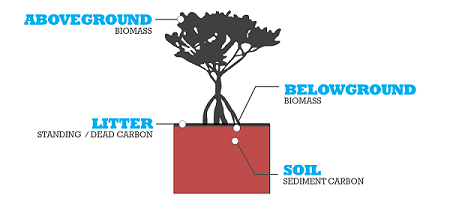
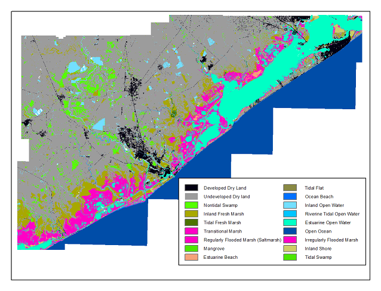
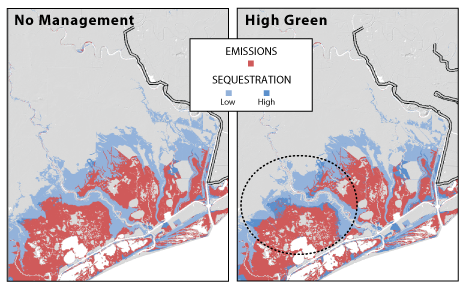

.. _海岸带蓝碳:

*******************
海岸带蓝碳
*******************

摘要
=======

海洋和陆地生态系统通过向大气中添加和清除二氧化碳(CO2)等温室气体（GHGs）来帮助调节地球气候。特别是沿海沼泽、红树林和海草，它们的沉积物、树叶和其他形式的生物量中储存了大量的碳。除了储存碳外，海洋生态系统还不断地在其沉积物中积累碳，形成长期封存的碳的大型储存库。通过储存和隔离碳，海洋生态系统保留了大气中的CO2，否则它会导致气候变化。

改变沿海植被覆盖等管理活动，例如恢复海草床和清除红树林，改变了沿海和海洋地区储存和封存碳的能力。

InVEST海岸带蓝碳模型试图预测由于土地覆盖的变化而在特定时间点上沿海地区储存和封存的碳量。利用对货币社会价值的估计，或在可能的情况下，对储存和封存的碳的市场价格，InVEST海岸带蓝碳模型还量化了储存和封存的边际价值。

InVEST海岸带蓝碳模型的结果可用于比较碳储量和净封存的当前和未来情景，并确定景观中应避免沿海生态系统退化和应优先恢复沿海生态系统的位置，以保存和增强这些碳封存和封存服务。

简介
============

该模型利用了各种信息，包括:

- 海岸植被的分布和丰度
- 特定栖息地碳储量数据
- 不同土地覆盖扰动对生物量和土壤碳储量的预测碳排放速率的影响特征
- 以估计陆地或海洋的碳储量、净固碳量和价值的碳积累率
- 为了量化碳储存和封存的价值，该模型侧重于大气二氧化碳和其他温室气体的变化，这是人类活动造成的变化的结果，可能会影响储存和封存碳的海洋生态系统。大气成分的变化对自然系统有广泛的影响，可导致农业生产力、空气质量、海平面等方面的变化。

模型
=========

建模考虑
-----------------------

绘制和模拟沿海和海洋生境的碳储存和封存变化可能带来挑战。有关碳循环的空间输入类型和可用信息因地点而异。一些研究区域拥有可用于详细分析的高质量数据，而另一些研究区域则没有建立沿海植被位置和功能变化模型所需的信息。例如，盐沼经常在海平面上升造成的迁移背景下进行研究。自然(例如海平面上升)和人为(例如被道路阻塞的盐沼迁移)因素的组合应包括在情景图和随后的碳建模中。在探索未来土地覆盖情景时，由SLAMM模型(海平面影响沼泽模型，由Warren Pinnacle开发)生成的土地覆盖地图输出可作为InVEST海岸蓝碳模型的有用输入(Clougheet等，2010年)。然而，由于并非所有地点都有运行SLAMM所需的详细海拔和栖息地信息，因此InVEST模型提供了一种灵活的方法，允许用户提供详细的土地利用/土地覆盖地图，或显示沿海和海洋植被可吸收碳的情况的地图。

运行原理
------------

InVEST 海岸带蓝碳通过记账类型的方法对碳循环进行建模(Houghton, 2003)。这种方法通过考虑在三个主要碳库(生物量、沉积物碳(即土壤)和静止死碳(即枯落物)，见图1) 中的存储简化了碳循环。沿海生境的碳积累主要发生在沉积物中(Pendleton等, 2012)。该模型要求用户提供储存碳的沿海生态系统的地图，如红树林和海草。用户还必须提供关于三个碳库中储存的碳量以及生物量和沉积物中每年碳积累率的数据。如果无法获得当地信息，用户可以从模型中所包含的同行评议文献中全球数据库中获取碳储量和累积率的值。如果有来自实地研究或其他当地来源的数据，应使用这些值而不是全球数据库中的值。该模型需要代表沿海地区人类利用模式变化或海平面变化的土地覆盖地图，以估计在特定时期内碳的损失或增加量。该模型通过将这三个碳库中的碳储量相加，量化了陆地或海洋的碳储量。

图1. InVEST蓝碳模型包括海洋生态系统的3个碳库 (以红树林例子)。

.. note::
       在模型中的大多数方程中，有几个参数是共享的:

        * :math:`t` 是时间步。该模型以年为时间尺度运行，因此`t`表示由时间间隔表示的年份。

          * :math:`t_{baseline}` 表示土地覆盖的年份基线。

        * :math:`s` 是快照年份。这表示基准年之后的任何转变快照的年份。
        * :math:`p` 代表碳库，通常是生物量或土壤。枯落物只在碳积累计算中考虑，不受排放的影响。

        该模型独立地考虑了每个网格单元格`x`，因此已从下面描述的方程中分解出来。

.. note::
        虽然本用户指南一章中提到的单位是以每公顷千万吨二氧化碳当量为单位的，但该模型不进行任何单位转换，因此只要在所有模型输入中一致，就可以使用任何代表特定栖息地的积累或排放速率的单位。

碳储存
^^^^^^^^^^^^^^

海岸带蓝碳生境可以简单地表明主要植被类型(如鳗草、红树林等)，也可以基于影响碳库存储值的细节，如植物种类、植被密度、温度状态或植被年龄(如自恢复或上次重大扰动以来的时间)。

为了估算碳储量，假设每个海岸蓝碳生境在任何时间点都处于储量平衡状态(碳的积累将被计算在模型的封存部分)。

给定`t`年的碳储量`S`和碳库`p`的计算方法是将`t`年的净碳封存量与前一年`t-1`的可用储量相加。或者，也可以使用生物物理表中的初始存量值`S_{p,t_{baseline}}`。

.. math::
        S_{p,t} = \begin{Bmatrix}
                S_{p,t-1} + N_{p,t} & if & t > t_{baseline} \\
                S_{p,t_{baseline}} & if & t = t_{baseline}
        \end{Bmatrix}
        :label: cbc_stocks_pool

第`t`年的碳储量代表了第`t`年年初的碳储量。

`N_{p,t}` 指的是在“t”年内获得或损失的碳量，最近的转变状态决定了碳是积累(正净固碳)还是排放(负净固碳)。单个栅格*可能*积累*或*排放碳;在一个时间步内不可能同时做到这两点。这种方式，模型假设网格单元在转换事件期间完全从一种栖息地类型转换到另一种栖息地类型。在一个像素上，封存(积累或排放)的性质也将在过渡年份之间保持一致。

因此，`N_{p,t}` 将等于这些方程中的一个，这取决于最近跃迁的状态:

.. math::
        N_{p,t} = \begin{Bmatrix}
                -1 \cdot E_{p,t} & if & carbon\ is\ emitting \\
                A_{p,t} & if & carbon\ is\ accumulating
        \end{Bmatrix}
        :label: cbc_net_sequestration

累积率`A_{p,t}`是由用户在每一种土地覆盖分类的生物物理表中定义的。当地表类型向累积状态过渡时，累积速率将反映目标地表类型。

请注意，排放`E_{p,t}`被计算为一个正数值，并且`-1`需要反映碳库中碳的损失。

请注意，以上仅适用于生物量和土壤。凋落物存量不受排放的影响，因此只能按照用户在生物物理表中定义的速率线性累积:

.. math::
        S_{p_{litter},t} = S_{p_{litter},t_{baseline}} + (A_{p_{litter}} \cdot (t - t_{baseline}))
        :label: cbc_stocks_litter

因此，凋落物池的净封存`N_{p_{litter},t}`等价于`A_{p_{litter}}`，由用户在生物物理表中定义。只有当地表覆盖层向另一个地表覆盖层转变时，其累积速率才会发生变化。

该模型还计算了每个时间步年`t`的总储量，这是3个碳库中所有碳储量的总和：

.. math:: S_{t,total} = S_{t,p_{soil}} + S_{t,p_{biomass}} + S_{t,p_{litter}}
        :label: cbc_stocks_total

碳积累
^^^^^^^^^^^^^^^^^^^

我们将碳积累模型定义为在分解一年后以有机形式保留在土壤中的碳的速率。相对于年度生态系统预算，这个碳库没有被再矿化，所以它代表净积累。这些碳通常来自地下生产，停留时间从几十年到几千年不等(Romero等人，1994, Mateo等人，1997)。这种积累有助于碳“储层”的发展，除非受到干扰，否则这些储层几乎被认为是永久性的。因此，即使在土地使用或土地覆盖没有变化的情况下，碳也会继续自然封存。

由于不同类型的人类使用和/或停滞可能会对土壤和下面储存的碳造成不同的破坏，因此扰动时土壤池(沉积物)的碳损失比固存更为微妙。例如，为虾塘而清除红树林或疏浚沉积物等高影响的活动可能比商业捕鱼或石油勘探等其他活动造成更大的土壤碳干扰。沿海开发对碳储量的影响各不相同，因为某些类型的开发可能涉及在土壤上铺路，这通常会保持很大比例的碳储量完整。或者，疏浚可能会清除海草而扰乱下面的沉积物，向大气中释放碳。

碳排放
^^^^^^^^^^^^^^^^

当沿海生态系统因人类活动而退化时，储存在活植物材料(地上和地下)和土壤中的碳可能被排放到大气中。转化后CO2释放的大小取决于受干扰植被的类型和干扰程度。扰动的类型将决定地上生物量损失的数量和土壤剖面将被改变到的深度。扰动的影响越深，土壤碳暴露在氧气中被氧化并以CO2的形式释放出来的就越多。一些干扰只会扰乱表层土壤，而深层土壤仍被淹没，碳元素完好无损。其他干扰可能影响几米的土壤剖面。为了估计各种干扰的影响程度，我们将干扰分为三类影响: 高，中，低。高影响干扰的例子包括红树林转变为虾场、排水或筑堤盐沼转变为农业。低冲击干扰的例子包括休闲划船或家庭漂浮船坞。

碳排放开始于一个快照年，其中网格单元格“x”下的土地覆盖分类过渡到低影响、中度影响或高影响扰动的状态。在随后的几年里，排放会继续，直到网格单元的x经历另一次转变，或者达到分析年。

该模型使用基于用户定义的碳库的半衰期`H_{p}` 以及扰动碳的体积的指数衰减函数。在本例中，`s` 表示转变的年份，`E_{p,t}` 表示碳库`p` 在`t` 年排放的碳量。

.. math:: E_{p,t} = D_{p,s} \cdot ({ 0.5 }^{ \frac { t-(s+1) }{ H_{p,s} } } - { 0.5 }^{ \frac { t-s }{ H_{p,s} } })
        :label: cbc_emissions

扰动碳`D_{p,s}`的体积表示在过渡年`s`的时间`t \rightarrow
\infty`中，在网格单元`x`上发生的过渡随时间推移所释放的碳总量。这个数量是由扰动`M_{p,s}` (低影响或高影响)的大小、年初出现的种群`s`和年的土地覆盖转变决定的:

.. math:: D_{p,s} = S_{p,s} \cdot M_{p,s}
        :label: cbc_disturbance_volume

扰动的量级由转换矩阵(低冲击、中等冲击或高冲击)确定，并在生物物理表中以扰动碳的百分比表示。当一个地表覆盖分类经历向发射状态的过渡时，扰动量级将从源地表覆盖类别中取。

损失的大小和时间
""""""""""""""""""""""""""""

我们通过估算扰动时每个生物量池和土壤池总存量中碳损失的比例来模拟生物量池和土壤池的碳释放。碳损失的比例由原始沿海蓝碳生境和扰动造成的影响程度决定(见表1)。

InVEST海岸蓝碳模型允许用户提供从海岸蓝碳栖息地向非海岸蓝碳栖息地过渡过程中发生的扰动水平的详细信息。这些信息可以通过预处理器工具提供给模型，并通过输入转换表进一步阐明。

一般来说，碳库以不同的速度排放碳:生物质库的大部分排放发生在第一年内，而土壤库的排放可能需要更长的时间。该模型为每种生境类型的生物量和土壤碳库分配了指数衰减函数和半衰期值(表1;Murray等人, 2011)。

..
  这个表格手动编辑很麻烦。如果您真的需要手动编辑，请找到最宽的显示器，并使文本超级小。另外，供您参考，| |语法允许在表格单元格中换行。

+-----------------------------------+-----------------------------------+------------------------------------------------------------------------------------+------------------------------------------------------------------+---------------------------+
| **Rank**                          | Salt marshes                      | Mangroves                                                                          | Seagrasses                                                       | Other vegetation          |
+===================================+===================================+====================================================================================+==================================================================+===========================+
| **% carbon loss from biomass**    | | LI/MI: 50% biomass loss (1)     | | LI/MI: 50% biomass loss (1)                                                      | | LI/MI: 50% biomass loss (1)                                    | Use literature/field data |
|                                   | | HI: 100% biomass loss           | | HI: 100% biomass loss                                                            | | HI: 100% biomass loss                                          |                           |
+-----------------------------------+-----------------------------------+------------------------------------------------------------------------------------+------------------------------------------------------------------+---------------------------+
| **% carbon loss from soil**       | | LI: 30% loss (1)                | | LI: 30% loss (1)                                                                 | | LI/MI: top 10% washes away, bottom 90% decomposes in place (2) | Use literature/field data |
|                                   | | MI/HI: 100% loss (3)            | | MI: 50% loss (1)                                                                 | | HI: top 50% washes away, bottom 50% decomposes in place (2)    |                           |
|                                   |                                   | | HI: 66% loss (up to 1.5 m depth) (1)                                             |                                                                  |                           |
+-----------------------------------+-----------------------------------+------------------------------------------------------------------------------------+------------------------------------------------------------------+---------------------------+
| **Rate of decay (over 25 years)** | | Biomass half-life: 6 months (2) | | Biomass half-life: 15 years, but assume 75% is released immediately from burning | | Biomass half-life: 100 days (2)                                | Use literature/field data |
|                                   | | Soil half-life: 7.5 years (2)   | | Soil half-life 7.5 years (2)                                                     | | Soil half-life: 1 year (2)                                     |                           |
+-----------------------------------+-----------------------------------+------------------------------------------------------------------------------------+------------------------------------------------------------------+---------------------------+
| **Methane emissions**             | 1.85 T CO2/ha/yr (4)              | 0.4 T CO2/ha/yr                                                                    | Negligible                                                       | Use literature/field data |
+-----------------------------------+-----------------------------------+------------------------------------------------------------------------------------+------------------------------------------------------------------+---------------------------+

表1:由于干扰盐沼、红树林和海草生态系统的**低(LI)、中(MI)和高(HI)影响**活动造成的碳损失百分比和特定生境的衰减率。这些默认值可以通过修改输入的CSV表进行调整。

参考文献(括号内数字):

1. Donato, D. C., Kauffman, J. B., Murdiyarso, D., Kurnianto, S., Stidham, M., & Kanninen, M. (2011). Mangroves among the most carbon-rich forests in the tropics. Nature Geoscience, 4(5), 293-297.
2. Murray, B. C., Pendleton, L., Jenkins, W. A., & Sifleet, S. (2011). Green payments for blue carbon: Economic incentives for protecting threatened coastal habitats. Nicholas Institute for Environmental Policy Solutions, Report NI, 11, 04.
3. Crooks, S., Herr, D., Tamelander, J., Laffoley, D., & Vandever, J. (2011). Mitigating climate change through restoration and management of coastal wetlands and near-shore marine ecosystems: challenges and opportunities. Environment Department Paper, 121, 2011-009.
4. Krithika, K., Purvaja, R., & Ramesh, R. (2008). Fluxes of methane and nitrous oxide from an Indian mangrove. Current Science (00113891), 94(2).

净固碳的估值
^^^^^^^^^^^^^^^^^^^^^^^^^^^^^^^^^^^

蓝碳模型的估值选项将封存(而非储存)的经济价值作为封存碳量、每吨封存碳的货币价值、贴现率以及封存碳价值随时间变化的函数进行估算。封存碳的价值取决于谁做出改变碳排放的决定，分为两类:社会和私人。如果碳排放的变化是由于公共政策造成的，例如划分沿海地区进行发展，那么决策者应该权衡发展的好处而不是碳排放造成的社会损失。由于局部碳排放会在全球范围内影响大气，因此碳的社会成本(SCC)通常是在全球范围内计算的(USIWGSCC, 2010)。计算碳社会成本的工作依赖于多个综合评估模型，如FUND (http://www.fund-model.org/)、PAGE (Hope, 2011)、DICE和RICE (https://sites.google.com/site/williamdnordhaus/dice-rice)。美国碳社会成本跨机构工作组综合了其中一些模型的结果，并针对三种不同的贴现率给出了适当的SCC随时间变化的指导(USIWGSCC, 2010;2013)。如果你的研究问题涉及到碳的社会成本方法，强烈建议参考本指南。在InVEST中应用基于USIWGSCC方法的SCC估值时，最相关的考虑事项如下：

 * 为应用程序选择的贴现率必须是报告中的三个选项之一(2.5%、3%或5%)。在政策分析的背景下，贴现率反映了社会的时间偏好。关于社会贴现率的入门知识，请参见Baumol(1968)。
 * 由于碳排放造成的损害发生在其最初释放到大气中的日期之后，任何一个时期的排放造成的损害都是未来损害的总和，折现回该点。例如，为了计算2030年排放的SCC，需要计算未来损害(2030年以后)总和的现值(2030年)。这意味着未来任何时期的SCC都是贴现率的函数，因此，在整个分析过程中应该使用一致的贴现率。对于不同的折扣率，有不同的SCC时间表(价目表)。因此，为您的上下文选择适当的贴现率将决定适当的SCC调度选择。

SCC的替代方案是碳信用市场价值法。如果决策者是个人或公司等私人实体，他们就可以通过碳信用额将土地使用决策货币化。碳市场目前在多个地区运作，澳大利亚、加利福尼亚和魁北克的新市场正在形成(世界银行，2012年)。这些市场为碳排放总量设定了上限，并要求排放国购买碳信用额度以抵消任何排放。增加固碳量的保护工作可以作为抵消碳排放的手段，因此固碳量有可能以碳信用市场中确定的价格货币化。碳补偿货币化的手段主要取决于每个市场的具体规则，因此，确定您的研究背景是否允许在碳市场销售封存信用是很重要的。同样重要的是要注意市场设计的特质推动了市场上观察到的碳信用价格，因此价格并不一定反映碳的社会损害。

有关碳的社会成本的更多细节和讨论，请参阅https://www.carbonbrief.org/qa-social-cost-carbon。

净现值`V`是为基线年之后的每个快照年`s`计算的，一直延伸到最终分析年。

.. math:: V = \sum_{t=0}^{T} \frac{p_t (S_t - S_{t-1})}{(1+d)^t}
        :label: cbc_net_present_value

式中

 * :math:`V` 是碳封存的净现值
 * :math:`T` 是`t_{baseline}`和快照年份`s`之间的年数。如果提供的分析年份超过了最后的快照年份，则除了快照年份之外，还将使用该分析年份。
 * :math:`p_t` 是时间步长`t`下每吨碳的价格。
 * :math:`S_t` 表示时间步`t`的总碳储量，在土壤和生物量池中求和。
 * :math:`d` 是贴现率。

.. note::
        美国联邦政府用于制定政策的最新碳价格表可以在https://www.epa.gov/sites/production/files/201612/documents/sc_co2_tsd_august_2016.pdf上找到。关于为什么这些方法目前在美国使用以及自2016年以来发生了什么，请参阅https://www.gao.gov/assets/710/707776.pdf的讨论。

        最新版InVEST的样本价格表是基于美国环境保护署2016年发布的2016年碳价格估算。这些表格是2007年的美元，这与USIWGSCC的估计是一致的。

	任何货币都可以使用。

使用预处理器识别LULC转换
^^^^^^^^^^^^^^^^^^^^^^^^^^^^^^^^^^^^^^^^^^^^^^^^^^

土地利用/土地覆盖(LULC)地图提供了用地变化的快照图，是驱动模型中碳积累和排放的输入。用户必须首先通过土地变化模型(例如SLAMM)、情景评估工具或人工地理信息系统处理来制作一套海岸和海洋栖息地地图。然后，用户必须将LULC映射输入到具有相关年份的模型中，这样就可以确定适当的源和目标转换。

预处理器工具比较映射中的LULC类，以识别发生的所有LULC转换的集合。然后，该工具生成一个转移矩阵，表明两种栖息地之间是否发生了过渡(例如盐沼到已开发的旱地)，以及一旦过渡发生，碳是否会积累、受到干扰或保持不变。碳积累或扰动的性质取决于陆地覆盖是否正在向和/或从沿海蓝碳生境过渡:

- 其他LULC类`\Rightarrow` 海岸蓝碳栖息地(*碳积累* 在后续年份的过渡事件直到下一个边界年)

- 海岸蓝碳栖息地`\Rightarrow` 海岸蓝碳栖息地 (*碳积累* 在后续年份的过渡事件，直到下一个边界年)

- 海岸蓝碳栖息地`\Rightarrow` 其他LULC类 (在时间序列预测结束之前，过渡事件后续年份的*碳扰动*)

- 其他LULC类`\Rightarrow` 其他LULC类 (到下一个边界年之前，在过渡事件的后续年份中*没有碳变化*)

这个由沿海蓝碳预处理器生成、**随后由用户** 编辑的转换矩阵使模型能够识别人类活动和自然事件在哪些地方干扰了植被储存的碳。如果在任何时间步骤中都没有发生从一个LULC类到另一个LULC类的转换，则该栅格将保留空白。对于矩阵中发生转变的栅格，当非沿海蓝碳栖息地过渡到沿海蓝碳栖息地或沿海蓝碳栖息地过渡到另一个沿海蓝碳栖息地时，该工具将用“积累”填充栅格；当沿海蓝碳栖息地过渡到非沿海蓝碳栖息地时，该工具将用“干扰”填充栅格；非沿海蓝碳栖息地过渡到另一个非沿海蓝碳栖息地。用“NCC”(表示“无碳变化”)。 例如，如果`s_{0}` 中的盐沼栅格在`s_{1}` 中转换为已开发的旱地，则该单元格将被‘干扰’填充。另一方面，如果一个红树林在同一段时间内仍然是红树林，那么矩阵中的这个单元格将被‘积累'填充。一个保持红树林状态的红树林很可能会在其土壤和生物量中积累碳。

然后，用户将需要修改“干扰”单元格，使用“低影响-干扰”、“中影响-干扰”或“高影响-干扰”，这取决于在LULC类型之间发生转换时发生的干扰水平。这使用户更精准的控制由于干扰引起的排放。例如，在LULC地图中，用户不只是提供一种发展类型，而是可以将这种类型分离为两种发展类型，并相应地更新转换矩阵，以便模型能够更准确地量化和绘制自然和人为因素导致的碳变化。同样，不同种类的红树林可能以不同的速度积累土壤碳。如果这些信息是已知的，它可以提高模型的准确性，以提供这些物种区分(在LULC输入图中有两个不同的类)，然后在生物物理表中提供相关的累积速率。

限制和简化
===============================

在缺乏沿海和海洋系统碳循环动态的详细知识的情况下，我们采用了最简单的核算方法，并利用来自邻近海岸线的已公布的碳储量数据集。我们使用了最广泛和最新发布的全球碳存储和积累率数据集的碳估算(例如，Fourqurean等人2012年和Silfeet等人2011年)。

 * 我们假设所有有意义的储存、积累和排放都发生在生物量和土壤池中。
 * 我们忽视了随着栖息地的增长和老化而增加的种群和积累。
 * 我们假设碳的储存和积累通过过渡之间的时间是线性的，
 * 我们假设在扰动事件发生后，扰动碳随时间以指数衰减率排放。
 * 我们假设一些可能会破坏沿海生态系统的人类活动不会干扰沉积物中的碳。
 * 我们假设土地覆盖的转变是瞬间发生的，完全发生在转变发生的一年的第一个时刻。

数据需求和运行模型
================================

由于海岸蓝碳模型依赖于从一个地表覆盖到另一个地表覆盖的特定转换，因此提供了一个可选的预处理程序，以便更容易地识别发生在景观上的地表覆盖转换以及这些转换的性质。如果使用这个预处理器的输出，在被用作主模型的输入之前，必须由用户编辑，以指示扰动的大小。这里描述了预处理程序和主模型的输入。

步骤1.预处理-海岸蓝碳预处理
--------------------------------------------------------

预处理器工具按时间顺序比较快照年份中的LULC类，以确定发生的所有LULC转换的集合。从这个集合中，预处理器生成一个转移矩阵，表明两个栖息地之间是否发生了过渡(例如盐沼到已开发的旱地)，以及一旦转移发生，碳是否会积累、受到干扰或保持不变。它还生成了一个模板生物物理表，供用户填写由于LULC转变而导致的碳变化的量化信息。此表必须由用户进一步编辑，编辑后的表是主要海岸带蓝碳模型的必需输入。更多信息请参见上面的“使用预处理器识别LULC转换*部分。

输入
^^^^^^

- :investspec:`coastal_blue_carbon.preprocessor workspace_dir`

- :investspec:`coastal_blue_carbon.preprocessor results_suffix`

- :investspec:`coastal_blue_carbon.preprocessor landcover_snapshot_csv`

列:

  - :investspec:`coastal_blue_carbon.preprocessor landcover_snapshot_csv.columns.snapshot_year`
  - :investspec:`coastal_blue_carbon.preprocessor landcover_snapshot_csv.columns.raster_path` The paths may be either absolute or relative to the location of the snapshots table itself.

- :investspec:`coastal_blue_carbon.preprocessor lulc_lookup_table_path`

 列:

  - :investspec:`coastal_blue_carbon.preprocessor lulc_lookup_table_path.columns.lucode`
  - :investspec:`coastal_blue_carbon.preprocessor lulc_lookup_table_path.columns.lulc-class`
  - :investspec:`coastal_blue_carbon.preprocessor lulc_lookup_table_path.columns.is_coastal_blue_carbon_habitat`

输出
^^^^^^^

预处理器的输出文件位于文件夹**Workspace/outputs_preprocessor**中。以下文件名中的“Suffix”指的是模型的可选用户定义后缀输入。

- **Parameter log**:每次运行模型时，将在主Workspace文件夹中创建一个文本(.txt)文件。该文件将列出该运行的参数值和输出消息，并将根据服务、日期和时间命名。当与NatCap联系模型运行中的错误时，请包含此参数日志。

- **transitions_[Suffix].csv**: CSV (.csv, 逗号分隔的值) 格式表,
  这是一个转换矩阵，表示从一个LULC类到另一个LULC类的转换中是否发生了扰动或累积。如果单元格为空白，则输入的土地利用/土地覆被栅格之间不会发生这种转换。最左边的列(* LULC -class*)表示源LULC类，最上面的行(<lulc1>, <lulc2>...)表示目标LULC类。根据转换类型的不同，单元格将被预先填充为以下类型之一:如果没有发生这种转变，则为空，‘NCC'(表示无碳变化)，‘accum'(表示积累)或’disturb'(表示扰动)。您必须编辑“干扰”单元格，使其具有由于LULC更改而发生的干扰的程度。这可以通过将“干扰”更改为“低影响-干扰”、“中影响-干扰”或“高影响-干扰”来实现。

 编辑后的表格作为输入到海岸蓝碳主模型，作为**LULC Transition Effect of Carbon Table**。

  ==========  ========  ========  ===
  lulc-class  <lulc1>   <lulc2>   ...
  ==========  ========  ========  ===
  <lulc1>     <string>  <string>  ...
  <lulc2>     <string>  <string>  ...
  ...         ...       ...       ...
  ==========  ========  ========  ===

- **carbon_pool_transient_template_[Suffix].csv**: CSV (.csv, 逗号分隔的值) 格式表, 将每个LULC类型映射到影响和积累信息。除了‘lulc-class'和’lucode'列外，您必须填写该表的所有列，这些列将由模型预填充。更多信息请参见*步骤2. 主模型*。累积单位为(Megatonnes of CO\:sub: ' 2è/ha-yr)，半衰期以整数年为单位，扰动以整数百分比为单位。

 编辑后的表格被用作输入到主要的海岸蓝碳模型**生物物理表**。

  ==========  ==========  ===============  ============  ==============  =================  ==========================  ==========================  ===========================  ===========================  ==============  =======================  =======================  ========================  ========================  ==========================
  lucode      lulc-class  biomass-initial  soil-initial  litter-initial  biomass-half-life  biomass-low-impact-disturb  biomass-med-impact-disturb  biomass-high-impact-disturb  biomass-yearly-accumulation  soil-half-life  soil-low-impact-disturb  soil-med-impact-disturb  soil-high-impact-disturb  soil-yearly-accumulation  litter-yearly-accumulation
  ==========  ==========  ===============  ============  ==============  =================  ==========================  ==========================  ===========================  ===========================  ==============  =======================  =======================  ========================  ========================  ==========================
  <int>       <lulc1>
  <int>       <lulc2>
  ...         ...
  ==========  ==========  ===============  ============  ==============  =================  ==========================  ==========================  ===========================  ===========================  ==============  =======================  =======================  ========================  ========================  ==========================

- **aligned_lulc_[year]_[Suffix].tif**: 栅格是将所有输入的LULC栅格彼此对齐的结果。所有栅格被重新采样到输入栅格的最小分辨率，并裁剪到它们的边界框的交集。任何需要的重采样都是使用最近邻插值完成的。通常不需要对这些文件做任何操作。

步骤2.主模型-海岸带蓝碳
--------------------------------------------

沿海蓝碳主模型基于预处理器生成并由用户编辑的转移和碳池信息，计算碳储量和随时间的封存。如果提供经济数据，它还可以自动计算出封存的价值。

输入
^^^^^^

- :investspec:`coastal_blue_carbon.coastal_blue_carbon workspace_dir`

- :investspec:`coastal_blue_carbon.coastal_blue_carbon results_suffix`

- :investspec:`coastal_blue_carbon.coastal_blue_carbon biophysical_table_path` 该表的模板由预处理器生成(如上所述)，并且还包含在模型的示例数据中。

  列:

  - :investspec:`coastal_blue_carbon.coastal_blue_carbon biophysical_table_path.columns.lucode`
  - :investspec:`coastal_blue_carbon.coastal_blue_carbon biophysical_table_path.columns.lulc-class`
  - :investspec:`coastal_blue_carbon.coastal_blue_carbon biophysical_table_path.columns.biomass-initial`
  - :investspec:`coastal_blue_carbon.coastal_blue_carbon biophysical_table_path.columns.soil-initial`
  - :investspec:`coastal_blue_carbon.coastal_blue_carbon biophysical_table_path.columns.litter-initial`
  - :investspec:`coastal_blue_carbon.coastal_blue_carbon biophysical_table_path.columns.biomass-half-life`
  - :investspec:`coastal_blue_carbon.coastal_blue_carbon biophysical_table_path.columns.biomass-low-impact-disturb`
  - :investspec:`coastal_blue_carbon.coastal_blue_carbon biophysical_table_path.columns.biomass-med-impact-disturb`
  - :investspec:`coastal_blue_carbon.coastal_blue_carbon biophysical_table_path.columns.biomass-high-impact-disturb`
  - :investspec:`coastal_blue_carbon.coastal_blue_carbon biophysical_table_path.columns.biomass-yearly-accumulation`
  - :investspec:`coastal_blue_carbon.coastal_blue_carbon biophysical_table_path.columns.soil-half-life`
  - :investspec:`coastal_blue_carbon.coastal_blue_carbon biophysical_table_path.columns.soil-low-impact-disturb`
  - :investspec:`coastal_blue_carbon.coastal_blue_carbon biophysical_table_path.columns.soil-med-impact-disturb`
  - :investspec:`coastal_blue_carbon.coastal_blue_carbon biophysical_table_path.columns.soil-high-impact-disturb`
  - :investspec:`coastal_blue_carbon.coastal_blue_carbon biophysical_table_path.columns.soil-yearly-accumulation`
  - :investspec:`coastal_blue_carbon.coastal_blue_carbon biophysical_table_path.columns.litter-yearly-accumulation` 这通常是``0``，但可以根据需要进行调整。

- :investspec:`coastal_blue_carbon.coastal_blue_carbon landcover_transitions_table`
  海岸带蓝碳预处理器的存在是为了帮助您创建这个表。您必须编辑``transitions_[suffix].csv``预处理器输出，如*步骤1.预处理输出信息*中所述，然后才能被主模型使用。

  列:

  - :investspec:`coastal_blue_carbon.coastal_blue_carbon landcover_transitions_table.columns.lulc-class`
  - :investspec:`coastal_blue_carbon.coastal_blue_carbon landcover_transitions_table.columns.[LULC CODE]`

- :investspec:`coastal_blue_carbon.coastal_blue_carbon landcover_snapshot_csv` 具有最早时间年份的栅格将被用作基线栅格。如果该表中提供的栅格具有不同的范围或分辨率，则将它们重新采样到栅格集的最小分辨率，并剪切到所有边界框的交集。如果你只对某一年的碳存量感兴趣，那么在这个表中只提供一行。本表中提供的所有栅格必须在以米为单位的投影坐标系中。

  列:

  - :investspec:`coastal_blue_carbon.coastal_blue_carbon landcover_snapshot_csv.columns.snapshot_year`
  - :investspec:`coastal_blue_carbon.coastal_blue_carbon landcover_snapshot_csv.columns.raster_path`

- :investspec:`coastal_blue_carbon.coastal_blue_carbon analysis_year`

- :investspec:`coastal_blue_carbon.coastal_blue_carbon do_economic_analysis`

随时间变化的碳固存值为:

 * **封存一吨碳的价值**: 本用户指南假设碳的计量单位为吨CO2。如果你有以吨碳为单位的价格，这些需要转换为每吨CO2。这需要将价格除以3.67，以反映CO2和碳元素之间原子质量的差异。同样，这个值可以使用适当时间范围内的价格表来输入，或者通过提供基准年碳价格和年度通胀率来输入。任何货币都可以使用，只要它在所有估值输入中是一致的。

 * **折现率**: (净现值方程中的`d`), 这反映了人们对眼前利益的偏好超过了对未来利益的偏好。如果利率设置为0%，则货币价值不贴现。

如果勾选了**计算封存碳的净现值**框，您还必须提供以下估值信息。

 - :investspec:`coastal_blue_carbon.coastal_blue_carbon use_price_table`

 - :investspec:`coastal_blue_carbon.coastal_blue_carbon price` 可以是任何货币，只要不同的估值输入是一致的。

 - :investspec:`coastal_blue_carbon.coastal_blue_carbon inflation_rate`

 - :investspec:`coastal_blue_carbon.coastal_blue_carbon price_table_path` 这个表可以用来代替价格和利率输入。

  列:

  - :investspec:`coastal_blue_carbon.coastal_blue_carbon price_table_path.columns.year`
  - :investspec:`coastal_blue_carbon.coastal_blue_carbon price_table_path.columns.price`

 - :investspec:`coastal_blue_carbon.coastal_blue_carbon discount_rate`

输出
^^^^^^^
- **Parameter log**: 每次运行模型时，将在主Workspace文件夹中创建一个文本(.txt)文件。该文件将列出该运行的参数值和输出消息，并将根据服务、日期和时间命名。当与NatCap联系模型运行中的错误时，请包含此参数日志。

**Workspace/outputs**

- **carbon-accumulation-between-[year]-and-[year][Suffix].tif**. 在两个指定年份之间累积的碳量。单位:百万吨CO2每公顷

- **carbon-emissions-between-[year]-and-[year][Suffix].tif**. 两个指定年份之间因扰动而损失的碳量。单位:百万吨CO2每公顷

- **carbon-stock-at-[year][Suffix].tif**. 指定年份每个LULC的3个碳库的总和。单位:百万吨CO2每公顷

- **total-net-carbon-sequestion-between-[year]-and-[year][Suffix].tif**. 两个特定年份之间的总碳固存量，以该期间的累积量减去排放量为基础。单位:百万吨CO2每公顷

- **total-net-carbon-sequestration[Suffix].tif**. 从基准年到最新快照年或分析年之间的整个时间段内的总碳固存量，基于累积减排放。单位:百万吨CO2每公顷

- **net-present-value[Suffix].tif**. 碳封存的货币价值。单位:(提供价格货币)每公顷

**Workspace/intermediate**

这个文件夹包含输入栅格，这些栅格都被重新采样并对齐到相同的包围框，作为建模过程中的中间步骤。通常，您不需要对这些文件做任何操作。

- **stocks-[pool]-[year][suffix].tif** - 在文件名中注明的年初可用的碳储量。单位:每公顷百万吨二氧化碳当量

- **accumulation-[pool]-[year][suffix].tif** - 在给定年份，给定池中碳积累速率的空间分布。年表示累积栅格生效的快照年份。单位:每公顷百万吨二氧化碳当量。

- **halflife-[pool]-[year][suffix].tif** - 在给定的快照年份，碳池中半衰期的空间分布光栅。单位:年。

- **disturbance-magnitude-[pool]-[year][suffix].tif** - 给定快照年中给定池中扰动的大小。单位:0-1，扰动碳的百分比。t

- **disturbance-volume-[pool]-[year][suffix].tif** - 在快照年份中被扰动的碳量。这是前一年碳储量和给定快照年扰动强度的函数。单位:每公顷百万吨二氧化碳当量。

- **year-of-latest-disturbance-[pool]-[year][suffix].tif** - 每个单元格表示该单元格发生地表覆盖转变的最近年份。

- **aligned-lulc-[snapshot type]-[year][suffix].tif** - 给定年份的快照地表覆盖栅格，与所有快照栅格的边界框的交点对齐，并且具有一致的单元格大小。对齐后的地表覆盖栅格的单元尺寸为输入单元尺寸的最小值。

- **net-sequestration-[pool]-[year][suffix].tif** - 在给定年份，在给定池子里的净封存。单位:每公顷百万吨二氧化碳当量。

- **total-carbon-stocks-[year][suffix].tif** - 在给定年份，所有三个碳库的储量总和。单位:每公顷百万吨二氧化碳当量。

高级用法:空间显式生物物理参数
---------------------------------------------------------

虽然海岸带蓝碳的预处理器和主要模型的用户界面对大多数可分为不同地表覆盖类型的情况都有帮助，但高级用户可能希望为模型提供碳半衰期、积累速率和其他生物物理参数的空间显式地图。这不能通过用户界面实现，但是可以通过python函数来实现，该函数提供对模型时间序列分析的低级访问。使用这种高级功能需要大量的数据预处理，并且有更复杂的数据需求。详情请参阅github上的模型源代码:https://github.com/natcap/invest/blob/main/src/natcap/invest/coastal_b lue_carbon/coastal_blue_carbon.py

示例
================

自由港,德克萨斯
---------------

摘要
^^^^^^^

在接下来的100年里，美国墨西哥湾沿岸被认为很容易受到海平面上升的影响。InVEST蓝碳模型的使用有助于确定沿海植被固碳存量的潜在变化。在德克萨斯州自由港，这种方法是通过丰富而准确的高程和LULC数据集实现的。我们使用了具有亚米垂直精度的10米DEM，利用Warren Pinnacle的SLAMM(海平面影响沼泽模型)对海平面上升(SLR)导致的沼泽迁移和损失进行了模拟。SLAMM的产出是InVEST沿海蓝碳模型的输入，该模型允许该工具绘制、测量和评估94年期间沿海土地覆盖变化造成的碳固载和排放。

海平面影响沼泽模型(SLAMM: http://www.warrenpinnacle.com/prof/SLAMM/)模拟了27种不同海岸湿地生境类型的分布变化对海平面上升的响应。该模型依赖于潮汐高度与滨海湿地栖息地类型之间的关系，并结合坡度、土地利用、侵蚀和吸积等信息来预测栖息地的变化或丧失。SLAMM输出用户自定义时间步长和海平面上升情景的未来栖息地地图。这些未来的栖息地地图可以与InVEST服务模型一起使用，以评估在各种海平面上升情景下(例如到2100年SLR为1米)生态系统服务的最终变化。

例如，SLAMM被用于量化美国德克萨斯州加尔维斯顿湾一系列海平面上升预测中碳封存的差异。首先，利用SLAMM绘制了不同海平面上升预测下沿海湿地栖息地分布随时间的变化。然后，利用InVEST海岸蓝碳模型评估与栖息地类型预测变化相关的碳固存变化。由SLAMM建模的27种土地覆盖类别被浓缩成与碳封存相关的子集，并从ASCII格式转换为栅格格式供InVEST使用。SLAMM的结果生成了从2006年开始到2100年结束的25年时间切片的未来备选方案的LULC地图。下图描述了2006年的土地分类和土地分类类型表。

图CS1.当前(2006)德克萨斯州自由港的LULC地图

沉积物(“土壤”库)中储存的碳是本次分析的重点。绝大多数的碳被海岸和海洋植被封存在这个碳库中。有关其他信息，请参阅案例研究限制。为了绘制不同25年时间步长的碳储量图，我们使用该模型进行了一个简单的“查找”，根据自由港地区采样的已知存储率确定每10×10米栅格的碳量(Chmura等，2003年)。

接下来，我们为InVEST模型提供了一个转移矩阵，以确定每个25年时间步中碳的增加或减少量。Chmura等人(2003)也得出了盐沼的年累积率。在分析从2025年到2050年的时间段时，我们假设`t_{2}` =2025年，`t_{3}` =2050年。我们确定了所有可能导致碳的积累或损失的转变。该模型比较两个LULC地图(`t_{2}` 和`t_{3}`)，以识别从一种土地覆盖类型到另一种土地覆盖类型的任何像素转换。我们将这些转换应用于现有碳储量，即`t_{2}` (2025)的运行碳计数。一旦这些调整完成，我们就有了一个新的`t_{3}` (2050)的碳存量图。我们在下一个时间段重复这一步骤，其中`t_{3}`=2050， `t_{4}` =2075。这个过程一直重复到2100年。该模型在空间上清晰地描述了净封存随时间的变化情况，并在每个25年时间步中总结了两种情景下的净碳增益/排放量。这些信息被用来确定在每个情景中，海平面上升和由此产生的沼泽迁移在哪个时间段内导致研究地点和整个自由港地区的净排放。

+------------------------------------------+----------------------------+-------------------------+
| Time Period                              | 情景 #1: 没有管理          | 情景 #2: 高绿           |
+==========================================+============================+=========================+
|  2006-2025 (:math:`t_{1}`-:math:`t_{2}`) | +4,031,180                 | +4,172,370              |
+------------------------------------------+----------------------------+-------------------------+
|  2025-2050 (:math:`t_{2}`-:math:`t_{3}`) | -1,170,580                 | +684,276                |
+------------------------------------------+----------------------------+-------------------------+
|  2050-2075 (:math:`t_{3}`-:math:`t_{4}`) | -7,403,690                 | -5,525,100              |
+------------------------------------------+----------------------------+-------------------------+
|  2075-2100 (:math:`t_{4}`-:math:`t_{5}`) | -7,609,020                 | -8,663,600              |
+------------------------------------------+----------------------------+-------------------------+
|  100-Year Total:                         | -12,152,100                | -9,332,050              |
+------------------------------------------+----------------------------+-------------------------+

表CS1。整个自由港研究区域的两种情景下每25年的碳封存和排放。

图CS2。从2006年到2100年，两个情景和自由港研究区域的一个子集的碳排放(红色)和封存(蓝色)。

下表总结了主要输入是如何获得的，从哪里获得的，以及如何在模型中使用的:

+--------------------------------------------+--------------------------------------------------+---------------------------------------------------------------------------------------------------------------------------------------------------------------------------------------------------------------------------------------------------------------------------------------------------------------------------------------------------------------------------------------------------------------------------------------------------------------------------------------------------------------------------------+
| Input                                      | Source                                           | 在InVEST蓝碳模型中使用                                                                                                                                                                                                                                                                                                                                                                                                                                                                                                          |
+============================================+==================================================+=================================================================================================================================================================================================================================================================================================================================================================================================================================================================================================================================+
| DEM                                        | USGS                                             | 使用SLAMM工具生成未来的LULC地图需要DEM。                                                                                                                                                                                                                                                                                                                                                                                                                                                                                        |
+--------------------------------------------+--------------------------------------------------+---------------------------------------------------------------------------------------------------------------------------------------------------------------------------------------------------------------------------------------------------------------------------------------------------------------------------------------------------------------------------------------------------------------------------------------------------------------------------------------------------------------------------------+
| 土地利用/土地覆盖(LULC)                    | USGS/NOAA                                        | 盐沼将碳储存在生物量和土壤中。我们利用显示盐沼目前分布的地图，建立了沼泽的基线覆盖率，据此我们估计了地上生物量和土壤碳。                                                                                                                                                                                                                                                                                                                                                                                                        |
+--------------------------------------------+--------------------------------------------------+---------------------------------------------------------------------------------------------------------------------------------------------------------------------------------------------------------------------------------------------------------------------------------------------------------------------------------------------------------------------------------------------------------------------------------------------------------------------------------------------------------------------------------+
| 盐沼系统的碳储量                           | 自然资本项目文献综述                             | 碳储量的计算方法是将生物量和沉积物中的碳储量相加。计算了研究区域所有功能性盐沼区域的碳储量(Chmura等，2003年)。                                                                                                                                                                                                                                                                                                                                                                                                                  |
+--------------------------------------------+--------------------------------------------------+---------------------------------------------------------------------------------------------------------------------------------------------------------------------------------------------------------------------------------------------------------------------------------------------------------------------------------------------------------------------------------------------------------------------------------------------------------------------------------------------------------------------------------+
| 2006年碳的社会价值                         | USIWGSCC 2010                                    | “碳的社会成本”(SCC)是对特定年份碳排放增量所带来的货币化损害的估计。它旨在包括(但不限于)农业净生产率的变化、人类健康、洪水风险增加造成的财产损失以及生态系统服务的价值。碳的社会成本有助于机构将减少二氧化碳排放的社会效益纳入对全球累计排放量影响较小或“边际”的管理行动的成本效益分析。                                                                                                                                                                                                                                         |
+--------------------------------------------+--------------------------------------------------+---------------------------------------------------------------------------------------------------------------------------------------------------------------------------------------------------------------------------------------------------------------------------------------------------------------------------------------------------------------------------------------------------------------------------------------------------------------------------------------------------------------------------------+
| 贴现率                                     | USIWGSCC 2010                                    | 这个贴现率反映了社会对短期消费和长期消费的偏好。由于二氧化碳的排放是长期的，后续的损害会持续多年。我们使用贴现率来调整未来损害流到其在排放发生变化那年的现值。                                                                                                                                                                                                                                                                                                                                                                  |
+--------------------------------------------+--------------------------------------------------+---------------------------------------------------------------------------------------------------------------------------------------------------------------------------------------------------------------------------------------------------------------------------------------------------------------------------------------------------------------------------------------------------------------------------------------------------------------------------------------------------------------------------------+

表CS2。输入Freeport, Texas使用InVEST蓝碳模型汇总表

局限性
^^^^^^^^^^^

* 这一分析没有模拟由于沿海和海洋植被地上生物量的增长或损失而导致的碳变化。

* SLAMM生成的LULC地图的空间分辨率非常高(10米)，而SLAMM提供的时间分辨率相当粗糙(25年时间步长)。碳循环是一个动态的过程。通过分析超过25年的时间周期的变化，我们忽略了在每个时间步骤的开始和结束时没有出现的任何变化。

.. _海岸带蓝碳-全球数据库:

附录:全球碳值数据库
==========================================

如果无法获得当地碳储量和积累率资料，用户不妨利用全球碳储量和积累率数据库，该数据库包含在InVEST CBC模型样本数据中，在此处下载:https://bitbucket.org/natcap/invest-sampledata/src/master/CoastalBlueCarbon/inputs/BlueCarbon_GlobalDB.xls。请注意，如果可以获得来自实地研究或其他本地来源的数据，则应使用这些值而不是全局数据库中的值。

这份excel表格包括盐沼、海草和红树林的碳储量和积累率，以及生物量和土壤池中的碳积累率。碳生物量储量以吨CO2当量/公顷为单位提供，碳积累速率以吨CO2当量/公顷/年为单位提供。

注意，在``SaltMarshSoil`` 表中，``T_CO2e_ha`` 列是从``gC_cm3`` 列(表示碳的克数/立方厘米)，使用以下公式:

.. math::

   T\_CO2e\_ha = \frac{(gC\_cm^3) \cdot 10^6 \cdot 10^4 \cdot 44}{12*10^6}

它从每立方厘米的克元素碳转化为每公顷的吨CO2

参考文献
==========

Baumol, W. J. (1968). On the social rate of discount. The American Economic Review, 788-802.

Bouillon, S., Borges, A. V., Castañeda-Moya, E., Diele, K., Dittmar, T., Duke, N. C., ... & Twilley, R. R. (2008). Mangrove production and carbon sinks: a revision of global budget estimates. Global Biogeochemical Cycles, 22(2).

Chmura, G. L., Anisfeld, S. C., Cahoon, D. R., & Lynch, J. C. (2003). Global carbon sequestration in tidal, saline wetland soils. Global biogeochemical cycles, 17(4).

Clough, J. S., Park, R., and Fuller, R. (2010). "SLAMM 6 beta Technical Documentation."  Available
at http://warrenpinnacle.com/prof/SLAMM.

Fourqurean, J. W., Duarte, C. M., Kennedy, H., Marbà, N., Holmer, M., Mateo, M. A., ... & Serrano, O. (2012). Seagrass ecosystems as a globally significant carbon stock. Nature Geoscience, 5(7), 505-509.

Hope, Chris. (2011) "The PAGE09 Integrated Assessment Model: A Technical Description." Cambridge Judge Business School Working Paper No. 4/2011 (April). Available at https://www.jbs.cam.ac.uk/wp-content/uploads/2020/08/wp1104.pdf.

Houghton, R. A. (2003). Revised estimates of the annual net flux of carbon to the atmosphere from changes in land use and land management 1850–2000. Tellus B, 55(2), 378-390.

Pendleton, L., Donato, D. C., Murray, B. C., Crooks, S., Jenkins, W. A., Sifleet, S., ... & Baldera, A. (2012). Estimating global “blue carbon” emissions from conversion and degradation of vegetated coastal ecosystems. PLoS One, 7(9), e43542.

Rosenthal, A., Arkema, K., Verutes, G., Bood, N., Cantor, D., Fish, M., Griffin, R., and Panuncio, M. (In press). Identification and valuation of adaptation options in coastal-marine ecosystems: Test case from Placencia, Belize. Washington, DC: InterAmerican Development Bank. Technical Report.

Sifleet, S., Pendleton, L., and B. Murray. (2011). State of the Science on Coastal Blue Carbon. Nicholas Institute Report, 1-43.

United States, Interagency Working Group on Social Costs of Carbon. (2010) "Technical Support Document: Social Cost of Carbon for Regulatory Impact Analysis Under Executive Order 12866." Available at https://www.epa.gov/sites/production/files/2016-12/documents/scc_tsd_2010.pdf.

United States, Interagency Working Group on Social Costs of Carbon. (2013) "Technical Update of the Social Cost of Carbon for Regulatory Impact Analysis Under Executive Order 12866." Available at https://environblog.jenner.com/files/technical-update-of-the-social-cost-of-carbon-for-regulatory-impact-analysis-under-executive-order-12866.pdf.

World Bank. (2012). State and Trends of the Carbon Market 2012. Washington DC: The World Bank, 133.
