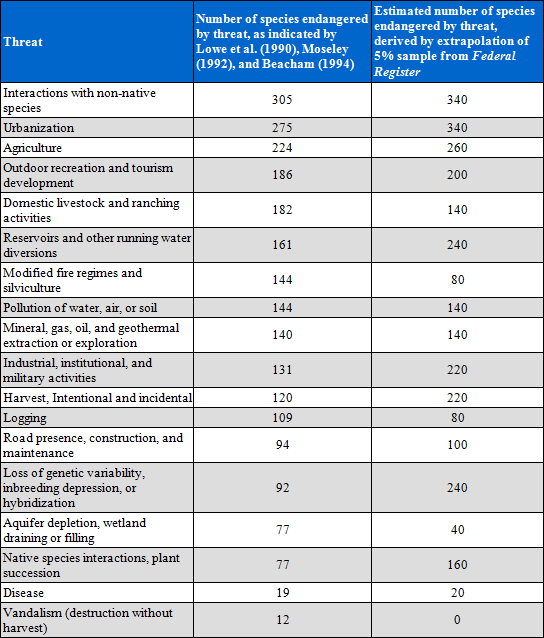

.. _habitat_quality:

***************
生境质量
***************

概述
=======

生物多样性与生态系统服务的生产有着密切的联系。生物多样性本质具有空间化特征，因此，可以通过分析土地利用和土地覆盖图(LULC)及其对生物多样性威胁程度计算得到。InVEST模型中生境质量和生境稀缺性作为生物多样性的反映，可以通过评估某一地区各种生境类型或植被类型的范围和这些类型各自的退化程度来表达。生境质量和生境稀缺性模型主要有四个因素组成：①每一种威胁的相对影响。②每一种生境类型对每一种威胁的相对敏感性。③栅格单元与威胁之间的距离。④单元受到的合法保护的水平。所需的输入数据包括LULC地图，LULC对每种威胁的敏感性，每种威胁分布和密度的空间数据，保护区域空间位置。模型假设土地的合法保护是有效的，所有对某一景观类型的威胁是递增的。

简介
============

生态保护的主要目标之一是生物多样性保护，包括基因的范围，感兴趣区域的物种类型、数量、生境和生态系统。虽然有人认为生物多样性是一项生态服务，这里我们还是将生物多样性作为自然系统的一个独立的属性，具有内在的价值（在模型中我们不给生物多样性定义价值）。自然资源管理者、企业和保护组织者对了解生物多样性和生态系统服务在空间的分配和方式越来越感兴趣。

很多资料表明全球生物多样性普遍下降(Vitousek等，1997; Wilcove等，1998; Czech等，2000)。这一迹象促使了政府和全社会做出响应。通过Rio生物多样性协会，189个国家表示会努力保存境内的生物多样性。但是，在协调生物多样性保护和保持生态系统服务交叉研究方面还很缺乏，这对于国家经济福祉是至关重要。这也正是InVEST致力解决的挑战。

为了使管理者了解景观区域内各个斑块各自的和整体的生物多样性分布和丰度，有必要绘制出区域内出现要素的范围或要素赋存状态（例如 物种，群落，生境）的地图作为代表各层次生物多样性水平。通过评估当前土地利用和管理影响要素保持的程度，制定出适合的保护策略，鼓励这些地区实施生物多样性最大化的资源管理措施。

不同的权衡使得划分保护优先的方法多种多样。每种方法都强调生物多样性特征和动力学的不同方面，包括生境或植被的代表性（粗略筛选），在给定的保护预算条件下保护点区域保护物种数目的最大化（Ando等，1998），划分丰度和特殊性（热点区）的斑块以及保护生态过程。分级筛选的方法（hybrid coarse-fine filter approach）即用细筛筛选一些要素，如要求特殊生境的物种，如果只用粗筛筛选，这些物种可能得不到充分的保护（TNC和WWF生态区计划）。InVEST生
境质量模型最接近于�D粗略筛选‖，或者基于生境方法。

生物多样性与生态系统服务建模的原因是简单的和强大的。这样做可以让我们比较生物多样性和生态系统服务的空间模式，找出双赢的地区（例如：保护区域既能有益于自然生态系统保护，又能有利于人类经济发展），同样也能找出某些目标不一致的区域。而且，它允许我们分析和权衡在未来土地利用变化的不同情景下的生物多样性和生态系统服务。土地利用/土地覆盖(LULC)模块，产生较多生态系统服务的区域可能并不能导致更多的生物多样性保护(Nelson 等，2008)，基于现在来模拟预测未来的变化，有助于帮助识别和避免利益权衡。

模型
=========

InVEST生境质量模型结合土地覆被和生物多样性威胁因素的信息生成生境质量地图。用这种方法对生物多样性初步评价有两个非常有用的信息关键设置：在某一地区各种生境类型或植被类型的范围，这些类型各自的退化度基于随时间所产生的变化。该方法的优点是可以代替详细的方法来迅速检验生境质量和数量的变化。如果生境变化被认为是基因、物种或生态系统变化的代表，模型用户则假设生境质量高的区域将更好的支持所有等级的生物多样性，随时间而减少的生境范围和质量则意味着生物多样性可持久性、弹性、恢复性的降低。

生境稀缺模型表明当前或基于某些基准时期的未来自然景观类型的斑块和范围的生物多样性稀缺程度。生境稀缺地图允许用户创建一个相对于用户基准选择的最适合研究区的生物多样性稀缺生境景观地图。

模型所需的数据在世界上任何地方都可以获取，这一点使得该模型在物种分布数据缺乏的地区非常有用。对于当前环境下的广泛出现的 (存在/没有) 数据可以在许多地方获取。但是，模拟当前环境或未来条件下多个物种的脆弱性的变化，通常是不可能或不可行。然而生境方法留下了详细的当前条件下物种生境数据，其中的几个组件代表了许多现有的生物多样性保护规划工具功能的先进性。最重要的是，能够描述各种威胁的生境类型的敏感性。并不是所有的生境都以相同的方式受到威胁，InVEST模型考虑到了这种可变性。此外，该模型允许用户评估一个威胁对另一个威胁的相对影响，这些威胁将会更损害生物多样性的持久性。例如，相对于由道路所带来的威胁，草原可能对由城市区域有带来的威胁更为敏感。此外，威胁导致自然系统退化的距离将被纳入模型。

当前景观类型可以作为保护概率粗略评估的输入项，表征了主要植被类型保护的应变力和水平。未来潜在景观类型可以作为测量未来生境范围、质量和稀缺性的潜在变化和保护需求。

模型如何运行
------------

生境质量
^^^^^^^^^^^^^^^

我们定义的生境为“存在于一个地区的资源和条件，为给定的生命有机体提供栖息用地，包括生存和繁殖，通过给定的有机体(Hall 等，1997)”。生境质量是指基于生存资源可获得性，生物繁殖与存在数量生态系统提供适合于个体和种群的生存条件的能力，也被认为是模型中一个连续变量，从低到中再到高， (Hall等，1997)。高质量的生境是相对完整，结构和功能均在历史动态范围内。生境质量取决于一个生境对人类土地利用和这些土地利用强度的可接近性。一般来说，生境质量的退化看做附近的土地利用强度增加的结果(Nelleman，2001；McKinney，2002；Forman等，2003)。

模型实用栅格数据运行，或者正方形栅格的栅格地图。每个栅格都赋予一种LULC类型，包括自然类型和管理类型。可在各分类水平上划分植被类型或野生动植物生境。例如，草地是一个广义LULC定义，可以背细分为牧草草场、恢复草原和住宅草坪类型，以便提供更多的LULC分类信息。然而，用户可以提交3 种LULC栅格地图，其中一种为基准地图，当前地图和未来地图，至少当前LULC地图必须提交给模型。

用户可以定义哪种LULC类型可以为保护物种对象提供生境（例如，如果森林哺育鸟类，则森林被认为是生境，非森林类型不是生境）。:math:`H_j`表示LULC类型:math:`j`的生境的适宜性。

哪种LULC类型应被考虑为生境？如果考虑通常的生物多样性或者如果关于特定物种与生境的关系数据缺失，你可以用简单的二分法来分配生境给LULC类型。一个典型的例子就是遵循一个海洋岛屿模型，从物种的角度来看，假设非管理土地的剩余斑块附近的土地矩阵是无法利用的（MacArthur and Wilson，1967）。在本例中，0会分配给管理的LULC类型矩阵（非生境），1分配给非管理的类型 (生境)。在这种建模方案下，生境质量分数不是生境重要性，稀缺性或适用性函数；所有的生境类型都是平等的。模型的输入假设不针对任何特定的物种，而是适用于更一般的生物多样性。

最近研究表明，由非管理的斑块所围绕的管理土地矩阵，将明显的影响生境斑块的有效隔离，呈现他们或多或少孤立的距离(Ricketts 2001；Prugh 等，2008)。矩阵的修正可能在一定程度上减少斑块隔离现象，从而在破碎的景观里有种群的灭绝风险 (Franklin and Lindenmayer 2009)。为了模拟这种现象，相对生境适宜性得分可以分配给一个LULC类型从0到1,1表示最高的生境适宜性。小于1的生境排名表明一个物种可能生存能力较低的生境。采用第二种方法极大地扩展了通常简单的生境定义，人工二进制的方法（例如，自然与非自然）包括一个广泛的管理和非管理的LULC类型。通过使用一个包括LULC类型的连续的生境适宜性，用户可以整体评估土地利用管理的重要生境质量或考虑“工作”景观 (或管理)的潜在的重要性。

如果连续的栖息地适宜性是相关的，LULC景观的权重名单必须应用在一个相关的特定物种组织。例如，草原黄莺可能更喜欢本地草原生境，远高于其他所有生境类型(LULC草原生境得分数 (:math:`H_{prarie}`= 1)，但是在必要时黄莺还将利用管理干草地或牧场 (LULC种秣草地生境得分数(:math:`H_{hayfield}`)和牧场(:math:`H_{pasture}`= 0.5)。然而，哺乳动物如豪猪会发现草原不适合繁殖和饲养。因此，如果特定物种种群-生境关系数据被使用，模型的输出是指在建模时设置的物种生境的范围和质量。

除了反映LULC对生境适宜性关系的LULC地图和数据，模型还需要关于生境威胁密度数据及其对生境质量的影响。总的来说，我们认为人为修正LULC类型将导致栖息地的分裂、边缘化和在邻近威胁生境的退化。例如，生境LULC 向非生境LULC的转换，减少周边生境斑块的大小和连续性。边缘效应是指在 斑块边界和相邻斑块内的生物和物理条件的变化。例如，相邻非生境LULC斑块组的退化对生境组施加“边缘效应”，可能对生境组具有负面影响，例如，利于捕食者，竞争对手，入侵物种，或者有毒化学物质和其他污染物的进入。另一个例子是在许多发展中国家道路是森林生境质量的威胁，因为道路提供木材和非木材森林砍伐的可获得性。

每个威胁源需要制图到对应的栅格网格。一个威胁地图的网格单元值可以显示单元内的威胁强度（例如，在网格单元的道路长度或栽培面积），或只是一个1（如果网格单元包含的公路或作物的威胁）和0。:math:`o_{ry}`是指威胁:math:`r`'s的栅格:math:`y`的得分值，:math:`r`=1，2，…，:math:`R`表明所有模拟的退化源。

所有制图的威胁应该以相同的规模和度量。例如，如果一个威胁是在每个网格单元密度测量，那么所有的退化源应该在每个网格单元密度测量，密度将被测量用同一的公制单位（例如，km 和 km\ :sup:`2`\）。或者，如果一个威胁用地图上存在或缺失（1/0）来测量，那么所有的威胁将用存在或缺失制图。

基于以下四个因素，模型使用这些威胁数据图层来评估不同土地利用类型的退化程度。

1. 第一个因子是每一种威胁的相对影响。一些威胁类型对所有的生境类型破坏性都要更强一些，相对影响得分也依赖于此 (详看表1：所有可能的威胁)。例如，城市面积在降低周围生境质量方面是农业面积的两倍。一个退化源权重，:math:`w_r`，是指退化源对所有生境的相对破坏性。权重:math:`w_r`能够选取0到1的任何一个数值。例如，如果城市面积具有威胁权重1，道路的威胁权重被设置为0.5，那么城市区域将对所有的生境类型产生2倍的干扰。再次重申，如果我们将物种群落-物种生境适宜性分数分配给每个LULC，那么威胁及其权重应该在建模组中体现。

2. 第二个因子是**生境栅格与威胁之间的距离，威胁所带来的影响**。通常，威胁的程度随栅格与威胁源距离的增加而减小，因此距离威胁最近的那些栅格单元将受到较高的影响。例如，假设一个栅格距离一个城市用地边缘2 km，距离高速公路0.5 km。这两个威胁源对该栅格生境的影响部分依赖于他们迅速降低的程度。用户能选择线性或指数距离衰减函数来描述威胁在空间上是如何衰减。威胁:math:`r`在栅格:math:`x`的生境对栅格:math:`y`的影响（:math:`r_y`）用:math:`i_{rxy}`表示，用如下公式表达： 

.. math:: i_{rxy}=1-\left( \frac{d_{xy}}{d_{r\ \mathrm{max}}}\right)\ \mathrm{if\ linear}
	:label: (hq. 1)
	
.. math:: i_{rxy}=exp\left(-\left(\frac{2.99}{d_{r\ \mathrm{max}}}\right)d_{xy}\right)\mathrm{if\ exponential}
	:label: (hq. 2)

	
式中：:math:`d_{xy}`是栅格:math:`x`和:math:`y`之间的线性距离；:math:`d_{r\ \mathrm{max}}`是威胁:math:`r`'s的最大作用距离。图1表明基于威胁的最大衰减距离(线性和指数)，距离与衰减率之间的相关关系。例如，如果用户选择指数降低和威胁最大影响距离设置为1km，当栅格离威胁源有200m时，威胁对栅格生境的影响将下降50%。如果:math:`i_{rxy}>0，那么栅格:math:`x`在退化的威胁:math:`ry`的干扰区域内。反复做，如果我们给每种LULC分配物种群落和生境适宜性得分，那么威胁的空间特征将会对模拟的物种种群有特定的影响。

|

.. figure:: ./habitat_quality/graph.png
   :align: center
   :figwidth: 500px

图 1. 威胁的衰减距离与最大影响距离之间的关系图。

|

3. 第三个因子，可以缓解威胁对生境影响，是**栅格单元受到的合法、制度、社会、物理保护的水平**。栅格单元是不是一个正式的保护区？它是不是人类无法接近的高海拔区域？是不是受到开放采伐或其他形式的干扰？模型假定单元受法律保护越大，受威胁影响越小。:math:`\beta_x \表示栅格:math:`x`可接近的水平，1是指完全可接近性。随着影响的降低，在栅格:math:`x`上的所有的威胁呈线性下降。值得注意的一点，是否合法、制度、社会、物理保护降低人类活动对生境的影响，例如打猎或捕鱼，这些通常不能保护其他某些损害源的影响，例如空气污染、水污染、生境的破碎或边界效益。如果威胁被认为是不受合法、制度、社会、物理保护措施影响，那么你将可以忽视输入或是设置所有栅格:math:`x`的:math:`\beta_x = 1`。再次重申，如果我们分配物种群落-物种生境可适宜得分给每个LULC，那么威胁缓和权重将针对模拟物种群落特别设置。

4. 最终的因子，**每一种生境类型对每一种威胁的相对敏感性**（Kareiva等，2010，生境敏感性也被称为逆，“抵抗”)。每一种生境类型对威胁的响应都可能都不同，因此每一种生境类型对威胁的敏感性用于修正上一步计算的总影响。:math:`S_{jr} \in [0,1]`表示LULC :math:`j`对威胁:math:`r`的敏感性，其值越接近1说明越敏感。这一步中，模型假定土地利用类型对威胁越敏感，土地利用类型单元退化度越大。模型假定一个受威胁的生境类型越敏感，生境类型越容易受威胁的影响导致其退化。生境敏感性的威胁应该是基于景观生态学的保护生物多样性的一般原则 (Forman 1995; Noss 1997; Lindenmayer 等，2008)。

因此，在LULC或生境类型:math:`j`中栅格:math:`x`的总威胁水平由:math:`D_{xj}`表示如下： 

.. math:: D_{xj}=\sum^R_{r=1}\sum^{Y_r}_{y=1}\left(\frac{w_r}{\sum^R_{r=1}w_r}\right)r_y i_{rxy} \beta_x S_{jr}
   :label: (hq. 3)

式中，:math:`y`是指:math:`r`'威胁栅格图上的所有栅格，:math:`Y_r`是指r威胁栅格图上的一组栅格。注意，由于栅格分辨率的变化，每种威胁图都能有一组栅格。如果:math:`S_{jr} = 0`，那么:math:`D_{xj}`不是威胁:math:`r`的函数。威胁权重是归一化的权重，所以所有的权重值加和为1。 

通过归一化权重，我们可以认为:math:`D_{xj}`作为栅格:math:`x`的所有威胁等级的均值。:math:`D_{xj}`图将因我们所使用的权重的改变而变化。注意，如果在每组不同的权重之间存在相对差异，那么仅仅两组权重不同。例如，一组权重0.1，0.1和0.4，同另一组权重0.2，0.2和0.8一样。

采用半饱和函数将一个栅格单元退化分值解译成生境质量得分值，其中用户必须定义半饱和数值。网格单元的退化分数增加其栖息地质量的减少。在LULC类型:math:`j`中的斑块组:math:`x`的生境质量由:math:`Q_{xj}`表示： 

.. math:: Q_{xj} = H_j\left(1-\left(\frac{D^z_{xj}}{D^z_{xj}+k^z}\right)\right)
   :label: (hq. 4)

:math:`z` (我们定义 :math:`z = 2.5`) 和 :math:`k` 为比例因子 (常数)。如果:math:`H_{j}` = 0，:math:`Q_{xj}`为0。:math:`Q_{xj}`在:math:`H_{j}`中增长，在:math:`D_{xj}`中下降。:math:`Q_{xj}`不可能大于1。:math:`k`常数为半饱和常数，用户设定其数值。参数:math:`k`等于:math:`D`值，当:math:`1-\left(\frac{D^z_{xj}}{D^z_{xj}+k^z} = 0.5\right)`。例如，如果 :math:`1-\left(\frac{D^z_{xj}}{D^z_{xj}+k^z}\right) = 0.5`当:math:`D_{xj} = 5`，:math:`k = 5`。在生物多样性模型中，我们设置:math:`k = 0.05`，但是用户可以重新设置。如果你做情景分析，首次运行模型所设置的:math:`k`值，以后的情景模拟中均用相同的:math:`k`值。相似的，首次运行模型所用到的分辨率，以后情景模拟中均用相当的分辨率。如果你想为某一运行模型，改变:math:`k`值或空间分辨率，那么其他所有模型也要做相应改变。

|

表 1. 基于导致美国物种衰减的原因（定义为威胁），或者危及到美国鱼和野生服务的一些可能的衰减源。Czech等，2000。

|

生境稀缺性
^^^^^^^^^^^^^^

生境质量制图能够帮助我们鉴别哪里的生物多样性可能是最完整的，哪里的受到了最严重的危害，然而评价生境的稀有性不考虑其完整性也是非常重要的。在很多保护计划中，越是稀有的生境给与越高的保护优先性，因为保护他们的选择和机会非常有限，如果所有这种生境都消失了，与他们相关的物种和过程也会消失。

当前或规划景观LULC类型的相对稀有性是用相对的LULC基本斑块来估算的，并不是当前的分布状态。当前或规划图上，一些稀有的LULC类型在理想或特定状态下仍然稀有（baseline），但并不一定是濒危区，相反，一些稀有的LULC在过去普遍存在，却处在危险之中。因此，生物多样性模型能够用两种方式计算生境稀有性。

计算当前或未来景观LUCU类型稀有性的一种方法是计算当前和过去（baseline）某一LULC类型j面积之比，再用1减去这个比值。模型引入了一个表现景观土地利用单元稀有性的指数。

.. math:: R_j=1-\frac{N_j}{N_{j_\mathrm{baseline}}+N_j}
   :label: (hq. 5)

式中，:math:`N_j`是当前或未来图中LULC :math:`j`的栅格数。:math:`N_{j_\mathrm{baseline}}`为基准景观图LULC:math:`j`的栅格数。:math:`R`的计算需要用到基准、当前和未来LULCmaps。在得分系统中，LULC的R得分越接近1，对生物多样性保护非常重要的当前和未来景观的可能性越大。如果基准景观中没有LULC :math:`j`，那么我们设置:math:`R_j = 0`。

只要我们有每种LULC类型的:math:`R_j`估计值，就能定量出总的栅格:math:`x`的生境类型稀缺性:

.. math:: R_x=\sum^X_{x=1}\sigma_{xj}R_j
   :label: (hq. 6)

式中，当栅格x为LULC类型:math:`j时:math:`\sigma_{xj}= 1`，否则为0。

模型局限和简化
-------------------------------

在这个模型中所有威胁是附加的，有证据表明，在某些情况下，多种威胁的集体影响远远大于个体之和的威胁水平。

因为选择感兴趣的景观通常是嵌套在一个更大的景观格局里，重要的是要认识到景观有人工边界，在研究边界之外的生境威胁已被省略和忽视。因此，威胁强度总会有减少现象在特定的景观边缘。有两种方法可以避免这个问题。第一种方法，您可以选择空间的景观建模的范围远远超出了您感兴趣的景观边界。然后，结果生成之后，你可以提取感兴趣的结果。或者，用户可以限制到那些主要集中在景观中部区域的退化源。

数据需求
==========

.. note:: *所有空间输入必须具有完全相同的投影坐标系* (以米为单位), *不是* 地理坐标系(以度为单位)。

- :investspec:`habitat_quality workspace_dir`
- :investspec:`habitat_quality results_suffix`
- :investspec:`habitat_quality lulc_cur_path` 这用于为相应的威胁栅格定义地理空间范围。

- :investspec:`habitat_quality lulc_fut_path` 如果提供，该模型将生成退化、栖息地质量和栖息地稀有度(如果提供基线地图)输出。

- :investspec:`habitat_quality lulc_bas_path` 在计算生境稀有度时，需要基线LULC。当用于计算栖息地稀有度时，相应的威胁栅格也可用于计算基线情景的栖息地质量。

  如果可能的话，基线地图应参照土地集约化管理相对罕见的时期。例如，1851年在美国俄勒冈州威拉米特山谷绘制的一幅LULC地图，捕捉到了在大规模农业生产严重改变地貌之前的LULC模式。当然，美国印第安人的土地清理做法，如控制火灾，也改变了这片景观。

- :investspec:`habitat_quality threats_table_path`
  
 目录:

  - :investspec:`habitat_quality threats_table_path.columns.threat`
  - :investspec:`habitat_quality threats_table_path.columns.max_dist`
  - :investspec:`habitat_quality threats_table_path.columns.weight`
  - :investspec:`habitat_quality threats_table_path.columns.decay`
  - :investspec:`habitat_quality threats_table_path.columns.cur_path`
  - :investspec:`habitat_quality threats_table_path.columns.base_path`
  - :investspec:`habitat_quality threats_table_path.columns.fut_path`

  **案例研究**
  
  对当前和未来情景的三种威胁的假设研究。农业(表中*Agric*)退化栖息地的距离比道路更远，总体影响也更大。此外，铺好的路(*Paved_rd*)比土路(*Dirt_rd*)吸引更多的交通，因此比土路对附近栖息地的破坏更大。文件路径是相对于Threat数据表的，因此在本例中，当前威胁位于与该表相同的目录中，而未来威胁位于与威胁数据表相邻的子目录*future*中。基线威胁文件路径是空白的，因为我们没有该场景的威胁栅格，或者我们没有将基线LULC包含在我们运行的模型中。

  ========   ========  ======  =========== ============ =================  =======================
  THREAT     MAX_DIST  WEIGHT  DECAY        BASE_PATH     CUR_PATH         FUT_PATH
  ========   ========  ======  =========== ============ =================  =======================
  Dirt_rd    2         0.1     linear                   dirt_rd.tif        future/dirt_rd_fut.tif
  Paved_rd   4         0.4     exponential              paved_rd.tif       future/paved_rd_fut.tif
  Agric      8         1       linear                   agric_rd.tif       future/agric_rd_fut.tif
  ========   ========  ======  =========== ============ =================  =======================

  **威胁栅格信息**
  
  每个威胁的分布和强度的GIS栅格文件，值在0到1之间。您将拥有与威胁相同数量的这些映射，栅格文件路径应该在**威胁数据**表中定义。这些栅格数据集的范围和分辨率不需要与输入的LULC地图相同。在威胁和LULC分辨率不同的情况下，模型将使用LULC的分辨率和范围。栅格中的每个单元格都包含一个值，表示其内部威胁的密度或存在程度(例如，农业面积、道路长度，如果网格单元格是道路或农田，则简单地为1，否则为0)。所有威胁都应该用相同的尺度和单位来衡量(例如，所有威胁都用密度来衡量，或者所有威胁都用存在/缺失来衡量)，而不是用某种指标的组合来衡量。不要让威胁地图上的任何区域显示为“无数据”。如果栅格不包含该威胁，则将栅格的威胁级别设置为0。
	
  InVEST不会在工具界面中提示您这些栅格，而是在相应场景列下的**Threats data**表中查找它们的文件路径。路径应该相对于**Threats data**表路径。
  
  最后，请注意，我们假设威胁的相对权重和生境对威胁的敏感性不随时间变化，因此我们只提交一个威胁数据表和一个生境敏感性数据表。如果您想随着时间的推移而改变这些，那么您将不得不多次运行该模型。
	
  在样例数据集中，威胁栅格存储在与威胁数据表相同的目录中，并在威胁数据表中以适当的列名定义，如下所示: **CUR_PATH**: crops_c.tif; railroad_c.tif; urban_c.tif; timber_c.tif; roads1_c.tif; roads2_c.tif; roads3_c.tif; **FUT_PATH**: crops_f.tif; railroad_f.tif; urban_f.tif; timber_f.tif; roads1_f.tif; roads2_f.tif; roads3_f.tif. 在输入样例数据集中发现的基线和未来情景LULC文件时，我们正在对当前和未来的LULC情景地图进行生境质量分析。不会为基线地图生成生境质量地图，因为我们没有为基线地图提供任何威胁层，并将威胁数据表中的这些列留空。“农作物”指的是农田，“铁路”指的是火车轨道，“城市”指的是城市，“木材”指的是轮作林业，“1号路”指的是主要道路，“2号路”指的是次要道路，“3号路”指的是轻型道路。

- :investspec:`habitat_quality sensitivity_table_path`

 目录:

  - :investspec:`habitat_quality sensitivity_table_path.columns.lulc`
  - :investspec:`habitat_quality sensitivity_table_path.columns.habitat` 这是:math:`H_j`在上面的方程。如果您想简单地将每个LULC分类为生境或不参考任何特定的物种组，则使用0和1，其中1表示生境。或者，如果一个物种群体的生境偏好有足够的信息，为LULC分配一个相对生境适宜性得分，介于0到1之间，其中1表示最高的生境适宜性。例如，一只草原鸟类可能更喜欢原生草原生境(草原鸟类的“生境”得分为1)，但如果没有草原，它也会使用管理的干草田或牧场(草原鸟类的“生境”得分为0.5)。

  - :investspec:`habitat_quality sensitivity_table_path.columns.[THREAT]` 即使LULC不被认为是生境，也不要将其对每种威胁的敏感性设置为Null或空白，而是输入0。

  *例如:* 有四种LULC类型和三种威胁的假设研究。在该案例中，我们将林地和森林视为(绝对)生境，将裸地和耕地视为(绝对)非生境。森林是最敏感的生境类型，并且对土路(DIRT_RD， 0.9)比铺砌道路(PAVED_RD， 0.5)或农业(AGRIC， 0.8)更敏感。我们对裸地和耕地这两种已开发土地覆盖的所有威胁都进入0，因为它们不是生境。

  ====    =============== ======= ======= ==========  =========
  LULC    NAME            HABITAT AGRIC   PAVED_RD    DIRT_RD
  ====    =============== ======= ======= ==========  =========
  1       Bare Soil       0       0       0           0
  2       Closed Woodland 1       0.5     0.2         0.4
  3       Cultivation     0       0       0           0
  4       Forest Mosaic   1       0.8     0.8         0.5
  ====    =============== ======= ======= ==========  =========

- :investspec:`habitat_quality access_vector_path` 具有最小可达性的边界(例如严格的自然保护区，保护良好的私人土地)被分配一个小于1的数字，而具有最大可达性的边界(例如采掘保护区)被分配一个值1。这些边界可以是土地管理单元或规则图形、六边形或方格。
  
  Field:

  - :investspec:`habitat_quality access_vector_path.fields.access`

- :investspec:`habitat_quality half_saturation_constant` 半饱和参数为公式:eq:`(hq. 4)`中的参数:math:`k`值。k的默认值为0.5，但是可以被设置为任何正数值。通常，你需要设置:math:`k`为景观类型上的最高退化栅格值。为了矫正模型结果，你将必须首先运行模型一次，找到最高退化栅格值，并设置:math:`k`。例如，最初的模型运行产生一个退化地图，该地图的最高退化栅格值为1，那么设置k为0.5，将会产生生境质量地图的最大变化范围为0到1。值得注意的一点是不管:math:`k`值如何设定，生境质量栅格的原有次序是不变的。:math:`k`值的选择仅仅取决于生境质量得分值的扩散和居中趋势。请确保对涉及相同的景观的所有运行使用相同的:math:`k`值。如果你需要对于任何一次模型运行都要改变:math:`k`值的话，那么你必须改变所有模型运行的参数。

.. _hq-interpreting-results:

运行结果
--------------------

**退化和生境质量边缘效应**
  输出栅格图边缘附近的生境质量和退化值可能被夸大，因为它们没有考虑到可能存在于土地覆盖栅格图范围之外的威胁。所有输入的威胁数据都被剪切到LULC栅格的范围内，因此用户应该通过忽略输出栅格边缘最大威胁距离内的值来限制对结果的解释。

* **[工作空间]** 文件夹:

  * **参数记录文件**: 每次模型运行，文本文件(.txt)将会在输出文件夹中生成。该文件将列出的一系列模型运行的参数值，并将根据服务,日期和时间而命名。当与NatCap联系模型运行中的错误时，请包括参数日志。

* **[Workspace]\\output** 文件夹:

  * **deg_sum_out_c_[Suffix].tif** -- 当前景观类型的相对生境退化水平。1代表退化度高，0代表退化度低。非生境的栅格(LULC with :math:`H_j` = 0)退化得分值为0。基于公式(3)计算得到退化得分值地图。
	
  * **deg_sum_out_f_[Suffix].tif** -- 未来景观类型的相对生境退化水平。1代表退化度高，0代表退化度低。非生境的栅格(LULC with :math:`H_j` = 0)退化得分值为0。基于公式(3)计算得到退化得分值地图。

  * **quality_out_c_[Suffix].tif** -- 当前景观类型的生境质量。较高数值表示较好的生境质量。非生境的景观区域生境得分值为0。质量得分值无量纲，不能反映特定的生物多样性测量。基于公式(4) 计算得到生境质量得分值地图。
	
  * **quality_out_f_[Suffix].tif** -- 未来景观类型的生境质量。较高数值表示较好的生境质量。非生境的景观区域生境得分值为0。质量得分值无量纲，不能反映特定的生物多样性测量。基于公式(4) 计算得到生境质量得分值地图。

  * **rarity_c_[Suffix].tif** --当前景观上的相对生境稀缺性。只有在给出基线LULC作为输入时，才会创建此输出。该输出给出了每个栅格的值:math:`R_x` (见式(6))。栅格的值定义在0到1的范围内，其中0.5表示基线和当前地图之间没有变化。数值在0到0.5之间表示生境更丰富，数值越接近0，当前或未来景观上该栖息地类型的保护对生物多样性保护的重要性可能性越小。数值在0.5到1之间表示生境数量较少，数值越接近1，当前或未来景观上的栖息地类型的保护对生物多样性保护的重要性就越大。如果基线景观上没有出现LULC生境类型，则栅格值为0。
	
  * **rarity_f_[Suffix].tif** -- 未来景观上的相对生境稀缺性。只有在给出基线LULC作为输入时，才会创建此输出。该输出给出了每个栅格的值:math:`R_x` (见式(6))。栅格的值定义在0到1的范围内，其中0.5表示基线和当前地图之间没有变化。数值在0到0.5之间表示生境更丰富，数值越接近0，当前或未来景观上该栖息地类型的保护对生物多样性保护的重要性可能性越小。数值在0.5到1之间表示生境数量较少，数值越接近1，当前或未来景观上的栖息地类型的保护对生物多样性保护的重要性就越大。如果基线景观上没有出现LULC生境类型，则栅格值为0。

* **[Workspace]\\intermediate** folder:

	这个文件夹包含在模型运行期间创建的一些中间文件。通常您不需要使用这些文件，除非您试图更好地理解模型是如何工作的，或者调试模型的运行。它们包括生境的地图(**habitat__[b,c,f].tif**)，用威胁数据表属性处理的威胁层(**[threat]_filtered_[b,c,f].tif**)，应用于不同威胁的灵敏度(**sens_[threat]_[b,c,f].tif**)，以及访问输入的栅格化版本(**access_layer.tif**)。

修改输出并创建景观生物多样性评分
^^^^^^^^^^^^^^^^^^^^^^^^^^^^^^^^^^^^^^^^^^^^^^^^^^^^^^^^^^^^

模型输出不提供景观级别的质量和稀有度分数，用于比较基线、当前和未来的LULC情景。相反，用户必须总结每个景观的生境范围、质量和稀有度得分。在最简单的层面上，LULC情景的生境质量景观评分只是该情景下所有网格单元级评分的总和。换句话说，我们可以将来自*quality_out_c.tif*、*quality_out_b.tif* (如果可用)和*quality_out_f.tif* (如果可用)的所有质量分数栅格相加，然后比较分数。地图可能有更高的总体质量分数，原因有几个。首先，它可能有更多的生境面积。然而，如果任何两种情况下的栖息地数量大致相同，那么景观质量得分越高，表明生境的整体质量越好。

景观中某些区域的分数也可以进行比较。例如，我们可以比较已知在感兴趣物种的地理范围内的景观区域的总体栖息地质量分数。例如，假设我们有9个物种的地理范围图，并向栖息地质量模型提供了当前和未来的LULC场景图。在这种情况下，我们将确定18个栖息地质量总分，在每个场景(当前和未来)下为每个模型物种一次。:math:`G_{s_{\mathrm{cur}}}`表示当前视图中位于:math:`s`'范围内的栅格单元集。然后，以物种为单位的栖息地质量平均分数:math:`s`'在当前景观上的范围为: 

.. math:: Q_{s_{\mathrm{cur}}}=\frac{\sum^{G^{s_{\mathrm{cur}}}}_{x=1}Q_{xj_{\mathrm{cur}}}}{G^{s_{\mathrm{cur}}}}
  :label: (hq. 9)

where :math:`Q_{xj_{cur}}` indicates the habitat quality score on pixel :math:`x` in LULC :math:`j` on the current landscape and :math:`Q_{xj_{cur}} = 0` if quality_out.tif for pixel :math:`x` is "No Data". 当前景观上所有9个物种的平均范围归一化生境质量评分将由: 

.. math:: R_x = \sum^X_{x=1}\sigma_{xj}R_j
  :label: (hq. 10)

然后，我们将使用:math:`G_{s_{\mathrm{fut}}}`中的网格单元对每个物种:math:`s`和:math:`Q_{xj_{fut}}`中的集合重复未来的景观。

参考文献
==========

Ando, A, J. Camm, S. Polasky, and A. Solow. 1998. Species distributions, land values, and efficient conservation. Science 279:2126-2128.

Czech, B., P. R. Krausman, and P. K. Devers. 2000. Economic Associations among Causes of Species Endangerment in the United States. Bioscience 50:593-601.

Forman, R. 1995. Land Mosaics: The Ecology of landscapes and regions. Cambridge Univ Press. New York.

Forman, R. 2003. Road ecology: science and solutions. Island Press. New York, New York.

Franklin, J.F. and D. B. Lindenmayer. 2009. Importance of matrix habitats in maintaining biological diversity. Proceedings of the National Academy of Sciences 106:349-350.

Hall, L.S., Krausman, P.R. and Morrison, M.L. 1997. The habitat concept and a plea for standard terminology. Wildlife Society Bulletin 25(1):173-182.

Lindenmayer, D., Hobbs, R., Montague-Drake, R., Alexandra, J., Bennett, A., Burgman, M., Cae, P., Calhoun, A., Cramer, V., Cullen, P. 2008. A checklist for ecological management of landscapes for conservation. Ecology Letters 11:78-91.

MacArthur, R., E. 0. Wilson. 1967. The theory of island biogeography. Princeton University Press, Princeton, NJ.

Mckinney, M.L. 2002. Urbanization, biodiversity, and conservation. BioScience 52:883-890.

Nelleman C, Kullered L, Vistnes I, Forbes B, Foresman T, Husby E, Kofinas G, Kaltenborn B, Rouaud J, Magomedova M, Bobiwash R, Lambrechts C, Schei P, Tveitdal S, Gron O, Larsen T. 2001. GLOBIO. Global methodology for mapping human impacts on the biosphere. UNEP/DEWA/TR.01-3.

Nelson, E., S. Polasky, D. J. Lewis, A. J. Plantinga, E. Lonsdorf, D. White, D. Bael & J. J. Lawler. 2008. Efficiency of incentives to jointly increase carbon sequestration and species conservation on a landscape. Proc. Nat. Acad. Sci. 105: 9471-9476.

Noss, R. F., M. A. Connell, and D. D. Murphy. 1997. The science of conservation planning: habitat conservation under the endangered species act. Island Press. Prugh, L., K. Hodges, A. Sinclair, and J. Brashares. 2008. Effect of habitat area and isolation on fragmented animal populations. Proceedings of the National Academy of Sciences 105:20770.

Ricketts, T. H. 2001. The Matrix Matters: Effective Isolation in Fragmented Landscapes. American Naturalist 158:87-99.

Vitousek, P. M., H. A. Mooney, J. Lubchenco, and J. M. Melillo. 1997. Human Domination of Earth's Ecosystems. Science 277:494.

Wilcove, D. S., D. Rothstein, J. Dubow, A. Phillips, and E. Losos. 1998. Quantifying Threats to Imperiled Species in the United States. Bioscience 48:607-615.
