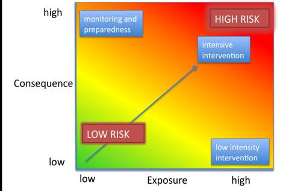
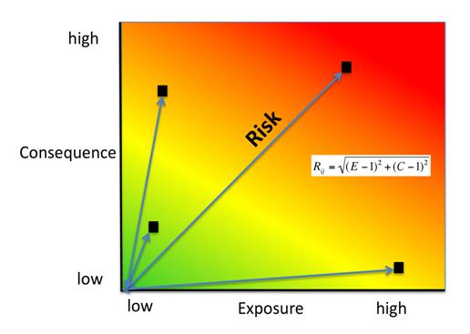

.. _habitat_risk_assessment:

***********************
生境风险评估
***********************

概要
=======

InVEST生境和物种风险评估(HRA/SRA)模型允许用户评估人类活动对生境和物种造成的累积风险，并探索对生态系统服务和生物多样性提供的后果。生境的条件是其所能提供的生态系统服务的关键决定因素;例如，退化的沿海红树林减弱波浪和减少沿海暴露的能力较差。物种面临的风险可能表明随着时间的推移可持续性下降。随着人为压力源继续多样化和加剧，也需要快速、清晰和可重复的方法来评估现在和未来管理情景下对生境和物种的风险。HRA/SRA利用一个得到良好支持的暴露-后果框架来评估陆地或海洋上多个人类活动累积风险的空间变化。

该模型的输出包括生态系统风险图、每个生境或物种的风险图、显示暴露和后果对总体风险的贡献的风险图，以及按分区域和生境或物种分列的风险汇总表。这些产出可用于确定研究区域内和未来各种备选设想中退化相对风险最大的地区以及风险的主要原因。模型输出可以帮助确定人类活动在哪些领域可能造成生态系统服务之间的权衡，从而造成足以危及生境结构和功能或物种持久性或恢复的风险。该模型可以帮助确定保护区域的优先次序，评估管理策略，并为海洋和陆地系统的空间规划的设计和配置提供信息。

简介
============

生境和物种为人类提供了基本的利益，包括调节、物质和非物质服务(Pascual et al. 2017, Díaz et al. 2018)。如海草林和鳗草丛等近岸生境可以提供多种有价值的生态系统服务，包括保护海岸线免受风暴影响，为鱼苗提供温床和碳固定等等。随着这些生境被人类活动破坏，它们所能提供的生态系统服务也受到影响。如今在滨海生态系统里，人类活动对沿海地区陆地与海洋的负面影响越来越普遍。最近国际研究发现全球海域没有一处地方不受到人类活动的影响(Halpern et al. 2008)。因此，加深人类活动对滨海生态系统影响的位置与强度的理解是促成成功的沿海与海洋管理的重要一步。而InVEST HRA模型能帮助用户去评价人类活动对这些生态系统健康的威胁。该模型已成功应用于世界各地的许多地点((如 Arkema et al. 2014, Cabral et al. 2015, Chung et al. 2015, Duggan et al. 2015, Ma et al. 2016, Elliff et al. 2017, Wyatt et al. 2017)。

HRA模型是一种定量方法，用于评估与人类活动相关的压力源对生境和物种的累积影响(Arkema et al. 2014, Arkema et al. 2015)。HRA使用了源自渔业脆弱性评估的风险文献的成熟方法(Astles et al. 2006, Patrick et al. 2010, Hobday et al. 2011, Samhouri and Levin 2012)。

该模型包含两个维度的信息，用于计算对生态系统组成部分的风险或影响(图1; Halpern et al. 2008, Patrick et al. 2010, Samhouri and Levin 2012, Arkema et al. 2014)。这些维度是*暴露*和*后果*。

**暴露** 是指考虑到管理实践的有效性，生境或物种遭受压力的程度。

**后果** 是生境(或物种)对该暴露的特定反应。结果包括每个生境或物种对压力源影响的*敏感性*，以及生境的*恢复力*，或生境或物种抵抗或从暴露的压力源中恢复的能力。

   与人类活动接触较多的生境，结果将面临较高风险。策划暴露在该情节的结果数据允许用户可视化风险，并评估哪些类型的风险更能被人工干预有效的减缓（由外生人为因素多产生的风险，右上区域风险空间）和通过风险监控和防范哪类风险更好的识别（由内生生境物种因素驱动的风险)。(Dawson等，2011)。

为决策过程提供信息
-----------------------------------
HRA模型的输出使用户能够识别生态系统风险较高的区域，调查哪些生境或物种在哪里面临最大的风险，确定风险的主要原因，并了解风险在未来情景下可能如何变化。HRA结果可用于一系列决策上下文: 

* 高风险地区可用于优先管理或恢复工作，正如NOAA海岸管理办公室在新罕布什尔州大海湾所做的那样(NOAA OCM 2016)。
* 高风险区域可用于限制额外用途选址时的决策空间(例如，怀亚特等人2017年所示的风能选址)。
* 风险图可以洞察哪些活动最有影响力，哪些类型的管理策略最有效(Duggan et al. 2015)。
* 当与评估生境引起的生态系统服务变化的模型(如风暴保护或旅游收入)结合使用时，HRA可以帮助评估人类活动和生态系统为人们提供的利益之间的权衡(参见:ref:` Connecting Habitat Risk Assessment Results to InVEST Ecosystem Service Models`; Guerry et al. 2012, Clarke et al. 2016, Arkema et al. 2015)。
* HRA的重复应用可以一起用于评估和比较替代方案(Arkema et al. 2014)。

模型
=========

如何运行
------------

为了评估生态系统和生境或物种对人类活动的暴露，以及这种暴露的后果，HRA综合了多种人类活动(或“压力源”)与多个生境或物种之间相互作用的信息，使用来自同行评审文献、灰色文献和专家意见的空间和非空间数据。

该模型在空间上是显式的，以用户选择的空间分辨率计算横跨研究区域的连续栅格表面上的暴露、后果和风险评分。所有地理空间数据输入都以该分辨率栅格化，下面描述的操作在栅格级进行。

用户提供地理空间数据，包括生境或物种分布、人类活动或压力源的空间范围，以及关于生境或物种与这些压力源之间相互作用性质的表格数据。有关这些相互作用的信息以多重暴露和后果标准评分的形式包含(通常为1-3分，0代表无分数)。具体的标准可以由用户定义，也可以由模型建议。分数是特定于每个生境(或物种)-压力源相互作用。例如，对于每一对生境-压力源，1-3分将分配给每一个标准: 

**暴露** 标准可能包括，生境-压力源对之间的*地理重叠程度*，压力源和生境重叠的*持续时间*，压力源的*强度*，以及*管理策略*减轻影响的程度。

**后果** 标准可能包括暴露于压力源导致的*生境丧失程度*、*生境结构的变化* 以及*生境从这些影响中恢复的能力*(即，通过生活史特征，如补充和再生率)。

对于每个标准，用户从低到高对交互进行评分。该模型非常灵活，可以适应数据不足和数据丰富的情况。数据可能来自多种来源，包括全球范围内同行评议的数据和当地可获得的精细数据。模型输入和结果可以在获得更好的信息时进行更新。

.. _hra-equations:

多重压力源对生境或物种的累积风险
^^^^^^^^^^^^^^^^^^^^^^^^^^^^^^^^^^^^^^^^^^^^^^^^^^^^^^^^^^^^^^

人类活动对生境或物种的风险模型分为五个步骤。

1. 计算每对生境-压力源的暴露和后果分数。
2. 针对每一对生境-压力源，将暴露值和后果值合并为风险评分。
3. 在每个栅格位置上计算累积来自每个生境/物种的所有压力源的风险。
4. 将每个生境或物种的风险分为低、中或高。
5. 将栅格级的结果总结为更大的感兴趣的子区域。

**步骤 1.** 此步骤涉及判断生境暴露于压力源可能性及其暴露后果。暴露程度（E）和后果（C）取决于每一个属性被分配的一套标准等级评定（通常为1-3分，
0代表无分数）。我们已为用户提供了科学研究中运用频繁的一套标准，但标准可
以任意添加或去除。默认标准的评分向导会在下文总结 (:ref:`exposure-criteria-details` and :ref:`consequence-criteria-details`)。注意，“空间重叠”是一个特殊的曝光标准，总是包括在内，不需要像其他标准一样由用户定义或评分。对于研究区域的每个栅格单元，如果压力源和生境或物种都存在，则空间重叠= 1，模型使用有关其他标准的信息和下面的方程计算E和C。如果压力源和生境或物种在特定网格单元格中不重叠，则暴露、后果和风险在该栅格中为0。所有其他标准的分数都是用户提供给模型的输入。对于分配的每个分数，您还可以指出用于确定分数的数据的质量，以及相对于其他标准的加权重要性。这允许您将更大的权重分配给得分置信度更高的标准，或者分配给对系统中风险贡献更大的标准。因此，对于来自生境*j*和压力源*k*的每个标准*i*，总体暴露:math:`E` 和后果:math:`C` 分数是根据暴露值:math:`e_i` 和后果值:math:`c_i` 的加权平均来计算的。

.. math:: E_{jkl} = \frac{\sum^N_{i=1}\frac{e_{ijkl}}{d_{ijkl}\cdot w_{ijkl}}} {\sum^N_{i=1}\frac{1}{d_{ijkl} \cdot w_{ijkl}}}
   :label: exposure

.. math:: C_{jkl} = \frac{\sum^N_{i=1}\frac{c_{ijkl}}{d_{ijkl}\cdot w_{ijkl}}}{\sum^N_{i=1}\frac{1}{d_{ijkl} \cdot w_{ijkl}}}
   :label: consequence

式中 :math:`E_{jkl}` 是特定于生境*j*的暴露得分，来自位置*l*的压力源*k*; :math:`C_{jkl}` 为后果评分, :math:`e_{ijkl}` 为暴露等级标准*i*，针对生境*j*和压力源*k*和位置*l*; :math:`c_{ijkl}` 结果评级。 :math:`d_{ijkl}`表示数据质量评级, :math:`w_{ijkl}` 表示标准的重要性权重。 *N* 为每个生境评估的标准数量。

**步骤 2.** 第二步是结合暴露程度与响应值去给每个压力源—生境联合体生成
一个对应的风险值。风险值计算有两个选项，基于距离的加权有三个选项。

对于欧几里得风险计算，在每个位置(即栅格)*l*，由压力源*k*引起的生境风险*j*计算为暴露-后果空间中距离原点的欧几里得距离，其中平均暴露(:eq:`exposure`)位于一个轴上，平均后果评分(:eq:`consequence`)位于另一个轴上。

.. math:: R_{jkl} = \sqrt{(E_{jkl}-1)^2+(C_{jkl}-1)^2} \cdot D_{jkl}
   :label: euclidean_risk

该模型在生境和压力源在空间上重叠的地方绘制了生境-压力源特定风险评分

对于乘法风险计算，栅格*l*中压力源*k*对生境*j*的风险计算为暴露(:eq:`exposure`)和后果评分(:eq:`consequence`)的乘积。

.. math:: R_{jkl} = E_{jkl} \cdot C_{jkl} \cdot D_{jkl}
   :label: multiplicative_risk

在欧几里得和乘法风险计算中，距离加权衰减:math:`D_{jkl}` 表示用户从以下选项中选择衰减函数:

无衰减("None" in the UI):

.. math:: D_{jkl} = \begin{Bmatrix}
        1 & if &distance_{jkl} > bufferdist_k \\
        0 & & otherwise
        \end{Bmatrix}
   :label: hra-decay-none

线性衰减 ("Linear" in the UI):

.. math:: D_{jkl} = \begin{Bmatrix}
        1 - \frac{distance_{jkl}}{bufferdist} & if & distance_{jkl} > bufferdist_k \\
        0 & & otherwise
        \end{Bmatrix}
   :label: hra-decay-linear

指数衰减 ("Exponential" in the UI):

.. math:: D_{jkl} = \begin{Bmatrix}
        1-e^{\frac{log_{10}(1e-6)}{distance_{jkl}}} & if & distance_{jkl} > bufferdist_k \\
        0 & & otherwise
        \end{Bmatrix}
   :label: hra-decay-exponential

式中:

* :math:`D_{jkl}` 表示压力源的距离加权影响
  :math:`k` 在生境:math:`j` 在位置:math:`l`。这是一个值在0到1之间，其中0表示没有影响(当:math:`l` 在缓冲距离)和1(其中:math:`l` 位于压力源栅格上)。
* :math:`distance_{jkl}` 是生境之间的距离，单位为米:math:`j` 压力源:math:`k`。
* :math:`bufferdist_k` 是用户定义的缓冲区距离，压力源:math:`k` 的单位为米。

.. note::
  用户可以选择使用哪个风险函数。不同的研究以不同的方式结合暴露和后果:累积影响映射研究倾向于使用乘法方法来估计风险(Halpern et al 2008, Selkoe et al 2009, Ban et al 2010)，而生态系统风险评估研究倾向于用风险图中特定生境(或物种)-活动组合的欧氏距离来估计风险(Patrick et al 2010, Hobday et al 2011, Samhouri and Levin 2012, Arkema et al. 2014)。

  初步敏感性测试表明，总体而言，两种方法在最高和最低风险生境或区域上是一致的，尽管中间风险结果可能有所不同(Stock et al. 2015)。在伯利兹使用欧几里得方法进行的广泛人类资源评估分析的实证检验发现，计算的风险与生境破碎化和健康的衡量指标之间有很好的一致性(Arkema et al. 2014 supplement)。一般来说，欧几里得方法可能比乘法方法提供更保守、更高的总体估计。如果E和C值相差很大，那么欧几里得方法将产生相对较高的风险结果。相比之下，乘法方法往往会产生相对较低、不太保守的风险值，并将E和C的相似性与较高的风险联系起来。如果您的系统所包含的生境具有很高的风险后果，但暴露程度较低(例如，目前避免珊瑚礁的珊瑚和虾拖网捕捞区)，并且您希望采用预防原则，则建议选择欧几里得方法。

**步骤 3.** 在这一步中，模型量化了每个栅格单元中所有压力源对每个生境或物种的累积风险。栅格*l*中生境或物种*j*的累积风险是每个生境或物种的所有风险得分的总和， 

.. math:: R_{jl} = \sum^K_{k=1} R_{jkl}

**步骤 4.** 基于单独压力源或多种压力源累积效应造成的风险，对应每种类型的生境里的每个栅格可分为HIGH（高），MED（中）和LOW（低）三个风险等级。HIGH等级分类被分配给满足以下两个标准之一的栅格单元: 

   1)	栅格单元的累积风险是任何单个生境(或物种)-压力源组合的最大风险评分的66%。例如，如果暴露和后果在1-3级范围内排名，那么单个生境(或物种)-压力源组合的最大风险评分为2.83(使用欧几里得方法);所有风险评分大于1.87(2.83的66%)的栅格将被归类为高风险。这一标准解决的问题是，在压力源具有特别破坏性的情况下(例如，清除所有树木的砍伐或清除所有珊瑚的疏浚)，额外的压力源(例如远足小径或娱乐钓鱼)不会进一步增加生境退化的风险。这被描述为 :eq:`hra-pairwise-risk-classification` 。

   2)	栅格单元中的累积风险是总可能累积风险的66%。总可能累积风险是基于单个生境(或物种)-压力源组合的最大风险评分，以及在研究区域内可以占据特定网格单元的压力源的最大数量(见下一段)。如果在整个研究区域内，单个栅格单元中可能出现的压力源(如农业径流、海洋养殖和海洋运输)不超过3个，则重叠压力源的最大数量为3。在这种情况下，总可能的累积风险将为8.49(基于欧几里得方法;单个生境(或物种)-压力源组合的最大风险评分X最大重叠压力源数量= 2.83 × 3 = 8.49)。这一标准解决了一个问题，即即使单个压力源不是特别有害的，多个压力源造成的累积效应也很高。这被描述为:eq:`hra-classified-risk-max` 和 :eq:`hra-cumulative-risk-classification`。

如果栅格具有个体压力源或累积风险评分在总可能累积风险评分的33%-66%之间，则将其归类为中风险。如果单个压力源或多个压力源的个体或累积风险分数分别为总可能风险分数的0-33%，则栅格被归类为低风险。

**步骤 4a.**

对于每一对生境/压力源，这种HIGH/MED/LOW分类更多正式表示为: 

.. math:: L_{jkl} = \begin{Bmatrix}
        0 & if & R_{jkl} = 0 \\
        1 & if & 0 < R_{jkl} < (\frac{1}{3}m_{jkl}) \\
        2 & if & (\frac{1}{3}m_{jkl}) <= R_{jkl} < (\frac{2}{3}m_{jkl}) \\
        3 & if & R_{jkl} >= (\frac{2}{3}m_{jkl})
        \end{Bmatrix}
   :label: hra-pairwise-risk-classification

式中:

* :math:`L_{jkl}` 是生境的高/中/低风险计算:math:`j`由于压力源:math:`k`在位置:math:`l`。
* :math:`R_{jkl}` 是压力源的计算风险:math:`k`到生境:math:`j`在位置:math:`l`。
* :math:`m_{jkl}` 是每个生境/压力源对的最大得分，即所有生境/压力源对都一致。它被定义为

   * :math:`m_{jkl} = (r_{max})^2` 如果使用乘法风险。
   * :math:`m_{jkl} = \sqrt{2(r_{max}-1)^2}` 如果使用欧几里得风险。

* :math:`r_{max}` 是用户自定义的最大分数。

**步骤 4b.**

多个压力源对每个生境或物种的累积影响的:math:`L` 更正式地表示为:

.. math:: L = \begin {Bmatrix}
        L_{jkl} & if & L_{jkl} > L_{jl}\\
        L_{jl} && otherwise\\
        \end{Bmatrix}
   :label: hra-classified-risk-max

式中 :math:`L_{jl}` 的计算为

.. math:: L_{jl} = \begin{Bmatrix}
        0 & if & R_{jl} = 0 \\
        1 & if & 0 < R_{jl} < (\frac{1}{3}m_{jl}) \\
        2 & if & (\frac{1}{3}m_{jl}) <= R_{jl} < (\frac{2}{3}m_{jl}) \\
        3 & if & R_{jl} >= (\frac{2}{3}m_{jl})
        \end{Bmatrix}
   :label: hra-cumulative-risk-classification

考虑到:

* :math:`L_{jl}` 是生境的高/中/低风险计算:math:`j` 在位置:math:`l`。
* :math:`R_{jl}` 是对单个生境或物种的累积风险:math:`j` 在位置:math:`l`。
* :math:`m_{jl}` 是所有生境/压力源对之和的最大风险评分，计算方法为:math:`m_{jl} = m_{jkl} \cdot n_{overlap}`，其中:math:`n_{overlap}` 是用户自定义的重叠压力源数量。

**步骤 5.** 在最后一步里，用户可以自行评估比栅格分辨率还高或比研究区域面积还小的子区域尺度的风险。在海岸与海洋空间规划过程中，子区域尺度通常作为政府地区规划中的边界单位（如沿海区域、州和省的规划）。值得注意的是，空间重叠（一个默认的暴露标准）中的子区域分数是基于子区域中生境碎块与人类活动的重叠（下文将详述细节）。依照其它E和C标准，子区域的分数是研究区域内所有栅格的E和C分数的平均值。风险值可以用欧几里得方法与成倍相乘方法来估算（详见上文）。

多重压力源对生态系统的累积风险
^^^^^^^^^^^^^^^^^^^^^^^^^^^^^^^^^^^^^^^^^^^^^^^^^^^^^^^^
为了提供网格单元中所有生境或物种的综合风险指数，该模型还计算了生态系统风险。每个栅格单元*l*的生态系统风险是生境或物种风险得分的总和。

.. math:: R_{l}= \sum^J_{j=1} R_{jl}

生态系统风险将随着共存生境或物种数量的增加而增加。

更详细的暴露和后果标准
^^^^^^^^^^^^^^^^^^^^^^^^^^^^^^^^^^^^^^^^^^^^^^^^

该模型允许在评估生境风险时使用任意数量的标准。作为默认，该模型提供了一组典型的考虑因素，以评估生境的压力源的风险。除了网格单元尺度上的空间重叠外，这些标准的评分范围为1-3,0 =无分数。然而，用户并不局限于1-3的范围。只要在单个模型运行中存在一致性，就可以使用其他尺度(例如1-5,1-10)。在所有情况下，数字越高代表接触或后果越大，并导致风险得分越高。**使用0分将始终表明给定的标准应排除在暴露和后果方程中。** 

有关如何准备此输入数据的技术指导，请参阅 :ref:`hra-criteria-csv`。

.. _exposure-criteria-details:

默认暴露标准
"""""""""""""""""""""""""

1. **空间重叠 .** 为了评估研究区域的空间重叠，模型使用了生境或物种和压力源的分布图。

   **生境分布图** 可以表示生物(如鳗草或海带)或非生物(如硬底或软底)生境类型或物种。用户定义生境分类的细节。例如，生境可以按分类单元(如珊瑚、海草、红树林)、物种(如红色、黑色红树林)或用户所需的任何方案定义为生物或非生物。在物种风险评估中，我们建议指定单个物种，但用户也可以指定一个分类单元。为了使更多的细节或特异性有用并改变模型的结果，这些生境分类应该与生境或物种对压力源的反应之间的差异相对应。

   **压力源分布图** 表示压力源活动的足迹或空间范围。此外，可以为每个压力源分配“影响区”或“缓冲区”，表示压力源的影响在输入映射中超出其实际足迹的传播距离。对于一些压力源，比如穿过森林的脚印，这个距离会很小。对于其他压力源，如营养物散布300-500米的鳍鱼养殖场或边缘效应可延伸至1公里的森林砍伐，这一距离可能很大。用户可以指定压力源的影响从压力源的足迹到影响区域的外部范围是线性衰减还是指数衰减。该模型使用压力源影响区域的距离来创建中间输出，该输出是由影响区域缓冲的压力源足迹映射(四舍五入到最近的栅格单位;例如，当分析分辨率为250m时，600m的缓冲距离将四舍五入到500m)。

   **对于每个栅格单元**, 如果生境或物种与压力源重叠，则空间重叠= 1，模型使用其他标准的得分计算暴露、后果和风险(如下)。如果生境或物种在特定栅格单元中与压力源不重叠，则模型将暴露、后果和风险设置为该特定栅格单元中的0。

   **子区域尺度**, 模型计算空间重叠分数如下:对于每个子区域，每个生境与每个压力源重叠的面积百分比为*percentage_overlap*。那么，空间重叠分数如下式: 

    maximum_criteria_score * percentage_overlap + minimum_criteria_score * (1 - percentage_overlap)

   例如，如果一个生境的50%的面积与压力源重叠，我们的标准范围是1-3，那么: 
   3 * 0.5 + 1 * (1 - 0.5) = 2. 最后，模型根据子区域暴露分数的平均值在平均空间重叠分数。如果没有重叠，则暴露程度，后果及风险为0。如果没有暴露程度分数但空间重叠确实存在，则分数为彻底的空间重叠的分数。

2. **时间重叠等级.** 所谓时间重叠就是生境与压力源空间重叠的持续时间。一些压力源如永久水上建筑物是整年的，一些则为季节性的如某一捕鱼活动。同样的，一些生境如红树林是整年的而其他如海草丛为短暂的。

   *如果标准评分为1-3分，以下是对时间重叠评分的建议:*

   ======================= ========================================================= ======================================================== ========================================================= ============
   Score:                     1 (low)                                                   2 (medium)                                               3 (high)                                                  0 (no score)
   ======================= ========================================================= ======================================================== ========================================================= ============
   时间重叠生境和压力源在  年中有0-4个月共存生境和压力源在                           年中有4-8个月共存生境和压力源在                          年中有8-12个月共存N/A
   ======================= ========================================================= ======================================================== ========================================================= ============

   *选择"不记分或无分数"意味着从你的评估中排除这个标准。*

3. **强度评比.** 生境暴露于压力源程度不但取决于生境与压力源是否空间和时间重叠，也涉及压力源的强度率。强度标准视特定压力源而定。举例说明，富营养压力的强度与鲑鱼养殖的联系在于养殖鲑鱼的数量及其有多少污染物排向周围的环境。又或者，破坏性的贝类捕获的强度与捕获次数与活动有关。你可以凭借这强度标准来研究一个压力源强度的变化怎么影响其对生境的风险。例如，在未来情景分析中，通过改变强度率的分数来看鲑鱼养殖地理存量的变化，也可以使用这排名去整合研究区域里不同压力源强度的差异。例如，不同类型的海洋运输可能有不同的强度水平，游轮可能是比水上出租车更强烈的压力源，因为它们比出租车释放更多的污染物。

   *如果评分标准为1-3分，建议评分强度为:*

   ========= ============= ================ ============== ============
   Score           1               2               3             0
   ========= ============= ================ ============== ============
   Intensity Low intensity Medium intensity High intensity N/A
   ========= ============= ================ ============== ============

   *选择"不记分或无分数"意味着从你的评估中排除这个标准。*

4. **管理策略效果对比.** 管理功能能限制人类活动对生境的负面作用。举个例子，相关政府能让鲑鱼养殖者进行休渔来减少污染物排放也能让附近的海草丛能到恢复。因此，有效的管理对策能减少生境暴露压力源的程度。在区域中每个压力源管理的效果都是相较于其他压力源评分的。如果有一个压力源非常好管理以至它比其他压力源对系统的压力很小，其管理效果归类为"非常有效"。一般来讲，大多数压力源的管理往往无效。毕竟，你把他们视为对生境有影响的压力源。你可以用这个标准来探讨不同情景中的管理变化，如将开发从高影响(可能会得到“无效”的分数)更改为低影响(可能会得到“非常有效”的分数)的效果。与所有标准一样，数字越高代表暴露程度越大，导致风险得分越高。

   *如果标准以1-3分制进行评分，则以下是对管理有效性评分的建议:*

   ======================== ============== ================== ============================= ============
   Score                         1                 2                3                             0
   ======================== ============== ================== ============================= ============
   Management effectiveness Very effective Somewhat effective Not effective, poorly managed N/A
   ======================== ============== ================== ============================= ============

   *选择"不记分或无分数"意味着从你的评估中排除这个标准。*

5. **其他** 暴露标准可作为上述标准的补充或替代。

.. _consequence-criteria-details:

默认后果标准
""""""""""""""""""""""""""""

生境被一个压力源威胁风险取决于暴露后果，而后者又取决于一个生境的抵抗及其恢复能力，这可以以四个关键属性来判断：面积变化，结构变化，自然干扰的频率和恢复特性。我们将在下面一一解释： 

1. **面积比率变化.** 面积变化可以用被特定压力影响且反馈敏感的生境区域面积变化百分比来衡量。生境在特定压力源影响下损失很大比例的面积则为高度敏感，反之为低度敏感抵抗性更强。

   *如果标准评分为1-3分，以下是对面积比率变化评分的建议:*

   ============== ======================== ============================ =========================== ============
   Score               1                           2                          3                               0
   ============== ======================== ============================ =========================== ============
   Change in area Low loss in area (0-20%) Medium loss in area (20-50%) High loss in area (50-100%) N/A
   ============== ======================== ============================ =========================== ============

   *选择"不记分或无分数"意味着从你的评估中排除这个标准。*

2. **结构变化.** 对于生物生境，结构变化就是在暴露在特定压力源下生境的结构密度的变化百分比。生境暴露在特定压力下损失高比例结果则为高度敏感，反之为低度敏感抵抗性更强。对于非生物生境，结构变化就是生境维持的结构损伤数量。敏感的非生物生境将遭受完全或部分破坏，而那些遭受很少或没有破坏的生境则更具抵抗力。例如，砾石或泥泞的底部将受到底部拖网作业的部分或完全破坏，而坚硬的基岩底部则几乎不会受到损害。对于物种来说，结构的变化可以用来捕捉种群结构的变化，例如年龄或性别分布的变化。

   *如果标准是1-3分，以下是对结构变化的评分建议:*

   =================== ======================================================================================================================== ======================================================================================================================= ==================================================================================================================== ============
   Score                    1                                                                                                                           2                                                                                                                     3                                                                                                                        0
   =================== ======================================================================================================================== ======================================================================================================================= ==================================================================================================================== ============
   Change in structure Low loss in structure (for biotic habitats, 0-20% loss in density, for abiotic habitats, little to no structural damage) Medium loss in structure (for biotic habitats, 20-50% loss in density, for abiotic habitats, partial structural damage) High loss in structure (for biotic habitats, 50-100% loss in density, for abiotic habitats, total structural damage) N/A
   =================== ======================================================================================================================== ======================================================================================================================= ==================================================================================================================== ============

   *选择"不记分或无分数"意味着从你的评估中排除这个标准。*

3. **自然干扰频率.** 如果一个生境被自然频繁干扰的方式类似于人类源压力源，它可能就对外来的人类源压力源具有更好的抗压性。对于每个生境和压力源结合体而言，这个标准评分是分开的，例如已经适应了多种营养条件从而使生境对鲑鱼小规模养殖导致营养负荷产生更高的抗性。然而，强烈风暴能帮助生境增加对大规模捕鱼的抵抗力，因为这两者对生境的影响途径相似。

   *如果标准评分为1-3分，以下是对自然干扰频率评分的建议:*

   ======================================== ========================== =============================================== ============================= ============
   Score                                         1                             2                                             3                                 0
   ======================================== ========================== =============================================== ============================= ============
   Frequency of similar natural disturbance Frequent (daily to weekly) Intermediate frequency (several times per year) Rare (annually or less often) N/A
   ======================================== ========================== =============================================== ============================= ============

   *选择"不记分或无分数"意味着从你的评估中排除这个标准。*

.. note:: 以下后果标准是恢复属性。这些包括生物长久特性如再生率及重建方式对生境干扰后恢复的能力的影响。对于生物生境，我们把恢复视为关于自然死亡率，重组频率，成熟年龄与连通性的函数。

4. **自然死亡率 (只适用于生物生境).** 拥有高自然死亡率的生境一般更为多产和恢复能力更强，因此被评为受干扰影响较小(即死亡率越高得分越低)。与所有标准一样，数字越高代表暴露或后果越大，并导致风险评分越高。

   *如果标准按1-3分进行评分，则以下是对自然死亡率评分的建议:*

   ====================== ================================== ================================ ========================== ============
   Score                       1                                     2                              3                              0
   ====================== ================================== ================================ ========================== ============
   Natural mortality rate High mortality (e.g.80% or higher) Moderate mortality (e.g. 20-50%) Low mortality (e.g. 0-20%) N/A
   ====================== ================================== ================================ ========================== ============

   *选择"不记分或无分数"意味着从你的评估中排除这个标准。*

5. **重组频率 (只适用于生物生境).** 重组的频繁通过增加外来繁殖体在受干扰区域重建群落的几率来增加恢复潜能。也就是说，重组越多，弹性越大，因此得分越低。与所有标准一样，数字越高代表暴露或后果越大，并导致风险评分越高。

   *如果按照1-3分的标准进行评分，下面是对重组频率评分的建议:*

   ======================== ==================== ============= ============ ============
   Score                         1                       2           3                0
   ======================== ==================== ============= ============ ============
   Natural recruitment rate Annual or more often Every 1-2 yrs Every 2+ yrs N/A
   ======================== ==================== ============= ============ ============

   *选择"不记分或无分数"意味着从你的评估中排除这个标准。*

6. **成熟年龄/恢复时间.** 能较早成熟的生物生境比那些成熟晚的生境能更快从干扰中恢复。这里我们指示的成熟是整个生境的成熟（如成熟的海藻林），而不是单个生物体的生理成熟。对于非生物生境，拥有较短的恢复时间的生境（如泥滩能减少暴露在人类活动的后果）。与之对比，由基岩组成的生境恢复只能在地质年代尺度，极大加重暴露后果。

   *如果标准是1-3分，以下是成熟年龄/恢复时间的评分建议:*

   ============================= ============== ========== ================ ============
   Score                         1              2          3                0
   ============================= ============== ========== ================ ============
   Age at maturity/recovery time Less than 1 yr 1-10yrs    More than 10 yrs N/A
   ============================= ============== ========== ================ ============

   *选择"不记分或无分数"意味着从你的评估中排除这个标准。*

7. **连通性 (只适用于生物生境).** 生境斑块或种群亚群的紧密间隔增加了新来者在受干扰地区重新建立种群的机会，从而增加了生境或物种的恢复潜力。连通性是与新来者移动距离相关的。例如，对于一个幼虫或种子只能移动数百米的物种来说，相隔10公里的斑块可能被认为是连通性不良的，而对于一个幼虫或种子可以移动数百公里的物种来说，连通性良好。与所有标准一样，数字越高代表暴露或后果越大，并导致风险评分越高。

   *如果标准评分为1-3分，则以下是对连通性评分的建议:*

   ============ ================================================ =================== ================================================ ============
   Score                                1                                 2          3                                                      0
   ============ ================================================ =================== ================================================ ============
   Connectivity Highly connected relative to dispersal distances Medium connectivity Low connectively relative to dispersal distances N/A
   ============ ================================================ =================== ================================================ ============

   *选择"不记分或无分数"意味着从你的评估中排除这个标准。*

空间直观标准的运用
^^^^^^^^^^^^^^^^^^^^^^^^^^^^^^^^^

作为能给一个标准设定等级从而运用到整个研究区域的途径，模型可以被输入空间直观标准。这些标准设定能直接用于任何暴露程度或后果标准。举例说明，用户可以区分研究区域内一个特定生境或物种的高低重组能力。空间直观标准是一类在特定区域内每个属性都能包括一个独立等级的矢量图层。（详见:ref:`spatially-explicit-data` 章节，里面含更多如何在一个完成模型运行中准备和运用空间直观标准的信息。）

.. _data-quality-details:

得分数据质量指南
^^^^^^^^^^^^^^^^^^^^^^^^^^^^^^^^^^^^^^^^^^^^^^^

风险评估是一个综合过程，其需要大量关于人类与生态系统多方面属性的数据。高质量的数据能支持风险评估某些方面而其他方面则可能受限与数据可获性和高不确定性。用户有权对数据质量评分并给风险计算中置信度高的标准提高权重（公式2和3）。我们希望通过在模型里包含数据质量评比的选项，用户可以意识到评估中一些来源的不确定性，因此，在使用源于低质量数据的结果时格外小心。此外，从这评分程序获取的信息可以用来指导研究或检测效果来提高数据的质量和可获性。我们建议用户第一次运行模型时，要运用在所有标准下数据质量都一致的分数（如2）来确定整体模式是否只在压力源与生境关系之间有意义。接下来，如果用户对于给定的标准具有优秀的数据质量，那么他们应该重新运行模型，使用1表示高数据质量，如果他们没有关于数据质量的验证信息，则指定3表示低数据质量。

对于每个暴露程度与后果的分数，用户能指明用来决定浮动尺度下的分数的数据的质量，其中1表示最高质量的数据，高于1的数据越来越不可信。

===================================================================================================================================================== ==================================================================================================================================================================== =====================================================================================================================
Best data (1)                                                                                                                                            Adequate data (2)                                                                                                                                                        Limited data (3)
===================================================================================================================================================== ==================================================================================================================================================================== =====================================================================================================================
Substantial information is available to support the score and is based on data collected in the study region (or nearby) for the species in question. Information is based on data collected outside the study region, may be based on related species, may represent moderate or insignificant statistical relationships. No empirical literature exists to justify scoring for the species but a reasonable inference can be made by the user.
===================================================================================================================================================== ==================================================================================================================================================================== =====================================================================================================================

Similarly, the user can adjust the importance or “weight” of each criterion. Each ecological system is unique and different criteria may be more important for some habitats or species than others. For example, the recovery potential of a habitat or species may be more strongly dictated by recruitment rate than connectivity to other habitat patches. We suggest the users first run the model with the same weight score (e.g., 2) for all the criteria to determine if the overall patterns make sense based on known relationships between the stressors and habitats or species. Next, if users have verified information on the importance of a given criteria, they should then re-run the model using a 1 or 3 to indicate higher or lower importance, respectively.

   ================================ =========================================================================== ========================================================================= ===================================================================================================
   ..                               Most important (1)                                                          Moderately important (2)                                                  Least important (3)
   ================================ =========================================================================== ========================================================================= ===================================================================================================
   Relative importance of criterion Criterion is especially important in determining the impact of the stressor Criterion is somewhat important in determining the impact of the stressor Criterion is less important, relative to other criterion, in determining the impact of the stressor
   ================================ =========================================================================== ========================================================================= ===================================================================================================

限制与假设
---------------------------

限制
^^^^^^^^^^^

1. **数据质量限制结果**:输入数据的可获性与质量可限制模型结果的准确性。使用一些高质量数据，诸如那些来自研究区域内若干选址都能重复的本地物种评估，在过去十年内比运用从遥远位置采集回来的有限的时空覆盖率的低质量数据将能获得更准确结果。大部分情况下，用户将会需要一些来自地理位置上压力源与生境结合体的数据，那是因为大部分关于一些压力源影响的数据只能从世界上少数地点采集。为了克服这些数据限制，我们分析中包含数据质量分值。这种分值能让用户为低质量数据降低标准。

2. **结果应该被解译为相对尺度**: 由于评分过程的特性，结果会用来比较在研究区域内若干生境内人类活动带来的风险（变化范围可从局地小尺度变为全球大尺度），但这应该不能被用于比较不同分析的风险计算。不确定性分析表明，这类影响映射的广泛定性趋势是稳健的(Stock 2016)。其他地方的HRA经验测试表明，模型风险与生境破碎化和健康之间存在很强的关系(Arkema et al. 2014)。随着当地可获得经验数据，未来工作的一个重要途径将是验证区域风险评分并将其与生境质量条件(例如密度、碎片化等)联系起来。

3. **结果不会反映过去人类活动的影响**. HRA模型不会明确考虑过去人类活动对当前风险的历史效应。曾经暴露在过去人类活动可能会影响当今和未来人类活动影响的后果。如果用户有生境暴露在人类活动的历史数据（如在时间或空间范围内）和关于这怎么样影响当前后果分数的信息，就能把这些信息输入分析中得出更准确结果。

4. **结果是基于标准的同量加权，除非用户明确加权标准的重要性或数据质量**。模型假设每个标准（如空间重叠和重组结构）的影响对于风险判断都是同等重要来计算暴露程度和后果分数。每个标准的相对重要性都不清楚，所以我们都假设它们都是同等重要。但是，用户也可以在判断整体风险中对每个标准加权重要性。 

5. **模型只评估了通过空间重叠直接影响生境的压力源的风险。** 压力源可能会以其他更间接的方式影响生境，但这个模型的设计并没有考虑到这些间接影响。

模型假设
^^^^^^^^^^^

1. **世界各地的生态系统对任何给定压力源的反应方式相似**。一般来讲，文献中关于压力源对生境影响的信息只是来自于少数地区。如果使用全球性的可用数据或者其他地方的数据，用户就得假设全球的生态系统对特定压力源的响应方式都相似（如地中海的鳗草丛对水产业的响应方式与不列颠哥伦比亚的鳗草丛一致）。为了避免全面使用这个假设，只要有可能，用户就应该选择使用本地数据。 

2. **风险累积是递增的（与协同或拮抗相对）**。 对多种压力源与海洋生态系统的相互关系仍理解不深(详见 Crain et al. 2008, Teichert eta l. 2016)。相互关系可能是递增、协同或者拮抗的一种。然而，我们预测将要发生的相互关系类型的能力十分有限。由于缺乏能决定这些类型的条件的可靠信息，模型就假设其为递增，因为其是最简单的途径。因此，模型也许会高估或低估累积风险，取决于研究区域内发生的压力源的设定。

.. _hra-data-needs:

数据需求
==========

.. note:: *所有空间输入必须具有完全相同的投影坐标系统* (以米为线性单位)，而*不是*地理坐标系统(以度为单位)。

- :investspec:`hra workspace_dir`

- :investspec:`hra results_suffix`

- :investspec:`hra info_table_path`

  Columns:

  - :investspec:`hra info_table_path.columns.name`
  - :investspec:`hra info_table_path.columns.path`
  - :investspec:`hra info_table_path.columns.type`
  - :investspec:`hra info_table_path.columns.stressor buffer (meters)`

- :investspec:`hra criteria_table_path` 表上的评级列还可以存储可选的空间显式标准文件的文件路径。“评级指示”列是可选的，用作填写“评级”列上的分数的参考。参见:ref:`hra-criteria-csv` 部分。

  .. note:: 提供的样本生境和压力源信息CSV和标准分数CSV在文件路径中使用windows风格的反斜杠。为此，如果您在MacOS上且未找到该文件，则向后斜杠将自动转换为正向斜杠。如果你的路径包含空格，这可能会导致问题;文件名中最好避免空格。

- :investspec:`hra resolution` 该模型将把任何基于矢量的生境和压力源输入转换为具有此分辨率的栅格。所有与生境/压力源几何结构部分或完全重叠的栅格都被认为包含该生境/压力源。

.. note:: 分析的分辨率应反映现有生境和压力源数据的分辨率。例如，如果输入数据包括分辨率在100-200米的小块海草和海带，那么为模型的分辨率选择一个类似的值。如果输入的生境数据比较粗糙，则选择较大的值。我们建议第一次以低分辨率(1000m或5000m)运行模型，以验证模型运行正常，然后根据需要在后续运行中使用更高分辨率。

- :investspec:`hra max_rating` 这是所有分数将与之进行比较的上限。例如，在一个评级分数范围为0-3的模型中，这将是3。如果您选择使用不同的等级，则这应该是该等级中的最高值。

- :investspec:`hra risk_eq` 这种选择选择了计算特定生境风险时将使用的方程。欧几里得风险模型见公式:eq:`euclidean_risk`，乘法风险模型见公式:eq:`multiplicative_risk`。

- :investspec:`hra decay_eq` 这种选择影响如何将压力源的“影响区”(即缓冲距离)应用于风险，以便更准确地模拟压力源超出其影响范围的影响。总体暴露等级根据这个方程随距离压力源足迹的距离而衰减，在**压力源缓冲距离**处下降到0。

- :investspec:`hra n_overlapping_stressors` 有关定义这个数字的更多信息，请参阅:ref:`number-overlapping-stressors` 。

- :investspec:`hra aoi_vector_path` 该模型将为每个生境和压力源生成暴露、后果和每个斑块内平均风险值的汇总统计数据。

   Field:

   - :investspec:`hra aoi_vector_path`

- :investspec:`hra visualize_outputs` 输出结果可在该网址可视化 <http://marineapps.naturalcapitalproject.org/>`_。

.. _hra-info-csv:

生境及压力源信息(CSV或Excel表格及GIS数据) 
----------------------------------------------------------------
该表指示模型在哪里找到生境和压力源层的GIS数据输入。GIS数据可以是栅格或矢量格式。请看下图中的示例。以下几列是必需的: 

* NAME: 为每个输入选择一个唯一的名称。这些名称必须与**Criteria Scores CSV**中出现的名称完全匹配。
* PATH: 输入数据集的文件路径。这些可以是绝对的文件路径 (e.g. C:/InVEST_3.7.0/HabitatRiskAssess/Input/habitat_layers/eelgrass.shp) or a path that is relative to the location of this CSV file.
* TYPE: "生境" 或 "压力源"
* STRESSOR_BUFFER: 用于扩大给定压力源的影响或足迹的所需缓冲距离(**米**)。对于生境应该留空，但是对于压力源不能留空。如果给定的压力源不需要缓冲，则输入0。模型将把这个缓冲距离四舍五入到最近的栅格单元。例如，如果分析分辨率为250m，则600m的缓冲距离将为两个栅格单元缓冲压力源的足迹。

**Raster inputs:** 如果使用栅格文件，它应该只包含值**0** 和**1**，其中**1** 表示生境或压力源的存在，**0** 表示生境或压力源的不存在。除0或1以外的任何值都将被视为0。栅格输入必须是投影坐标系。

**Vector inputs:** 如果使用矢量文件，则该矢量中的所有特征都被认为代表生境或压力源的存在。矢量输入必须被投影。该表应该有列NAME、PATH、TYPE和STRESSOR BUFFER(米)。列名不区分大小写，但路径名区分大小写。

.. csv-table::
   :file: ../../invest-sample-data/HabitatRiskAssess/Input/habitat_stressor_info.csv
   :header-rows: 1
   :widths: auto

.. _hra-criteria-csv:

CSV标准分数
-------------------

标准评分CSV(或Excel)文件将为生境和物种风险评估模型的运行提供所有标准信息。该文件包含了关于在分析中生境和压力源的每个压力源对每个生境的影响(即暴露和后果分数)的信息。在示例数据文件夹中可以找到标准CSV文件的模板。用户可以随意添加或删除特定的标准，并填写从1到3或从1到任何其他值的评分，只要所有标准的比例相同。

.. 此图与示例数据中提供的表相同。
  它太大太复杂，无法格式化成csv-table，所以我把它作为图形保存。

.. figure:: ../en/habitat_risk_assessment/criteria_csv.png
   :width: 900

模板csv将不包含数字评级，只包含关于如何填写每个评级的指导。用户应使用现有的最佳数据源以获得评级信息。资料栏包括以下内容: 

* **Rating**- 这是衡量一个标准对特定生境或物种的影响，以及对整个生态系统的影响。评级可以是一个整数，也可以是空间显式文件的路径(参见:ref:`spatially-explicit-data`)。评级可能来自全球范围内同行评议的来源和当地可获得的精细数据来源的组合。模型输入和结果可以在获得更好的信息时进行更新。我们提供了1-3级的知名标准指南，但应该注意的是，如果有不同级别的信息，也可以使用该指南。然而，重要的是要注意，所有csv的所有评级信息都应该在一个一致的尺度上，而不管上限是什么。评级分数**0**将告诉模型忽略特定的标准。
* **DQ**- 这一列呈现的是评分列导出的分数的数据质量。这里模型允许用户去给一些不太可靠的数据来源降权，或给一些完善的标准加权。低DQ(例如1)表示最好的数据质量，而高DQ(例如3)表示有限的数据质量。我们提供了范围1-3评分系统的向导，只要尺度是一致用户可以用任何他们觉得可行的上边界。下边界经常都为1，除非用户希望移去整个标准分数。
* **Weight**- 当用户觉得对系统有必要的话可以加权标准，而不依赖于源数据质量。权重值低(例如1)表示更重要的标准，而权重值高(例如3)表示不那么重要的标准。我们提供了范围1-3评分系统的向导，只要尺度是一致用户可以用任何他们觉得可行的上限。下边界经常都为1，除非用户希望移去整个标准分数。
* **E/C**- 这一列反映的是提供的标准是否能用于所选的风险公式里的暴露程度与后果部分。用户可一个一个标准来手动修改。然而，我们强烈不推荐这种做法。如果用户想改变标准的配置，最好在抵抗力、暴露程度和敏感度类别里HRA预处理界面里修改标准配置。系统默认，抵抗力和暴露程度类别里的任何标准都会指派给风险公式中后果（C），而暴露程度类别里的标准则会指派给公式中暴露程度（E）。

.. note:: **需要哪些条件?** - 准确的风险评估应包括有关风险的所有关键组成部分的信息(即，空间重叠以及其他相关暴露和后果标准)。尽管如此，只要至少有一个暴露标准和一个后果标准，该模型将产生风险估计。空间重叠计数作为曝光标准，它不需要在这个表中有一行，它总是计算出来的。

.. note:: **指定生境和压力源之间没有相互作用** - 从InVEST 3.7.0开始，HRA模型将允许用户指示生境-压力源对应该没有相互作用。这本质上意味着该模型将考虑生境和压力源没有空间重叠。要将生境-压力源对设置为不重叠，只需在每个标准的“评级”列中为给定的对填充0值。该对的所有“评级”值必须设置为0，以便模型认为该对没有交互/重叠。

.. _spatially-explicit-data:

准备空间显式标准层
^^^^^^^^^^^^^^^^^^^^^^^^^^^^^^^^^^^^^^^^^^^^
对于** criteria Scores CSV**中列出的任何标准，可以输入GIS文件的路径，而不是为**Rating**输入单个数字，从而允许该标准的Rating随空间变化。评级将从空间数据中提取，如下所示。如果使用光栅文件，其像素值将被用作评分，因此像素值必须在0到**最大标准评分**之间。如果使用矢量文件，则将从特征的属性中提取Rating值。属性字段“rating”的值必须在0到最大标准分数之间。

.. _number-overlapping-stressors:

定义重叠压力源的数量
^^^^^^^^^^^^^^^^^^^^^^^^^^^^^^^^^^^^^^^^^^^^

重叠压力源的数量用于确定高、中、低风险分类之间的间隔。

用户在定义要使用的数字时可以采用以下几种可能性: 

1. 使用重叠压力源的实际最大数量。例如，如果你有8个压力源，但在任何一个像素上重叠最多的是5个，那么你可以输入5个。

2. 你可以做一个叠加分析，看看在你的研究领域中，最常见的重叠压力源的数量是多少。例如，如果你有8个压力源，但通常只有2个重叠，你可以输入2个。

3. 你可以做一个敏感性分析，用一系列可能的数字运行模型几次。理想情况下，你可以选择一个，并根据这些生境健康状况的经验数据，使用统计测试来验证HRA模型的输出，然后相应地调整数字。请注意，InVEST Python API非常适合进行这种敏感性分析。

.. _hra-interpreting-results:

结果说明
====================

风险评估结果可用于探索减少特定生境对特定活动的暴露的策略，例如减少活动的范围或改变活动的位置。该模型为每个生境生成风险摘要，比较分区域范围内所有活动的后果和暴露分数(**SUMMARY_STATISTICS.CSV**)。这些帮助用户理解通过管理行动减少特定活动的风险是否可能降低风险，或者风险是否由后果驱动，这很难通过管理行动来扰乱(参见上面的图1)。

模型输出
-------------

输出文件夹
^^^^^^^^^^^^^
每个输出文件都保存在“outputs”文件夹中，该文件夹保存在用户指定的工作空间目录中: 

+ **TOTAL_RISK_<habitat>.tif**
  该栅格层描述了网格单元中所有压力源对特定生境的累积风险。例如，"TOTAL_RISK_eelgrass"描述了所有压力源对生境"eelgrass"的累积风险。它是在栅格的基础上计算的，其中风险仅在生境或物种发生的地方计算，并根据影响生境或物种的压力源的分布(和分数)在空间上变化(参见: :ref:`hra-equations`)。
  对于那些想要知道特定生境的累积风险在研究区域内如何变化的用户来说，这一层是有用的(例如，确定鳗草或海带受到多种压力源的高风险的热点地区)。累积风险高的热点可以作为恢复或监测的目标。

+ **TOTAL_RISK_Ecosystem.tif**
  该栅格层描述了生境累积风险分数除以每个细胞中出现的生境数量的总和。它最好被解释为网格单元中所有生境的平均风险。例如，在包含一些珊瑚礁、红树林和软底生境的近岸网格单元中，生态系统风险值反映了单元中所有三种生境的风险之和。

+ **RECLASS_RISK_<habitat>.tif**
  该栅格层描述了一个栅格中所有压力源重新分类的生境特定风险，分为四类，其中0 =无风险，1 =低风险，2 =中等风险，3 =高风险。如果栅格的累积风险评分为总可能累积风险评分的66%-100%，则将其归类为高风险。如果栅格的累积风险评分在总可能累积风险评分的33%-66%之间，则将其归类为中等风险。如果单个压力源或多个压力源的累积风险分数分别为0-33%，则栅格被归类为低风险。如果生境栅格上没有压力源，则被归类为无风险。

+ **RECLASS_RISK_Ecosystem.tif**
  该栅格层描述了每个单元中重新分类的生态系统风险。最好把它解释为栅格中所有生境的风险重新分类的平均指数。重分类技术类似于上面描述的技术。

+ **SUMMARY_STATISTICS.csv**
  此CSV文件包含每个生境-压力源对的平均、最小和最大暴露、后果和风险评分，以及每个子区域的生境特定评分。如果AOI向量中没有给出“name”字段，则将使用“Total Region”值来表示表中“SUBREGION”列中的整个AOI范围。另外，“R_%HIGH”、“R_%MEDIUM”、“R_%LOW”三列分别表示高、中、低风险区域的百分比。

+ **InVEST-Habitat-Risk-Assessment-log-YYYY-MM-DD--HH_MM_SS.txt**
  每次运行模型时，工作区文件夹中都会出现一个文本文件。该文件将列出该运行的参数值，并根据日期和时间命名。参数日志信息可用于识别每个场景模拟的详细配置。

可视化输出文件夹(可选) 
^^^^^^^^^^^^^^^^^^^^^^^^^^^^^^^^^^^^^^^

每个输出文件都保存在“visualization_outputs”文件夹中，该文件夹保存在用户指定的工作空间目录中。你可以将这个文件夹上传到一个web应用程序，该应用程序将可视化你的结果。参见http://marineapps.naturalcapitalproject.org/上的“生境风险评估”。 

+ **RECLASS_RISK_<habitat>.geojson**
  该矢量层允许用户在地图上以从白色到红色的渐变颜色将所有压力源的生境特定风险重新分类为四类，其中0 =无风险，1 =低风险，2 =中等风险，3 =高风险。

+ **RECLASS_RISK_Ecosystem.tif**
  该矢量层允许用户将每个单元中的生态系统风险重新分类为四个类别，其中0 =无风险，1 =低风险，2 =中等风险，3 =高风险，在地图上以从白到红的梯度颜色显示。

+ **STRESSOR_<stressor>.geojson**
  这个矢量层允许用户在地图上用橙色显示压力源的范围。

+ **SUMMARY_STATISTICS.csv**
  这与Output文件夹中的一个文件相同。这里复制了它，所以用户可以将可视化输出文件夹上传到HRA web应用程序，所有文件都在一个地方。

中间过程文件夹
^^^^^^^^^^^^^^^^^^^

中间过程文件夹包含为支持最终输出计算而生成的文件。该文件中的所有栅格都使用用户在:ref:`hra-data-needs` 部分的“Resolution of Analysis”文本字段中指定的栅格大小。

+ **C_<habitat>_<stressor>.tif**
  与特定生境/压力源组合的计算结果得分的所有其他输入层对齐的栅格文件。

+ **E_<habitat>_<stressor>.tif**
  一个栅格文件，与特定生境/压力源组合的计算暴露得分的所有其他输入层对齐。

+ **RECOVERY_<habitat>.tif**
  一个栅格文件，描述每个栅格给定生境或物种的恢复力或恢复潜力。恢复潜力是基于自然死亡率、恢复率、成熟年龄/恢复时间、连通性，尽管这些可以由用户在标准表中更改。恢复潜力对于那些对确定生境或物种对人类压力更有弹性的地区感兴趣的人是有用的，因此可能能够承受越来越大的压力。恢复潜力低的生境或物种尤其容易受到人类活动加剧的影响。

+ **RISK_<habitat>_<stressor>.tif**
  指示生境-压力源对风险评分的栅格文件。

+ **aligned_<habitat.tif**
  与所有其他输入层对齐的栅格文件，因此它们共享相同的投影、栅格大小、维度和边界。

+ **composite_criteria.csv**
  从用户的标准表中获得的经过处理的CSV，跟踪生境、压力源、标准、评级、数据质量、权重以及分数是否适用于暴露或后果的每个组合。

+ **decayed_edt_<stressor>.tif**
  表示压力源的距离加权影响的栅格。

+ **habitat_mask.tif**
  表示栅格包含一个或多个生境的栅格。

+ **reclass_<habitat>_<stressor>.tif**
  重新分类(高/中/低)的给定压力源对给定生境的风险。

+ **reprojected_<habitat/stressor/criteria>.shp**
  如果以空间矢量格式提供任何生境、压力源或空间标准层，则将其重新投影到用户感兴趣区域的投影中，并将其作为ESRI Shapefile写入此文件路径。

+ **rewritten_<habitat/stressor/criteria>.tif**
  如果以空间栅格格式提供了任何生境、压力源或空间标准层，则将其重新投影到用户感兴趣区域的投影中，并将其作为GeoTiff写入此文件路径。

+ **simplified_<habitat/stressor/criteria>.gpkg**
  任何生境，压力源或空间标准层提供简化为用户定义的栅格分辨率的1/2，以加速栅格转化。

附录
========

生境风险评估结果与生态系统服务模型的连接
----------------------------------------------------------------------

除了提供管理工具和见解外，HRA/SRA是将众多压力源与生态系统服务变化联系起来的一个不可或缺的步骤。InVEST生态系统服务模型将生境的位置或质量作为决定服务提供的一个因素，并且可以根据风险结果对服务模型的输入进行修改。例如，海岸的脆弱性取决于海岸生境的存在以及这些生境衰减海浪的能力。如果这些沿海生境处于高风险中，它们衰减海浪的能力可能会降低。伯利兹海岸带管理管理局和研究所(CZMAI)和自然资本项目的科学家们展示了将HRA和生态系统服务模式联系起来的可能性，他们使用HRA和三个InVEST生态系统服务模式为该国设计了一个综合海岸带管理计划。为了估计生态系统服务的空间变化和变化，他们首先量化了三种生境的分布、丰度和其他特征的变化:珊瑚礁、红树林和海草床。他们首先进行了HRA分析，以确定哪些生境和哪些地方因当前和未来三种情景的人类活动累积影响而退化的风险最大(Arkema et al. 2014)。该分析生成了沿海地区和海域生境退化高风险、中等风险和低风险的地图。Arkema等人2015年使用这些地图估算了在每种情景下能够提供生态系统服务的功能性生境的面积。在高海拔和中等海拔地区，他们分别假设0%和50%的现有生境能够提供服务;在低风险地区，他们认为所有生境都是功能性的(Arkema et al. 2015)。

在另一个不使用InVEST生态系统服务模型的例子中，在新罕布什尔州的大海湾，NOAA海岸管理办公室和其他机构(Pinsky et al. 2013)在HRA分析中确定的鳗草、盐沼和牡蛎养殖场当前和估计的未来风险与休闲捕鱼、休闲牡蛎捕捞和商业水产养殖的损失相关，使用利益转移方法对恢复规划和水产养殖选址产生影响。当与估计生境引起的生态系统服务变化的模型结合使用时，HRA可以帮助评估人类活动和生态系统为人类提供的利益之间的权衡。

与InVEST生境质量模型的比较
------------------------------------------

InVEST HRA/SRA模型与InVEST生境质量模型相似，这两个模型都允许用户识别景观或海景中人类影响最大的区域。生境质量模型旨在用于评估人类活动如何影响生物多样性，而HRA模型更适合于筛查当前和未来人类活动的风险，以优先考虑最能减轻风险的管理战略。

保育的首要目标是保护生物多样性;生物多样性与生态系统服务的产生有着错综复杂的联系。虽然有些人和机构认为生物多样性本身是一种生态系统服务，但InVEST生境质量模型将其视为自然系统的独立属性，具有自身的内在价值(InVEST不将生物多样性货币化)。InVEST包括生境质量模型，因为自然资源管理者、公司和保护组织越来越有兴趣了解生物多样性和生态系统服务在空间中如何以及在何处协调，以及管理行动如何影响两者。生物多样性模型使用生境质量和稀有度作为多样性的代表。

在考虑海洋系统开发类似模型时(如HRA/SRA的情况)，数据可用性的差异(例如，在海洋系统中缺乏类似的土地使用/土地覆盖地图)和思维上的差异(例如，渔业科学中普遍存在风险评估框架)导致我们开发了本章所述的生境(和物种)风险评估模型。生境质量和生境风险评估模型都可以跨系统使用，以确定景观或海景中由人类活动造成的风险最高的区域。然而，建模方法在几个方面有所不同。首先，HRA/SRA模型的暴露-后果框架允许以一种帮助用户探索哪些类型的管理策略可能最有效地降低风险的方式来解释模型结果(图1)。例如，高暴露和高后果的生态系统可能是密集主动管理的目标。对于暴露于人类压力源较少但后果严重的生态系统，有效的策略可能包括密切监测，但很少积极干预，除非暴露增加。其次，透明灵活的结构，除了能够对数据质量和重要性进行排名外，还有助于在数据丰富和数据贫乏的情况下使用HRA/SRA。最后，生境质量模型比海洋应用更适合陆地应用，因为它需要土地利用和土地覆盖地图作为输入。HRA/SRA模型可用于海洋和陆地系统。

参考文献
==========

Arkema, K. K., Verutes, G., Bernhardt, J. R., Clarke, C., Rosado, S., Maritza Canto, … Zegher, J. de. (2014). Assessing habitat risk from human activities to inform coastal and marine spatial planning: a demonstration in Belize. Environmental Research Letters, 9(11), 114016. https://doi.org/10.1088/1748-9326/9/11/114016

Arkema, K. K., Verutes, G. M., Wood, S. A., Clarke-Samuels, C., Rosado, S., Canto, M., … Guerry, A. D. (2015). Embedding ecosystem services in coastal planning leads to better outcomes for people and nature. Proceedings of the National Academy of Sciences, 112(24), 7390–7395. https://doi.org/10.1073/pnas.1406483112

Astles, K. L., Holloway, M. G., Steffe, A., Green, M., Ganassin, C., & Gibbs, P. J. 2006. An ecological method for qualitative risk assessment and its use in the management of fisheries in New South Wales, Australia. Fisheries Research, 82: 290-303.

Burgman, M. 2005. Risks and decisions for conservation and environmental management. Cambridge University Press, Cambridge, UK.

Cabral, P., Levrel, H., Schoenn, J., Thiébaut, E., Le Mao, P., Mongruel, R., … Daures, F. (2015). Marine habitats ecosystem service potential: A vulnerability approach in the Normand-Breton (Saint Malo) Gulf, France. Ecosystem Services, 16(Supplement C), 306–318. https://doi.org/10.1016/j.ecoser.2014.09.007

Chung, M. G., Kang, H., & Choi, S.-U. (2015). Assessment of Coastal Ecosystem Services for Conservation Strategies in South Korea. PLOS ONE, 10(7), e0133856. https://doi.org/10.1371/journal.pone.0133856

Clarke C, Canto M, Rosado S. Belize Integrated Coastal Zone Management Plan. Coastal Zone Management Authority and Institute (CZMAI); 2013.

Coastal Zone Management Authority and Institute. Belize Integrated Coastal Zone Management Plan (2016). Retrieved from https://www.openchannels.org/sites/default/files/literature/Belize%20Integrated%20Coastal%20Zone%20Management%20Plan%202016.pdf

Crain, C. M., Kroeker, K., & Halpern, B. S. 2008. Interactive and cumulative effects of multiple human stressors in marine systems. Ecology Letters, 11: 1304-1315.

Dawson, T. P., Jackson, S. T., House, J. I., Prentice, I. C., & Mace, G. M. 2011. Beyond Predictions: Biodiversity Conservation in a Changing Climate. Science, 332: 53-58.

Díaz, S., Pascual, U., Stenseke, M., Martín-López, B., Watson, R. T., Molnár, Z., … Shirayama, Y. (2018). Assessing nature’s contributions to people. Science, 359(6373), 270–272. https://doi.org/10.1126/science.aap8826

Duggan, J. M., Eichelberger, B. A., Ma, S., Lawler, J. J., & Ziv, G. (2015). Informing management of rare species with an approach combining scenario modeling and spatially explicit risk assessment. Ecosystem Health and Sustainability, 1(6), 1–18. https://doi.org/10.1890/EHS14-0009.1

Elliff, C. I., & Kikuchi, R. K. P. (2017). Ecosystem services provided by coral reefs in a Southwestern Atlantic Archipelago. Ocean & Coastal Management, 136(Supplement C), 49–55. https://doi.org/10.1016/j.ocecoaman.2016.11.021

Halpern, B. S., Walbridge, S., Selkoe, K. A., Kappel, C. V., Micheli, F., D'Agrosa, C., Bruno, J. F., et al. 2008. A Global Map of Human Impact on Marine Ecosystems. Science, 319: 948-952.

Halpern BS, Frazier M, Potapenko J, Casey KS, Koenig K, Longo C, et al. Spatial and temporal changes in cumulative human impacts on the world’s ocean. Nat Commun. 2015;6: 7615. doi:10.1038/ncomms8615

Hobday, A. J., Smith, A. D. M., Stobutzki, I. C., Bulman, C., Daley, R., Dambacher, J. M., Deng, R. A., et al. 2011. Ecological risk assessment for the effects of fishing. Fisheries Research, 108: 372-384.

Ma, S., Duggan, J. M., Eichelberger, B. A., McNally, B. W., Foster, J. R., Pepi, E., … Ziv, G. (2016). Valuation of ecosystem services to inform management of multiple-use landscapes. Ecosystem Services, 19, 6–18. https://doi.org/10.1016/j.ecoser.2016.03.005

NOAA OCM 2016. How people benefit from New Hampshire’s Great Bay estuary. A collaborative assessment of the value of ecosystem services and how our decision might affect those values in the future. [Internet]. NOAA Office for Coastal Management, New Hampshire Department of Environmental Services Coastal Program, and Eastern Research Group, Inc.; 2016. Available: https://www3.epa.gov/region1/npdes/schillerstation/pdfs/AR-390.pdf

Pascual, U., Balvanera, P., Díaz, S., Pataki, G., Roth, E., Stenseke, M., … Yagi, N. (2017). Valuing nature’s contributions to people: the IPBES approach. Current Opinion in Environmental Sustainability, 26–27, 7–16. https://doi.org/10.1016/j.cosust.2016.12.006

Pinsky ML, Worm B, Fogarty MJ, Sarmiento J, Levin SA. Marine taxa track local climate velocities. Science. 2013;341: 1239–1242.

Samhouri, J. F., and P. S. Levin. Linking Land- and Sea-Based Activities to Risk in Coastal Ecosystems. 2012. Biological Conservation 145(1): 118–129. doi:10.1016/j.biocon.2011.10.021.

Stock A, Micheli F. Effects of model assumptions and data quality on spatial cumulative human impact assessments. Glob Ecol Biogeogr. 2016;25: 1321–1332. doi:10.1111/geb.12493

Verutes, G. M., Arkema, K. K., Clarke-Samuels, C., Wood, S. A., Rosenthal, A., Rosado, S., … Ruckelshaus, M. (2017). Integrated planning that safeguards ecosystems and balances multiple objectives in coastal Belize. International Journal of Biodiversity Science, Ecosystem Services & Management, 13(3), 1–17. https://doi.org/10.1080/21513732.2017.1345979

Teck, S. J., Halpern, B. S., Kappel, C. V., Micheli, F., Selkoe, K. A., Crain, C. M., Martone, R., et al. 2010. Using expert judgement to estimate marine ecosystem vulnerability in the California Current. Ecological Applications 20: 1402-1416.

Teichert N, Borja A, Chust G, Uriarte A, Lepage M. Restoring fish ecological quality in estuaries: Implication of interactive and cumulative effects among anthropogenic stressors. Sci Total Environ. 2016;542, Part A: 383–393. doi:10.1016/j.scitotenv.2015.10.068

Williams, A., Dowdney, J., Smith, A. D. M., Hobday, A. J., & Fuller, M. 2011. Evaluating impacts of fishing on benthic habitats: A risk assessment framework applied to Australian fisheries. Fisheries Research, In Press.

Wyatt, K. H., Griffin, R., Guerry, A. D., Ruckelshaus, M., Fogarty, M., & Arkema, K. K. (2017). Habitat risk assessment for regional ocean planning in the U.S. Northeast and Mid-Atlantic. PLOS ONE, 12(12), e0188776. https://doi.org/10.1371/journal.pone.0188776
