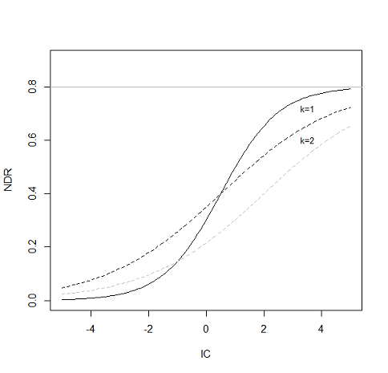

．．_ndr:

****************************
养分输送比（NDR）
****************************

总结
=======

InVEST的养分输送模型目标是绘制流域的养分来源及其向河流的输送。该空间信息可用于评价自然植被的养分持留服务。持留服务对分析地表水质量问题特别重要，可以从经济或社会方面予以重视，例如通过获得清洁饮用水而避免处理费用或改善水安全。

介绍
============

土地利用的变化，特别是向农业用地的转变，极大地改变了自然养分循环。人为养分来源包括点源污染，如工业废水或水处理厂排放，和非点源污染，如农业和居民区使用的肥料等。当下雨或下雪时，水流过地表，将污染物从这些表面带入小溪、河流、湖泊和海洋。这对人们产生了影响，直接影响到他们的健康或福祉(Keeler等，2012)，也对适应这些养分负荷能力有限的水生生态系统产生了影响。

减少非点源污染的一种方法是减少人为投入(即肥料管理)。当这种选择失败时，生态系统可以在污染物进入河流之前持留或降解污染物，从而提供净化服务。例如，植物可以通过将污染物储存在组织中或以另一种形式释放到环境中来去除污染物。土壤还能储存和捕获一些可溶性污染物。湿地可以长时间减缓水流，使污染物被植被吸收。河岸植被在这方面尤其重要，它们通常是污染物进入河流之前的最后一道屏障。

从政府机构到环保组织，土地使用规划者都需要有关生态系统对减轻水污染的贡献的信息。具体来说，它们需要关于养分输出和最高过滤区域的空间信息。养分输送和持留模型为非点源污染物提供了这一信息。该模型是为养分(氮和磷)设计的，但如果有关于感兴趣污染物的装载率和过滤率的数据，其结构可以用于其他污染物(持久性有机物、病原体等)。

模型
=========

概述
--------

该模型使用了简单的质量平衡方法，描述了大量养分物质在空间中的运动。与更复杂的养分模型不同，该模型不代表养分循环的细节，而是通过经验关系表示养分物质的长期稳态流动。整个景观的养分来源，也称为养分负荷，是根据土地利用/土地覆盖(LULC)地图和相关的负荷率确定的。养分负载可以分为沉积物结合部分和溶解部分，它们将分别通过地表和地下流动输送，当它们到达河流等水体时停止。注意，模拟地下流动是可选的;用户可以选择只模拟表面流。在第二步中，根据属于同一流动路径的像元的属性(特别是它们的坡度和LULC的持留效率)计算每个像元的输送因子。在流域/子流域出口，养分输送被计算为像元级贡献的总和。

|

NDR模型的概念。每个像元i由其养分负荷及其养分输送比(NDR)表征，NDR是上坡面积和下坡流动路径的函数(特别是LULC类型在下坡流动路径上的持留效率)。像元级输出是基于这两个因子计算的，流域水平的沉积物输出是像元级养分输出的总和。

养分负荷
--------------

负荷是与景观的每个像元相关的养分物质的来源。与出口系数文献一致(加州地区水质控制委员会中部海岸地区，2013;Reckhow等，1980年)，每一类LULC的负荷值是由养分输出的经验测量得出的(例如，养分从城市地区、作物等输出)。如果有关于养分施用量的信息(例如肥料、禽畜废物、大气沉降)，则可以通过估计像元上的养分使用量，并应用该修正因子来获得负荷参数。

接下来，修改每个像元的负载以考虑本地径流潜力。上面定义的基于LULC的负荷是该区域的平均值，但每个像元的贡献将取决于输送养分的径流量(Endreny和Wood,2003;Heathwaite等，2005)。载荷可以修改如下:

.. math:: modified.load_{x_i}=load_{x_i}\cdot RPI_{x_i}
   :label: ndr_modified_load

where :math:`RPI_i` is the runoff potential index on pixel :math:`i`, defined as:

.. math:: RPI_i = RP_i/RP_{av}
   :label: ndr_rpi

其中: RP_i是像元i上径流的养分径流代理， P_{av}是栅格RP上的平均值。这种方法与enreny和Wood(2003)开发的方法类似。在实践中，栅格RP被定义为流动指数(例如，InVEST季节性水产量模型)或降水。

对于每个像元，修改的负载可以分为沉积物结合和溶解的养分部分。从概念上讲，前者代表地表或浅层地下径流输送的养分，而后者代表地下水输送的养分。

．．注意::
  该模型只计算了氮的地下成分。地下磷没有建模，因为磷颗粒通常与沉积物结合，不太可能通过地下流输送。

这两种类型的养分来源之间的比例由参数“proportion\_subsurface\_n”给出，该参数量化了溶解的养分物质与养分物质总量的比例。对于像元i:

.. math:: load_{surf,i} = (1-proportion\_subsurface_i) \cdot modified.load\_n_i
   :label: ndr_surface_load
.. math:: load_{subsurf,i} = proportion\_subsurface_i \cdot modified.load\_n_i
   :label: ndr_subsurface_load

如果没有关于两种类型之间的划分的信息，建议“proportion\_subsurface\_n”的默认值为0，这意味着所有的养分物质都是通过表面流到达河流的。(注意，表面流动在概念上可以包括浅层地下流动)。然而，用户应该探究模型对该值的敏感性，以描述该假设引入的不确定性。

养分输送
------------------

养分输送基于养分输送比(NDR)的概念，该方法受到同行评审的沉积物输送比概念的启发(参见InVEST SDR用户指南章节和Vigiak等，2012年)。该概念类似于养分建模中流行的基于风险的指数方法(Drewry等.， 2011)，尽管它提供了养分输出的定量值(例如到达河流的养分负荷的比例)。计算了两种输送比，一种是地表流输送的养分，另一种是地下流输送的养分。

|
|

模型中养分传递的概念性表述。如果用户选择表示地下流量，则将每个像元上的负荷load_n分为两部分，总养分输出为地表贡献和地下贡献之和。

地表NDR
^^^^^^^^^^^

地表NDR是输送因子和地形指数的乘积，前者表示下坡像元在不持留的情况下输送养分的能力，后者表示在景观地形中的位置。对于像元i:

.. math:: NDR_i = NDR_{0,i}\left(1 + \exp\left(\frac{IC_0-IC_i}{k}\right)\right)^{-1}
   :label: ndr_surface

其中IC_0和k是标定参数，IC_i是地形指数，NDR_{0,i}是下坡像元未持留的养分比例(与像元在地形上的位置无关)。下面我们将详细介绍每个因子的计算方法。

NDR_{0,i}基于像元和溪流之间土地的最大持留效率(图1中为下坡路径):

.. math:: NDR_{0,i} = 1 - eff'_i
   :label: ndr_0

沿着流的路径移动，算法计算每个像元提供的额外持留，考虑到在每个LULC类型上行进的总距离。来自相同LULC类型的每一个额外像元将为总持留贡献一个更小的值，直到达到给定LULC的最大持留效率(图2)。总持留由沿流路径的LULC类型所能提供的最大持留值eff_{LULC_i}所限制。

数学表达如下:

.. math:: eff'_i =
    \begin{cases}
        eff_{LULC_i}\cdot(1-s_i) & \mathrm{if\ } down_i \mathrm{\ is\ a\ stream\ pixel}\\
        eff'_{down_i}\cdot s_i + eff_{LULC_i}\cdot (1 - s_i) & \mathrm{if\ } eff_{LULC_i} > eff'_{down_i}\\
        eff'_{down_i} & otherwise
    \end{cases}
  :label: ndr_eff

地点:

* eff'_{down_i}是直接从i向下倾斜的像元上的有效向下坡度持留，
* eff_{LULC_i}是LULC类型上i可以达到的最大持留效率，并且
* s_i是步长因子，定义为:

.. math:: s_i=\exp\left(\frac{-5 \ell_{i_{down}}}{\ell_{LULC_i}}\right)
   :label: ndr_s

其中:

* ell_{i_{down}}是从像元i到它相邻的下坡流路径的长度。这是两个像元质心之间的欧氏距离。
* ell_{LULC_i}是土地覆盖类型在像素i上的LULC持留长度(临界长度)。

注:

由于eff'_i依赖于向下倾斜的像元，因此在向上倾斜的像元可以计算之前，从直接流入流的像元开始递归地进行计算。

在公式[6]中，系数5是基于当达到其值的99%时其达到最大效率的假设(由于效率函数的指数形式，这意味着在有限的流道长度下不能达到最大值)。

|

由4像元草地和3像元森林组成的简单流动路径计算持留效率图。草地的每一个额外像元对草提供的最大效率贡献的百分比更小。指数曲线的形状是由最大效率和持留长度决定的。

|

连通性指数IC表示水文连通性，即像元上的养分到达河流的可能性。在该模型中，IC仅是地形的函数:

.. math:: IC=\log_{10}\left(\frac{D_{up}}{D_{dn}}\right)
   :label: ndr_ic

其中

.. math:: D_{up} = \overline{S}\sqrt{A}
   :label: ndr_d_up

同时

.. math:: D_{dn} = \sum_i \frac{d_i}{S_i}
   :label: ndr_d_dn

其中D_{up} = \overline{S}为上坡贡献区域的平均坡度(m/m)，A为上坡贡献区域(m\:sup: 2 \);d_i是第i个单元沿最陡下坡方向(m)的流道长度(详见泥沙模型)，S_i分别是第i个单元的坡度。

注：上坡贡献区和下坡径流路径采用多流向算法进行圈定。为了避免IC的无限值，根据数字高程模型，如果坡度值S小于这个阈值，则强制它们最小为0.005 m/m (Cavalli等人，2013年)。

IC_0的值为IC_0=\FRAC{IC_{max}+IC_{min}}{2}
这要求将NDR与IC关联的Sigmoid函数以IC分布的中值为中心，因此最大IC值为NDR=NDR_{max}。k设置为为默认值2 (参见SDR模型理论)；它是代表局部地形的经验因子。

NDR与连接指数IC的关系，NDR的最大值设置为NDR_{0}=0.8。通过设置k=1和k=2(分别为实线和虚线)，以及IC_0=0.5和IC_0=2(分别为黑色和灰色虚线)来说明校准的效果。

地下NDR
^^^^^^^^^^^^^^

地下NDR的表达式是一个简单的指数衰减，与河流的距离有关，稳定在与用户定义的最大地下养分持留相对应的值：

.. math:: NDR_{subs,i} = 1 - eff_{subs}\left(1-e^\frac{-5\cdot\ell}{\ell_{subs}}\right)
   :label: ndr_subsurface

其中

* eff_{subs}是通过地下流动可达到的最大养分持留效率(即由于土壤生化降解而产生的持留)，

* \ell_{subs}是地下流持留长度，即可以假设土壤以最大容量持留养分的距离，

* \ell_i是像元到流的距离。

养分输出
^^^^^^^^^^^^^^^

每个像元i的养分输出计算为负荷与NDR的乘积:

.. math:: x_{exp_i} = load_{surf,i} \cdot NDR_{surf,i} + load_{subs,i} \cdot NDR_{subs,i}
   :label: nutrient_export

每个用户定义的流域输出的总养分是该流域内所有像元贡献的总和:

.. math:: x_{exp_{tot}} = \sum_i x_{exp_i}
   :label: total_nutrient_export

规定的输出范围
^^^^^^^^^^^^^^^^^^^^^^^

NDR和其他几个模型输出是根据到流的距离(d_i)来定义的。因此，这些输出仅为排出到地图上的溪流(以及溪流的流域内)的像素定义。不输出到任何流的像素在这些输出中将没有数据。受影响的输出文件为:**d_dn.tif**, **dist_to_channel.tif**,**ic_factor.tif**,**ndr_n.tif**, **ndr_p.tif**, **sub_ndr_n.tif**,**n_surface_export.tif**,**n_subsurface_export.tif**, **n_total_export.tif**, and **p_surface_export.tif**。

如果你在这些输出中看到没有数据的区域，而不能用输入中的缺失数据来解释，这很可能是因为它们在水文上没有与地图上的河流连接。有关识别和修复此问题的信息，请参阅SDR定义区域章节 <sdr_defined_area>。

通过将流量累积栅格(**flow_accumulation.tif**)设置阈值流量累积(TFA)值来计算模型的流图(**stream.tif**)：

  .. math::
     :label: ndr_stream

     stream_{TFA,i} = \left\{\begin{array}{lr}
          1, & \text{if } flow\_accum_{i} \geq TFA \\
          0,     & \text{otherwise} \\
          \end{array}\right\}

限制
-----------

该模型参数较少，输出通常对输入具有较高的灵敏度。这意味着经验负荷参数值的误差将对预测产生很大影响。同样，持留效率值基于经验研究，影响这些值的因素(如坡度或年内变化)是平均的。这些值隐含地包含了受气候和土壤影响的主要养分动态信息。该模型还假设，一旦养分物质到达河流，它就会影响流域出口处的水质，没有捕捉河流内部的过程。最后，栅格分辨率对NDR公式的影响还没有得到很好的研究。

建议使用敏感性分析来调查输入参数的置信区间如何影响研究结论(Hamel等人， 2015)。

关于模型不确定性的更多细节，请参见“生物物理模型解释”部分。

评估养分持留服务
--------------------------------------

NDR模型没有直接量化景观上持留的养分量。但是，如果您有与当前条件进行比较的场景，则可以通过计算场景与当前条件之间的养分输出差来估计养分持留服务。这基于情景中土地覆盖/气候等的变化，量化了到达溪流的养分的差异，从而提供了一种评估对饮用水等下游使用影响的方法。

要在单个场景中计算每个像元的氮持留服务，我们建议从位于* intermediate *输出文件夹中的*MODIFIED_LOAD_n.tif*结果中减去*n_Total_export.tif*。同样，每个像元的磷持留服务可以通过从*Modified_Load_p.tif*中减去*p_Surface_export.tif*来计算。使用.gpkg输出来量化流域尺度的养分持留服务，方法是从氮的(*n_Surface_Load*+*n_subSurface_Load*)减去*n_Total_EXPORT*，从*p_Surface_Load*减去*p_Surface_EXPORT*。

养分持留服务的货币(或非货币)估值是非常具体的。关于为任何服务分配货币价值的一个重要注意事项是，估值应该只在经过校准和验证的模型输出上进行。否则，模型表示感兴趣区域的效果就不得而知了，这可能会导致对精确值的错误表示。如果模型尚未校准，则只应使用相对结果(如增加10%)，而不应使用绝对值(如1,523公斤或42,900美元)。

数据需求
==========

.. note:: *所有空间输入必须具有完全相同的投影坐标系* (以米为线性单位)，而不是地理坐标系(以度为单位)。

.. note:: 栅格输入可能有不同的单元格大小，应重新采样以匹配DEM的单元格大小。因此，所有模型结果都将具有与DEM相同的单元格大小。

该模型可以选择计算氮、磷或两者。你必须提供与所选养分相对应的输入。

- :investspec:`ndr.ndr workspace_dir`

- :investspec:`ndr.ndr results_suffix`

- :investspec:“ndr.ndr dem_path”请确保DEM通过填洼进行校正，并将输出的流图与该区域的水文图进行比较。为了确保正确的流动路径，DEM应该延伸到感兴趣的流域之外，而不是仅修剪到流域边缘。

- :investspec:`ndr.ndr lulc_path`

- :investspec:“ndr.ndr runoff_proxy_path”这个栅格可以定义为急流指数(例如季节性水产量<seasonal_water_yield>模型)或简单地定义为年降水量。即RP，将其归一化(除以其平均值)得到方程ndr_rpi中的径流潜力指数RPI。对于输入的单位没有特定的要求，因为在计算中使用之前，它会被模型归一化。

- :investspec:`ndr.ndr watersheds_path`

- :investspec:`ndr.ndr calc_n`
- :investspec:`ndr.ndr calc_p`

- :investspec:`ndr.ndr biophysical_table_path`

   列:

    - :investspec:`ndr.ndr biophysical_table_path.columns.lucode`
    - :investspec:`ndr.ndr biophysical_table_path.columns.load_[NUTRIENT]`

   .. note::
      负荷是与每个LULC类型相关的养分来源。这个值是来自所有源的总负荷。如果你想表示不同的施肥水平，你需要创建单独的LULC类，比如一个类叫做“作物-高肥料使用量”，另一个类叫做“作物-低肥料使用量”，等等。

   .. note::
      负荷值可以表示为养分施用量(例如肥料、禽畜废物、大气沉降);也可以表示为污染物的“广泛”量度，即代表一块土地对养分收支的贡献的经验值(例如城市地区、农作物等的养分输出)。在后一种情况下，应根据同一LULC的下坡像元的养分持留对负载进行校正。例如，如果测得的(或根据经验得出的)森林出口值为3千克/公顷/年，持留效率为0.8，则用户应在生物物理表的n_Load栏中输入15(千克/公顷/年)；模型将计算从森林像元流出的养分为15*(1-0.8)=3千克/公顷/年。

   - :investspec:`ndr.ndr biophysical_table_path.columns.eff_[NUTRIENT]` 给定植被类型的养分持留能力是以上坡的养分量的比例表示的。例如，所有的自然植被类型(如森林、天然牧场、湿地或草原)都有较高的值(0.6至0.8)，这表明60%-80%的养分被持留了下来。

   - :investspec:`ndr.ndr biophysical_table_path.columns.crit_len_[NUTRIENT]` 如果养分移动的距离小于持留长度，持留效率将小于最大值*eff_x*，然后呈指数衰减(参见养分输送部分)。

   - :investspec:`ndr.ndr biophysical_table_path.columns.proportion_subsurface_n` 默认情况下，这个值应该设置为0，表示所有养分物质都是通过表面流传递的。对于磷来说，则没有相关等效值。

   下面是一个生物物理表示例。在本例中，只评估了磷，因此包含了**load_p**、**eff_p**和**crit_len_p**。

    .. csv-table::
       :file: ../../invest-sample-data/NDR/biophysical_table_gura.csv
       :header-rows: 1
       :name: NDR Biophysical Table Example
       :widths: auto

   .. note::
      此示例和其余示例数据仅作为示例使用。您的LULC类型和相应的数据会有所不同。

- :investspec:`ndr.ndr threshold_flow_accumulation` 用于对DEM中的河流进行分类。这一阈值直接影响到水文连通性的表达和养分输出结果:当水流路径到达河流时，养分持留停止，输出的养分被假定到达集水口。仔细选择这个值是很重要的，这样建模的流就会尽可能接近现实。有关选择该值的更多信息，请参阅附录1。

- :investspec:`ndr.ndr k_param` The default value is 2.

- :investspec:`ndr.ndr subsurface_critical_length_n`

.. note::
  如果溶解氮的流动距离小于其地下临界长度，则持留效率将低于定义的地下最大持留效率值。将此值设置为小于像元大小的距离将导致仅在一个像元内达到最大持留效率。

- :investspec:`ndr.ndr subsurface_eff_n`

结果解读
--------------------

在下面的文件名中，“x”代表n(氮)或p(磷)，这取决于所模拟的养分物质。输出栅格的分辨率将与作为输入提供的DEM的分辨率相同。

* **Parameter log**:每次模型运行时，将在工作区中创建一个文本(.txt)文件。该文件将列出该运行的参数值和输出消息，并将根据服务、日期和时间命名。。当就模型运行中的错误联系NatCap时，请包含参数日志。

* **[Workspace]** folder:

   * **watershed_results_ndr.gpkg**:包含每个流域的养分模型聚合结果.dbf表包含每个流域的以下信息:

     * *p_surface_load*:流域中的总磷负荷(源)，即未经景观过滤的所有地表LULC的养分贡献之和。(单位：千克/年)
     * *n_surface_load*:流域总氮负荷(源)，即未经景观过滤的所有地表LULC的养分贡献之和。(单位：千克/年)
     * *n_subsurface_load*:流域总地下氮负荷。(单位：千克/年)
     * *p_surface_export*:流域通过地表径流输出的总磷。[单位：kg/年](公式: total_nutrient_export)
     * *n_surface_export*:流域通过地表径流输出的总氮。[单位：kg/年]( 公式:total_nutrient_export)
     * *n_subsurface_export*:通过地下径流从流域输出的总磷。[单位：kg/年]( 公式:total_nutrient_export)
     * *n_total_export*:通过地表和地下径流从流域输出的总氮。[单位：kg/年]( 公式:total_nutrient_export)

  * * * p_surface_export.tif**:像元级地图，显示每个像元最终有多少磷通过表面流到河流。[单位:kg/像元]( 公式: nutrient_export)
  * * * n_surface_export.tif**:像元级地图，显示每个像元最终有多少氮通过表面流到河流。[单位:kg/像元]( 公式: nutrient_export)
  * * * n_subsurface_export.tif**:像元级地图，显示每个像元最终有多少氮通过地下流到达河流。[单位:kg/像元]( 公式: nutrient_export)
  * * * n_total_export.tif**:像元级地图，显示每个像元最终有多少氮到达溪流(**n_surface_export.sum).Tif **和**n_subsurface_export.tif**)。[单位:kg/像元]( 公式: nutrient_export)

* **[Workspace]\\intermediate_outputs** 文件夹:

  * **crit_len_x.tif**:持留长度值，crit_len，可在生物物理表中找到
  * **d_dn.tif**:连通性指数的下坡度因子(Eq.: Eq: ndr_d_dn)
  * **d_up.tif**:连通性指数的上坡度因子(Eq.: Eq: ndr_d_up)
  * **dist_to_channel.tif**:从像元到流的平均下坡距离
  * **eff_x.tif**:养分x的原始景观覆盖物持留效率。
  * **effective_retention_x.tif**:下坡流动路径为每个像元提供的有效持留(Eq.: Eq: ndr_eff)
  * **flow_accumulation.tif**:由DEM创建的流量累加
  * **flow_direction.tif**:由DEM创建的流向
  * **ic_factor.tif**:连通性指数(Eq.: Eq: ndr_ic)
  * **load_x.tif**:每个像元的负载(地表输送)[单位:kg/年]
  * **modified_load_x.tif**:按径流代理指数表示的原始负荷。(单位:千克/年)
  * **ndr_x.tif**: NDR值(Eq.: Eq: ndr_surface)
  * **runoff_proxy_index.tif**:模型的径流代理输入的归一化值
  * **s_accumulation.tif**:养分输送部分IC方程的坡度参数
  * **s_bar.tif**:养分输送部分IC方程的坡度参数
  * **s_factor_inverse.tif**:养分输送部分IC方程的坡度参数
  * **stream.tif**:由DEM创建的流网络，0表示陆地像元，1表示流像元(Eq.: Eq: ndr_stream)。将此层与现实世界的流图进行比较，并调整阈值流量累积，使其与现实世界的流尽可能匹配。
  * **sub_load_n.tif**:地下输送含氮量[单位:kg/年]
  * **sub_ndr_n.tif**:地下氮NDR值
  * **surface_load_x.tif**:地上养分负荷[单位:kg/年]
  * **thresholded_slope.tif**:带坡度值的栅格，用于正确计算IC。
  * **what_drains_to_stream.tif**:像元中径流流入溪流的图。值为1意味着至少有一部分来自该像元的径流流到**stream.tif**中。值为0意味着它根本不输出径流到**stream.tif**中的任何溪流中。

用于估值的生物物理模型解释
----------------------------------------------

有些估值方法，例如依赖于污水处理厂水质变化的估值方法，对模型的绝对预测非常敏感。因此，重要的是要考虑与使用InVEST作为预测工具相关的不确定性，并尽量减少其对估值步骤的影响。

模型参数不确定性
^^^^^^^^^^^^^^^^^^^^^^^^^^^^^

输入参数的不确定性可以通过文献回顾来说明(例如，检查来自不同研究的值的分布)。评估参数不确定性影响的一种选择是使用文献中获得的参数范围进行局部或全局敏感性分析(Hamel et al.， 2015)。另参见Hamel和Bryant 2017，他们为评估生态系统服务分析中的不确定性提供了相关指导。

模型结构不确定性
^^^^^^^^^^^^^^^^^^^^^^^^^^^^^^

InVEST模型计算流域上的养分物质平衡，从总养分来源中减去养分物质损失(概念上由持留系数表示)。在相关的情况下，可以在模型中添加三个参数，从而区分地表和地下流动路径。在缺乏经验知识的情况下，建模者可以假设表面负荷和持留参数都代表了输送过程。鼓励对模型进行测试和校准，明确两个主要挑战:

养分输送方面的知识缺口:尽管有强有力的证据表明土地利用变化对养分输出的影响，但流域尺度动态建模仍然具有挑战性(Breuer等人，2008;Scanlon等人，2007)。因此，校准是困难的，如果没有深入的分析，就不建议进行校准(Hamel等人，2015)

点源污染的潜在贡献:家庭和工业废物通常是养分的一部分，在校准过程中应予以考虑(例如，将点源养分负荷添加到模拟的养分输出中，然后将其总和与观测数据进行比较)。

与观测数据比较
^^^^^^^^^^^^^^^^^^^^^^^^^^^

尽管存在上述不确定性，InVEST模型提供了养分持留过程的一级评估，并可与观测结果进行比较。用于模型验证的养分浓度时间序列应跨越一段较长的合理时间(最好至少10年)，以减弱年际变化的影响。时间序列在一年中也应该相对完整(没有明显的季节性数据差距)，以确保与年度总负载进行比较。如果观察到的数据也是养分浓度的时间序列，则需要将其转换为年负荷(LOADEST和FLUX32是促进这种转换的两个软件)。相关预测的方法和模型性能的其他细节可以在Redhead等人2018年的研究中找到。

如果在分析区域的溪流上有水坝，很可能它们持留了养分物质，这样养分物质就不会到达研究区域的出口。在这种情况下，在比较模型结果与观测数据时调整这种持留可能是有用的。这是美国东北部的一项研究中的一个例子，见Griffin等人（2020）。大坝持留方法在论文附录中描述，并且需要知道大坝的养分持留效率。

附录:数据来源
======================

:数字高程模型<dem>
------------------------------------

:土地利用/土地覆被<lulc>
---------------------------------

:流域< watersheds >”
------------------------------

:阈值流量累加<tfa>
----------------------------------------

养分径流代理
---------------------
可以使用流速指数(例如，来自InVEST季节产水量或其他模型)或年平均降水量。平均年降水量可以从现有的雨量计和遥感模型的全球数据集内插值，以考虑偏远地区。在考虑雨量计数据时，应确保它们能很好地覆盖感兴趣的区域，特别是在高程有较大变化导致AOI降水量不均匀的情况下。理想情况下，这些测量仪将拥有至少10年的连续数据，没有大的差距，与土地利用/土地覆盖地图所使用的时间周期大致相同。

如果没有实测数据，可以使用免费提供的全球数据集(如WorldClim (https://www.worldclim.org/)或气候研究单位(http://www.cru.uea.ac.uk))的粗略年降水量数据。

养分负荷
-------------
对于所有水质参数(养分负荷、持留效率和持留长度)，应参考当地文献，以得出本地化的值。NatCap养分参数数据库提供了关于养分负荷和持留效率的非详尽的本地参考列表:https://naturalcapitalproject.stanford.edu/sites/g/files/sbiybj9321/f/nutrient_db_0212.xlsx。Parn等人(2012)和Harmel等人(2007)对温带气候下的农业用地进行了很好的综述。

美国的排放系数(“广泛”措施，见数据需求)的例子可以在EPA PLOAD用户手册和Lin(2004)的一篇综述中找到。请注意，EPA指南中的示例是以磅/ac/年为单位，必须转换为千克/公顷/年。

持留效率
--------------------
从概念上讲，这个值表示从给定的LULC类型中可以预期的最大养分持留量。自然植被LULC类型(如森林、天然牧场、湿地或草原)通常被赋予较高的值(>0.8)。建议查阅当地文献并咨询水文学家，为该参数选择最相关的值。NatCap养分参数数据库提供了关于养分负荷和持留效率的非详尽的本地参考列表:https://naturalcapitalproject.stanford.edu/sites/g/files/sbiybj9321/f/nutrient_db_0212.xlsx。Parn等人(2012)对温带气候进行了有益的综述。河岸缓冲区效率的综述，虽然是LULC持留的一种特殊情况，但也可以以予考虑(Mayer等人，2007;Zhang等人，2009)。

持留长度:crit_len_n和crit_len_p
-------------------------------------------
该值表示达到最大持留效率所需的典型距离。在模型中引入它是为了去除对LULC栅格分辨率的任何敏感性。关于河岸缓冲区去除效率的文献表明，持留长度范围为10至300米(Mayer等人，2007;Zhang等人，2009)。在缺少非森林或草地的土地使用的本地数据的情况下，您可以简单地设置持留长度等于像元大小:这将导致仅在一个像元的距离内达到最大持留效率。另一种选择是将持留长度作为校准参数。在没有任何其他信息的情况下，从上述范围的中点(即150m)的值开始，然后在校准过程中上下变化该值，以找到一个合适的值。

参数:propor_subsurface_n, eff_sub, crit_len_sub
---------------------------------------------------------------------
这些数值用于高级分析，应与水文学家协商选择。Parn等人(2012)提供了淋滤和地表径流之间氮负荷分配的平均值。Mayer等人(2007)认为，植被缓冲的全球平均持留长度为200米，持留效率为80%。

参考文献
==========

Breuer, L., Vaché, K.B., Julich, S., Frede, H.-G., 2008. Current concepts in nitrogen dynamics for mesoscale catchments. Hydrol. Sci. J. 53, 1059–1074.

California Regional Water Quality Control Board Central Coast Region, 2013. Total Maximum Daily Loads for Nitrogen Compounds and Orthophosphate for the Lower Salinas River and Reclamation Canal Basin , and the Moro Cojo Slough Subwatershed , Monterey County, CA. Appendix F. Available at: https://www.waterboards.ca.gov/centralcoast/water_issues/programs/tmdl/docs/salinas/nutrients/index.html

Endreny, T.A., Wood, E.F., 2003. Watershed weighting of export coefficients to map critical phosphorous loading areas. J. Am. Water Resour. Assoc. 08544, 165–181.

Robert Griffin, Adrian Vogl, Stacie Wolny, Stefanie Covino, Eivy Monroy, Heidi Ricci, Richard Sharp, Courtney Schmidt, Emi Uchida, 2020. "Including Additional Pollutants into an Integrated Assessment Model for Estimating Nonmarket Benefits from Water Quality," Land Economics, University of Wisconsin Press, vol. 96(4), pages 457-477. DOI: 10.3368/wple.96.4.457

Hamel, P. & Bryant, B. (2017). Uncertainty assessment in ecosystem services analyses: Seven challenges and practical responses. Ecosystem Services, Volume 24. https://doi.org/10.1016/j.ecoser.2016.12.008.

Hamel, P., Chaplin-Kramer, R., Sim, S., Mueller, C., 2015. A new approach to modeling the sediment retention service (InVEST 3.0): Case study of the Cape Fear catchment, North Carolina, USA. Sci. Total Environ. 166–177.

Hamel, P., Guswa A.J. 2015. Uncertainty Analysis of the InVEST 3.0 Nutrient Model: Case Study of the Cape Fear Catchment, NC. Hydrology and Earth System Sciences Discussion 11:11001-11036. http://dx.doi.org/10.5194/hessd-11-11001-2014

Harmel, D., Potter, S., Casebolt, P., Reckhow, K., 2007. Compilation of measured nutrient load data for agricultural land uses in the United States 76502, 1163–1178.

Heathwaite, A.L., Quinn, P.F., Hewett, C.J.M., 2005. Modelling and managing critical source areas of diffuse pollution from agricultural land using flow connectivity simulation. J. Hydrol. 304, 446–461.

Keeler, B.L., Polasky, S., Brauman, K.A., Johnson, K.A., Finlay, J.C., Neill, A.O., 2012. Linking water quality and well-being for improved assessment and valuation of ecosystem services 109, 18629–18624.

Lin, J.., 2004. Review of published export coefficient and event mean concentration (EMC) data, WRAP Technical Notes Collection (ERDC TN-WRAP-04-3). Vicksburg, MS.

Mayer, P.M., Reynolds, S.K., Mccutchen, M.D., Canfield, T.J., 2007. Meta-Analysis of Nitrogen Removal in Riparian Buffers 1172–1180.

Pärn, J., Pinay, G., Mander, Ü., 2012. Indicators of nutrients transport from agricultural catchments under temperate climate: A review. Ecol. Indic. 22, 4–15.

Reckhow, K.H., Beaulac, M.N., Simpson, J.T., 1980. Modeling Phosphorus loading and lake response under uncertainty: A manual and compilation of export coefficients. EPA 440/5-80-011. US-EPA, Washington, DC.

Redhead, John W.; May, Linda; Oliver, Tom H.; Hamel, Perrine; Sharp, Richard; Bullock, James M.. 2018 National scale evaluation of the InVEST nutrient retention model in the United Kingdom. Science of the Total Environment, 610-611. 666-677. https://doi.org/10.1016/j.scitotenv.2017.08.092

Scanlon, B.R., Jolly, I., Sophocleous, M., Zhang, L., 2007. Global impacts of conversions from natural to agricultural ecosystems on water resources: Quantity versus quality. Water Resour. Res. 43.

Tarboton, D., 1997. A new method for the determination of flow directions and upslope areas in grid digital elevation models. Water Resour. Res. 33, 309–319.

Vigiak, O., Borselli, L., Newham, L.T.H., Mcinnes, J., Roberts, A.M., 2012. Comparison of conceptual landscape metrics to define hillslope-scale sediment delivery ratio. Geomorphology 138, 74–88.

Zhang, X., Liu, X., Zhang, M., Dahlgren, R. a, Eitzel, M., 2009. A review of vegetated buffers and a meta-analysis of their mitigation efficacy in reducing nonpoint source pollution. J. Environ. Qual. 39, 76–84.

