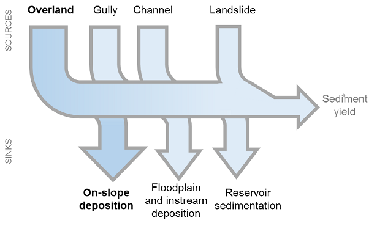

.. _sdr:

****************************
SDR: 泥沙输移比例模型
****************************

概要
=======

InVEST模型泥沙输移比例模块（SDR）的作用是描述坡面土壤侵蚀和流域输沙空间过程。全球范围的水文观测站对径流产沙量变化的监测，对河流水质控制和水库管理具有重大意义（UNESCO，2009）。水资源管理者十分重视自然景观防止泥沙淤积的生态系统服务功能，了解流域泥沙来源和输移过程有利于决策者制定减少径流含沙量的战略和措施，有利于下游农业灌溉、给水处理、水上游憩、水库生产的良性运转。这些影响可以通过将InVEST SDR模型的输出结果与缓解成本、替代成本或支付意愿等信息结合起来进行经济评估。

SDR模型近期变化
===============================

InVEST 3.12.0 版对SDR模型进行了几处重大修改，以提高其可用性、透明度和准确性。这里总结了这些变化，并在本章的相关章节和方程中进一步描述。

* 术语 "deposition" 已改为 "trapping", 中间参数 :math:`R` 已改为 :math:`T`,以避免与USLE中使用的R因子相混淆。

* 中间参数 :math:`R` (先更新为 :math:`T`, trapping) and :math:`F` (flux) 的计算已更新。之前, :math:`R` 和 :math:`F` 的计算方法是，从一个栅格单元中侵蚀出来的沉积物（根据修订的通用土壤损失方程式RUSLE计算）可以被同一栅格单元上的植被捕获。这在概念上是不一致的：植被对于减少侵蚀和径流沉积物的作用已经体现在RUSLE的C因子中（Wischmeier and Smith，1978）。如果允许在同一栅格单元上立即捕获沉积物，这相当于重复计算植被的作用。在更新的计算中，所有从一个栅格单元中侵蚀出来的沉积物都会流向下一个下坡的栅格单元，在那里它可以被截留或者继续向下流动。*相对于以前的模型表述，这一变化不会影响对任何特定情况下的水质估计。然而，它将导致在景观上提供泥沙滞留服务的地方归属发生一些变化*。

* 增加了两个新的输出结果("避免侵蚀" 和 "避免输沙"), 明确地量化了景观的泥沙滞留服务。以前，不清楚哪一个输出结果或输出结果的组合应被用于评价生态系统服务。

* 两个沉积物滞留指数已被删除(*sed_retention.tif* 和 *sed_retention_index.tif*)。这些只是指数（而没有量化），它们的效用并不明确，特别是在新输出结果的背景下。

简介
============

流域土壤侵蚀和坡面径流泥沙淤积是决定径流含沙量的自然过程。集水区尺度的
泥沙动力学过程的影响因素主要包括气候（尤其是降雨强度），土壤，地形地貌，植被，及农业生产大坝修筑和运营等人类活动。河流泥沙的主要来源包括流域地表侵蚀（土壤颗粒在降雨和地表径流的作用下起动、沉降的过程），上游河槽冲刷（地表径流占据的河谷谷底部分），河岸侵蚀，以及重力侵蚀（或滑坡侵蚀，详见Merrit，2003）。河流泥沙淤积类型见图1，包括坡面径流泥沙沉降，河漫滩沉积或河道沉积，以及水库淤沙。土地利用类型变更和国土空间管理变化对集水区土壤侵蚀量具有重大影响，影响程度取决于：（1）主要土壤侵蚀类型（土地利用变化对地表侵蚀的集水区影响较大）；（2）泥沙来源和淤积空间分布（如，植被覆盖有利于保水保沙，土地利用变化影响较小）。

InVEST SDR 模型只关注陆上侵蚀，不模拟沟渠、河岸或大规模侵蚀。该模型的输出包括在年度时间范围内输送到河流的泥沙沉积物，以及在集水区侵蚀的泥沙量和由植被和地形特征保留的泥沙量。请注意，SDR只产生生物物理结果。对于泥沙滞留服务的估值，适当的估值方法将在很大程度上取决于特定的应用、背景和受益人，并且需要独立于 InVEST 来实施。参见用户指南部分:ref:`quantitative-valuation` 以获得更多指导。

|
|

图1. 集水区泥沙输移与计算过程，箭头相对大小变化取决于环境特征。InVEST模型着重分析地表过程。

模型
=========

输沙运移
-----------------

输沙运移模块是在输入DEM数据的空间分辨率基础上生成集水区产沙的空间分布。
模型首先计算出每个栅格单元土壤侵蚀泥沙量，然后计算泥沙输移比（SDR），即到达集水区出口断面的泥沙量占上游水土流失泥沙总量的比例系数。该方法自2008年Borselli等提出以来得到广泛应用（Cavalli等2013；López-vicente等，2013；Sougnez等，2011）。更多关于模型讨论参见用户手册 `differences-SDR-Borselli`。

年土壤侵蚀量
^^^^^^^^^^^^^^^^

栅格单元的每年土壤侵蚀总量:math:`i`, :math:`usle_i` (单位: :math:`tons\cdot ha^{-1} yr^{-1}`), 计算公式为修正通用土壤流失方程 (RUSLE1 - Renard et al. 1997):

.. math:: usle_i=R_i\cdot K_i\cdot LS_i\cdot C_i\cdot P_i,
   :label: usle

式中

 * :math:`R_i` 表示降水侵蚀性因子 (单位: :math:`MJ\cdot mm (ha\cdot hr\cdot yr)^{-1})`,

 * :math:`K_i` 表示土壤可侵蚀性因子 (单位: :math:`ton\cdot ha\cdot hr (MJ\cdot ha\cdot mm)^{-1}`),

 * :math:`LS_i` 表示坡度坡长因子 (无量纲)

 * :math:`C_i` 表示植被覆盖和作物管理因子 (无量纲)

 * :math:`P_i` 表示水土保持措施因子（Renard等，1997；Bhattarai and Dutta，2006） (无量纲)

:math:`LS_i` 坡度坡长因子的计算使用Desmet和Govers（1996）的二维地表计算方法： 

.. math:: LS_i=S_i \frac{(A_{i-in}+D^2)^{m+1}-A_{i-in}^{m+1}}{D^{m+2}\cdot x_i^m\cdot (22.13)^m}
    :label: ls

式中

 * :math:`S_i` 表示栅格单元坡度因子 :math:`i` 为关于坡度值的函数 :math:`\theta`

   .. math::

      S = \left\{\begin{array}{lr}
        10.8\cdot\sin(\theta)+0.03, & \text{where } \theta < 9\% \\
        16.8\cdot\sin(\theta)-0.50, & \text{where } \theta \geq 9\% \\
        \end{array}\right\}

 * :math:`A_{i-in}` 表示栅格径流入口以上产沙区域面积 (:math:`m^2`) 由多流向算法计算得出

 * :math:`D` 表示栅格尺寸 (:math:`m`)

 * :math:`x_i` 表示泥沙输移比例的加权平均值 :math:`i` 通过多流向算法计算。计算公式为

   .. math:: x_i = \sum_{d\in{\{0,7\}}} x_d\cdot P_i(d)

   式中:math:`x_d = |\sin \alpha(d)| + |\cos \alpha(d)|`, :math:`\alpha(d)` 是 :math:`d` 的输沙方向, and :math:`P_i(d)` 是栅格单元 :math:`i` 在方向 :math:`d` 上的总输沙比例。

 * :math:`m` 表示RUSLE长度指示因子。

为正确计算坡长坡度因子，长坡的长度应小于122米（Desmet和Govers，1996；
Renard 等，1997）。

长度指数因子 :math:`m` 建立在经典通用土壤侵蚀方程USLE长度指数因子体系上，具体规定如下（Oliveira等，2013）:

.. math::

   \begin{align*}
   m &=  \left\{\begin{array}{lr}
      0.2, & \text{where } \theta \leq 1\% \\
      0.3, & \text{where } 1\% < \theta \leq 3.5\% \\
      0.4, & \text{where } 3.5\% < \theta \leq 5\% \\
      0.5, & \text{where } 5\% < \theta \leq 9\% \\
      \beta / (1 + \beta), & \text{where } \theta > 9\%
   \end{array}\right\} \\
   \\
   \beta &= \frac{\sin\theta / 0.0896}{3\sin\theta^{0.8} + 0.56}
   \end{align*}

泥沙输移比
^^^^^^^^^^^^^^^^^^^^^^^

**步骤 1.** 根据Borselli等人（2008）的研究成果，模型首先计算出空间关联指数(:math:`IC`)。空间关联指数描述了沉积物源（来自景观）和汇（如溪流）之间的水文联系。 :math:`IC` `的值越高，说明从上坡栅格单元侵蚀的泥沙有更大的部分被输送到下坡溪流中（即空间关联性更强）。当沉积物源和汇之间的坡度陡峭、距离短或植被稀少时，通常会出现高连接性。:math:`IC` 的值较低时（即较低的空间关联性）与较多的植被区和较缓的坡度有关。

:math:`IC` 是每个栅格单元的上坡面积 (:math:`D_{up}`) 和栅格单元与最近溪流之间的流动路径(:math:`D_{dn}`). 如果上坡地区面积大，坡度小，植被好(USLE的C因子低), :math:`D_{up}` 的值将会较低, 表示泥沙进入溪流的可能性较低。同样，如果栅格单元和河流之间的下坡路径很长，坡度较低，植被覆盖良好，那么 :math:`D_{dn}` 的值将会较低。

:math:`IC` 的计算公式入下:

.. math:: IC=\log_{10} \left(\frac{D_{up}}{D_{dn}}\right)
    :label: ic

.. figure:: ./sdr/connectivity_diagram.png

图 2. 模型使用概念方法。每个栅格单元的泥沙输移比（SDR）是上坡面积和下坡流动路径之间的函数。|

坡度因子 :math:`S_{th}` 和植被覆盖和作物管理因子 :math:`C_{th}` 的阈值永远计算 :math:`D_{up}` 和 :math:`D_{dn}`。设定一个下限以避免 :math:`IC` 的无限值。上限也适用于坡度，以限制由于陡坡上的 :math:`IC` 值非常高而产生的偏差 (Cavalli et al., 2013)。

.. math::
   :label: threshold_slope

   S_{th} = \left\{\begin{array}{lr}
        0.005, &\text{for } S<0.005\\
        S,     &\text{for } 0.005\leq S\leq 1\\
        1,     &\text{for } S>1
        \end{array}\right\}

.. math::
   :label: threshold_c

   C_{th} = \left\{\begin{array}{lr}
        0.001, & \text{for } C<0.001\\
        C,     & \text{otherwise}\\
        \end{array}\right\}

:math:`D_{up}` is the upslope component defined as:

.. math:: D_{up}=\bar{C}_{th}\bar{S}_{th}\sqrt{A}
    :label: d_up

式中 :math:`\bar{C}_{th}` 是坡上产沙区域 :math:`C` 的平均阈值， :math:`\bar{S}_{th}` 表示坡上产沙区域坡度 (:math:`m/m`) 。:math:`A` 表示坡上产沙区域面积 (:math:`m^2`)。 利用多流向算法生成坡上产沙区域。

:math:`D_{dn}` 表示该点坡下土壤淤积量，计算公式为：

.. math:: D_{dn}=\sum_i\frac{d_i}{C_{th, i} S_{th,i}}
    :label: d_dn

式中 :math:`d_i` 表示按水流方向计算的栅格单元坡长 (:math:`m`)，水流必定沿最陡方向运动（见图2), :math:`C_{th, i}` 和 :math:`S_{th, i}` 分别表示栅格单元植被覆盖和作物因子𝐶和坡度。同样，利用多流向算法生成坡上产沙区域。

**步骤2** 栅格:math:`i` 中的泥沙输移比（SDR）可以通过如下the conductivity index :math:`IC` 指数计算 (Vigiak et al., 2012):

.. math:: SDR_i = \frac{SDR_{max}}{1+\exp\left(\frac{IC_0-IC_i}{k}\right)}
    :label: sdr

式中 :math:`SDR_{max}` 表示理论最大SDR值,为平均值0.8 (Vigiak et al., 2012), :math:`IC_0` 和 :math:`k` 为定义SDR-IC 关系的校准参数 (递增函数)。 :math:`IC_0` 和 :math:`k` 与SDR的关系如下图所示：

.. figure:: ./sdr/ic0_k_effect.png

图3. 空间连接指数 IC 和泥沙输移比 SDR 相互关系。𝑆𝐷𝑅最大值设定为 :math:`SDR_{max}=0.8`, 校准参数 :math:`k_b=1` 和 :math:`k_b=2` (分别表示实线和虚线）；:math:`IC_0=0.5` 和:math:`IC_0=2` (分别为黑色和灰色虚线）。
|

输沙量
^^^^^^^^^^^^^^^

栅格单元 :math:`i`中输沙量 :math:`E_i` (单位: :math:`tons\cdot ha^{-1} yr^{-1}`),就是从栅格处被侵蚀的沉淀物最终到达了河流的量。计算公式如下：

.. math:: E_i=usle_i\cdot SDR_i
    :label: e_i

集水区输沙总量 :math:`E` (单位: :math:`ton\cdot ha^{-1} yr^{-1}`) 的计算公式如下：

.. math:: E=\sum_i E_i
    :label: e

计算集水区输沙总量:math:`E` 作用：与其他可用泥沙淤积数据相结合对模型进行验证和校准。

坡下捕获的沉积物
^^^^^^^^^^^^^^^^^^^^^^^^^^^

该模型还估算了从源头向下坡的流道中被捕获(沉积/保留)的泥沙数量，因此，泥沙被侵蚀并从栅格中输出，但没有到达河流。了解这一数量的空间分布将使用户能够跟踪栅格上泥沙的净变化(增加或减少)，从而为土地退化指数提供信息。

从栅格 :math:`i` 输出到河流中的沉积物用:eq:`e_i` 表示。USLE的质量平衡的另一个组成部分是没有到达河流的沉积物。这些沉积物一定是被滞留在沿着流向河流的路径的景观上的某个地方，计算如下

.. math:: E'_i=usle_i (1-SDR_i)
    :label: eprime

由于SDR的计算性质，:math:`E_i` 已经考虑到下坡水流路径和过滤泥沙的生物物理特性。因此我们可以独立于:math:`E'_i` 进行建模。

为了做到这一点，我们假设 :math:`E_i` 和在整个景观中具有以下属性:

**属性A**: SDR沿下坡流道线性增加。随着下坡流道的追踪，SDR 的值将线性增加，因为下坡流道的距离减少了。需要注意的是，在数字上有一种可能性，即一个下坡栅格的SDR值与一个上坡栅格相同。在这种情况下，其含义是，沿该阶梯没有发生栅格上的沉积物捕获。

**属性B**: 边界河流栅格上的所有非输出沉积物都由该栅格保留。如果像素:math:`i`直接流向溪流，就没有机会对:math:`E_i`进一步进行下坡过滤。由于:math:`E_i`是:math:`E'_i`的倒数，其含义是上坡流量（定义为:math:`F_i`）一定被捕获在该像素上。

考虑到这两个属性，我们可以看到:math:`E_i` 保留在一个栅格上的数量必须是一个函数:

 * 从栅格:math:`i` 到它的下坡栅格的SDR值的绝对差异。
 * 下坡SDR值在数值上与1.0（流道栅格）的接近程度。

这些机理可以作为像素:math:`i` 的SDR值与它的下坡SDR对应物的差值与理论上最大下坡SDR值1.0的差值的线性插值来捕获。

.. math:: dT_i=\frac{\left(\sum_{k \in \{directly\ downslope\ from\ i\}}SDR_k\cdot p(i,k)\right) - SDR_i}{1.0-SDR_i}
    :label: dti

:math:`T` 代表沉积物捕获。在 :math:`dT_i` 中的 :math:`d` 表示一个增加量插值， :math:`p(i,k)` 是从栅格 :math:`i` 到栅格 :math:`k` 的流量比例。 这种表示法是为了调用:math:`Ti` 的导数。注意边界条件得到满足:

 * 在属性A情况下(其中下坡 :math:`\left(\sum_{k \in \{directly\ downslope\ from\ i\}}SDR_k\cdot p(i,k)\right)=SDR_i`), :math:`dT_i=0` 表示没有 :math:`F_i` 被保留在栅格上。
 * 在属性B情况下 (下坡 :math:`SDR_k=1` because it is a stream) :math:`dT_i=1` 表示 :math:`F_i` 保留在栅格上。

现在，我们使用:math:`dT_i` 定义流道中任何栅格上保留的泥沙通量，作为上坡通量的加权:

.. math:: T_i=dT_i\cdot\left(\sum_{j\in\{pixels\ that\ drain\ to\ i\}}F_j \cdot p(i,j)\right)
    :label: ti

式中 :math:`F_i` 表示未达到河流的输沙量，定义为:

.. math:: F_i=(1-dT_i)\cdot(\left(\sum_{j\in\{pixels\ that\ drain\ to\ i\}} F_j \cdot p(i,j)\right) + E'_i)
    :label: fi

|  
|  

.. figure:: ./sdr/SDR_connectivity_indices.png
   :scale: 25 %

图 4. 说明相关的沉积物侵蚀和沉积过程，它们在空间上的相互联系，以及它们在模型中的表现。在没有植被的情况下，一个栅格可能被侵蚀的最大泥沙量被定义为USLE值（RKLS）。该值与土地覆盖和管理下的实际侵蚀量（RKLSCP）之间的差异表明这些地方因素对避免侵蚀的作用。在离开一个栅格（RKLSCP）的泥沙中，只有一部分（SDR）到达下坡溪流。其余的（:math:`RKLSCP*(1-SDR)`）被保留在下游的栅格上。因此，植被的作用是双重的：（1）避免局部侵蚀；（2）截留上坡的泥沙。底部的方框表示侵蚀的沉积物的潜在去向。

|  
|  

生态系统服务指标
^^^^^^^^^^^^^^^^^^^^^^^^^^^^

景观提供的控制侵蚀的潜在生态系统服务可通过两种方式量化: 

* **避免侵蚀** - 植被对减少侵蚀的贡献。换句话说，首先要重视避免侵蚀发生的植被。这可用于从当地土壤流失的角度量化生态系统服务。计算公式为

.. math:: AER_i = RKLS_i - USLE_i
    :label: aer_i

式中 :math:`AER_i` 是栅格 :math:`i`上避免的侵蚀量, :math:`RKLS_i` 和 :math:`USLE_i` 之间的区别代表植被和良好管理实践的好处，因为RKLS相当于USLE减去C和P因子。

* **避免输沙** - 植被对减少栅格侵蚀的贡献，以及捕获来自上坡的沉积物，使它们都不会向下进入河流。这也可以被认为是保留在栅格上的总沉积物。*避免输沙* 表示从下游角度考虑生态系统服务，计算为

.. math:: AEX_i = (RKLS_i - USLE_i) \cdot SDR_i + T_i
    :label: aex_i

式中 :math:`AEX_i` 是该栅格提供的总泥沙沉积量，包括栅格内侵蚀源和上坡侵蚀源。通过滞留这些沉积物，它有助于减少流向河流的沉积物。与*避免侵蚀*一样， :math:`RKLS_i` 和:math:`USLE_i` 之间的差异表示植被和良好管理实践的好处，并将其乘以泥沙输送比:math:`SDR_i` 量化了未进入河流的侵蚀量。最后，:math:`T_i` 是被滞留在栅格上的上坡沉积物量，也防止它进入河流。

有关这些指标的更多信息，请参见以下部分：ref:`evaluating_sed_ret_services`.

可选排水层
^^^^^^^^^^^^^^^^^^^^^^^^^^^^^^^^^^^
模型的径流分布是计算的径流图层和输入排水层(如果提供)的联合。
该模型通过阈值流量累积(TFA)值对流量累积栅格(**flow_accumulation.tif**)进行阈值处理，计算出一个径流图层(**stream.tif**): 

  .. math::
     :label: sdr_stream

     stream_{TFA,i} = \left\{\begin{array}{lr}
          1, & \text{if } flow\_accum_{i} \geq TFA \\
          0,     & \text{otherwise} \\
          \end{array}\right\}

如果提供了可选排水层，则模型包含它 (**stream_and_drainage.tif**):

  .. math:: stream_{drainage,i} = stream_{TFA,i} \text{  OR  } stream_{input,i}
     :label: stream_and_drainage

最终图层(:math:`stream_{TFA}`, 或 :math:`stream_{drainage}` 如果提供了可选排水层) 用于确定 :math:`d_i` (到河流的距离) 用于SDR计算。

受交通道路影响，天然河道有可能被迫改道，这些区域由地形地貌决定的空间连
接指数不能反映真实情况。比如，城市和道路附近的泥沙可能大多数会被降雨带进河道。可选的排水层表示与径流输沙相关的交通道路栅格，无论其具体位置（如，与水系的距离）。排水层栅格的处理方式同水系栅格图一致；即输沙运移过程在排水层停止，相应淤积的产沙量纳入输沙总量计算。

.. _sdr_defined_area:

指定产沙区域
^^^^^^^^^^^^^^^^^^^^^^^

SDR和其他几个模型输出是根据到河流的距离 (:math:`d_i`)定义的。因此，这些输出仅定义为流向地图上的河流的栅格(因此在河流的分水岭内)。没有引流到任何河流的栅格将在这些输出中具有NoData值。受影响的输出文件为: **d_dn.tif**, **ic.tif**, **e_prime.tif**, **sdr_factor.tif**, **sediment_deposition.tif**, **avoided_erosion.tif**, and **sed_export.tif**.

如果在这些输出中看到无法用输入中缺失的数据解释的NoData区域，很可能是因为它们在水文上没有与地图上的河流相连。如果您的DEM有错误，或地图边界没有扩展到足够远的范围以包括该流域的河流，或者如果您的阈值流量累积值过高，无法识别河流，就可能发生这种情况。您可以通过检查中间输出**what_drains_to_stream.tif**来确认这一点，该输出指示哪些栅格是河流。检查输出(**stream.tif**)，并确保它与现实世界中的河流尽可能紧密地对齐。有关更多信息，请参见本用户指南的:ref:`working-with-the-DEM` 部分。

**示例:** 下面是一个例子，说明阈值流量积累对确定范围的影响，在一个有多个流域，但在水文上没有连接的地区。在地图区域内，你可以看到一个从西北流向东南的连通的溪流网络，以及沿着地图右侧被切断的3条溪流。在下面的示例映射中，顶部显示河流(**stream.tif** 来自SDR的输出)，而底部显示SDR (**sdr_factor.tif**)。

在左列中，TFA值为100，表示左下和右上流域都存在河流。SDR栅格在所有定义输入的地方都有定义，除了右边缘的一小块不引流到任何流之外。

在右列中，TFA值为1000，右上角的分水岭中根本没有任何河流。因此，该分水岭中的像素不会引流到任何流，相应的SDR栅格在该区域中是未定义的(nas values of NoData)。

.. figure:: ./sdr/example_different_tfa_effects.png
   :scale: 50 %

图 5. 阈值流量累积参数对输出映射范围影响的示例。

限制
-----------

 * 模型使用通用土壤流失方程USLE（Renard等，1997）。USLE方程应用范围广 泛，其坡度因子计算预测建立在缓坡资料上，主要用来预测不同作物系统的片 蚀、沟蚀和沟间侵蚀而不能用来预测沟谷侵蚀，河岸侵蚀和重力侵蚀。Wilkinson 等（2014）对沟谷侵蚀和河岸侵蚀做了详细描述，并提供了可行的建模方法。大规模移动(滑坡)没有在模型中表示，但在某些地区或在某些土地使用变化(如道路建设)下，可能是一个重要的来源。

 * 推论一：对生态系统服务（及所有后效评价）的影响评价应当包括模型中不同 泥沙来源占泥沙收支平衡的相对比例(详见 :ref:`evaluating_sed_ret_services`).

 * 推论二： USLE方程作为针对美国地区土壤流失的经验公式，诸多研究案例证 明其在其他地区适用范围有限——即便是只针对片蚀和沟蚀（REF）。根据当地 实际情况，用户可以结合区域研究成果，通过适当调整R因子，K因子，C因子，P因子取值，修正模型土壤流失方程（Sougnez等，2011）

 * 模型结果受非物理参数k和IC0影响很大。许多关于InVEST模型使用的建模方法的最新研究（Cavalli等，2013；Lopez-vicente等，2013 Sougnez等，2011；Vigiak等，2012）提供了该参数的设置指导，但进行模型结果绝对值分析时，用户应该了解这个限制因素。

 * 使用简化模型和较少参数进行分析时，输出结果受大多数输入指标的影响非常 大。因在USLE方程的经验参数误差会对预测结果有很大影响。建议使用模型 敏感性分析，以便查明输入参数的置信区间如何影响研究结论。

.. _differences-SDR-Borselli:

InVEST泥沙输移比模型对Borselli等（2008）方法的改进
------------------------------------------------------------------------------------------------------

该InVEST的泥沙输移比 SDR模型基于水文过程空间联系过程概念， Borselli等人（2012）为此提出了相关参数。该方法优点是：所需参数较少，能够使用全球已有数据，且为空间直观描述。在对比研究中，Vigiak等（2012）认为该方法具有以下特点："（1）预测产沙过程的巨大进步，（2）易于实现和推广，（3）各尺度相互独立，（4）能够使用公式描述景观变量和地形学与沉积学空间联系概念之间的关系"。该方法也适用于预测土地利用变化影响（Jamshidi等，2013）。

InVEST模型和Borselli模型的主要区别如下： 

 * USLE方程的C因子作为权重系数（其它研究使用不同公式，例如，基于高分辨 率DEM数据的粗糙度指数（Cavalli等，2013））。

 * Borselli等使用的:math:`SDR_{max}` 参数设置为默认值0.8，以减少参数数量。Vigiak等（2012）提出:math:`SDR_{max}` 最大值应定义为比粗砂更细的表土土壤颗粒粒径(<1 mm)。

.. _evaluating_sed_ret_services:

生态系统减少泥沙淤积服务评价
======================================

生态系统减少泥沙淤积服务
---------------------------

为了评估你感兴趣地区的减少泥沙淤积服务，提供了两项结果: 

* **避免侵蚀** (avoided_erosion.tif) - 植被对减少侵蚀的贡献。换句话说，首先要重视不允许侵蚀发生的植被。这从当地土壤流失的角度表明了生态系统服务，例如，在表土保持很重要的农业地区。

* **避免输沙** (avoided_export.tif) - 植被对避免侵蚀的贡献，以及对来自上坡的沉积物的捕获，使它们都不会向下坡进入河流。这也可以被认为是保留在栅格上的总沉积物。*避免输沙* 表示从下游用水用户的角度来看的生态系统服务，他们将受益于将沉积物排除在他们用于饮用、水力发电或其他用途的河流之外。

*avoided_erosion.tif* 和 *avoided_export.tif* 指标可用于识别景观中捕获/保留泥沙的地方，这些地方支持当地土壤资源和下游水质。这些信息可以告知保护工作的重点在哪里，这样这些服务就可以保留到未来。然而，重要的是要注意，更多的侵蚀将保留在产生更多侵蚀的地方。因此，单纯地关注保护高保留区并不一定能解决首先产生侵蚀的地方。*USLE.tif* 输出可以通过显示流域中土壤流失最多的地方来补充这一点；*sed_export.tif* 输出显示了哪些区域向河流贡献了最多的泥沙。这些地点可能有助于目标恢复或改善土地管理。

如果您有与当前条件比较的场景，您也可以通过取场景与当前条件之间的泥沙*export*差来量化减少泥沙淤积服务。基于土地覆盖/气候等的变化，它量化了侵蚀到达河流的差异。这提供了一种评估下游用途(如水库和饮用水)影响的方法。

度量泥沙输移变化对人类福祉的生物物理学影响很大程度上取决于决策环境。土壤侵蚀，悬浮泥沙含量和泥沙沉积对同一小流域的不同人类群体可能同时产生积极和消极影响（Keeler等，2012）。举例来说： 

 * 水分和养分容持能力降低，导致土壤肥力下降
 * 市政饮用水供应的水处理成本提高
 * 湖水浑浊，景观娱乐价值降低
 * 总悬浮固体增加，影响人类健康和水生生物种群的分布
 * 水库淤泥，水电减产，清淤和管理成本增加减
 * 海港泥沙淤积，要求相应防淤减淤措施以维护港口功能

评估这项服务需要在景观中找到相关受益者，并将他们与有助于避免侵蚀或避免出口(或改变泥沙出口)的地方联系起来。举个例子，对于点受益者，如饮用水提取，一种方法是创建排水到该点位置的分水岭(使用:ref:`delineateit` 这样的工具)，然后在该分水岭内对避免的输出输出栅格(或泥沙输出的变化，如果使用场景)进行相加。参见Mandle等人(2015)和Mandle等人(2017)的两个使用这种方法的例子。

.. _quantitative-valuation:

定量评估
----------------------

关于为任何服务分配货币价值的一个重要注意事项是，估值应该只在经过校准和验证的模型输出上进行。否则，就不知道模型如何很好地表示感兴趣的区域，这可能导致对准确值的错误表示。如果没有对模型进行校准，就只能使用相对结果(如增加10%)，而不能使用绝对值(如1523吨，4.29万美元)。有关灵敏度测试和校准的更多信息，请参见下面章节:ref:`comparison_with_observations` 。

小流域尺度的泥沙滞留
^^^^^^^^^^^^^^^^^^^^^^^^^^^^^^^^^^^^^^^^^^^^

从估值的角度来看，一个重要的指标是不同场景的留存或输出的差异。对于泥沙滞留服务的定量评估，该模型提供了关于泥沙滞留在景观上的位置的空间信息，表明哪些区域从上坡滞留泥沙，并阻止其流入河流。同样，不同用户提供的场景提供的留沙量可以通过取场景和基线之间的输沙量差来与基线条件(或彼此)进行比较。出口的这种变化可以表示由于情景中所反映的可能的未来而导致的泥沙保留服务的变化。根据具体情况，这些留存结果可以按单一价值或非单一价值进行评估——关于评估方法的更多信息，请参阅下面的章节。

其他泥沙主要来源和淤积
^^^^^^^^^^^^^^^^^^^^^^^^^^^^^^^^^^^^^^^^

如模型适用范围所述，输沙量价值量评价分析中应当考虑其他泥沙来源和淤积情况（切沟侵蚀，河岸侵蚀和重力侵蚀）。某些生态系统中，其他来源的泥沙可能对坡面侵蚀过程有较大影响，但对最终汇入径流中的泥沙量影响不大。换句话说，如果两种情景的产沙量差别为50%，而沟蚀/沟间侵蚀占侵蚀总量的60%，那么避免水库泥沙淤积实际服务价值变化量为30%。

计算泥沙输移总量的复杂情况之一是气候条件和土地利用方式变化导致降雨时洪
峰流量变化，及其由此带来的沟蚀和河岸侵蚀程度变化。由于其他泥沙来源的变化幅度受地表状况影响相当大，因此其侵蚀发展方向同坡面侵蚀基本一致：水流较大导致更大的泥沙坡面运移，加剧沟道侵蚀和河岸侵蚀。因此，在进行不同情境对比时，绝对变化可以作为对特定的气候类型和土地利用变化总体影响评价下限。

:ref:`sdr_appendix2` 列出了模型中其他泥沙来源和淤积。

保沙使其不进入水库的价值和支付意愿方法 
^^^^^^^^^^^^^^^^^^^^^^^^^^^^^^^^^^^^^^^^^^^^^^^^^^^^^^^^^^^^^^^^^^^^^^^^^^^^^

如果使用较合理的清淤费用估算法或成本重置法，许多生态系统服务影响特别是泥沙淤积影响评价相对简单。在这种情况下，假定利益相关者可能支付的成本是泥沙生物物理参数的函数（如，悬浮沉积物的清淤处理成本更高）。但同时应当认识到，清淤费用估算方法或成本重置法建立在采取清淤措施对管理者是经济的假设前提下。例如，如果水库经营者认为泥沙沉积减少库容导致的经济损失小于疏浚泥沙沉积支付的费用，就不应当将全部沉积泥沙纳入疏浚单位成本计算。与之类似的还有饮用水供应影响计算，水体中悬浮沉积物增加必然导致水处理成本上升，或者需要使用替代水处理技术，由于清淤可以避免这类成本，应当算作泥沙清淤的经济效益。然而在某些背景下，私人用水者可以决定能够接受的河道泥沙含量比例，该比例以下不用产生额外水资源处理费用。这些私人用水者的经济条件可能较差，如果不支付处理费用，其经济损失上限可以使用成本重置法，而经
济损失与实际财政支出变化没有直接联系，这将进一步增加价值和支付意愿分析的复杂性。

注意事项：这种确定极限参数的方法完全能够满足初步评估不同经济收益来源重
要性的需求，也就是说使用最昂贵的方法对分析结果没有显著影响，因此没有必要使用改进的更详细的分析方法，如支付意愿调查法（消费者），或净收益变化评价（生产者）。但如果泥沙影响较大时，而相关行为人也并非必需采取减淤活动，应当使用支付意愿概念框架。现有的技术介绍，参考http://ecosystemvaluation.org/dollar_based.htm.

时间因素
^^^^^^^^^^^^^^^^^^^

经济和金融分析通常还是用多种折现方式体现货币、收益和资源利用的时间价值。 ―按最小计算‖的未来收益和成本比直接使用单签收益和成本的结果更精
确。使用经济和金融分析方法进行计算式还应当注意，SDR模型代表稳定状态条件下的影响，包括两层含义：第一，用户应当认识到进行影响评价时，收益需要一定时间才能达到稳定状态，而成本一直保持稳定状态；第二，使用年平均值表示如果涉及短期非线性成本或收益函数时，应当进行结果转化（有条件情况下），或将InVEST模型输出结果同其他统计分析相比较，表示重要的年内和年际变化。

数据需求
==========

.. note:: *所有空间输入必须具有完全相同的投影坐标系* (以米为单位), *而不是* 地理坐标系 (以度为单位).

.. note:: 栅格输入可能有不同的栅格大小，它们将被重新采样以匹配DEM的栅格大小。因此，所有模型结果都将具有与DEM相同的栅格大小。

- :investspec:`sdr.sdr workspace_dir`

- :investspec:`sdr.sdr results_suffix`

- :investspec:`sdr.sdr dem_path` 每个栅格单元对应一个高程值的GIS栅格数据集。加载的DEM数据应经过填洼，有研究区水文地质图条件下应进行流向分析和修正。为保证流向准确性，DEM数据范围应大于研究区范围。有关更多信息，请参见本用户指南的:ref:`working-with-the-DEM`。

- :investspec:`sdr.sdr erosivity_path` 暴雨的强度和持续时间越大，侵蚀潜力越大。

- :investspec:`sdr.sdr erodibility_path`

- :investspec:`sdr.sdr lulc_path`

- :investspec:`sdr.sdr watersheds_path`

  Field:

  - :investspec:`sdr.sdr watersheds_path.fields.ws_id`

- :investspec:`sdr.sdr biophysical_table_path`

  Columns:

  - :investspec:`sdr.sdr biophysical_table_path.columns.lucode`
  - :investspec:`sdr.sdr biophysical_table_path.columns.usle_c`
  - :investspec:`sdr.sdr biophysical_table_path.columns.usle_p`

- :investspec:`sdr.sdr threshold_flow_accumulation` 这个阈值直接影响到水文连通性的表达和泥沙输出结果:当水流路径到达河流时，泥沙截留停止，假设输出的泥沙到达汇水出口。仔细选择这个值是很重要的，这样建模的流才会尽可能接近现实。更多信息见 :ref:`sdr_appendix1` and :ref:`working-with-the-DEM` 。

- :investspec:`sdr.sdr k_param` This is :math:`k` in equation :eq:`sdr`. Default value: 2.
- :investspec:`sdr.sdr ic_0_param` This is :math:`IC_0` in equation :eq:`sdr`. Default value: 0.5.

- :investspec:`sdr.sdr sdr_max` This is :math:`SDR_{max}` in equation :eq:`sdr`. 栅格最大泥沙输移比由土壤质地决定。更确切地说，是指小于粗砂的表土土壤颗粒粒径（1000 𝜇m；Vigiak等，2012）。进一步分析中，该参数用于模型校准。默认值设为0.8。

- :investspec:`sdr.sdr l_max` Values of :math:`L` 超过这个值的将被阈值设置为默认值，它的默认值是122，但文献中的合理值将其置于122-333之间，参见Desmet和Govers, 1996和Renard等人，1997。

- :investspec:`sdr.sdr drainage_path` 表示通过工程设施与河流相连的栅格（如道路，排水管道等）。径流向水系移动过程中在这些"工程连接"栅格结束。

运行结果
--------------------
输出栅格的分辨率将与作为输入提供的DEM的分辨率相同。

* **[工作空间]** 文件夹:

    * **日志文件**: 模型每运行一次，输出文件夹（output）会自动生成一个txt文件。日志文件保存该次模型运行相关参数，并根据服务器，日期和时间，后缀命名。当与NatCap联系关于模型运行中的错误时，请包括参数日志。

    * **rkls.tif** (类型: 栅格; 单位: 吨/栅格单元): 未使用RKLS方程的C、P因子修正的现状土地利用类型每栅格单元潜在土壤侵蚀总量，等于裸地的土壤侵蚀量。

    * **sed_export.tif** (类型: 栅格; 单位: 吨/栅格单元): 从栅格单元进入河道的土壤侵蚀总量。 (Eq. :eq:`e_i`)

    * **sediment_deposition.tif** (类型: 栅格; 单位: 吨/栅格单元): 由于捕获的结果，上坡沉积在栅格中的沉积物总量(Eq. :eq:`ti`)

    * **stream.tif** (类型:栅格): 使用流量方向和流量累积(DEM和阈值流量累积)创建的河流网络。值1表示河流，值0表示非河流像素。将此层与现实世界的河流图进行比较，并调整阈值流累积，使该图与现实世界的流尽可能接近。更多信息参见 :ref:`working-with-the-DEM` 。

    * **stream_and_drainage.tif** (类型: 栅格): I如果提供了排水层，该栅格是该层与计算的流层的联合(Eq. :eq:`stream_and_drainage`). 值1表示河流，值0表示非河流像素。 

    * **usle.tif** (类型: 栅格; 单位: 吨/栅格单元): 根据USLE方程计算的现状土地利用类型每栅格单元潜在土壤侵蚀总量。 (Eq. :eq:`usle`)

    * **avoided_erosion.tif** (类型: 栅格; 单位: 吨/栅格单元): 植被对防止土壤侵蚀的贡献。 (Eq. :eq:`aer_i`)

    * **avoided_export.tif** (类型: 栅格; 单位: 吨/栅格单元): 植被对防止侵蚀进入河流所作的贡献这结合了局部/栅格上的沉积物保留和来自栅格上坡的侵蚀捕获。 (Eq. :eq:`aex_i`)

    * **watershed_results_sdr.shp**: 每个小流域生物物理参数表，相关字段如下：

        * **sed_export** (单位: 吨/流域): 每个小流域进入河道泥沙总量。应当与小流域出口沉沙量观测值相比较。小流域水文状况资料和片蚀贡献率有利于模型修正和校准。 (Eq. :eq:`e` 在流域面积上计算总和)

        * **usle_tot** (单位: 吨/流域): 根据USLE方程计算的每个小流域栅格单元潜在土壤侵蚀总量。 (Sum of USLE from :eq:`usle` over the watershed area)

        * **avoid_exp** (单位: 吨/流域): 流域内避免输出的总和。 (Sum of :math:`AEX_i` from :eq:`aex_i` over the watershed area)

        * **avoid_eros** (单位: 吨/流域): 流域内避免局部侵蚀的总和 (Sum of :math:`AER_i` from :eq:`aer_i` over the watershed area)

        * **sed_dep** (单位: 吨/流域): 在每个流域中，未进入河流的沉积物的总量。(Sum of :math:`T_i` from :eq:`ti` over the watershed area)

* **[Workspace]\\intermediate_outputs** folder:

    * **cp.tif**: :math:`C\cdot P` factor (Eq. :eq:`usle`), 通过生物物理表中的 *usle_c* 和 *usle_p* 映射到LULC 栅格上得到

    * **d_dn.tif**: 连通性指数的下坡系数 (Eq. :eq:`d_dn`)

    * **d_up.tif**: 连通性指数的上坡因子(Eq. :eq:`d_up`)

    * **e_prime.tif**: 沉积物下坡沉积，从一个给定的栅格没有到达河流的沉积物的数量 (Eq. :eq:`eprime`)

    * **f.tif**: 未到达河流的泥沙通量(Eq. :eq:`fi`)

    * **flow_accumulation.tif**: 流量积累，源于流向

    * **flow_direction.tif**: MFD流向。注意:不能直接解释栅格值。每个32位数由8个4位数组成。每个4位数字表示流入八个相邻栅格中的一个的流量比例。

    * **ic.tif**: 连通性指数(Eq. :eq:`ic`)

    * **ls.tif**: USLE的LS因子(Eq. :eq:`ls`)

    * **pit_filled_dem.tif**: 填洼后的DEM 

    * **s_accumulation.tif**: 由阈值斜率加权的流量累积。用于计算 *s_bar*.

    * **s_bar.tif**: 上坡贡献面积的平均阈值坡度 (:math:`\bar{S}_{th}` in eq. :eq:`d_up`)

    * **s_inverse.tif**: 阈值斜率的倒数(:math:`1/S_{th}` in eq. :eq:`d_dn`)

    * **sdr_factor.tif**: 泥沙输移比 (Eq. :eq:`sdr`)

    * **slope.tif**: 坡度以弧度为单位，由填洼DEM计算

    * **slope_threshold.tif**: 以弧度为单位的斜率，阈值不小于0.005，不大于1 (eq. :eq:`threshold_slope`)

    * **w_threshold.tif**: 覆盖管理因子阈值不小于0.001 (eq. :eq:`threshold_c`)

    * **w_accumulation.tif**: 由阈值覆盖管理因子加权的流量累积。用于计算 *w_bar*.

    * **w_bar.tif**: 上坡贡献面积的平均阈值覆盖管理因子 (:math:`\bar{C}_{th}` in eq. :eq:`d_up`)

    * **w.tif**: 通过将生物物理表中的*usle_c*映射到LULC栅格得到的覆盖管理因子

    * **what_drains_to_stream.tif**: 将栅格引到河流的映射。值为1意味着至少有一些来自该栅格的流到**stream.tif**中的河流中。值为0意味着它根本不会被流到**stream.tif**中的任何河流。

    * **weighted_avg_aspect.tif**: 按流向加权的平均相位 (:math:`x` in eq. :eq:`ls`)

    * **ws_inverse.tif**: 阈值覆盖管理系数的倒数乘以阈值斜率 (:math:`1/(C_{th} \cdot S_{th})` in eq. :eq:`d_dn`)

.. _comparison_with_observations:

模型预测与实际监测值比较
----------------------------

模型预测的产沙量(*sed_export.tif* 和*sed_export*)可与实测结果进行比较。应当采用水库泥沙淤积量计算，以及悬浮固体（TSS）总量或河流混浊度的时间序
列分析的方式，比较模型估计产沙量（sed_export）与水文站点观测值。使用水库泥沙淤积量进行比较时，衡量指标单位和InVEST模型一致（吨/年）。使用时间序列分析时，径流集中产沙数据应转换为全年均匀产沙数据（使用LOADEST和FLUX32可以实现该转换）。用于模型验证的泥沙加载时间序列应跨度相当长(最好至少10年)，以减弱年际变化的影响。时间序列也应该在一年中相对完整(没有明显的季节性数据空白)，以确保与全年总负载进行比较。

较大河流产沙量的全球数据集可从FAO网站获得: http://www.fao.org/nr/water/aquastat/sediment/index.stm
除此之外，全球产沙模型可用于
较大集水区的产沙量计算。相关文献综述参阅de Vente等(2013)。

对比SDR模型的预测结果的注意事项：进行预测值和观测值的比较时，请注意模
型仅代表沟蚀和沟间侵蚀，如简介中描述，泥沙输移计算应当还包括其他三种泥沙来源：切沟侵蚀，河岸侵蚀和重力侵蚀。应当明确上述特定侵蚀过程对给定流域景观的相对重要性，以确保模型分析结果符合实际情况。

如果在分析区域的河流上有水坝，它们就有可能保留泥沙，这样泥沙就不会到达研究区域的出口。在这种情况下，在比较模型结果与观测数据时，调整这种保留可能是有用的。关于在美国东北部的一项研究是如何做到这一点的例子，见Griffin等人2020。大坝截留方法在论文的附录中有描述，需要知道大坝的截留泥沙效率。

有关与观测结果比较和相关校准的更多详细信息，请参见Hamel等人(2015)。有关评估生态系统服务分析中的不确定性的一般指导，请参见Hamel & Bryant(2017)。

以下是将模型预测与实际监测值进行比较的一般步骤: 

1. 在你感兴趣的流域出口收集监测到的泥沙沉积数据，根据需要进行处理，并转换为吨/年的单位。

2. 对输入参数进行敏感性分析，确定哪些参数对建模结果影响最大。这通常是通过基于lulc的参数(如USLE C)和“全局”参数(如*IC0*和*k*)完成的。它也可能涉及空间输入，但这种做法不太常见。

例如，要对Borselli *k* 参数进行敏感性分析，您将进行多次模型运行，在+/-50%的范围内以10%的增量更改每次运行中*k*的值。(见Hamel et al(2015)的表1)。注意，这可能涉及到许多模型运行，因此编写流程脚本可能很有用。有关批处理InVEST模型运行的更多信息，请参阅本用户指南中的:ref:`invest_api` 一节。如果改变参数值对结果有很大的影响，那么模型对该参数很敏感，是调整校准的很好的备选。如果改变参数对结果几乎没有影响，则不需要将其包含在校准中。

3. 一旦确定了最敏感的参数，您可以选择使用其中一个进行校准，或者您可以选择进行另一组模型运行，其中在一个范围内调整了多个最敏感的参数。

4. 将每个模型运行的泥沙输出结果与监测数据进行比较，看看哪个参数值产生的泥沙输出值与监测值最接近。

如果您想对一些空间输入进行敏感性分析，可以对基线层进行调整，或者使用来自其他来源的层进行比较。例如，您可以尝试来自不同来源的多个dem，或者使用不同的降水来源来创建降雨侵蚀力栅格。

如果尽管进行了敏感性/校准过程，校准值仍然与观测数据存在不可接受的差异，该怎么办? 

* 记住，SDR模型只考虑了地表侵蚀，可能是其他沉积物来源在你的景观中占主导地位。更多信息请参见:ref:`sdr_appendix2`。

* 回顾模型输入的单位和监测值的单位，并确保它们都是正确的。

* 可能是SDR模型根本不适合您的场景。例如，USLE不能很好地捕捉非常陡峭的斜坡，因此，如果您的地区非常多山，您可能需要使用不同的模型来获得更准确的结果。

.. _sdr_appendix1:

附录 1:数据来源
========================

:ref:`Digital Elevation Model <dem>`
------------------------------------

:ref:`Land Use/Land Cover <lulc>`
---------------------------------

:ref:`Watersheds <watersheds>`
------------------------------

:ref:`Threshold Flow Accumulation <tfa>`
----------------------------------------

降水侵蚀性因子 (R)
----------------------------

由于经典法计算降雨侵蚀力R的降雨参数要求较苛刻，R的取值应当来源于可信度较高的公开资料。计算R通过取EI值的每年平均值，E表示降雨动能（单位 :math:`MJ\cdot ha^{-1}`），I30表示30分钟最大降雨强度（单位mm.hr-1）。Renard和Freimund对全球降雨量与降雨侵蚀力两者关系做了研究回顾（1994）。

降雨侵蚀力 R 通 用 计 算 公 式 参 考 FAO70 土壤公报（ Roose ， 1996 ）： http://www.fao.org/3/t1765e/t1765e0e.htm. 也有可能已经推导出特定地区或国家的R方程，因此值得进行文献搜索。

全球降雨侵蚀力地图(30弧-秒，赤道约1公里)可从欧盟委员会获得: https://esdac.jrc.ec.europa.eu/content/global-rainfall-erosivity.

美国地区的降雨侵蚀力R分布图可以从美国农业部（USDA）和国家环境保护局
（EPA）网站获得。美国农业部（USDA）改进通用土壤流失方程（RUSLE）说明书
(https://www3.epa.gov/npdes/pubs/ruslech2.pdf )包含每个区域降雨侵蚀性指数。使用该图件应现在GIS中建立线状图层，再转化为栅格图。注意单位换算：该值原为国际制单位，乘以17.02后单位转换为MJ.mm.(ha.h.yr)-1，详细转换方法参考美国农业部（USDA）改进通用土壤流失方程（RUSLE）说明书（Renard等，1997）。

国家环境保护局（EPA）相关数字地图： https://archive.epa.gov/esd/archive-nerl-esd1/web/html/wemap_mm_sl_rusle_r_qt.html. 图层为shapefile格式，也要转换为栅格图，并进行单位换算。

土壤可蚀性因子 (K)
--------------------

土壤可蚀性因子由土壤质地、土壤剖面、土壤有机碳和土壤渗透性决定。取值从
代表最疏松土壤70/100到代表最紧实土壤10/100（国际制）。直接测定土壤可蚀性在标准径流小区条件下进行，标准径流小区是22.2米长，沿斜坡方向坡度9%，三年内未种植任何作物。

土壤-地形数字化数据库计划（SOTER）也提供相关数： (https://data.isric.org:443/geonetwork/srv/eng/catalog.search). 他们提供了一些特定地区的土壤数据库，以及全球的土壤网格。
联合国粮农组织（FAO）还提供全球土壤数据，但精度比较粗糙: https://webarchive.iiasa.ac.at/Research/LUC/External-World-soil-database/HTML/, but it is rather coarse.

在美国，可从美国农业部的NRCS gSSURGO、SSURGO和gNATSGO数据库中免费获得土壤数据: https://www.nrcs.usda.gov/wps/portal/nrcs/main/soils/survey/geo/。他们还提供ArcGIS工具(SSURGO的土壤数据查看器和gNATSGO的土壤数据开发工具箱)，帮助将这些数据库处理成可被模型使用的空间数据。土壤数据开发工具箱是最容易使用的，如果您使用ArcGIS并需要处理美国土壤数据，强烈推荐使用它。

注意土壤可蚀性因子K为英制单位，乘以0.1317后转换为国际制单位 :math:`ton\cdot ha\cdot hr\cdot (ha\cdot MJ\cdot mm)^{-1}`，详细转换方法参考美国农业部（USDA）改进通用土壤流失方程（RUSLE）说明书（Renard等，1997）。

.. math:: K = \frac{2.1\cdot 10^{-4}(12-a)M^{1.14}+3.25(b-2)+2.5(c-3)}{759}
    :label: k

式中 K = 土壤可蚀性因子 (:math:`t\cdot ha\cdot hr\cdot (MJ\cdot mm\cdot ha)^{-1}`; M = (粉粒含量 (%) + 砂粒含量 (%))(100-粘粒含量 (%)) a = 土壤有机碳质量分数 (%) b = 土壤结构级别代码: (1)强度, (2)中度, (3) 轻微 (4)无结构 c = 剖面渗透率代码: (1)快速, (2)中等至快速, (3)中等, (4) 中等至缓慢, (5)缓慢和 (6)非常缓慢。

缺少土壤剖面渗透率和土壤结构数据时，土壤可蚀性因子K可以使用Wischmeier，
Johnson和Cross的方法（Roose，1996），即通过土壤质地和有机质含量计算。OMAFRA的情况说明书(http://www.omafra.gov.on.ca/english/engineer/facts/12-051.htm)中相关参数取值见下表:

.. csv-table::
  :file: sdr/soil_data.csv
  :header-rows: 1
  :name: OMAFRA Fact Sheet

**本表土壤可蚀性值(K)为美国常用单位，需按上述0.1317换算。** 值基于OMAFRA的情况说明。土壤质地分类可从粮农组织土壤描述指南中得出 (FAO, 2006, 图 4)。

水体不属于任何土地利用类型，其土壤可蚀性因子K取值为0，即假设水体中无土
壤侵蚀。

土壤地图也可能在非水体的地方有空(如冰川)。在这里，看看土地覆盖地图，看看正在发生的景观。如果它是一个不太可能发生侵蚀的地方(如岩石露头)，则可以使用0值。然而，如果该区域似乎应该有土壤数据，您可以使用最近的GIS功能，或手动将这些区域设置为缺失数据周围的主要土壤类型。

P 和 C 系数
--------------------
水土保持措施因子P，表示等高耕作，条带种植或修筑梯田等坡面侵蚀控制措
施。植被覆盖和管理因子C表示特定作物类型，以及耕地撂荒的相关管理活动。在线查询P、C因子参考:

 * 美国农业部USDA: RUSLE手册 (Renard等, 1997)

 * OMAFRA: USLE情况说明书 http://www.omafra.gov.on.ca/english/engineer/facts/12-051.htm

 * 联合国粮农组织：http://www.fao.org/3/T1765E/t1765e0c.htm

模型校准参数 :math:`IC_0` 和 :math:`k_b`
---------------------------------------------------

:math:`IC_0` 和 :math:`k_b` 是定义水文过程空间连接指数和泥沙输移比（SDR）关系的校准参数。Vigiak等（2012）等人的研究表明:math:`IC_0` 取值与流域景观无关，因此模型结果受:math:`k_b` 影响更大C0。关于泥沙动力学建模有助于理解水文过程的空间联系性，有助于该指南的完善。与此同时，也建议使用其他研究学者（Jamshidi等，2013）的参数值( :math:`IC_0` =0.5 and :math:`k_b` =2)，:math:`k_b` 仅用于模型校准（Vigiak等，2012）。

有关敏感性分析和校准的更多详细信息，参见Hamel等人 (2015)。

.. _sdr_appendix2:

附录 2: 水库泥沙的其他主要来源和淤积
======================================================================

InVEST模型主要针对片流侵蚀的泥沙输移，忽略其他泥沙来源和淤积（如，切沟
侵蚀，河岸冲刷与沉积，滑坡，河道沉积等）及其相对应的评价方法。在泥沙输移和计算中添加这些参考要素要求理解区域泥沙动力学过程，并且超出了生态系统服务评估的范围。河道沉积通用公式和沟谷侵蚀过程公式仍旧是研究热点，研究人员仍旧继续进行代表水文过程中存在的较大不确定因素的系统识别（Hughes和Prosser，2003；Wilkinson等，2014）。在估计其他泥沙来源和沉积相对重要性时使用当地相关研究成果，是优化相关评价的可行方法。

.. csv-table::
  :file: sdr/sources_sinks.csv
  :header-rows: 1
  :name: Sources and Sinks of Sediment

如果你对沉积物沉积或侵蚀的水流过程建模感兴趣，可参考CASCADE (Schmitt 2016)或(Czuba 2018)。这两种建模框架都是开源的，如果您对整个河流网络感兴趣，它们是很好的选择。如果您对较小河道段的沉积/侵蚀更感兴趣，可以选择BASEMENT (https://basement.ethz.ch/)。

参考文献
==========

Bhattarai, R., Dutta, D., 2006. Estimation of Soil Erosion and Sediment Yield Using GIS at Catchment Scale. Water Resour. Manag. 21, 1635–1647.

Borselli, L., Cassi, P., Torri, D., 2008. Prolegomena to sediment and flow connectivity in the landscape: A GIS and field numerical assessment. Catena 75, 268–277.

Cavalli, M., Trevisani, S., Comiti, F., Marchi, L., 2013. Geomorphometric assessment of spatial sediment connectivity in small Alpine catchments. Geomorphology 188, 31–41.

Czuba, J.A., 2018. A Lagrangian framework for exploring complexities of mixed-size sediment transport in gravel-bedded river networks. Geomorphology 321, 146–152. https://doi.org/10.1016/j.geomorph.2018.08.031

Desmet, P.J.J., Govers, G., 1996. A GIs procedure for automatically calculating the USLE LS factor on topographically complex landscape units. J. Soi 51, 427–433.

De Vente J, Poesen J, Verstraeten G, Govers G, Vanmaercke M, Van Rompaey, A., Boix-Fayos C., 2013. Predicting soil erosion and sediment yield at regional scales: Where do we stand? Earth-Science Rev. 127 16–29

FAO, 2006. Guidelines for soil description - Fourth edition. Rome, Italy.

Griffin, R., Vogl, A., Wolny, S., Covino, S., Monroy, E., Ricci, H., Sharp, R., Schmidt, C., Uchida, E., 2020. "Including Additional Pollutants into an Integrated Assessment Model for Estimating Nonmarket Benefits from Water Quality," Land Economics, University of Wisconsin Press, vol. 96(4), pages 457-477. DOI: 10.3368/wple.96.4.457

Hamel, P. & Bryant, B. (2017). Uncertainty assessment in ecosystem services analyses: Seven challenges and practical responses. Ecosystem Services, Volume 24. https://doi.org/10.1016/j.ecoser.2016.12.008.

Hamel, P., Chaplin-Kramer, R., Sim, S., Mueller, C., 2015. A new approach to modeling the sediment retention service (InVEST 3.0): Case study of the Cape Fear catchment, North Carolina, USA. Science of the Total Environment 524–525 (2015) 166–177.

Hughes, A.O., Prosser, I.P., 2003. Gully and Riverbank erosion mapping for the Murray-Darling Basin. Canberra, ACT.

Jamshidi, R., Dragovich, D., Webb, A.A., 2013. Distributed empirical algorithms to estimate catchment scale sediment connectivity and yield in a subtropical region. Hydrol. Process.

Lopez-vicente, M., Poesen, J., Navas, A., Gaspar, L., 2013. Predicting runoff and sediment connectivity and soil erosion by water for different land use scenarios in the Spanish Pre-Pyrenees. Catena 102, 62–73.

Mandle, L., Tallis, H., Sotomayor, L., Vogl, A.L., 2015. Who loses? Tracking ecosystem service redistribution from road development and mitigation in the Peruvian Amazon. Frontiers in Ecology and the Environment, 13(6), pp.309-315. https://doi.org/10.1890/140337

Mandle, L., Wolny, S., Bhagabati, N., Helsingen, H., Hamel, P., Bartlett, R., Dixon, A., Horton, R., Lesk, C., Manley, D., De Mel, M., 2017. Assessing ecosystem service provision under climate change to support conservation and development planning in Myanmar, PloS one, 12(9), p.e0184951. https://doi.org/10.1371/journal.pone.0184951

Merritt, W.S., Letcher, R.A., Jakeman, A.J., 2003. A review of erosion and sediment transport models. Environmental Modelling & Software, 18(8-9), 761-799.

Oliveira, A.H., Silva, M.A. da, Silva, M.L.N., Curi, N., Neto, G.K., Freitas, D.A.F. de, 2013. Development of Topographic Factor Modeling for Application in Soil Erosion Models, in: Intechopen (Ed.), Soil Processes and Current Trends in Quality Assessment. p. 28.

Pelletier, J.D., 2012. A spatially distributed model for the long-term suspended sediment discharge and delivery ratio of drainage basins. Journal of Geophysical Research, 117, 1–15.

Renard, K., Foster, G., Weesies, G., McCool, D., Yoder, D., 1997. Predicting Soil Erosion by Water: A Guide to Conservation Planning with the revised soil loss equation.

Renard, K., Freimund, J., 1994. Using monthly precipitation data to estimate the R-factor in the revised USLE. J. Hydrol. 157, 287–306.
Roose, 1996. Land husbandry - Components and strategy. Soils Bulletin 70. Rome, Italy.

Schmitt, R.J.P., Bizzi, S., Castelletti, A., 2016. Tracking multiple sediment cascades at the river network scale identifies controls and emerging patterns of sediment connectivity. Water Resour. Res. 3941–3965. https://doi.org/10.1002/2015WR018097

Sougnez, N., Wesemael, B. Van, Vanacker, V., 2011. Low erosion rates measured for steep , sparsely vegetated catchments in southeast Spain. Catena 84, 1–11.

Vigiak, O., Borselli, L., Newham, L.T.H., Mcinnes, J., Roberts, A.M., 2012. Comparison of conceptual landscape metrics to define hillslope-scale sediment delivery ratio. Geomorphology 138, 74–88.

Wilkinson, S.N., Dougall, C., Kinsey-Henderson, A.E., Searle, R.D., Ellis, R.J., Bartley, R., 2014. Development of a time-stepping sediment budget model for assessing land use impacts in large river basins. Sci. Total Environ. 468-469, 1210–24.
