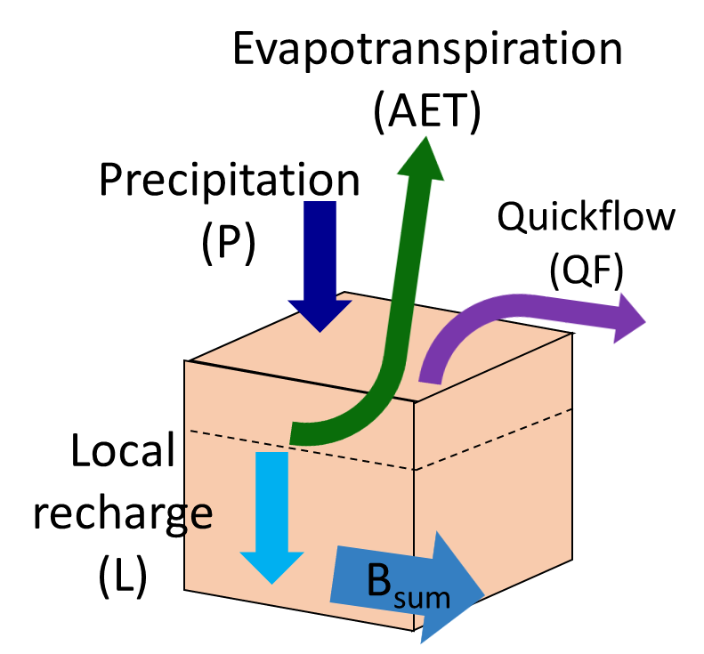
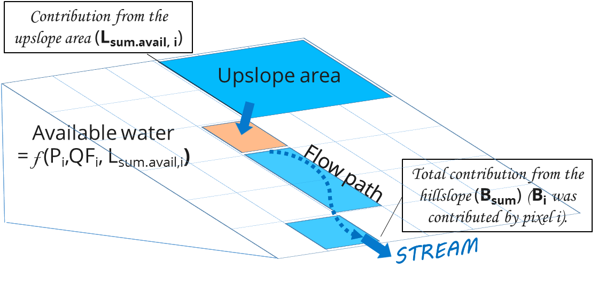

.. _seasonal_water_yield:

********************
季节性产水量
********************

总结
=======

对于诸如灌溉、家庭消费和水电生产等用途，对评估景观管理对供水服务的影响的工具有很高的需求。虽然InVEST年度产水量模型提供了集水区总产水量的估计，但许多应用需要季节流动的知识，特别是在旱季。这需要了解集水区的水文过程，特别是流动(发生在下雨期间或之后不久)和基流(发生在干燥天气)之间的划分。在季节性很强的气候条件下，基流可能比流流提供更大的价值，除非有大量的储存(例如，一个大型水库)可用。InVEST季节性产水量模型旨在提供关于地块对产生基流和流动的贡献的指导。该模型计算空间指数，量化一块土地对基流和流流产生的相对贡献。目前还没有对基流的定量估计，只有像素的相对贡献;正在开发一个单独的工具来解决这个问题。

介绍
============

了解景观管理对流域季节性流量的影响对流域管理至关重要。一个特定区域对水流的贡献取决于许多环境因素，包括气候、土壤、植被、坡度和沿水流路径的位置(决定像素是否可以从上坡接收水，或者补给的水可能会蒸发)。

流经景观的水要么被蒸发、蒸发、被井抽走，要么以深层地下水流或溪流的形式离开分流域。如果我们考虑一个单独的像素，以及它相对于产水量的值，我们可以考虑两种方法: 

- 第一种是在某一水域产生的净水量像素等于输入降水减去这个像素上的损失的蒸散发。在这个方案中，有在此方案中，可能实际蒸散量要大于降水。由此，净产水可能是负的。这种方法没有考虑到最终结果该像素上产生的水倾向;也就是说，该模型不考虑水是否真的以流水的形式出现蒸发了，或者在它的路径上消失了。

- 第二种是地块实际显示为快速流。因此，如果该地块产生水后来被蒸发了，贡献被认为是零。

前一种方法更强调一个地点的土地利用和土地覆盖，因为重点是该像素的净值。它考虑了上坡像素的水补给，但没有考虑下坡的影响。它表示产生流量的“潜力”(不是实际产生的流量)。

第二种方法更加强调像素的地形位置，因为这将决定像素上产生的水在成为水流之前被消耗的可能。它表示一个像素产生的实际流量。由于实际的流流量不能小于零，因此与第一种方法不同，这种方法将导致大于或等于零的指标。

我们使用这两个概念来开发一组三个指标，一个用于快速流，一个用于补给(代表“潜在的基流”)，一个用于实际的基流。在这里，基流定义为生成流域停留时间为月到年的流，而快速流表示流域停留时间为小时到天的生成的流。

模型
=========

快速流
---------

*快速流* (QF)的计算采用基于曲线数(CN)的方法。每月的降雨事件导致降水落在景观上。土壤和土地覆盖特征决定了有多少雨水快速从地表流出(产生快速流)，有多少雨水渗入土壤(产生局部补给)。曲线数法是捕捉这些土壤+土地覆盖特征的一种简单方法——CN值越高，快速流潜力越高(例如，黏土和低植被覆盖)，CN值越低，渗透的可能性越大(例如，沙质土壤和茂密植被覆盖)

为了计算快速流量，我们使用平均事件深度:math:`\frac{P_{i,m}}{n_{i,m}}`，并假设一个在有雨日的日降水深度分布指数，

.. math:: f\left( p \right) = \frac{1}{a_{i,m}}exp\left( - \frac{p}{a_{i,m}} \right)

式中 :math:`a_{i,m} = \frac{P_{i,m}}{n_{m}}/25.4` 和

- :math:`a_{i,m}` 是下雨天的该像素的平均降雨深度
   *i*月 *米* [in],

- :math:`n_{i,m}` 是像素i处的事件数*i* 月*米*
   [-],

- :math:`P_{i,m}` 是像素i处的月降水深度 *i* 月
   *米* [mm].

位于流域像素的快速流被设置为该像素上的降水，假设没有渗透，只有径流。

.. math:: \text{QF}_{stream,m} = \ P_{stream,m}

从指数分布可以看出，月径流:math:`\text{QF}_{i,m}` 为

.. math:: \text{QF}_{i,m} = n_{m} \times \left( \left( a_{i,m} - S_{i} \right)\exp\left( - \frac{0.2S_{i}}{a_{i,m}} \right) + \frac{S_{i}^{2}}{a_{i,m}}\exp\left( \frac{0.8S_{i}}{a_{i,m}} \right)E_{1}\left( \frac{S_{i}}{a_{i,m}} \right) \right) \times \left( 25.4\ \left\lbrack \frac{\text{mm}}{\text{in}} \right\rbrack \right)
	:label: (swy. 1)

式中

- :math:`S_{i} = \frac{1000}{\text{CN}_{i}} - 10` [in]

- :math:`\text{CN}_{i}` 是像素i的曲线数 *i*
   [in\ :sup:`-1`\],作为当地LULC和土壤类型的函数表
   *(见附录I表格模板)*,

- :math:`E_{1}` 是指数积分函数，
   :math:`E_{1}(x) = \int_{1}^{\infty}{\frac{e^{-xt}}{t}\text{dt}}`.

- and :math:`25.4` 是从英寸(在等式中使用)到毫米(在模型中使用)的转换因子

因此，每年的快速流量:math:`\text{QF}_{i}`,可以由每月的:`\text{QF}_{i,m}` 值的总和来计算,

.. math:: \text{QF}_{i} = \sum_{m = 1}^{12}{QF_{i,m}}
	:label: (swy. 2)

本地补给
--------------

*本地* *补给,* 或者说像素对基流的潜在贡献，是从当地的水平衡计算出来的。如果降水不以流流的形式流失，也不被像素上的植被蒸发，就可以渗透到土壤中成为当地的补给。如果一个像素点没有获得足够的水来满足其植被需求(由其作物因子*Kc*决定)，那么它也会使用像素点上坡产生的水(称为“上坡补贴”)，那么局部补给可能是负的。当地补给指数是按年时间标度计算的，但使用的是由月派生的值。

对于像素*i*，由年度水预算得到的局部补给
为(图1):

.. math:: L_{i} = P_{i} - \text{QF}_{i} - \text{AET}_{i}
	:label: (swy. 3)

其中，年实际蒸散发AET为月AET之和:

.. math:: \text{AET}_{i} = \sum_{\text{months}}^{}\text{AET}_{i,m}
	:label: (swy. 4)

对于每个月，:math:`\text{AET}_{i,m}` 要么受需求限制(潜在蒸散发- PET)或有效水(来自Allen et al. 1998):

.. math:: \text{AET}_{i,m} = min(\text{PET}_{i,m}\ ;\ P_{i,m} - \text{QF}_{i,m} + \alpha_{m}\beta_{i}L_{sum.avail,i})
	:label: (swy. 5)

式中math: ' \text{PET}_{i,m} '为月潜在蒸散发量，

.. math:: \text{PET}_{i,m} = K_{c,i,m} \times ET_{0,i,m}
	:label: (swy. 6)

:math:`L_{sum.avail,i}` 递归定义如下 (图 2),

.. math:: L_{sum.avail,i} = \sum_{j \in \{ neighbor\ pixels\ draining\ to\ pixel\ i\}}^{}{p_{\text{ij}} \cdot \left( L_{avail,j} + L_{sum.avail,j} \right)}
	:label: (swy. 7)

式中:math:`p_{\text{ij}}\ \in \lbrack 0,1\rbrack` 是从单元格*i*到*j*的流量比例，并且:math:`L_{avail,i}` 是对像素的可用补给值，当:math:`L_{i}` 为负值时，即:math:`L_{i}`'为负值时，为:math:`L_{i}` 的比例:math:`\gamma` 为正值时(参见下面:math:`\gamma` 的定义):

.. math:: L_{avail,i}\ = min(\gamma L_{i},L_{i})
	:label: (swy. 8)

在上面:

- :math:`P_{i}` 和 :math:`P_{i,m}` 分别为年度和月度降水 [mm]

- :math:`\text{QF}_{i}` 和 :math:`\text{QF}_{i,m}` 为快速流指数，定义如上[mm]

- :math:`ET_{0,i,m}` 是第m个月的参考蒸散发量 [mm]

- :math:`K_{c,i,m}` 是像素的LULC的月度裁剪因子

- :math:`\alpha_{m}` is the fraction of upslope annual available
   recharge that is available in month m (default is 1/12) 是年度可用上坡的比例在第m个月的可用补给(默认为1/12)

- :math:`\beta_{i}` 是上坡补给的比例可用于下坡蒸散发(默认为1;看详情请参阅附录II)

- γ是可用于下坡的像素补给的百分比像素(默认为1)

补给的属性
-----------------------

总基流量:math:`Q_b` (单位为mm)是集水区贡献的局部补给(负或正)的平均值，

.. math:: Q_{b} = \frac{\sum_{k \in \left\{ \text{pixels in catchment} \right\}}^{}L_{k}}{n_{\text{pixels in catchment}}}
	:label: (swy. 9)

一个像素的属性值是该像素上的局部补给:math:`L` 对基流:math:`Q_b` 的相对贡献:

.. math:: V_{R,i} = \frac{L_{i}}{{Q_{b} \times n}_{\text{pixels in catchment}}}
	:label: (swy. 10)

|

*图 1. 像素尺度上的水平衡来计算局部补给(公式3), 式中是实际到达溪流的流量。*

|
|
|

*图 2. 在山坡尺度上进行路由以计算实际的蒸散发(基于每个像素的气候变量和上坡贡献，见公式5) 和基流(基于Bsum，实际到达溪流的流量，见公式11-14)*
|
|
基流
--------

基流指数表示像素对基流(即在旱季到达河流的水)的贡献。如果本地充值是负的，那么像素对基流没有贡献，所以:math:`B` 被设置为零。如果像素对地下水补给有贡献，那么:math:`B` 是离开像素的流量和该像素对补给的相对贡献的函数。

对于不与河道相邻的像素，累积基流:math:`B_{sum,i}` 正比于离开相邻的下坡像素的累积基流减去在同一下坡像素上生成的累积基流(图2):

.. math::
   B_{sum,i} = L_{sum,i}\sum_{j \in \{\text{cells to which cell i pours}\}}^{}\begin{Bmatrix}
   p_{\text{ij}}\left( 1 - \frac{L_{avail,j}}{L_{sum,j}} \right)\frac{B_{sum,j}}{L_{sum,j} - L_{j}}\ \text{   if }j\text{ is a nonstream pixel} \\
   p_{\text{ij}}\ \text{   if }j\text{ is a stream pixel} \\
   \end{Bmatrix}
 :label: (swy. 11)

在流域出口(或在与溪流相邻的任何像素处)，基流生成的总和:math:`B_{sum,i}` 在所有上坡路像素上等于在相同像素上的本地生成的总和(因为在到达溪流之前没有进一步的机会消耗慢流):

.. math:: B_{sum,outlet} = L_{sum,outlet}
	:label: (swy. 12)

式中 :math:`L_{sum,i}` 累计上游补给值由以下定义

.. math:: L_{sum,i} = L_{i} + \sum_{j,\ all\ pixels\ draining\ to\ pixel\ i}^{}{L_{sum,j} \cdot p_{\text{ji}}}
	:label: (swy. 13)

基流:math:`B_{i}` 可直接由离开单元格*i*的累计基流占上游累计补给值可用补给的比例求得:

.. math:: B_{i} = max\left(B_{sum,i} \cdot \frac{L_{i}}{L_{sum,i}}, 0\right)
	:label: (swy. 14)

局限性
-----------

像所有InVEST模型一样，季节性产水量使用了一种简化的方法来估计快速流和基流，不包括水在景观中流动时发生的许多复杂情况。快速流主要基于曲线数，没有考虑地形。对于基流，虽然模型使用了基于物理的方法，但在空间和时间尺度上方程都得到了极大的简化，这大大增加了产生的绝对数的不确定性。因此，我们不建议使用绝对值，而是使用整个景观的相对值(我们假设简化的影响较小，因为它们适用于整个景观)。

校准
-----------

如果可能的话，始终建议根据观察到的数据进行验证。但是，虽然模型的快速流输出可以用作定量度量，但基流旨在用作指标，而不是一个绝对值。因此，很难将快速流和基流结合起来，并期望得到真实的模型结果，并与实测流动进行验证。一种可能是验证相对值(即值在整个景观中的分布)。流测量仪，可以与模型的流流和基流输出进行比较，聚合到相同的流测量仪点。或者，如果可用的话，可以将结果与不同的空间显式模型进行比较。

果你确实尝试定量验证流速，或快速流和基流的组合(同样，不建议，但人们确实尝试了)，请注意，由于结果是以毫米为单位的，如果我们简单地在整个区域上相加，结果很可能是大的数量级，并不能正确地代表总水量。相反，使用流域的*平均* B或Qf值，将毫米转换为米，然后乘以流域面积得到一个立方米的值，可以与观测到的流量数据进行比较。或者，你也可以计算每像素的体积，然后把它们加起来。

参见Hamel等人(2020)的论文，其中有一个针对观测数据和其他水文模型校准季节性产水量模型的例子。有关评估生态系统服务分析中的不确定性的更多一般指导，请参见Hamel & Bryant(2017)。

数据需求
==========

.. note:: *所有空间输入必须具有完全相同的投影坐标系* (以米为线性单位)，而不是地理坐标系(以度为单位)。

.. note::栅格输入可能有不同的单元格大小，它们将被重新采样以匹配DEM的单元格大小。因此，所有模型结果都将具有与DEM相同的单元大小。

- :investspec:`seasonal_water_yield.seasonal_water_yield workspace_dir`

- :investspec:`seasonal_water_yield.seasonal_water_yield results_suffix`

- :investspec:`seasonal_water_yield.seasonal_water_yield precip_dir`

  Contents:

  - :investspec:`seasonal_water_yield.seasonal_water_yield precip_dir.contents.[MONTH]`

- :investspec:`seasonal_water_yield.seasonal_water_yield et0_dir`

  内容:

  - :investspec:`seasonal_water_yield.seasonal_water_yield et0_dir.contents.[MONTH]`

- :investspec:`seasonal_water_yield.seasonal_water_yield dem_raster_path`

- :investspec:`seasonal_water_yield.seasonal_water_yield lulc_raster_path`

- :investspec:`seasonal_water_yield.seasonal_water_yield soil_group_path`

- :investspec:`seasonal_water_yield.seasonal_water_yield aoi_path`

- :investspec:`seasonal_water_yield.seasonal_water_yield biophysical_table_path` A .csv (Comma Separated Value) table containing model information corresponding to each of the land use classes in the LULC raster. *All LULC classes in the LULC raster MUST have corresponding values in this table.* Each row is a land use/land cover class and columns must be named and defined as follows:

  列:

  - :investspec:`seasonal_water_yield.seasonal_water_yield biophysical_table_path.columns.lucode`
  - :investspec:`seasonal_water_yield.seasonal_water_yield biophysical_table_path.columns.cn_[SOIL_GROUP]`
  - :investspec:`seasonal_water_yield.seasonal_water_yield biophysical_table_path.columns.kc_[MONTH]`

- :investspec:`seasonal_water_yield.seasonal_water_yield rain_events_table_path` A rain event is defined as >0.1mm precipitation.

  列:

  - :investspec:`seasonal_water_yield.seasonal_water_yield rain_events_table_path.columns.month`
  - :investspec:`seasonal_water_yield.seasonal_water_yield rain_events_table_path.columns.events`

- :investspec:`seasonal_water_yield.seasonal_water_yield threshold_flow_accumulation`
- :investspec:`seasonal_water_yield.seasonal_water_yield alpha_m` Default value: 1/12.
- :investspec:`seasonal_water_yield.seasonal_water_yield beta_i` Default value: 1.
- :investspec:`seasonal_water_yield.seasonal_water_yield gamma` Default value: 1.

高级模型选项
----------------------

每月的雨事件表是提供雨事件数据的一种简单方法。这假设整个流域都有一个这样的数字，但对于大片地区或降水量空间变化非常大的地区可能并不成立。

为了表示降雨事件数量的可变性，可以输入气候带的地图，以及每个气候带的相关降雨事件数量。

**输入**

- :investspec:`seasonal_water_yield.seasonal_water_yield user_defined_climate_zones`

- :investspec:`seasonal_water_yield.seasonal_water_yield climate_zone_table_path`

   列:

   - :investspec:`seasonal_water_yield.seasonal_water_yield climate_zone_table_path.columns.cz_id`
   - :investspec:`seasonal_water_yield.seasonal_water_yield climate_zone_table_path.columns.[MONTH]`

- :investspec:`seasonal_water_yield.seasonal_water_yield climate_zone_raster_path`

|

该模型先计算本地补给层，再从本地补给层计算基流层。而不是InVEST计算本地补给值，这一层可以从一个不同的模型(例如，rhhessys)获得。要基于您自己的补给层计算基流贡献，可以绕过模型的第一部分，直接输入本地补给的映射。

**输入**

- :investspec:`seasonal_water_yield.seasonal_water_yield user_defined_local_recharge`
- :investspec:`seasonal_water_yield.seasonal_water_yield l_path`

|

*alpha* 参数表示一个像素上上坡有效水对蒸散发贡献的时间变化。在默认参数化中，它的值被设置为1/12，假设土壤缓冲了水的释放，并且月贡献恰好是年贡献的1\\12\:sup:`th`。
为了允许上坡补贴临时可变，用户可以提供每月*alpha* 值的表。

**输入**

- :investspec:`seasonal_water_yield.seasonal_water_yield monthly_alpha`
- :investspec:`seasonal_water_yield.seasonal_water_yield monthly_alpha_path`

解释输出
--------------------

输出栅格的分辨率将与作为输入提供的DEM的分辨率相同。

* **[工作区]** 文件夹:

 * **参数日志**:每当模型运行时，将在工作区中创建一个文本(.txt)文件。该文件将列出该运行的参数值和输出消息，并将根据服务、日期和时间命名。当与NatCap联系关于模型运行中的错误时，请包括参数日志。

 * **B_[ Suffix].tif** (类型:栅格;单位:mm，但应该被解释为相对值，而不是绝对值):基流的映射:math:`B` 值，一个像素对缓慢释放流的贡献(在到达溪流之前没有蒸发)

 * **B_sum_[ Suffix].tif** (类型:栅格;单位:mm，但应该解释为相对值，而不是绝对值): 映射值:math:`B_{\text{sum}}` \，通过像素的流量，由所有上坡像素贡献，在到达溪流之前没有蒸发

 * **CN_[ Suffix].tif** (type: raster): 曲线数值图

 * **L_avail_[ Suffix].tif** (类型:栅格;单位:mm，但应该解释为相对值，而不是绝对值):可用的本地充值映射:math:`L_{\text{avail}}`

 * **L_[Suffix].tif** (类型:栅格;单位:mm，但应该被解释为相对值，而不是绝对值):本地补充地图:math:`L` 值

 * **L_sum_avail_[Suffix].tif** (类型:栅格;单位:mm，但应该解释为相对值，而不是绝对值):映射值:math:`L_{\text{sum.avail}}`，即一个像素的可用水分，由所有上坡像素贡献，该像素可用于蒸散发

 * **L_sum_[Suffix].tif**  (类型:栅格;单位:mm，但应该被解释为相对值，而不是绝对值) 映射值:math:`L_{\text{sum}}`，通过一个像素的流量，由所有上坡像素贡献，可用于下坡像素的蒸散发

 * **QF_[Suffix].tif** (类型:栅格;单位:mm): 映射值QF 

 * **P_[Suffix].tif** (类型:栅格;单位:mm/年):该像素上所有月份的总降水量。

 * **Vri_[Suffix].tif** (类型:栅格;单位:mm):补充值(贡献，正或负)与总补充值的映射

 * **aggregated_results_swy_[Suffix].shp**:各流域生物物理值表，字段如下:

        * **qb** (单位:mm，但应该解释为相对值，而不是绝对值):流域内的平均本地补给值
	
	* **vri_sum**  (单位:mm):流域内总补给贡献(正或负)。流域内``Vri_[Suffix].tif``的像素值之和。

* **[Workspace]\\intermediate_outputs** folder:

 * **aet_[Suffix].tif** (type: raster; units: mm):实际蒸散发图(AET)

 * **qf_1_[Suffix].tif...qf_12_[Suffix].tif** (类型:栅格;单位:mm):月流通量图(1 =一月…12 = 12月)

 * **stream_[Suffix].tif** (type: raster):由输入DEM和阈值流量累积生成的溪流网络。值1表示流，值0表示非流像素。

附录1: 参数选择的数据来源和指导
=============================================================

:ref:`Precipitation <precipitation>`
------------------------------------

:ref:`Evapotranspiration <et0>`
-------------------------------

:ref:`Digital Elevation Model <dem>`
------------------------------------

:ref:`Land Use/Land Cover <lulc>`
---------------------------------

:ref:`Soil Groups <soil_groups>`
---------------------------------

:ref:`Watersheds <watersheds>`
------------------------------

:ref:`Curve Number <cn>`
------------------------

:ref:`Kc <kc>`
--------------

:ref:`Rain Events <rain_events>`
--------------------------------

:ref:`Threshold Flow Accumulation <tfa>`
----------------------------------------

气候区
-------------
Climate zone data is available on the `Köppen-Geiger climate classification site <http://koeppen-geiger.vu-wien.ac.at/present.htm>`_.气候带数据可在`Köppen-Geiger气候分类网站<http://koeppen-geiger.vu-wien.ac.at/present.htm>`_上获得。

alpha_m
-------

默认值: 1/12. 见附录 2

beta_i
------

默认值: 1. 见附录 2

gamma
-----

默认值: 1. 见附录2

|
|

附录 2: :math:`{\mathbf{\alpha},\mathbf{\beta}}_{\mathbf{i}},`\ 和 :math:`gamma` 参数定义和可选值
==================================================================================================================================

:math:`\alpha` 和:math:`\beta_{i}` 表示在给定的月份里，上坡像素每年为下坡像素提供的用于蒸散发的补给的百分比。该产品
:math:`\alpha \times \beta_{i}` 预期为<1，因为有些水可能无法从上坡来，要么是它沿着深层流动路径，要么是供应和(蒸散发)需求的时间不同步。

:math:`\alpha` 是降水季节性的函数:根据地下旅行时间，下坡地区可以在以后的几个月使用给定月份的补给。在默认参数化中，它的值被设置为1/12，假设土壤缓冲了水的释放，并且每个月的贡献恰好为一个年度的供应12\:sup:`th`。另一种假设是将值设置为前一个月的降水量值，相对于总降水量: P\ :sub:`m-1`/P\ :sub:`annual`

:math:`\beta_{i}` 是当地地形和土壤的函数:对于给定的上坡补给量，像素使用的水量是存储容量的函数。它还取决于上坡区域的特征:上坡补给的使用受贡献区域的形状和面积的限制(即，与远得多的像素相比，关注像素上方的像素的补给不太可能丢失)。

在默认参数化中，对于所有像素:math:`\beta` 都被设置为1。一个备选方案是设置:math:`\beta_{i}` 为TI，一个像素的地形湿度指数，定义为:math:`ln(\frac{A}{\text{tan}\beta}`) (或其他包括土壤类型和深度的公式)。

γ表示可用于下坡像素的像素充值的百分比。这是土壤性质的函数，也可能是地形的函数。在默认参数化中，γ在横向上是常数，其作用类似于:math:`\alpha`。

在实践中
-----------

提供上述选项主要是为了研究目的。在实践中，我们建议对于季节性很强的气候，*alpha* 应该设置为前一个月的降水量值，相对于总降水量: P\ :sub:`m-1`/P\ :sub:`annual`

然后，我们提供了两个选项来解决参数值周围的不确定性:

1. 用观测资料验证实际蒸散发量

该模型输出年时间尺度上的实际蒸散发:用户可以调整参数以满足观测到的实际蒸散发(例如来自MODIS, https://www.ntsg.umt.edu/project/modis/mod16.php)。其中，"_mod"表示建模的AET，"_obs"表示观察到的AET。

* 如果AET\_mod > AET\_obs模型过度预测蒸散发，可以通过:减少*Kc*值，或减少*gamma*来修正值和/或*beta*值(因此每个值可用的水更少像素)。

* 如果AET\_mod < AET\_obs，模型低预测蒸散发，可以通过:增加*Kc*值(和增加*gamma*或者*beta*值，如果它们不是最大值1)。

如果AET的月值可用，可以通过改变季节参数alpha进行更精细的校准。

2.集成建模

该模型可以在不同的假设下运行，并对输出进行比较，以估计参数误差的影响。参数范围可以通过假设给定像素可用的上坡补给比例来确定;可以将它们设置为最大边界(0和1)初步结果。

参考文献
==========

Allen, R.G., Pereira, L.S., Raes, D., Smith, M., 1998. Crop
evapotranspiration - Guidelines for computing crop water requirements,
FAO Irrigation and drainage paper 56. Rome, Italy.

Hamel, P. & Bryant, B. (2017). Uncertainty assessment in ecosystem services analyses: Seven challenges and practical responses. Ecosystem Services, Volume 24. https://doi.org/10.1016/j.ecoser.2016.12.008.

Hamel, P., Valencia, J., Schmitt, R., Shrestha, M., Piman, T., Sharp, R.P., Francesconi, W., Guswa, A.J., 2020. Modeling seasonal water yield for landscape management: Applications in Peru and Myanmar. Journal of Environmental Management 270, 110792.

NRCS-USDA, 2007. National Engineering Handbook. United States Department
of Agriculture,
https://www.nrcs.usda.gov/wps/portal/nrcs/detailfull/national/water/?cid=stelprdb1043063.

