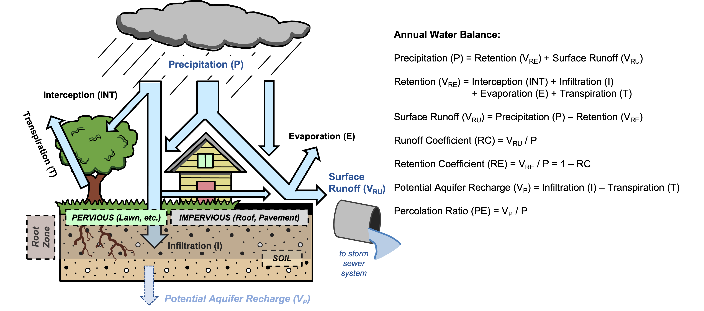
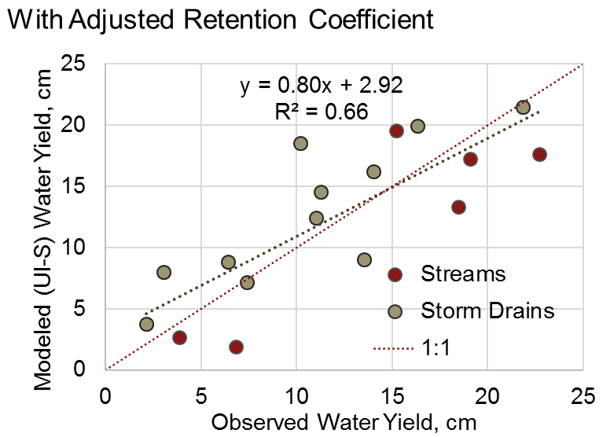
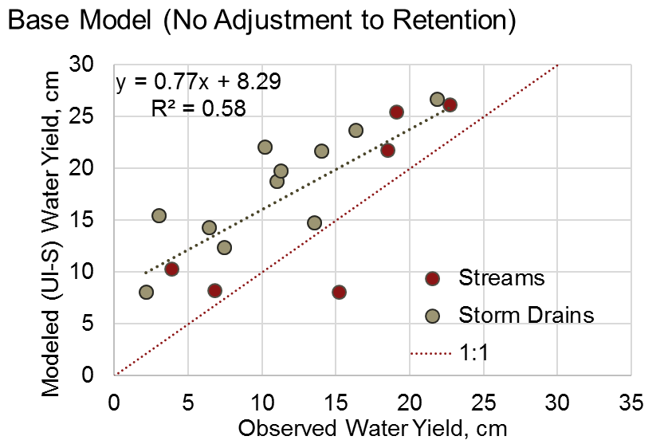

.. _stormwater:

**************************
城市暴雨滞留
**************************

简介
====

规划部门在解决气候变化、洪水风险或人口增长等问题的战略中，越来越多地考虑城市水管理，同时保护环境。InVEST暴雨径流滞留模型可以通过提供与暴雨管理相关的两种生态系统服务的信息来支持这一努力：径流滞留和地下水补给（洪水风险降低在一个单独的InVEST模型中评估，即："城市洪水风险缓解<ufrm>"）。径流滞留有两个方面：径流数量和径流质量。具体来说，它相当于透水土地利用对雨水（降雨-径流）的截留，考虑到被污染的雨水排入河流或海洋的有害影响，这是有益的。地下水补给是一项相关的服务，对应于雨水经过根部区域的渗入，可能为人类和非人类补给地下水。该模型的次要输出是对地表径流的估计，或未被景观保留并与相关营养物或污染物一起输出的雨水部分。城市水资源平衡的这些主要组成部分在 :numref:`hydro-schematic` 中得到了说明。

该模型对滞留、地下水补给和地表径流的估计是以年度为单位，而不是以单个暴雨事件为单位。这是 InVEST 暴雨滞留和洪水风险缓解模型之间的主要区别：前者旨在评估景观在应对一年的降水时提供的更普遍的水文服务，其中主要的规划关注点与地表水质量和供水有关，而后者模型旨在评估景观在应对单一大型（"极端"）风暴事件时提供的服务，其中洪水是首要关注点。

模型
====

该模型计算每年的雨水滞留量和相关的水质效益（即避免向接受径流的湖泊、河流或河口输送营养物质或污染物）。暴雨滞留服务的价值可以用雨水基础设施的替代成本来计算。作为选择，该模型还可以提供潜在的地下水对含水层的补给，以及地表径流中导出的雨水（作为污染物或营养物的数量和质量）的估计。城市降雨-径流水量平衡的概述，说明了这些主要的水通量，见下文 :numref:`hydro-schematic`。

.. _hydro-schematic:

   城市雨水平衡中的主要水文通量**，说明降水落在透水表面（土壤或植被，如草坪和树木）和不透水表面（屋顶和铺设的表面）时的潜在结果。在干燥天气期间，潜在的含水层补给量被估计为渗入的降雨量与大多数植物根系可能存在的土壤深度内植被蒸腾的水量之间的差异。

估算雨水滞留、补给和径流情况
^^^^^^^^^^^^^^^^^^^^^^^^^^^^

该模型需要生物物理表中每种土地利用-土地覆盖（LULC）类型的年径流系数（:math:`RC`）和可选的渗流率（:math:`PE`）的值。径流系数被定义为年地表径流与年降水量之间的比率，数值在0和1之间，而渗流率是年渗入地下水（"潜在含水层补给"）与年降水量之间的比率（:numref:`hydro-schematic`）。这些系数通常是流域内土地覆盖和土壤属性的函数；关于确定这些数值的进一步细节，请参见 "输入指南"。

对于每个LULC类型:math:`x`，暴雨滞留系数:math:`RE_x` 计算公式如下：

.. math:: RE_x=1-RC_x

基于LULC和水文土壤分组栅格，该模型为每个像素:math:`i`分配暴雨滞留系数（:math:`RE_i`）。接下来，模型计算出每个像素:math:`i`的滞留水量（:math:`m3/yr`）：

.. math:: V_{RE_i}=0.001\cdot P_i\cdot RE_i\cdot pixel.area

式中：其中:math:`P_i`是年降水量（:math:`mm/yr`），:math:`pixel.area`是像素面积（:math:`m^2`）。

径流量 :math:`V_{RU}`（:math:`m^3/yr`）根据径流系数（:math:`RU` 或:math:`RC`）计算。如果选择调整滞留系数选项（见下文），径流系数可能与输入的:math:`RC` 值不同，因为它们是由（调整后的）滞留系数通过以下公式计算得出的：

.. math:: RU_x=1-RE_x

.. math:: V_{RU,i}=0.001\cdot P_i\cdot RU_i\cdot pixel.area

另外，如果用户定义了渗流率，模型将根据LULC和土壤水文分组栅格为每个像素分配这些值，并计算每个像素的:math:`V_{P}`，即通过土壤渗入含水层的水量（:math:`m^3/年`）。

.. math:: V_{P,i}=0.001\cdot P_i\cdot PE_i\cdot pixel.area

直接连通的不透水层的调整滞留系数（可选）
^^^^^^^^^^^^^^^^^^^^^^^^^^^^^^^^^^^^^^^^
至少在考虑子流域尺度时，一个特定像素的滞留应该受到上游和下游像素的滞留影响。(例如，目前的 InVEST 营养物质输送率模型通过流动路径划分和滞留长度框架考虑到了这一点，由于暴雨排水管改变了地表和地下流路，这在城市排水网络中是不可行的）。为了解释说明流向周围像素的径流的滞留情况，该模型可选择使对滞留进行一个简单的修改。对于像素:math:`i`，滞留系数:math:`RE_{i}` 根据其邻近像素在一定滞留半径内的滞留值向上调整。调整值:math:`C_{i}` 被应用于特定像素的未滞留的径流，如下所示：

.. math:: RE^{adj}_{i} = RE_{i} + (1 - RE_{i})\cdot C_{i}
   :label: adjusted_retention_coefficient

式中 :math:`RE^{adj}_{i}` 是调整后的滞留系数，并且如果像素 :math:`i` 靠近直接连接的不透水区域和/或靠近道路，则调整因子 :math:`C_{i}` 为0。
如果一个像素的中心点在被标记为连接的土地利用/土地覆盖类型中像素的中心点的半径:math:`l` 之内（在生物物理表的 "is_connected "列中有1），则该像素 "靠近 "直接连接的不透水区。
如果一个像素的中心点在道路像素的中心点（通过栅格化道路中心线矢量确定）的半径:math:`l` 内，则该像素 "靠近 "道路。
:math:`R_{mean,i}`, otherwise

式中 :math:`R_{mean,i}` 是像素 :math:`i` 和其有效邻近像素的平均滞留系数。"邻近 "像素是指那些离 :math:`i` 不超过滞留半径的像素，测量方法是从中心点到中心点。

换句话说，如果该像素被认为是直接连接的，即靠近密集的城市土地使用或道路，在大多数城市地区，这些土地通过沟渠或地下管道直接连接到排水网络，则周围土地不提供额外的滞留功能。否则，该像素的滞留系数会根据其邻近像素提供的滞留量按比例增加。

**注意1：关于连接性** 考虑与排水管网的连接性是有些主观，但应该由使用的土地覆被层决定。因此，"连通性 "的确定由用户决定，因为土地利用/土地覆盖可能有更多（或更少）细节，这取决于是否可获取。连接性的默认特征（见下面 "输入指南 "中的样本表）是基于美国国家土地覆被数据库（NLCD）和对其最 "发达 "类别的连接性的假设。更具体地说，NLCD对开发强度有广泛的分类（开放、低、中和高），基本上是不透水率的分类，我们假设 "高 "和 "中 "开发类别可能完全与雨水排放系统连接（即在生物物理表中的 "是否连接 "列的值为1），因为根据NLCD的规范，不透水率大于50%。低和开放类别的不透水率较低（<50%），可能包含一些公园之类的覆盖类型，没有连接和/或提供更多的滞留，并被假定为有效断开（"is_connected "的值为0）。最后，使用一个可选的**公路线图层**，这是一个可用于城市的常用数据集，提供了与雨水排放网络直接连接的像素的进一步分类（该模型内部处理这一计算）。

**注意1：关于滞留半径** 保留半径:math:`l` 是检查与雨水排放网络的连接性和/或考虑额外保留的像素的距离。另一种考虑该参数的方式是，在城市流域中，径流在遇到相连的路面或完全下渗之前可能走过的最大陆上距离，这可能因土地使用类型差异而略有不同。例如，如果一个典型的住宅地块的深度是40米，那么地块上到街道（前面）或小巷（后面）的最大排水距离大约是20米，因此20米（或更少）可能是一个合适的滞留半径，应用于主要是密集住宅的土地利用。

**其他考虑因素:** 这种方法在农业用地、公园、高尔夫球场和墓地等大型透水区域产生了额外的滞留量，应该会提高较发达流域的准确性，在这些流域，由于管道、路边沟道路的普遍存在，假设道路直接连接的可能性较大。然而，对于更多的农村流域，特别是那些主要有沟渠的道路，该方法可能会 "过度修正"（预测不足），由于沟渠中可能因停留时间和/或渗透的增加而出现额外的滞留，因此道路直接连接的假设可能会落空。此外，我们承认，由于使用了滞留半径，而不是只考虑下坡方向（水移动的方向）的连通性或滞留，这种方法可能会产生一些误差，但这种方法的效率可能超过了潜在的不准确性。附录中显示了对美国明尼苏达州明尼阿波利斯-圣保罗都会区测得的流域进行的简单测试（该研究只考虑了八个相邻的单元，而不是半径；模型使用半径来减少对像素大小的依赖）。

计算暴雨滞留的水质效益（可选）。
^^^^^^^^^^^^^^^^^^^^^^^^^^^^^^^^^^

暴雨滞留的潜在水质影响被确定为与滞留暴雨相关的污染物质量，即避免的污染物负荷量。每年避免的污染物负荷，以 :math:`kg/yr` 为单位，计算出每个像素 :math:`i` 的滞留体积（:math:`m^3/yr`）与污染物事件平均浓度（:math:`EMC`）的乘积，以 :math:`mg/L` 为单位：

.. math:: Avoided.load_i=0.001\cdot V_{RE,i}\cdot EMC

同样，地表径流输出的年污染物负荷（:math:`kg/yr`）是根据径流量计算的：

.. math:: Load_i=0.001\cdot V_{RU,i}\cdot EMC

使用生物物理表将每种污染物的 EMC 值分配给土地使用类型。氮和磷是常见的相关污染物，但任何雨水污染物（如沉积物、金属或有机化合物）都可以通过在生物物理表中提供这些污染物的 EMC 值来使用。如果不包括污染物，则跳过此步骤。

暴雨滞留服务的价值化（可选）
^^^^^^^^^^^^^^^^^^^^^^^^^^^^^^

对暴雨滞留服务最常见的价值化方法的文献综述可以在一份为地方政府编写的报告中找到（Catchlove, 2020）。如果存在暴雨调节，用户可以以目标滞留量为参考，评估雨水滞留的价值。如果有滞留装置的平均价值（货币/体积），则可以被用于评估经济价值。

.. math:: Retention.cost=PR\cdot V_{RE}
   :label: retention-value

其中PR是暴雨滞留的替代成本（按体积计算的货币，例如:math:`$/m^3`）。例如，Simpson和McPherson（2007）估计，旧金山湾区（美国加州）城市地区的替代成本为:math:`$1.59/m^3`。

该模型可以输出潜在的地下水补给量（:math:`V_{P}`），这也可以作为滞留量的评估。然而，该模型目前没有估计与该补给量相关的污染物负荷，因为模型中没有实现污染物的地下传输和转化。

流域范围内的汇总（可选）
^^^^^^^^^^^^^^^^^^^^^^^^^^

用户可以提供一个多边形矢量文件，框定需要汇总数据的区域（通常是流域或污水流域）。该模型将对输出的栅格进行汇总计算：

- 平均暴雨滞留率（:math:`RE` 值的平均值）
- 总滞留量， :math:`m^3`（ :math:`V_{RE}` 值之和）。
- 每种污染物的总滞留量，:math:`kg/yr`（:math:`Avoided.load` 值之和）。
- 总径流量， :math:`m^3`（:math:`V_{RU}` 值之和）。
- 每种污染物的总负荷， :math:`kg/yr`（ :math:`Load` 值之和）。
- 总的潜在补给量， :math:`m^3`（如果提供渗流率，则为 :math:`V_{P}` 之和）。
- 总替代成本，货币单位（如果价值明确的话，则为滞留服务的替代成本之和）。

数据需求
========

- :investspec:`stormwater workspace_dir`

- :investspec:`stormwater results_suffix`

- :investspec:`stormwater lulc_path`

- :investspec:`stormwater soil_group_path`

- :investspec:`stormwater precipitation_path`

- :investspec:`stormwater biophysical_table`

  Columns:

    - :investspec:`stormwater biophysical_table.columns.lucode`
    - :investspec:`stormwater biophysical_table.columns.is_connected`
    - :investspec:`stormwater biophysical_table.columns.rc_a`
    - :investspec:`stormwater biophysical_table.columns.rc_b`
    - :investspec:`stormwater biophysical_table.columns.rc_c`
    - :investspec:`stormwater biophysical_table.columns.rc_d`
    - :investspec:`stormwater biophysical_table.columns.pe_a`
    - :investspec:`stormwater biophysical_table.columns.pe_b`
    - :investspec:`stormwater biophysical_table.columns.pe_c`
    - :investspec:`stormwater biophysical_table.columns.pe_d`
    - :investspec:`stormwater biophysical_table.columns.emc_[POLLUTANT]`

- :investspec:`stormwater adjust_retention_ratios`

- :investspec:`stormwater retention_radius`

- :investspec:`stormwater road_centerlines_path`

- :investspec:`stormwater replacement_cost` Available from national or regional studies (e.g. `EPA report for the US: <https://www3.epa.gov/npdes/pubs/usw_d.pdf>`_). Representative value of $1.59 USD/m3 from Simpson and McPherson (2007).

- :investspec:`stormwater aggregate_areas_path` Watersheds can be obtained with the DelineateIt model.

结果解释
========

最终输出
^^^^^^^^
注意：除非另有说明，所有比率（如滞留率）或系数（如径流系数），无论是像素级还是流域的平均数，都以小数表示，数值在0和1之间。

- **retention_ratio.tif**。由土地利用/土地覆盖栅格和生物物理表`RC_x`列得出的栅格，其中每个像素的值是该地区的雨水滞留率。

- **adjusted_retention_ratio.tif** (仅当 "调整滞留率 "被选中时）。调整后的滞留率栅格，由:eq:`adjusted_retention_coefficient` 可调整滞留系数可由‘retention_ratio, ratio_average, near_road’, and ‘near_impervious_lulc’计算得到。

- **retention_volume.tif**:滞留量栅格图，单位：math:`m^3/yr`。

- **percolation_ratio.tif**: (如果提供渗漏数据）通过交叉引用LULC和带有生物物理表土壤组栅格，得出渗漏率栅格图。

- **percolation_volume.tif**: (如果提供渗滤数据) 渗滤(潜在含水层补给)量栅格图，单位为:math:`m^3/yr`。

- **runoff_ratio.tif**:从滞留率栅格产生出来的栅格，其中每个像素的值是该地区的暴雨径流率。是'retention_ratio.tif'（:math:`runoff = 1 - retention`）的倒数。

- **runoff_volume.tif**: 径流体积的栅格图，单位为:math:`m^3/yr`。

- **retention_value.tif**:(如果提供价值数据) 每个像素的水滞留价值的栅格图，单位为:math: "currency/yr"。根据公式:eq:`retention-value` 计算得到。

- **aggregate.gpkg**:(如果提供集合向量) 集合数据的向量图。这与集合区域的输入矢量相同，但每个多边形都被赋予了集合数据的额外字段。

　　- **mean_retention_ratio**:该多边形的平均滞留率

　　- **total_retention_volume**:该多边形的总滞留量，单位为:math:`m^3/yr`。

　　- **mean_runoff_ratio**:该多边形的平均径流系数

　　- **total_runoff_volume**:该多边形的总径流量，单位为:math:`m^3/yr`。

　　- **mean_percolation_ratio** (如果提供渗滤率)。该多边形的平均渗滤（补给）率

　　- **total_percolation_volume** (如果提供渗滤率)。该多边形的潜在含水层总补给量，单位为:math:`m^3/yr`。

　　- **p_total_avoided_load** (对于每个污染物 :math:`p`): 该多边形区域内避免（滞留）的污染物总量，单位为:math:`kg/yr`。

　　- **p_total_load** (对于每个污染物 :math:`p`): 该多边形地区径流中的污染物总量，单位为:math:`kg/yr`。

　　- **total_retention_value** (如果提供价值数据）。该多边形上滞留水量的总价值，单位为:math:`currency/yr`。

中间输出结果
^^^^^^^^^^^^

- **lulc_aligned.tif**: 土壤组栅格输入的副本，裁剪为三个栅格输入的交叉点。

- **soil_group_aligned.tif**:土壤组栅格输入的副本，与LULC栅格对齐，并裁剪为三个栅格输入的交叉点

- **precipitation_aligned.tif**:降水栅格输入的副本，与LULC栅格对齐，并裁剪为三个栅格输入的交叉点

- **reprojected_centerlines.gpkg**: 道路中心线矢量输入的副本，重新投影到LULC栅格的投影坐标系中

- **rasterized_centerlines.tif**:重投影中心线向量的栅格化版本，其中1表示该像素是道路，0表示不是。

- **is_connected_lulc.tif**:从LULC栅格和生物物理表的 "is_connected "列得出的二进制栅格，其中1表示该像素有直接连接的不透水LULC类型，0表示没有。

- **road_distance.tif**: 从栅格化中心线地图中得到的栅格，其中每个像素的值是它与道路像素的最小距离（中心点到中心点的测量值）。

- **connected_lulc_distance.tif**:从 "is_connected_lulc "地图得到的栅格，其中每个像素的值是它与相连的不透水LULC像素的最小距离（中心点到中心点的测量）。

- **near_road.tif**:从 "road_distance "地图中得到的二进制栅格，其中1表示该像素在道路像素的滞留半径内，0表示不在。

- **near_connected_lulc.tif**:从`connected_lulc_distance'地图中导出的二进制栅格，其中1表示该像素在连接的不透水LULC像素的滞留半径内，0表示不在。

- **search_kernel.tif**:代表搜索核密度的二进制栅格，与 "滞留率 "栅格进行卷积，计算每个像素保留半径内的平均保留率。

- **ratio_average.tif**:该栅格中每个像素的值是它在 "滞留率 "地图中邻近像素的平均值，由滞留率栅格对搜索核进行卷积计算得出。

.. _Input Guidance:

附录 1：数据来源和参数选择指南
==============================

径流系数和补给率
^^^^^^^^^^^^^^^^

**使用已公开报告数据：** 径流系数通常在各种规模和土地利用环境（城市到农村）的流域研究中被报告。在某些情况下，这些研究可能适用于要应用暴雨滞留模型的地点，报告的径流系数可以直接用来代替默认值。然而，如果在现有的研究中没有按土地利用来指定这些参数，那么它们将很难在模型中使用，可能不得不使用默认的或最佳的径流系数估计值。然后可以将模型输出结果与报告中的值进行核对，作为校准步骤。如果已知径流系数是LULC类型的函数，而不是每个水文土壤组（HSG）的函数（这可能是经常发生的情况），那么在给定的LULC类型中，为每个HSG指定相同的 :math:`RC` 值（即，`RC_A`、`RC_B`、`RC_C`和`RC_D`在生物物理表中的一行都有相同的值）。不要在生物物理表中留下任何空白，也不要删除必要的列（:math:`lucode`, :math:`RC_x`, :math:`PE_x`）。

**估计径流系数的其他方法：** 如果在以前的研究中没有发现每种LULC类型的径流系数，可以通过以下方法确定：

- 美国EPA的雨水径流计算器（https://swcweb.epa.gov/stormwatercalculator/）。

- 任何（月或日时间尺度）计算一般LC类型的雨水径流和实际蒸发量（单位：毫米/年）的降雨-径流模型（例如，SWMM软件；见以下例子）

- InVEST 季节性产水模型中使用的月度方法。该模型需要景观中代表性地点的月降水量和蒸散量（ET）值，以及SCS-CN法的曲线数值（CN）（NRCS-USDA 2004）。

注意透水土地覆盖和裸露土壤的径流系数应该为每个土壤水文分组定义（即使所有的值都相同）。水的`RC`值被设置为1。

**从SWMM模型中估计径流系数（和渗漏率）：** SWMM模型结合基本土地覆盖类型和四个土壤水文组（A、B、C、D）可以用来简单估计研究区内的径流系数。Hamel等人（2021）的SI中描述了这种方法：“[SWMM]模型包括几个合成流域（100米长，10米宽），每个流域都有统一的土地覆盖，包括裸露（无植被）、透水（有植被）或不透水表面；后两类包括有树冠和无树冠的情况（例如，'无树冠透水'），总共有五个合成流域。在这五个流域中，四个水文土壤组（HSG；即A、B、C或D）各包括一组，共20个合成流域。我们用10年（2008-2017）的当地气候数据（明尼阿波利斯-圣保罗国际机场）连续模拟运行SWMM模型，使用Horton渗透和运动学波面路由模型，启用融雪和含水层传输。为每个土壤等级定义了单独的含水层（仅在渗透能力上有差异），初始土壤湿度条件是平均的，尽管使用10年连续模拟应减少这一假设的影响。基本土地覆盖类别的结果径流系数被确定为整个10年期间的平均值（而不是10个年度系数的平均值）。”

渗滤率（:math:`PE`）是对潜在地下水补给的估计，也是从这些SWMM模型中估算出来的，方法是计算渗入的降雨量和植被总蒸发量之间的差值，并将这个差值按总降雨量进行归一化。

下一步是将这些基本的SWMM土地覆盖类型（下表的 "SW_Type"）的径流系数分配或汇总到LULC输入栅格（在这种情况下是NLCD土地覆盖数据）中所有覆盖类别的径流系数值。对于一些类别，分配是直接的：例如，NLCD类别 "灌丛/灌木"、"草地 "和 "牧场/干草 "被分配为 "无树冠的透水"（`SW_Type`=3）的径流系数。混合基本覆盖类型（不透水+透水，树冠+开阔）的类别，如NLCD中的 "发达 "等级，需要根据不透水和树冠水平的假设对SW_Type进行汇总。我们假设每个NLCD定义的区间中点具有不透水性，并进一步假设基本覆盖类型的树木覆盖率为50%。举例来说，"高强度城市 "NLCD类型代表了总不透水面积为80-100%的城市地区（名义值为90%）。它被分配了一个滞留系数，其权重为90%不透水，一半有树木覆盖（因此45%"不透水无树冠"（`SW_Type`=1）和45%"不透水无树冠"（`SW_Type`=2）），10%透水，一半有树木覆盖（因此5%"透水无树冠"（`SW_Type`=3）和5%"透水有树冠"（`SW_Type`=4）。这种方法产生的径流系数在0.76-0.79之间，适用于四个HSG类型。渗流比（:math:`PE`）是用同样的方法分配给土地利用类型的。

径流系数和渗漏率表的例子，其数值由SWMM基本土地覆盖类型（`SW_Type`）和A/B/C/D土壤水文分组（用于透水和裸土）指定。数值来自SWMM模拟，数据基础来自于美国明尼苏达州明尼阿波利斯-圣保罗机场10年的每小时天气数据（2008-2017）。

.. csv-table:: **样例径流系数和渗流系数**。
      :file: ../en/stormwater/example_coefficients.csv
      :header-rows: 1

污染物事件平均浓度
^^^^^^^^^^^^^^^^^^^^
污染物事件平均浓度（EMC）可由用户指定任何感兴趣的污染物。流域研究和数据库（如 https://bmpdatabase.org）中通常会报告 EMC，但如果有的话，以前研究中的体积加权浓度在这里指定会更准确。这是因为模型所使用的EMC值是应用于年径流值。

上面的生物物理样例表中提供了城市特定的NLCD土地利用类别的氮和磷的默认值，并可从美国国家暴雨质量数据库（bmpdatabase.org/nsqd.html）中获得，其中包括过去30年中从美国500多个地点收集的7000多个样本的数据，以及以前一些关于欠发达土地利用的总结（Lin 2004；King and Balogh. 2011）。注：Pitt等人（2018年）发现，该数据库中的EMC受土地利用、地区和季节的影响很大。

这些数据是以通用的土地利用分类（如 "住宅"、"商业"、"工业"）来报告的，需要根据用户提供的 LULC 类型进行调整。通常，这些数据的一个子集与监测流域的总不透水率信息可用于按不透水率汇总站点，类似于（上文概述的）用于将SWMM基本土地覆盖类型的径流系数汇总到NLCD土地覆盖数据中更复杂的类别的方法。非城市类型的氮和磷浓度可从文献摘要中获得，如Line等人2002年，Maestre和Pitt 2005年，Lin 2004年，Tetra Tech 2010年，以及King等人2011年。

鼓励用户酌情使用当地研究的结果或其他相关文献的数值，例如：http://dcstormwaterplan.org/wp-content/uploads/AppD_EMCs_FinalCBA_12222014.pdf）。通常，污染物浓度将作为事件平均浓度（EMC）报告。EMC数据对于模型使用过程中的粗略负荷估算方法是可以接受的，但如果可以的话，使用体积加权浓度将提供更准确的结果，因为估算污染物负荷的方法是将滞留（或径流）体积乘以一个特征浓度。

具有代表性的雨水滞留技术
~~~~~~~~~~~~~~~~~~~~~~~~~~

像生物过滤器、生物滞留池或沼泽这样的单个雨水滞留技术可以用一个独特的LULC类别来表示，其径流系数为负值，相当于它们捕获的汇水径流深度除以该像素上的降水深度。这需要事先知道这些技术措施的集水区。

附录2：评估滞留系数的调整
==========================
**基本原理** 基于栅格的径流建模方法的一个主要问题是，当在流域或研究区尺度内汇总结果时，径流和滞留负荷被计算为每个像素上产生的负荷之和--即假设每个像素上产生的径流进入流域的排水网络，在通过网络时没有机会被滞留。在高度发达的地区，这是一个公平的假设，因为那里的流道长度（即地表径流在进入雨水管道之前的距离）可能不超过像素的大小（美国NLCD/C-CAP中为30米）。这也是SWMM模型为估计径流系数而实施的固有假设，其中所有的径流都直接流向出口。然而，在有大量绿地的地区，如公园、公墓和高尔夫球场，以及可能在城市核心区以外的地区，住宅开发可能不那么密集，所有组成网格单元的 "直接连接 "将导致过度预测的负荷和数量，因为额外的径流滞留可以通过位于透水像素和雨水排放网络之间的透水区域的渗透来提供。此外，缺乏路径也导致无法在暴雨模型中进行任何背景分析；在一个像素（或构成一个感兴趣的地块的像素集合，如高尔夫球场）上产生的径流不会受到其周围土地的影响，也不会对其下游或邻近的像素产生任何影响。有关流域内土地利用的配置或位置对产出没有影响，只有每种土地利用的总量对其有影响。

位于美国明尼苏达州明尼阿波利斯-圣保罗大都会区（"双城 "大都会区，简称TCMA）的18个流域的排放数据被用于测试暴雨滞留模型。这些数据是由一些国家机构收集的，并且是公开可获取使用的。这些地点可按流态和被监测系统的类型进行粗略分类：
由几个流域管理组织（密西西比流域管理组织，www.mwmo.org；国会区流域区，www.capitolregionwd.org/monitoring-research/data/；南华盛顿流域区，wq.swdmn.org）监测的大型雨水渠，每年对其排放进行监测，并且已经确定其年平均雨水量[n=10个站点，加上作为雨水许可部分监测的1个溪流站点]；
溪流监测点，由大都会委员会环境服务部（https://eims.metc.state.mn.us）监测，并由几个地方流域区维护，其中年度总（基流+暴雨流）排放被确定为10年以上的时间[n = 6个站点]。

对于溪流测量点（第2组），已经进行了6-30年的全年监测（取决于地点/内容），数据通常质量很高，排水区域也是已知的。然而，流量包括基流，因此这不被允许与径流滞留模型直接比较，尽管这些地点仍然作为案例研究进行测试。只包括过去10年的数据，以便用于运行暴雨滞留模型的土地利用分类（美国NLCD，2013年得出）与测量数据大致相同；一些流域在过去20-30年中经历了大量的发展。

**输入数据** 包括30米美国NLCD土地覆盖分类，NRCS-USDA土壤调查的HSG，明尼苏达州的道路线（gisdata.mn.gov），大都会委员会和各自流域区的排水划界和降雨量数据，以及明尼阿波利斯-圣保罗机场的额外降雨数据（检索自中西部区域气候中心，mrcc.purdue.edu）。

**结果：** 对18个TCMA测量点应用暴雨滞留模型，包括有无滞留调整，见下图。结果显示，总的来说，基础版的暴雨滞留模型倾向于过度预测溪流和暴雨排水点的观测径流量。当使用滞留调整时，模拟径流量的准确性总体上有很大提高，尽管这主要是由暴雨排水点的改进所驱动。由于这些地点一般都比较城市化（已开发），调整后的滞留量似乎是一种有效的方法，可以改善对城市流域中相对复杂的连通性的模拟--这是开发暴雨滞留模型作为NDR模型替代品的主要目的。

在欠发达的流域（即溪流所在地），预计由于假设道路直接连接，可能会造成滞留量预测不足（径流预测过高）；相反，模型似乎对农村流域的滞留量预测过高（径流预测不足）。有两个因素可能导致了这一问题：（1）溪流数据包括基流，而基流不是由暴雨截留模型（仅包括地表径流）预测的，因此模拟量预计将小于观测量；(2）农业（或高尔夫球场）土地使用中存在的排水沟可能导致一些透水土地覆盖比粗滞留调整所预测的更 "直接连接"。

   使用调整后的滞留系数，对双城市大区的溪流和暴雨排水点的模拟与观测产水量（厘米）进行比较。

   使用默认的滞留系数，对双城市大区的溪流和暴雨排放点进行模拟与观测产水量（厘米）的比较。

.. csv-table:: **RMSE and MAE parameters for base and adjusted models**
   :file: ../en/stormwater/base_vs_adjusted.csv
   :header-rows: 1

附录3: InVEST与其他模型的区别
==============================

与现有的InVEST产水量模型和营养物质输送率模型相比，暴雨滞留模型主要关注地表径流，而不是总径流（地表和次表层），并经过设计使其可在城市和发展中流域使用。该模型使用广泛可用的卫星衍生栅格数据集，如土地覆盖和高程，以及用户输入的目标子流域或管辖边界的形式来汇总指标（空间数据），并可选择特定地点的径流和水质参数（表格数据）。在这方面，该模型与其他工具非常相似，包括iTree和OpenNSPECT。

OpenNSPECT（开源非点源污染和侵蚀比较工具；https://coast.noaa.gov/digitalcoast/tools/opennspect.html）是美国国家海洋和大气管理局（NOAA）在2014年开发的一个水质情景工具。

它被设计用来快速评估土地利用和气候变化对发展中流域的水、营养物和沉积物负荷的影响情况。输入的数据主要是栅格格式，包括C-CAP或NLCD土地覆盖（30米分辨率）、高程（最高1米分辨率）和土壤水文组（美国农业部土壤调查），以及事件或年度规模的降水（网格化或基于站点）。径流是用SCS-CN方法在每个像素上生成的，考虑到土地覆盖和土壤类型（水文组），包括对年径流的修改。每个像素导出的营养物质质量（负荷）被确定为该径流量与该像素土地覆盖类型的平均营养物径流浓度（氮或磷）的乘积。流动方向栅格从高程数据中得出，并被用于产生流动路径和排水流域的划定，径流量和营养物负荷在此划定中被引流和汇总。

模型中对径流和水质进行建模的一般方法与OpenNSPECT几乎相同，但有以下区别：径流是根据径流系数（径流深度除以降雨深度）而不是曲线数在每个像素上生成的。径流系数是土地覆盖和土壤水文组的函数，由模型规定，但用户可以根据其他模型（如SWMM）的输出、当地水文数据、修改的曲线数字等进行修改。

该模型通过使用渗滤比参数来估计潜在的地下水补给，该参数也是由模型根据SWMM在测试流域的模拟结果规定的，但用户可以修改。

关于进一步水文研究的其他资源，见Beck等人，2017年。

参考文献
==========

Arkema, K. K., Griffin, R., Maldonado, S., Silver, J., Suckale, J., & Guerry, A. D. (2017). Linking social, ecological, and physical science to advance natural and nature-based protection for coastal communities. https://doi.org/10.1111/nyas.13322

Beck, N. G., Conley, G., Kanner, L., & Mathias, M. (2017). An urban runoff model designed to inform stormwater management decisions. Journal of Environmental Management, 193: 257-269. https://doi.org/10.1016/j.jenvman.2017.02.007.

Balbi, M., Lallemant, D., & Hamel, P. (2017). A flood risk framework for ecosystem services valuation: a proof-of-concept.

Hamel, P., Guerry, A.D., Polasky, S. et al. (2021). Mapping the benefits of nature in cities with the InVEST software. npj Urban Sustain 1, 25. https://doi.org/10.1038/s42949-021-00027-9

King, K.W. and Balogh, J. (2011). Stream water nutrient enrichment in a mixed-use watershed. J. Environ. Monit, 13: 721-731.

Lin, J.P. (2004). Review of published export coefficient and event mean concentration (emc) data. Wetlands Regulatory Assistance Program. ERDC TN-WRAP-04-3. Sep 2004.

Line, D.E., White, N.M., Osmond, D.L., Jennings, G.D. and Mojonnier, C.B. (2002). Water Environment Research, 74(1): 100-110.

Maestre, A. and Pitt, R. (2005). The National Stormwater Quality Database, Version 1.1: A Compilation and Analysis of NPDES Stormwater Monitoring Information. Center for Watershed Protection; Ellicott City, MD. Sep 4, 2005.

NRCS-USDA. (2004). Chapter 10. Estimation of Direct Runoff from Storm Rainfall. In United States Department of Agriculture (Ed.), Part 630 Hydrology. National Engineering Handbook. Retrieved from http://www.nrcs.usda.gov/wps/portal/nrcs/detailfull/national/water/?cid=stelprdb1043063

Pitt, R., Maestre, A. & Clary, J. (2018). The National Stormwater Quality Database (NSQD), Ver 4.02. Retrieved from http://www.bmpdatabase.org/Docs/NSQD_ver_4_brief_Feb_18_2018.pdf

Sahl, J. (2015). Economic Valuation Approaches for Ecosystem Services: a literature review to support the development of a modeling framework for valuing urban stormwater management services.

Simpson, J.R. and McPherson, E.G. (2007). San Francisco Bay Area State of the Urban Forest Final Report. Center for Urban Forest Research, USDA Forest Service Pacific Southwest Research Station. Davis, CA. Dec 2007: 92 pp.

Tetra Tech, Inc. (2010). Stormwater Best Management Practices (BMP) Performance Analysis. Prepared for U.S. E.P.A. Region 1. Fairfax, VA. 232 pp.
