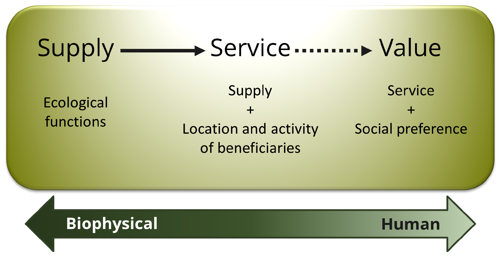
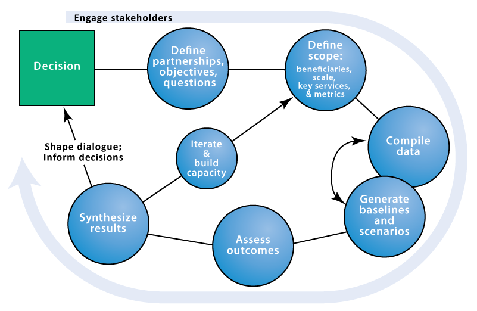
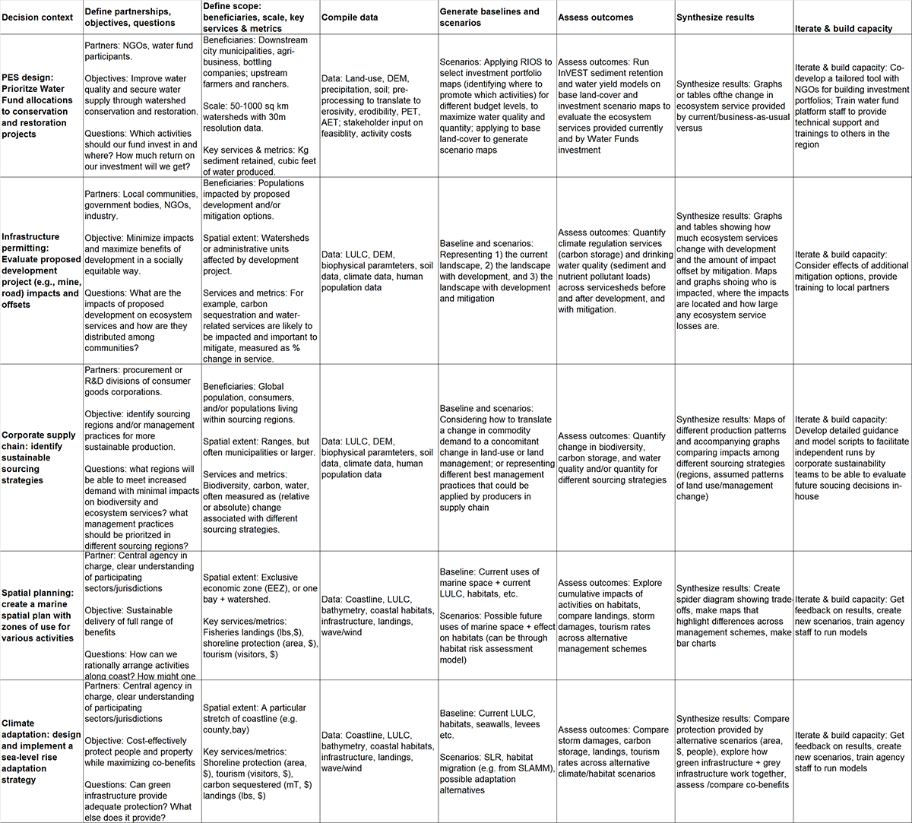

..所需:

*****************************************************
为什么我们需要工具来绘制和评估生态系统服务
*****************************************************

介绍
============

生态系统如果管理得当，会产生对人类至关重要的服务，包括物质产品生产(例如食物)、生命维持过程(例如水净化)、令生命感到满足的条件(例如美丽、娱乐机会)以及（未来）选择的保留(例如供未来使用的遗传多样性)。尽管这种自然资本很重要，但人们对它知之甚少，且几乎没有监测，在许多情况下它正在迅速退化和枯竭。为了将对自然价值的理解带入决策中，自然资本项目正在开发量化和绘制生态系统服务价值的模型。该建模套件最适合分析多个服务和多个目标。与更复杂的工具相比，目前的模型对数据的要求较低，它们可以确定在哪些地方进行投资可能改善人类福祉和自然。我们正在持续改进现有的模型，并开发新的模型。

我们使用千年生态系统评估(2005)对生态系统服务一词的定义：“人们从生态系统中获得的惠益。”生态系统包含生物和非生物成分，因此我们认为“生态系统服务”和“环境服务”是等同的。自然资本是生态系统中有助于提供生态系统服务的有生命的和没有生命的组成部分。资本资产有多种形式，包括制造资本(如建筑物和机器)、人力资本(知识、经验和健康)、社会资本(关系和机构)以及自然资本。

为什么要用InVEST?
======================

InVEST旨在为有关自然资源管理的决策提供信息。从本质上讲，它提供了有关生态系统的变化可能如何导致对人类的惠益流动发生变化的信息。决策者，从政府到非营利组织再到企业，经常管理多种用途的土地和水域，不可避免地必须评估这些用途之间的权衡。InVEST的多服务、模块化设计为探索变更管理方式和不同气候情景所产生的可能结果以及评估部门和服务之间的权衡提供了一个有效的工具。例如，政府机构可以利用InVEST来帮助确定如何管理土地、海岸和海洋区域，使其为人们提供一系列理想的惠益，或者帮助设计推进或缓解的计划，以维持自然对社会的惠益。保护组织可以利用InVEST，更好地将其保护生物多样性的使命与改善人类生计的活动结合起来。消费品公司、可再生能源公司和水务公司等公司也可以使用InVEST来决定如何以及在哪里投资自然资本，以确保其供应链是可持续和安全的。

InVEST可以帮助回答如下问题:

+ 生态系统服务在哪里产生，在哪里被消费？
+ 一项拟议的林业管理计划对生物多样性、水质和娱乐活动有何影响？
+ 什么样的海岸管理和渔业政策能为可持续渔业、海岸线保护和娱乐活动带来最好的回报？ 
+ 流域的哪些部分提供了最大的碳固存、生物多样性和旅游价值？
+ 在保持或减少水流损失的同时，在哪里植树造林能实现下游水质效益最大化？
+ 气候变化和人口增长是如何影响生态系统服务和生物多样性的？
+ 除了为可再生能源设施、渔业和水产养殖提供安全可靠的选址外，海洋空间规划还能给社会带来什么好处？

InVEST介绍
======================

InVEST是一种探索生态系统的变化可能如何导致流向人们的惠益产生变化的工具。

InVEST通常采用生产函数法来量化和评估生态系统服务。生产函数规定了环境在给定条件和过程下提供的生态系统服务的产出。一旦生产函数被指定，我们就可以量化土地或水的变化对生态系统服务产出水平变化的影响。 

InVEST使用一个简单的框架来描述“供应、服务和价值”，将生产功能与提供给人们的利益联系起来(图1).

   生态系统服务供应链，将生态功能与生态系统服务和为人民提供的利益联系起来

“供应”代表生态系统潜在的可用资源(即生态系统的结构和功能能提供什么)。例如，正是由于红树林的特定位置和密度才提供了海浪衰减和随后的陆地侵蚀和洪水减少。“服务”包含了需求，因此使用了有关该服务受益者的信息(例如，人们住在哪里、重要的文化遗址、基础设施等)。“价值”包括社会偏好，并考虑到经济和社会指标的计算(例如，避免水土流失和洪水造成的破坏、受影响的人数)。

本指南中描述的InVEST工具集包括对陆地、淡水和海洋系统提供的效益进行量化、绘制和评估的模型。我们将InVEST中的模型分为四个主要类别:1)支持服务，2)最终服务，3)促进生态系统服务分析的工具，4)支持工具。支持服务是其他生态系统服务的基础，但并不直接为人们带来惠益。最终服务为人们提供直接的惠益。对于最终的服务，我们将服务分为生物物理供应和尽可能为人提供的服务。对于一些最终服务，我们直接对服务进行建模，而不对供应进行单独建模。支持工具包括帮助创建流域，对数字高程模型进行水文处理，并创建可作为InVEST输入的场景。

生态系统支持服务:
^^^^^^^^^^^^^^^^^^^^^^^^^^^^^^

+  生境风险评估

+  生境质量

+  传粉者丰度：农作物授粉

生态系统最终服务:
^^^^^^^^^^^^^^^^^^^^^^^^^

+  森林碳边缘效应

+  碳储存和封存

+  海岸蓝碳

+  年产水量

+  养分输送比

+  泥沙输移比

+  畅通无阻的景色:提供风景质量

+  旅游:娱乐和旅游

+ 	波能生产

+  海上风能生产

+  农作物生产

+ 	季节性产水量

促进生态系统服务分析的工具: 
^^^^^^^^^^^^^^^^^^^^^^^^^^^^^^^^^^^^^^^^^^^^^^^

+  叠加分析

+ 	沿海脆弱性

+ 	InVEST GLOBIO 

支持工具: 
^^^^^^^^^^^^^^^^^

+ 	DEM路径

+  IT描绘

+  场景生成器

+  场景生成器:基于近邻

使用InVEST来指导决策
================================

当问题由决策者和利益相关方而不是由科学家和分析师提出时，关于生态系统服务变化的信息最有可能产生影响。我们发现InVEST在决策过程中使用是最有效的。自然资本项目在全球60多个国家使用了InVEST。查看NatCap网站(https://naturalcapitalalliance.stanford.edu/impact/where-we-work)的“我们工作的地方”部分，了解我们项目的最新地图和相关描述。通过我们应用InVEST和辅助形成决策的经验，我们已经看到了InVEST工具在自然资本路径大背景的应用。 

我们的方法(图2)从一系列利益相关方磋商开始。通过讨论，确定政策制定者、社区和保护组织感兴趣的问题。这些问题可能涉及当前的服务提供情况，以及这些服务如何受到未来新项目、政策和条件的影响。对于有关未来的问题，利益相关方制定相关“情景”，以探讨预期变化对自然资源的影响。这些设想通常包括未来土地利用和土地覆盖，或就海洋而言，包括未来沿海和海洋利用和沿海/海洋生境的地图。这些情景通过生物物理模型和经济模型来评估生态系统服务价值。在与利益相关方进行协商和方案制定之后，InVEST可以评估当前景观或未来方案下提供的生态系统服务量。InVEST模型是空间显式的，使用地图作为信息源，生成地图作为输出。投资回报可以是生物物理方面的绝对值或相对数量(例如，保留的泥沙吨或保留的泥沙变化百分比)，也可以是经济方面的(例如，固碳价值)。

提供决策的自然资本方法的阶段。

分析的空间范围也很灵活，用户可以在地方、区域或全球范围内解决相关问题。InVEST结果可以与创建场景的利益相关方和决策者共享，以便为即将进行的决策提供信息。使用InVEST是一个迭代过程，利益相关方可以根据模型所揭示的信息选择创建新的场景，直到为管理行动确定合适的解决方案为止。

下面的图3提供了一些具体的示例，说明如何使用常规方法来影响不同类型的决策。

   自然资本项目如何使用生态系统服务方法为各种背景下的决策提供信息的例子。该表中的列对应于上面图2所示的自然资本方法的各个阶段。

正在进行中的工作
==================

InVEST是在BSD开源许可下授权的免费软件产品。

InVEST的开发是自然资本项目的一项持续努力。我们大约每三个月发布一次工具包的更新版本，包括更新的科学、性能和功能增强、bug修复和/或新模型。作为历史笔记，最初的InVEST模型是在ArcGIS中构建的，但现在所有模型都以独立的形式存在，可以直接从Windows或Mac操作系统启动，不依赖其他软件。 

关于InVEST版本的说明: 关于投资版本控制的说明:整数更改将反映重大更改。例如，从2.6.0到3.0.0的过渡表示从ArcGIS模块到独立版本的过渡。小数点后数字的增量表示主要的新特性(例如，新模型的添加)或主要的修订。第三个小数点表示没有新功能的小功能修订或bug修复。

指南
==========

指南将帮助您理解InVEST模型的基础知识，并开始使用它们。下一章将引导您完成安装过程，并提供关于该工具及其接口的一般信息。

其余章节介绍了各个生态系统服务模型。每一章包含:

+ 简要介绍一个服务，并建议InVEST结果的可能用途;

+ 解释模型的工作原理，包括重要的简化、假设和限制;

+ 描述运行模型所需的数据，这是至关重要的，因为InVEST结果的意义和价值取决于输入数据;

+ 提供如何输入数据和与工具交互的分步说明;

+ 为解读InVEST结果提供指导;

+ 包括有关数据来源的信息和数据准备建议的附录(本节在各章中有所不同，并将随着时间的推移根据用户的输入进行改进)。

许多与这些模型的科学基础相关的理论可以在《自然资本:绘制生态系统服务的理论与实践》(牛津大学出版社)一书中找到。然而，在那本书中应用和讨论的模型与InVEST工具集中介绍的模型并不完全相同，而本用户指南提供了模型当前版本的最新描述。

