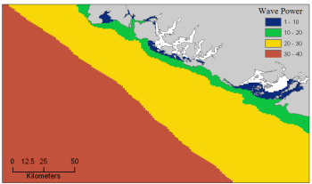

.. _波浪能:

**********************
波浪能生产
**********************

摘要
=======

决策者和公众对将波浪能转换成电能越来越感兴趣，他们希望波浪可以成为清洁、安全、可靠和可负担得起的能源。InVEST波能量模型(WEM)的目标是绘制和评估海浪所提供的能源供应服务，进而评估定位波能量转换(WEC)设施的过程中可能会出现的得失。WEM评估了潜在的波浪发电、基于波条件获得的波能（例如，有效波高和波周期峰值）以及WEC设备的技术特有信息（例如：性能表和最大容量）。然后，该模型会通过经济参数（例如：电价、贴现率、以及安装和维护成本），计算WEC设施的建造和运营相对于其使用寿命的净现值(NPV)。获得准确的输入数据和模型的经济部分的参数估值是一个重大的挑战，因为至今为止尚没有商业规模的波能源设施。我们建议，通过默认值计算得出的波能源设施的净现值仅用于不同站点之间的相对比较。WEM的输出信息在空间上提供了明确的信息，显示了WEC设施选址的潜在领域以及最大的能源生产和价值。这个WEC的站点特定和设施特定的信息可以用来识别和量化定位波能量设施的过程中可能会出现的潜在得失。决策者和利益相关者可以使用WEM来更好地理解在哪里安装WEC设施可以获得最大的波能量，同时将对沿海和海洋生态系统以及其他人类使用的影响降到最低。

简介
============

　　波能有许多对于对于有效发电十分重要的特征，被认为是努力满足人类日益增长的能源需求的潜在重大贡献者(Barstow et al. 2008)。在各种可再生能源资源中，波能具有最大的功率密度，为电网操作提供了相对连续的和可预测的电能重要优势(Bedard et al. 2005)。自20世纪80年代以来，波能发电的费用逐渐降低，并且随着技术的发展以及波能工业的扩大，还有可能会进一步降低(Thorpe 1999)。考虑到化石燃料能源的成本增加以及人们对可再生能源的浓厚兴趣，在不久的将来，波能可能是经济可行的。因此，决策者和公众对波能转换成电能越来越感兴趣，他们希望波浪可以成为清洁、安全、可靠和可负担得起的能源，同时不会产生温室气体。由于人们对波能这一可再生能源的兴趣越来越浓厚，对于帮助决策者进行波能设施选址的框架的需求越来越多。我们这里描述的WEM将为规划者提供信息，进而用来平衡海洋和沿海生态系统的现有使用中获得的波能量。
　　在全球范围内，可利用的波能资源大约相当于目前世界电力消耗的20%，但是它们会根据位置出现显著的潜在变化(Cornett 2008)。此外，在靠近海岸的地区，“热点”（其特点是压缩波能）显示了获得波能的最高潜力(Cornett and Zhang 2008; Iglesias and Carballo 2010)。 因此，在为波能转换（WEC）设施选址时，确认波能富集区属于第一步。

　　已经拟定了WEC设备的各种技术，用来捕获波能，这些设备的特定特征就是在量化可以捕获的波能中发挥关键作用。因此，WEC设备的选择也是按地点、在不同波浪条件下有效地收集不同波能的一个重要组成部分。

　　波能设施的经济价值可以用来比较跨站点和设备特定技术的净收益。如同大多数可再生能源项目一样，可以在经济评估中包括许多不同的因素。这些因素包括：向电网输送能源的价值，与传统资源相比、波能项目相关的污染的减少，丧失沿海和海洋地点使用权的成本，以及建设和运营这些设施的环境成本。在实践中，所有相关收益和成本，尤其是那些涉及到环境效益和成本的因素，均是很难衡量的，也是很难纳入正式的成本效益分析中的。我们采取了一种简单的方法来将其中一些信息纳入到可用于与正式成本效益分析类似的框架中，而不是忽略这些潜在的影响。
　　虽然波能可以提供清洁和可再生能源，没有明显的温室气体排放，但是波能项目可能与现有的海洋使用或海洋物种和栖息地保护政策相冲突。WEC设施有可能会影响捕鱼机会、远洋和底栖生物栖息地、休闲活动、审美视角、水动力和波环境、导航、以及有毒物质在生物体内的积累 (Boehlert et al. 2007; Nelson et al. 2008; Thorpe 1999)。这些潜在影响的严重程度可能会具体到站点方面。同时，鉴于至今为止与波能项目有限的相关经验，几乎没有描述相关影响的经验证据。因此，识别和评估与WEC设施选址相关的潜在得失是海洋空间规划以及海洋和海岸环境的其他形式的决策中非常重要的组成部分。

此处的WEM可以评估：1) 潜在的波浪发电，2)捕获的波能，以及3) WEC设施的净现值。WEM的输出会在空间上提供明确的信息，显示了WEC设施选址的潜在领域以及最大的能源生产和价值。这个WEC的站点特定和设施特定的信息可以用来估计WEC设施的选址将如何影响和（或）改变现有海岸和海洋使用。例如，WEM允许用户通过映射和量化空间竞争以及商业和休闲活动的现有海洋用途（例如：钓鱼、导航、赏鲸、皮划艇等)来探索潜在的得失。

模型
=========

WEM的目的是，通过探索能源设施选址的潜在成本和效益，帮助在波能项目背景下促进海洋空间规划。该模型可以使用默认的输入数据集进行运行，该数据集是全球和地区性可用的，或者可以与本地输入数据一起使用。

工作原理
------------

潜在的波浪发电资源评估
^^^^^^^^^^^^^^^^^^^^^^^^^^^^^^^^^^^^^^^^

按不规则波传输的波峰长度的每单位宽度的波能可以近似为：

.. math:: P_n = {{\rho * g}\over 16} H^2_s C_g (T_e,h)
   :label: wave_power

其中 :math:`P_n` 是波能 (kW/m), :math:`\rho`是海水密度(1,028 kg m\ :sup:`-3`), :math:`g` 是重力加速度 (9.8 m s\ :sup:`-2`), :math:`H_s` 是有效波高(m), and :math:`C_g` 是波群速度 (m s\ :sup:`-1`) ，它是波能周期, :math:`T_e` (sec),和水深:math:`h` (m) 的函数(Cornett 2008). :math:`C_g` 可以作如下估计：

.. math:: C_g = { {\left(1 + {{2kh}\over \sinh(2kh)}\right) \sqrt{{g\over k} \tanh(kh)}}\over 2 }
   :label: wave_group_velocity

其中波数 :math:`k` 是通过作为波频(:math:`w = 2\pi / T_e`) 和水深 :math:`h`:的色散关系函数计算得出的，表示为：

.. math:: w^2 = {gk * \tanh(kh)}
   :label: wave_freq

迭 代 的 数 值 方 案 可 以 应 用 于 求 解 方 程 :eq:`wave_freq` 以及初步估计:math:`k = {w^2 / {(g \cdot \sqrt{tanh(w^2 \cdot h/g)})}}`. 测量得出的波周期或模拟海面状态得出的波周期很少表达为 :math:`T_e`, 相反, 它们通常被指定为波高峰时期:math:`T_p`. 因此, 波能高峰时期可按如下进行预估 :math:`T_e = \alpha \cdot T_p`. 其中, :math:`\alpha` 是确定波谱形状的常数。 我们使用 :math:`\alpha` = 0.90 作为默认值，同时假定使用标准JONSWAP波普, 该波普适用于单源波主导下的波浪的海面状态，以及波普是单峰的情况 (Cornett 2008)。同样的假设也用于全球波浪发电资源评估 (Cornett 2008) 和加拿大西海岸的波浪发电计算 (Cornett and Zhang 2008; Dunnett and Wallace 2009)。

　　我们为潜在的波浪发电资源计算准备了全球和地区性可用的输入数据层。我们使用 NOAA WAVEWATCH III (NWW3) 模型追算再分析结果 (version 2.22) ，以获得:math:`H_s` 和 :math:`T_p`确定的波浪特征. 根据全球和区域电网系统，NWW3空间分辨率范围为4到60弧分[h美1]。我们使用ETOPO1来获取水的深度 (:math:`h`), 它提供了1弧分的全球海洋深度测量法信息 (Amante and Eakins 2009)。当使用默认的输入数据层时，该模型结果提供了世界上任何目标区域的潜在电力资源的一级近似。然而, 然而，模型结果的空间分辨率可能不够精细，无法评估沿海地区附近的波浪发电资源。因此，在接下来的版本中，这个模块将允许用户基于本地研究添加自己的波输入 (e.g., nearshore wave model results)。

.. _captured-wave-energy-assessment:

已捕获的波浪能源评估
"""""""""""""""""""""""""""""""
已捕获的波浪能量可以作为海面状态和WEC设备波能吸收性能的函数预估
 (Previsic 2004a, Previsic 2004b)。海面状态是海洋表面的一般情况，常常表现为两个参数，为有效波高:math:`H_s` 和波峰周期 :math:`T_p`. 长期波浪的时间序列数据可用于计算每个海面状态在一个特定时期内产生的小时数. 我们准备了全球和地区性海面状态表，其中使用3小时间隔的NWW3海浪模型结果，周期为5年。该表是在温哥华岛的西海岸，每个海面状态收集器的年度产生小时数的一个示例。在这个例子中, :math:`H_s` = 2.5 m 和 :math:`T_p` = 10.0 sec 的海面状态是最主要的, 每年产生115个小时。

   在温哥华岛的西海岸，每个海面状态收集器的年度产生小时数（小时/年）。.

　　WEC设备捕获波能的能力可以表示为WEC设备制造商可用的波能吸收性能。我们已经对WEC设备做出了文献综述，其中包含其公开信息，并编制了波能吸收性能表。虽然这些设备在快速变化的近海波浪能源工业中属于技术过时的设备，但是它们已经接受了全面的海洋测试和验证。目前，InVEST WEM包括默认输入参数性能表：

+ PWP-Pelamis (Pelamis Wave Power Ltd 2010; Previsic 2004b)
+ Energetech-OWC (Previsic 2004a)
+ AquaBuOY (Dunnett and Wallace 2009)
+ WaveDragon (Dunnett and Wallace 2009)
 

   Pelamis 的每个海面状态收集器的波能吸收性能(千瓦)

通过将年度产生小时表中的每个单元与波能吸收性能表的每个对应单元相乘，已捕获的波能是针对每个海面情况收集器进行计算的。每个WEC设备的已捕获的年度波能(千瓦时/年)是通过加总每个海面状态收集器的所有已捕获的波能计算得出的。一些WEC设备在响应特定场地条件时有能力优化性能（Previsic 2004 b），用户可能需要调整WEC设备的默认参数，或者在他们自己的机器特有值中进行应用，以便更加准确地评估已捕获的波能。

净现值评估
""""""""""""""""""""""""""""
　　我们使用成本效益分析框架来评估波浪能源设施的建设和运营。我们结合与收益 (:math:`B_t`) 和成本(:math:`C_t`) 最为相关的测量来计算海洋空间中特定位置上的波能设施的净现值。特定的波浪能源设施的净现值为：
　　
.. math:: \sum^T_{t=1}{(B_t - C_t)}{(1 + i)}^{-t}
   :label: eq4

上式是针对WEC设施的整个生命周期 :math:`T`,来计算的。在对未来收益和成本的价值进行贴现时，折现率:math:`i` 是必需的。年度收益计算得出的是每千瓦时的产品电价以及每千瓦时的年度捕获波能 [#f1]_。我们假设在项目的第一年是没有收入的。请参考InVEST近海风能模型的估值部分来讨论适当的折现率和能源价格的选择。

年度成本可以分为初始安装费用和年度运营和维护成本。安装波能装置的初始成
本包括以下几类：1) 每安装千瓦的资本成本，其与设备相关，2) 系泊缆绳成本，3) 水下传输电缆的成本，4) 陆路传输电缆的成本[#f2]_。由于水下和内陆传输电缆的总成本取决于设备与最近的电网连接点之间的距离，净现值的计算允许用户评估确定波能资源的特殊位置的设施定位与在该位置上安装设备的距离成本之间的利弊得失。我们为波能的经济评估提供了默认经济参数表格，其中使用了之前章节中描述的四台机器中的三台机器:ref:`previous section <captured-wave-energy-assessment>`: PWP-Pelamis, AquaBuOY and WaveDragon. 所有成本均以2006年美元表示，并且应该以分析研究基准年进行通货膨胀的处理。详情见`Kim et al. (2012) <http://dx.doi.org/10.1371/journal.pone.0047598>`_ and `Plummer and Feist (2016) <http://dx.doi.org/10.1080/08920753.2016.1208877>`_ 以获取有关参数化模型经济部分的进一步指导。

限制和简化 
-------------------------------

模型的限制和简化以及模型解释指导的相关警示文字：

1. 波输入数据的质量决定了模型结果的准确性。因此，用户需要了解波输入数据的质量，从而对WEM结果进行适当的解释。例如，默认波输入数据更适合于4或60弧分的空间分辨率的全球和区域范围应用。关于感兴趣区域的波发电的详细分析，用户可能希望以更为精细的空间分辨率来提供波模型结果。

2. 捕获的波能表明的是每个WEC设备每年平均吸收的能量。对WEC设备的实际能源生产的估计，用户可能需要考虑其他的技术特定信息，例如设备的可用性、能量转化效率以及定向因素。对于一些WEC设备，提高性能可能不需要对设备结构进行较大地变动，用户可以将调整因素应用到性能表中。关于WEC设施的实际波能生产预估的进一步讨论，请咨询Previsic(2004 a,2004 b)。

3. 由于到目前为止并没有相应的商业规模的波能设施，获得精确的成本数据成为了一个挑战。我们为几个公开的波能装置提供了默认值。因为这些成本可能是不准确的或过时的，因此我们建议使用默认值计算得出的波能设施的净现值可以用于不同站点之间的相对比较。这些相对比较将表明，潜在的波浪发电资源和与电网之间的距离将对预估的项目成本产生巨大的影响。应特别谨慎地解释净现值计算的大小。

4. 提供的成本估计会按照波浪发电厂的从小型到中型的尺寸进行调整 [#f3]_。较大的农场可能会由于生产较多的机器而节约成本，但也可能需要更高的容量和（或）额外的传输电缆。如果您想要模拟能量捕获量或更大农场的相关成本，您该仔细评估这些因素。

5. WEC设施与水下电缆降落点之间的测量距离是基于欧几里得度量，而且并不识别在两个目标点之间的任何大片陆地。用户在使用复杂深度测量法时，应该注意区域的距离估计。

.. _wem-data-needs:

数据需求
==========

- :investspec:`wave_energy workspace_dir`

- :investspec:`wave_energy results_suffix`

- :investspec:`wave_energy wave_base_data_path`

- :investspec:`wave_energy analysis_area` 用户还可以选择感兴趣的区域 (AOI, 请参阅下面的可选输入). AOI输入可以裁剪这些较大的区域，以便展开更详细的局部分析。如果没有制定AOI，该模型将对整个分析区域进行波能量计算。所有这些区域的基础数据集都包含在提供的示例数据中。

- :investspec:`wave_energy machine_perf_path`

  Example:

  .. csv-table::
     :file: ../../invest-sample-data/WaveEnergy/input/Machine_Pelamis_Performance_modified.csv
     :header-rows: 1
     :widths: auto

- :investspec:`wave_energy machine_param_path`

  Rows:

  - :investspec:`wave_energy machine_param_path.rows.capmax`
  - :investspec:`wave_energy machine_param_path.rows.hsmax`
  - :investspec:`wave_energy machine_param_path.rows.tpmax`

  Example:

  .. csv-table::
     :file: ../../invest-sample-data/WaveEnergy/input/Machine_Pelamis_Parameter.csv
     :header-rows: 1
     :widths: auto

- :investspec:`wave_energy dem_path` 此信息被纳入潜在波动力计算以及经济分析评估中，以便确定在系泊缆绳到达降落点之前向海底输送缆索的成本。如果用户指定的栅格输入未覆盖整个AOI，则此覆盖区域之外的结果将不包括波能计算。为确保模型正常运行，请您确保输入了覆盖分析区域。样本数据提供了分辨率为1弧分的默认全球测深数据。如果您使用的波输入数据分辨率超过1弧分分辨率，我们建议使用默认提供的测深数据。

- :investspec:`wave_energy aoi_path` 您如果需要进一步缩小分析区域，请提供此输入。它指示模型在何处裁剪输入数据并定义分析的确切区域。

- :investspec:`wave_energy valuation_container`

- :investspec:`wave_energy land_gridPts_path`

  Columns:

  - :investspec:`wave_energy land_gridPts_path.columns.id`
  - :investspec:`wave_energy land_gridPts_path.columns.type`
  - :investspec:`wave_energy land_gridPts_path.columns.lat`
  - :investspec:`wave_energy land_gridPts_path.columns.long`
  - :investspec:`wave_energy land_gridPts_path.columns.location`

- :investspec:`wave_energy machine_econ_path` 模型提供了三个不同机器的示例数据。其可以使用任何货币，只要在不同的输入中保持一致。样品成本以2006年的美元计价。

  Rows:

  - :investspec:`wave_energy machine_econ_path.rows.capmax`
  - :investspec:`wave_energy machine_econ_path.rows.cc`
  - :investspec:`wave_energy machine_econ_path.rows.cml`
  - :investspec:`wave_energy machine_econ_path.rows.cul`
  - :investspec:`wave_energy machine_econ_path.rows.col`
  - :investspec:`wave_energy machine_econ_path.rows.omc`
  - :investspec:`wave_energy machine_econ_path.rows.p`
  - :investspec:`wave_energy machine_econ_path.rows.r`
  - :investspec:`wave_energy machine_econ_path.rows.smlpm`

  Example:

  .. csv-table::
     :file: ../../invest-sample-data/WaveEnergy/input/Machine_Pelamis_Economic.csv
     :header-rows: 1
     :widths: auto

- :investspec:`wave_energy number_of_machines` 为了确定向机器输入一个合理的数量，我们建议用户将机器的最大容量 (参考输入 #5) 除以所需的已捕获的能量数量。例如，如果用户希望捕获21000千瓦的波能，那么波浪能源场将会有28个Pelamis (最大容量为750kW), 或 84个AquaBuoy (最大容量为 250kW), 或3个WaveDragon (最大容量为 7000kW).

.. _wave-energy-interpreting-results:

结果解释
====================

模型输出
-------------

输出文件夹
^^^^^^^^^^^^^

+ Output\\wp_kw & Output\\wp_rc

  + 这些栅格层描述了用户特定区域的潜在波能发电，单位为千瓦/米。后者 ("_rc") 是对前者按照分位数进行的重新分类 (1 = < 25%, 2 = 25-50%, 3 = 50-75%, 4 = 75-90%, 5 = > 90%).  ("_rc") 栅格也随附着一个csv文件，其中显示了每个分位数组的值域范围以及每组的像素数量。 
  + 潜在的波能发电地图基于波的条件显示了波能发电资源。这些通常提供了波能项目的选址过程中的首个剪辑。

+ Output\\capwe_mwh & Output\\capwe_rc

  + 这些栅格层描述了指定区域的每个WEC设备的已捕获的波能，单位为兆瓦/年。 后者 ("_rc") 是对前者按照分位数进行的重新分类(1 = < 25%, 2 = 25-50%, 3 = 50-75%, 4 = 75-90%, 5 = > 90%).  ("_rc") 栅格也随附着一个csv文件，其中显示了每个分位数组的值域范围以及每组的像素数量。
  + 捕获的波能地图提供了用于比较作为场地特定波浪条件函数的不同WEC设备的性能的有用信息。

+ Output\\npv_usd & Output\\npv_rc

  + 这些栅格层描述了用户指定区域的WEC设施在25年寿命期内的净现值，单位为千美元。后者("_rc") 是对前者按照分位数进行的重新分类 (1 = < 25%, 2 = 25-50%, 3 = 50-75%, 4 = 75-90%, 5 = > 90%).  ("_rc") 栅格也随附着一个csv文件，其中显示了每个分位数组的值域范围以及每组的像素数量。

  + 净现值地图显示的是由多个设备组成的WEC设施的经济价值。正值表示净效益；负值表示净亏损。这些信息可以用来确定波浪能源设施可能是经济可行的潜在区域。
  + 如果您已经选择运行经济估算，那么仅产生一项输出。

+ Output\\LandPts_prj.shp and GridPt_prj.shp

  + 这些特征层包含水下电缆降落点位置和电网连接点的信息。
  + 降落点和电网连接点针对净现值地图的解释提供了有用信息。
  + 如果用户选择运行经济估算，那么仅产生一项输出。

+ Parameters_[yr-mon-day-min-sec].txt

  + 每次模型运行，均将在工作区文件夹显现文本文件。文件会列出该运行的参数值，同时会根据日期和时间对文件进行命名。
  + 参数日志信息可以用来识别每个模拟情景的详细配置。

中间文件夹
^^^^^^^^^^^^^^^^^^^

+ intermediate\\WEM_InputOutput_Pts.shp

  + 这些来自于选中的波数据网格的点层是基于输入 #2-4.
  + 它们包含多种输入和输出信息，其中包括：:

    + I and J – 波输入网格点的指标值s
    + LONG and LAT – 经度和纬度的网格点
    + HSAVG_M – 平均波高 [m]
    + TPAVG_S – 平均波周期 [second]
    + DEPTH_M – 深度 [m]
    + WE_KWM – 潜在波能 [kW/m]
    + CAPWE_MWHY – 已捕获的波能 [MWh/yr/WEC device]
    + W2L_MDIST – 与最近的着陆连接点之间的欧几里得距离 [m]
    + LAND_ID – 最近的着陆连接点接近的编号
    + L2G_MDIST – LAND_ID与最近的电网连接点之间的欧几里得距离 [m]
    + UNITS – 被认为是在这个WEC设施上的WEC设备的数量
    + CAPWE_ALL – 场地上的所有机器的已捕获的总波能 [MWh/yr/WEC facility]
    + NPV_25Y – 25年的净现值 [thousands of units of currency]

  + 栅格格式下的模型格式是根据这些点数据进行插值的结果。因此，您可以利用这个信息来探索波输出数据点位置的必要输入和输出的确切值。

+ intermediate\\GridPt.txt and LandPts.txt
  + 这些文本文件日志记录了网格和着陆点的坐标。
  + 如果您选择运行经济估算，这只是一个中间输出。

说明结果的案例
=================================

下面的例子说明了温哥华岛西海岸(WCVI)的波能模型的应用。这些数据和地图仅
作为示例，并不不一定是对WCVI的精确描述。在这个例子中,我们使用输入数据层，其中包括：

1. 波基本数据 = 北美西海岸，4弧分的分辨率。2. 感兴趣区域 = AOI_WCVI.shp 3. WEC 设备 = Pelamis 4. 数字高程模型 = global_dem 5. 着陆和电网连接点= LandGridPts_WCVI.shp 6. 机器单元的数量 = 28 7. 投影 = WGS 1984 UTM Zone 10N.prj

为了生成一个电网电力生产设施，需要捕获至少10 kW / m的波浪发电 (Spaulding and Grilli 2010). 沿着WCVI，通常会达到这个阈值，大部分地区的年平均波浪发电大于10 kW / m。波浪发电逐渐向海面扩大。在10公里的海岸处，大约有20千瓦/米的波能是可用的，但是，在深度大于150米的位置的20公里的海面处，最大波浪发电30 - 40千瓦/米是可用的。

   温哥华岛的西海岸的波浪发电潜力(千瓦/ m)。

在这个例子中，已捕获的波能是基于750千瓦的额定功率的Pelamis设备下计算得出的。已捕获的波浪能量的总体模式类似于潜在的波浪发电。Pelamis设备位于50 - 70米等深线处，产生了大约2000 - 2300千瓦时/年的能量。假设在WCVI，每户能源使用量为15兆瓦/年(Germain 2003), 那么每个Pelamis设备产生的能量足以用来支持133 - 153户家庭。

   使用750千瓦额定功率的Pelamis设备的已捕获的波浪能源(千瓦时/年)。

对于已捕获的波能的经济估算，我们计算并绘制了WEC设施在25年寿命期内的净
现值。对于这个示例模型的运行，每个WEC设施均由28个 Pelamis设备组成。我们在估计时假定水下电缆成本为100000美元，电力价格为20美分/千瓦。净现值为正出现在5 -10公里离岸的海岸线上。它会向海面扩大，并且在距离海岸的25 - 90公里的位置出现最大的净现值（所有净现值计算值(4668 k - 7307 k美元)的前20%）。

   25年寿命周期的净现值(千美元)，水下传输电缆的成本为每公里100000美元。两个水下电缆着陆点位于托菲诺和尤克卢利特(×)，电网连接点位于尤克卢利特(o)。每个WEC设施均由28个Pelamis设备组成，电力价格设定在每千瓦20美分。
 

因为到目前为止并没有商业规模的波浪能源设施，因此在经济参数方面存在较大
的不确定性。特别是，水下传输电缆具有高度不确定的成本，范围在每公里100000美元到1000000美元。对于电缆成本，净现值使用每公里100000美元的成本下限。当我们使用水下传输电缆成本的中位数时（每公里500000美元），如果净现值为正，则表明该区域正在显著缩减。

在这个例子中，净现值为仅出现在托菲诺和尤克卢利特的两个水下电缆接地点附
近的50公里范围内。前20%的净现值落在两个接地点的10-40公里距离范围内。当传输电缆成本使用上限(1000000美元/公里)时，在WCVI中不存在正的净现值。基于经济参数的不确定性，用户在解释净现值大小时，应该十分谨慎。我们建议使用默认值的波浪能源设施的净现值计算仅用于不同站点之间的相对比较。

   25年寿命周期的净现值(千美元)，水下传输电缆的成本为每公里500000美元。两个水下电缆着陆点位于托菲诺和尤克卢利特(×)，电网连接点位于尤克卢利特(o)。每个WEC设施均由28个Pelamis设备组成，电力价格设定在每千瓦20美分。

附录：数据来源
======================

波数据: 有效波高 (:math:`H_s`) 和波周期峰值 (:math:`T_p`)
-----------------------------------------------------------------------------------
全球海洋波浪浮标数据可从美国国家海洋和大气管理局的国家数据浮标中心 (https://www.ndbc.noaa.gov/)中查询。虽然海浪浮标提供了最准确的波时间序列数据，但是其空间分辨率是很粗略的，它可能不适合用于当地的规模分析

美国国家海洋和大气管理局的国家气象服务提供了WAVEWATCH III模型追算再分析结果 (https://polar.ncep.noaa.gov/)。 该模型的空间分辨率结果范围为4 – 60弧分，取决于全球和区域电网系统。已经将1999年至今的模型输出按照每三个小时为一个时间区间的形式进行保存。已经通过海洋浮标数据在多数地方验证了模型结果，同时模型结果提供了优质波浪信息。

波能吸收性能
----------------------------------
EPRI 波 能 转 换 项 目 提 供 了 数 个 WEC 设 备 的 审 查 功 能: http://oceanenergy.epri.com/waveenergy.html。 最新的技术更新可以从WEC设备制造中查询。
   + PWP-Pelamis
   + AquaBuOY
   + WaveDragon: http://www.wavedragon.net/
   + DEXAWAVE: http://www.dexawave.com/

:ref:`Bathymetric DEM <bathymetry>`
-----------------------------------

参考文献
==========
Amante, C., and B. W. Eakins. 2009. ETOPO1 1 Arc-minute global relief model: procedures, data sources and analysis, p. 19. NOAA Technical Memorandum NESDIS NGDC-24.

Barstow, S., G. Mørk, D. Mollison, and J. Cruz. 2008. The wave energy resource, p. 94-131. In J. Cruz [ed.], Ocean Wave Energy: current status and future prepectives. Springer.

Bedard, R., G. Hagerman, M. Previsic, O. Siddiqui, R. Thresher, and B. Ram. 2005. Offshore wave power feasibility demonstration project: final summary report, p. 34. Electric Power Research Institute Inc.

Boehlert, G. W., G. R. Mcmurray, and C. E. Tortorici. 2007. Ecological effects of wave energy development in the Pacific Nothwest, p. 174. U.S. Dept. Commerce, NOAA Tech. Memo.

Cornett, A., and J. Zhang. 2008. Nearshore wave energy resources, Western Vancouver Island, B.C., p. 68. Canadian Hydraulics Centre.

Cornett, A. M. 2008. A global wave energy resource assessment. Proc. ISOPE 2008.

Dunnett, D., and J. S. Wallace. 2009. Electricity generation from wave power in Canada. Renewable Energy 34: 179-195.

Germain, L. A. S. 2003. A case study of wave power integration into the Ucluelet area electrical grid. Master Thesis. University of Victoria.

Iglesias, G., and R. Carballo. 2010. Wave energy and nearshore hot spots: the case of the SE Bay of Biscay. Renewable Energy 35: 2490-2500.

Kim, C.K.

Kim, C.K., J. Toft, M. Papenfus, G. Verutes, A. Guerry, M. Ruckelshaus, K. Arkema et al. 2012. Catching the right wave: evaluating wave energy resources and potential compatibility with existing marine and coastal uses. PloS one 7, no. 11: e47598.

Nelson, P. A. and others 2008. Developing wave energy in coastal California: potential socio-economic and environmental effects, p. 182. California Energy Commission, PIER Energy-Related Environmental Research Program, and California Ocean Protection Council.

Pelamis Wave Power Ltd. 2010. Pelamis Wave Power.

Plummer, M. and B. Feist. 2016. Capturing energy from the motion of the ocean in a crowded sea. Coastal Management 44, no. 5: 1-22.

Previsic, M. 2004a. System level design, performance and costs - San Francisco California Energetech offshore wave power plant. EPRI.

---. 2004b. System level design, performance and costs for San Francisco California Pelamis offshore wave power plant, p. 73. EPRI.

Spaulding, M. L., and A. Grilli. 2010. Application of technology development index and principal component analysis and cluster methods to ocean renewable energy facility siting. Marine Technology Society Journal 44: 8-23.

Thorpe, T. W. 1999. A brief review of wave energy, p. 186. The UK department of trade and industry.

Wilson, J. H., and A. Beyene. 2007. California wave energy resource evaluation. Journal of coastal research 23: 679-690.

.. rubric:: Footnotes

.. [#f1] Both the discount rate and the wholesale price of electricity are user-defined inputs for which we provide example values. In many cases, fixed tariff or feed-in tariffs are being discussed to help promote development of renewable energy projects. 

.. [#f2] We do not consider the costs of additional land-based infrastructure that may be required to connect an offshore facility to the grid, nor do we consider the costs of permitting a wave energy project. Costs estimates for different wave energy conversion devices were derived from Dunnett and Wallace (2009) and are given in 2006 USD$.

.. [#f3] Wallace and Dunnett (2009) model 24 devices in their application.

[h美1]不太明晰 翻译是否正确
