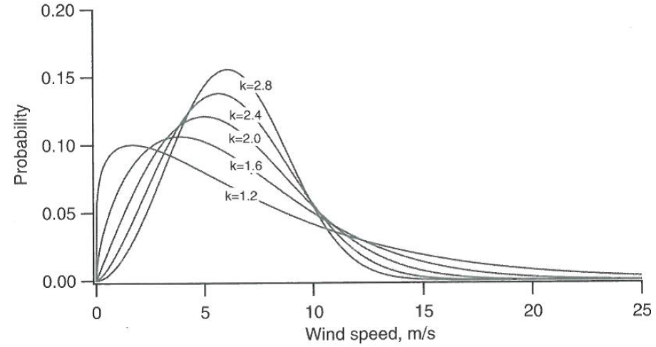
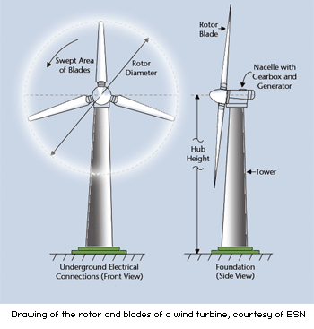
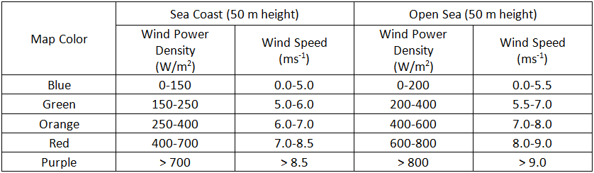
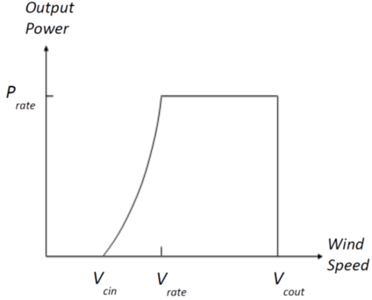
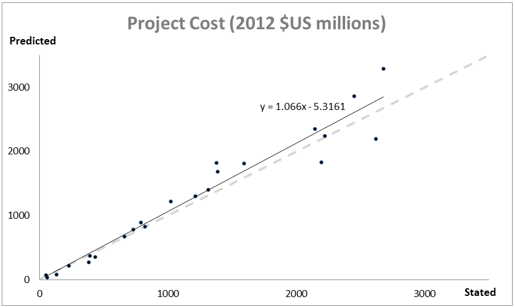

.. _wind-energy:

*******************************
海上风能生产
*******************************

概要
=======

离岸风能正在全球获得关注，截至2013年1月全球总共安装了5400兆瓦(MW)，每年的增长率在25%左右(GWEC,2013)。持续较高的离岸风能以及靠近沿海负荷中心成为风能开发人员持续关注离岸海域的两个主要原因。InVEST离岸风能模型的目的是提供能源资源可用性的空间分布、能源发电潜力、以及(可选)允许用户评估选址决策、使用利弊、以及一系列其他海洋空间规划问题的能源生产价值。该模型的开发主要用于向用户提供最大的灵活性，因为它可以通过默认数据和参数运行，但它也可以很容易地更新新的涡轮和基础信息、电网连接信息以及符合用户情境的参数值。模型输出包括风力发电潜力、能源生产、碳排放抵消、净现值、以及平均化的能源成本，所有均属于发射场的级别。

Peer-reviewed references for this model are http://dx.doi.org/10.1016/j.aquaculture.2014.10.035 for the financial portion of the model and http://dx.doi.org/10.1016/j.marpol.2015.09.024 for the physical portion.

简介
============

这种风能模型提供了一个可以轻易复制的界面，进而在您的地区的不同风电场的 设计情景中评估风能的可行性。输出的是栅格地图，其中的点值代表的是以该点为中 心的风电场的合计价值。这允许对选址选择进行精细、详细的分析，尽管它假定条件 围绕中心充分对称，中心点代表所有涡轮机的平均条件。由于用户可以选择风能长的 涡轮机的数量，因此栅格地图并不会指出风电场的规模，该模型还会输出随机选定的 风能数据点的代表性多线交叉多边形，这个数据点表明了风电场的大小。
运行模型，您需要向绘图用户界面提供信息。其中包括涡轮机的类型、涡轮机的
数量、感兴趣区域等等。为了减少所需的输入，该模型将两个常见的海上风力涡轮机的默认数据纳入了.csv表格中：3.6 兆瓦和5.0兆瓦。此外，该模型还包括较为不常见的、已更改的默认值表格，用于将模型的各个部分进行参数化，被称为―全球风能参数‖文件。这些.csv文件属于必要输入，如果可以通过文本编辑器或Microsoft Excel直接编辑文件来获得替代值，那么这些文件便可能会被修改修改这些文件时，建议用户复制默认.csv文件，进而不会丢掉原来的默认值

模型
=========

风能潜力
---------------------

风能模型可以预估风电密度（风能潜力），从而识别近海区域较高的能源潜力。特定位置的风电密度 :math:`PD (Wm^{-2}`)可以近似为风能统计的函数 (Elliott et al., 1986)

.. math:: \frac{1}{2}\rho\sum^c_{j=1}f(V_j)V_j^3
   :label: wind_power_density

其中, :math:`\rho` 是平均空气密度 (:math:`kg\,m^{-3}`), :math:`j` 是风速等级的标记, :math:`c` 风速等级的数量, :math:`V_j` 是第j个等级的风速 (:math:`ms^{-1}`), 以及 :math:`f(V_j)` 是:math:`V_j` 的概率分布密度函数. 通常用于风力数据分析的主要有两个概率分布: 1) 瑞利分布和 2) 威布尔分布 (Manwell et al. 2009). 威布尔分布能更好地代表一个更为广泛的多种的风况 (Celik 2003; Manwell et al. 2009), 并且表示为：

.. math:: f(V_j) = \frac{k}{\lambda}\left(\frac{V_j}{\lambda}\right)^{k-1}e^{-\left(\frac{V_j}{\lambda}\right)^k}
   :label: weibull_dist

其中, :math:`k` and :math:`\lambda` 分为为形状和比例因子.形状因子, :math:`k`, 可以确定威布尔分布概率密度函数的形状。(:numref:`weibull-fig`). 随着:math:`k` 的增长,概率密度函数分波峰更为突出，这表明在平均风速附近存在一致的风速.另一方面, 如果k不断减小，函数曲线会变得比较光滑，这表明风速变化变大，出现更为频繁的低风速和高风速.该模型要求风速输入符合估计的威布尔参数，而不是采用原始风速数据. 对于我们的样本数据，我们使用 MATLAB 函数 'wblfit', 来估计:math:`k` and :math:`\lambda` 风速参考高度 (观测或估计风速的高度),其返回给定风能时间序列数据的条件下，威布尔分布参数的最大似然估计值.这是针对每个风速观测点完成的。 关于`wblfit` 函数, 请参考https://kr.mathworks.com/help/stats/wblfit.html. This can also be accomplished in R (see here for tutorial: https://stats.stackexchange.com/questions/60511/weibull-distribution-parameters-k-and-c-for-wind-speed-data).

.. _weibull-fig:

   威布尔概率密度函数示例有着多种形状因子(:math:`k`), 其中平均风速 = :math:`6 ms^{-1}` (Manwell et al., 2009).

风电密度的计算需要风力涡轮机的轮毂高度:math:`Z` (m) (:numref:`weibull-fig`), 这意味着所有的变量:eq:`wind_power_density` 和:eq:`weibull_dist`均需被转换成近似的轮毂高度值. 平均空气密度:math:`\rho` 可以如下估计 :math:`\rho=1.225-(1.194\cdot 10^{-4})Z`, 近似于美国标准大气剖面的空气密度(美国国家海洋于大气管理局, 1976). 我们在估计风速 (:math:`V`) 在轮毂高度下 :math:`Z` 的时候需要应用风速轮廓幂律(Elliott et al., 1986).

.. math:: \frac{V}{V_r} = \left(\frac{Z}{Z_r}\right)^\alpha

where :math:`V`在风力涡轮机轮毂高度:math:`Z` (m)下的风速 (:math:`ms^{-1}`), 并且 :math:`V_{r}` 为获得风能数据的参考高度时:math:`Z_r` (m)的风速(:math:`ms^{-1}`) . :math:`\alpha`是幂律指数，它是一个经验系数，并随着大气的稳定性而不断变化. 对于中性稳定条件, 陆地表面的α约为1/7 (0.143), 这个值可以广泛应用于调整陆地的风速 (Elliott et al., 1986). 不同的海洋表面具有不同的幂律指数. Hsu等人. (1994) 发现在近似中性大气稳定的条件下，海洋表面的 :math:`\alpha = 0.11\pm0.03`.风能模型使用的默认值为 :math:`\alpha = 0.11` ，用于调整海洋表面的风速。大气边界层的风剖面可以通过使用日志风速剖面方程得到更为准确的近似值，该方程考虑了表面粗糙度和大气稳定性(Manwell et al. 2009) (Manwell et al. 2009).

.. _wind-turbine-fig:

   风力涡轮机示意图(https://www.daviddarling.info/encyclopedia/H/AE_hub_height.html)

风电密度(PD)输出为风电开发项目在风力资源方面提供了相应的信息。太平洋西北实验室基于美国风能分布图将风电密度和风速分为七类(:numref:`wind-power-density-fig`) (Manwell et al. 2009). 四级及其以上的区域被认为是适合大多数风能开发的区域。如果使用大型涡轮机，三级区域适合风能开发。一级和二级区域很少被认为是在能源潜力方面适合风能发展的区域。风力资源在空间上的差异很大，而欧洲开发了一种更为详细的风电密度分类，其中包括五种地形条件：遮蔽地形、开放平原、海岸、大海、山和山脊(图5.34)(Manwell et al., 2009)。海岸和大海的风力资源分类在海上风能项目的适用性方面可以提供更好的信息.

.. _wind-power-density-fig:

   基于欧洲风能图集的风能功率密度（PD）和风速等级 (Modified from Table 2.6 in Manwell et al. 2009).

能源产生
-----------------

从特定位置的风力涡轮机中获取能量的数量取决于风力发电机的特点以及风力条
件 (Pallabazzer 2003; Jafarian & Ranjbar 2010). 风电模型根据风力发电机的输出功率曲线和风速统计数据，量化了已捕获的能量. :numref:`power-output-curve-fig` 显示的是风力发电机输出功率曲线（行距控制型）. 风力涡轮机开始以插入风速(:math:`V_cin`)进行发电. 输出功率增加到额定功率(Prate)，同时风速增加到额定风速 (:math:`V_rate`). 。风力涡轮机持续产生最大功率(即，Prate)，直到风速达到断路器风速 (:math:`V_cout`). 如果风速增加超出了断路器风速，风力发电机将处于安全目的停止发电。目前，全球范围内运转的离岸风力发电场超过74个，每个风电场的风力涡轮机在技术方面的具体信息均可以在LORC知识上查询(2012)

.. _power-output-curve-fig:

   风力发电机的输出功率(P)曲线（行距控制型）是风速(V)的函数(Modified from Fig.1 in Pallabazzer 2003)

为了确保各种不同的涡轮机类型的灵活性，且不需要用户手动输入功率曲线，我
们通过多项式逼近建模估计了风力涡轮机的输出功率:math:`P` (kW) (Jafarian & Ranjbar 2010):

.. math:: P(V) = \left\{\begin{array}{ll} 0 & V < V_{cin} \mathrm{\ or\ } V>V_{cout}\\
              P_{rate} & V_{rate} < V < V_{cout}\\
	      (V^m - V^m_{in})/(V^m_{rate} - V^m_{in}) & V_{cin} \leq V \leq V_{rate}\\
	      \end{array}\right.

其中, :math:`m` 是输出功率曲线(通常为1或2). 使用这种方法，风力涡轮机生成的能量输出O (MWh)可以通过下式计算

.. math:: O = nday\cdot \frac{\rho}{\rho_0} P_{rate}\left(\int^{V_rate}_{V_{cin}} \frac{V^m - V^m_{cin}}{V^m_r-V^m_{cin}} f(V)dV
     + \int^{V_{cout}}_{V_{rate}} f(V) dV\right)(1- lossrate)

其中, :math:`nday` 是能量输出的天数(e.g. :math:`nday = 365` 年度能量输出), :math:`\rho_0` 是标准大气的空气密度(e.g. ：在海平面上，美国标准大气空气密度为 :math:`1.225 kg m^{-3}`), and :math:`lossrate` 率是一个十进制值，代表了停机、能量转化效率和电网损失综合情况下的能量损失(默认值为  .05). 所有这些参数均包含在全球参数`.csv`文件中，用户可以改变相应的默认值。总计风电场能量输出等同于单个涡轮机输出乘以涡轮机的数量 :math:`n`,

.. math:: E = nO

InVEST软件带有两种常见涡轮机大小的默认技术和财务信息：3.6兆瓦和5.0兆瓦的风力涡轮机。每个涡轮机的信息均在输入目录的`.csv` 文件中给出，并且要求需要 `\Input` 到模型中. 用户可以使用默认数据，编辑文件、或者创建一个新文件来评估不同的涡轮机大小或更新特定特征。这些文件必须保留相同的格式，只有安全参数值可能会被修改。建议将编辑内容保存为新的 `.csv` 文件，而不是重写默认数据.

碳补偿
-------------

因为风力涡轮机在发电时不会产生温室气体，因此用户可能会对风力发电厂与传
统能源发电装置的二氧化碳排放的减少的评估感兴趣。为了将无碳风电转化为每年减少的 :math:`\mathrm{CO}_2` 排放的代表数量, 我们使用以下默认转换因子: :math:`6.8956\cdot 10 ^{-4} \mathrm{metric\ tons\ CO}_2/kWh`

该数值是从美国环保署(http://www.epa.gov/cleanenergy/energy-resources/refs.html)中获取的，并且是基于2007年的数据。请参考他们的网站来查询这种方法的局限性。美国能源组合的代表碳排放参数可能并不适合您的环境。这个值可以在全球参数 `.csv` file.文件中更改.

电能价值
--------------

风力发电的价值可以通过发电的贴现税前净收入进行衡量，其中风电场的预期寿
命期内的风能开发人员/运营商可以进行评估。对于一个给定的风电场，能量的净现值 (https://en.wikipedia.org/wiki/Net_present_value) (NPV) of energy for a given wind farm is:

.. math:: NPV = \sum^T_{t=1}(R_t-C_t)(1+i)^{-t}

其中 :math:`R_t` 是年份:math:`t`中累积的收入总额,:math:`C_t` 是年份:math:`t`中的费用总额. :math:`T`代表的是设备的预期寿命,:math:`i` 代表的是贴现率(https://en.wikipedia.org/wiki/Discount_rate) 或资本的加权平均成本(WACC, https://en.wikipedia.org/wiki/Weighted_average_cost_of_capital). :math:`T` and :math:`i`都可以由用户更改; :math:`T` 可以在全球参数`.csv` 文件中查找:math:`i` 可以在用户界面的估值部分进行输入. 对于通过债券和股票融资的项目以及在建立和维护项目收入流的过程中伴有大量风险的项目，WACC是一种更好的计算资金的时间价值的方法。由于该参数是以与折现率相同的方式输入至计算中，如果您希望，您可以输入一个适当的折现率，并解释相应的结果。我们不会提供一个默认值，但Levitt等人(2011)建议WACC的值为0 .116 ，这个值根据对欧洲和美国行业特定贴现率和不同债务/股权结构的综合分析得到. 它要高于其他地方普遍使用的贴现率，例如在标准成本效益分析中使用的贴现率，因此您可能会发现您的应用程序在以不同的速度进行调整。

年度收入总额可以通过将每kWh、:math:`s`的价格乘以风电场向电网供应的kWh的年度数量:math:`E_t`来计算 , 即为 :math:`R_t=sE_t`. 其中假设在建设阶段的第一年并未收集电能.

成本可以分为一次性资本成本以及持续运营和管理成本。在建设阶段，支出主要
来自于涡轮机、底座、电力传输设备、以及其他与开发、采购、工程相关的杂项费用。在风电场可用生命周期结束时，公司必须移除他们的设备。默认提供的信息是基于同行评议的出版物、行业报告、新闻稿等广泛审查得到的。这些信息总结如下。

涡轮机
^^^^^^^^

涡轮机和底座均已单位成本建模。我们已经提供了3.6兆瓦和5.0兆瓦级别的风力涡轮机以及单桩底座和夹套底座的成本数据，虽然您可输入自己的涡轮机或底座特定信息。注意以下给出的所有违约成本均以2012年的美元计价。假设每个涡轮机有一个底座，涡轮和底座的总成本便是风力发电机的数量乘以单位成本。表1总结了现有涡轮机的成本。

.. csv-table::
  :file: ../en/wind_energy/turbine_costs.csv
  :header-rows: 1

*Table 1: Turbine costs.*

底座
^^^^^^^^^^^

这个模型可以比较灵活地包括针对底座和浮式风机设计的估值。这可以通过让用
户输入他们的风电场设计的适当单位成本信息来实现。输出会受到用户可编辑的深度和距离参数的限制，所以重要的是要调整这些数值来反映您的设计选择的适当技术限制。带有底座的涡轮机的深度通常限定在60米左右。

底座成本信息的获得是相对困难的。单桩底座是最为常见的底座类型，一般是与
3.6兆瓦的风力涡轮机成对匹配。Ramboll是主要的底座制造商，它估计3.6 兆瓦的汽轮机的底座大约在200万美元左右。英国的Burbo和Rhyl Flats的单桩成本在新闻发布中给出的价格分别为190万美元190万美元。夹套底座比单桩底座更为牢固，通常用于5.0兆瓦发电机和/或深水环境中。Nordsee Ost(德国)和Ormonde(英国)在新闻发布中对这种类型底座的单位成本设定分别为274万美元和243万美元。欧洲能源回收计划在2012年的新闻稿中发布，全球科技1(德国)的深水重力(40米)底座成本为665万美元。

所有底座的成本均会随深度增加而增加，因为如果深度增加，材料成本也必然会
更高；然而，由于缺乏评估这种关系的项目成本数据，目前在这个模型中并未抓住这一点。Jacquemin等人(2011)用现场数据来估算底座重量，将其作为水深的函数；但是给出的数据和函数无法复制它们的工作。尽管如此，上述资料确实提供了一种近似计算不同底座技术成本的方法，其中包括浮动底座技术。Samoteskul 等人(2014)说明了如何以这种方式使用Jacquemin等人(2011)的数据。

电力传输
^^^^^^^^^^^^^^^^^^^^^^^^

电力传输设备时很难以组建级别来建模的，因为最优的传输系统设计会根据当地
条件和风电场设计而产生很大的差别。根据风电场的大小以及它与海岸之间的距离，可能需要带有电压变压器、转换器和开关设备的近海平台。此外，风电场与电网之间的距离上存在一个临界点，在这个临界点上需要从交流电(AC)电源切换至直流(DC)电力，进而克服导致传递能量数量减少的线路损失。鉴于在不同背景下的设计变化，我们在传输成本方面使用自上而下的建模方法，使模型可以广泛应用，而无需详尽的系统建模和单位成本信息。我们从20个风力发电场中收集了输电成本(包括安装)信息，并用它来估计总成本和风电场之间的关系特征。这些数据均是从英国Ofgem招标流程中收集得到的(https://www.ofgem.gov.uk/electricity/transmission-networks/offshore-transmission)如表二所示.

.. csv-table::
  :file: ../en/wind_energy/transmission_table.csv
  :header-rows: 1

*Table 2: 海上能源传输基础设施.*

使用普通最小二乘回归，我们可以估计下面的方程，该方程涉及的是风电场容量的总传输成本以及总传输电缆的距离

.. math:: TransCost = \beta_0 MW + \beta_1 TotCable + \epsilon

为了获得阻力带来的传输损失的影响，我们针对每个当前类型（交流和直流）进
行了分别估计。由于我们的数据显示出在直流传动方面，存在一个大于54.8公里的关键阈值，因此我们采用60公里作为过渡点。这也符合与交流到直流输电过渡的成本效益的相关公开数字 (Carbon Trust, 2008; UMaine, 2011);参考表3

.. csv-table::
  :file: ../en/wind_energy/ac_dc_transmission_cost.csv
  :header-rows: 1

*Table 3, 交流直流输电成本. \*p<.10, \*\*p<.05, \*\*\*p<.01*

这些结果提供了一个传输成本的预测模型，可作为电流类型、以兆瓦为单位的总
计风电场容量、以及以千米为单位的输电电缆总长度的函数。为了计算从任何给定的 海上位置的传输电缆的总长度，该模型需要一些陆上电网的信息。提供的选项是为了向用户提供基于数据可用性的灵活性以及普遍分析问题。用户有两种选择:

 * 创建一个`.csv`表，其中包括所有感兴趣区域的电网连接点的经度和纬度详情。
 * 使用固定参数来对电网位置建模

该表格选项能够使得用户显示海岸线和电网连接点的两个着陆点。针对每个潜在
风电场站点（每个符合模型的其他约束的海洋像素，且位于感兴趣区域内），该模型确定最接近的指定陆地点，并计算点与点之间的直线距离。然后找到最近的电网连接点，并计算与该点的直线距离。将这两个距离加总，得到输电电缆的总长度，用于表3的输电成本计算。从表中，用户可以选择忽略着陆点，只包括电网连接点：在这种情况下，该模型只是计算了输电电缆的总长度，也就是每个潜在的风电场与最近的电网连接点之间的直线距离。

固定参数选项指定了沿着整个海岸线的平均内陆距离，代表了陆上电缆到达电网
连接的预期距离。因为大型风电场的电网连接点是具有机会主义特点的，它只是资本成本的一个相对较小的部分，如果缺少详细的电网连接方案，这种方式是无法实现电网连接建模的。包含的默认的参数，即5.5公里，是上述输电基础设施表格中的英国平均陆地电缆距离。

超出向海岸传送能量的成本，风力发电场还需要使用电缆连接发电机，称为方阵
电缆。我们基于下表数据，对方阵电缆与涡轮机数量之间的简单线性关系进了估计:

.. csv-table::
  :file: ../en/wind_energy/example_farms.csv
  :header-rows: 1

*Table 4. 方阵电缆*

上面的数据显示0.91公里的电缆需要的每个涡轮机每公里的成本为260000美元。这样就建立了一种方阵电缆与风力涡轮机之间的关系，可以仅基于风电场的涡轮机的数量来查看方阵电缆的总成本。

其他成本
^^^^^^^^^^^

有很多与建设阶段有关的额外成本，比如开发、工程、采购以及版税。AWS Truewind (2010) 估计这些成本将占到总资本支出的2%；布兰科(2009)表明，它可能会高
达8%。我们采用资本成本率的方法来计算这些成本，并使用5%作为默认的平均值。

底座、涡轮机和传动装置(电缆、变电站)的安装由其本身的成本类别构成。凯撒和斯奈德(2012)对安装成本进行了全面的考量，发现安装成本大约占到欧洲海上风力发电场的资本支出的20%。因此，这个模型将安装成本视为总资本成本的一个固定比例，并使用由凯泽和斯奈德(2012)建议使用的默认值。

设施使用寿命结束时(t =T)的停运需要以与安装成本类似的方式输入到模型中，因为它属于资本支出的一个固定的部分。斯奈德和凯瑟(2012) 使用复杂的停运模型，将这个一次性成本设为海角风电场的初始支出(净残值)的2.6%到3.7%。在这个模型中使用的默认值是3.7%。

大部分的离岸风电场的成本均与初始资本成本相关；然而，也存在与维护和操作
相关的持续成本 (运营管理)。Boccard(2010)使用一种符合我们建模的其余部分要求的方法，计算年度管理运营成本与原始资本成本之间的百分比，并将成本介于3和3.5之间。在这个模型中，使用的默认值为3.5%，并且可以通过编辑全球参数`.csv` file文件，与本节中所有的其他费用一起，改变这个默认值。

能源价格
^^^^^^^^^^^^^

这个模型目前用于接受在风电场的生命周期内的能量的固定单价，单位为千瓦小
时(kWh)。在一些地方，风电场运营商会收到固定价格政策的补贴费用，这样可以保证他们在一些时间范围设定一组能源价格。在其他地方，风电场运营商必须与能源供应商和公用事业委员会协商，以确保电力购买协议。这些合同规定了交付能源的单价，并且可能随着时间的推移具有可变的费率，这使得价格表的具有灵活性。

能源成本平均化
------------------------

能源成本平均化(https://en.wikipedia.org/wiki/Cost_of_electricity_by_source) (LCOE) 指的是使得项目现值为0的、可以获得能源而需要支付的单价。因此，它给出了风电场开发商可以接受的每千瓦时的最低价格。模型输出是以美元/千瓦时计算的，其计算式为:

.. math:: LCOE = \frac{\sum^T_{t=1}\frac{O\&M\cdot CAPEX}{(1+i)^t}+\frac{D\cdot CAPEX}{(1+i)^T}+CAPEX}{\sum^T_{t=1}\frac{E_t}{(1+i)^t}}

其中 :math:`CAPEX` 属于初始资本支出， :math:`O\&M` 是运营与管理参数, :math:`D` 是停运参数， :math:`E_t` 是年电能，单位为 kWh, :math:`i`是折现率或者是加权平均资金成本率,  :math:`t` 是年时间长度,其中:math:`t=\{1\ldots T\}`.

验证
----------

资本成本模型
^^^^^^^^^^^^^^^^^^

由于资本支出在成本中所占的比例最大，大部分的辅助成本是资本成本的固定部
分，因此基于全球海上风电场设定成本进行模型验证是至关重要的。为此，我们从https://www.4coffshore.com/ 和 https://www.lorc.dk/offshore-wind-farms-map/上收集了在建或正在运营的风电场的设定资本成本和设计的相关数据。我们在数据收集时，仅使用了3.6 兆瓦和5.0兆瓦的涡轮机，其中我们使用InVEST模型来提供默认数据。对于离库的设定资本成本，已经通过他们提供的成本预估收集时的金融相关信息，将其按照相应的物价指数调整为2012年的美元水平。为了生成预测，使用针对所有部分的适当违约成本参数，在InVEST模型中输入每个风电场的设计。为了预测这些风电场的电力传输成本，首先需要做的就是评估整个海上变电站的成本，然后根据它们对能源输出能力的相对贡献，将按比例分配的资本成本分配到每个风电场上。例如，连接到风电场A(200 MW)和风电场B(600 MW)的、具有800兆瓦出口能力的离岸变电站将向A贡献25%的资本成本，向B贡献75%的资本成本。使用默认数据，验证结果表现出3.6兆瓦和5.0兆瓦风力发电机的预测和设定资本成本之间很强的相关性 (see Figure 5.6).

.. _project-costs-fig:

   预测的资本成本与设定的资本成本的比较.

因为这个模型是在2013年初发布的，因此已经基于其他建模方法进行了测试。其
中指出了如下参考:

1. 将InVEST模型与国家可再生能源实验室(NREL)的模型估计相比较，同时与来自于加州大学圣芭芭拉分校的咨询公司的报告中给出的模型估计相比较，该报告衡量了百慕大风能的平均化成本。InVEST处于NREL估计的3%范围内，处于咨询公司估计的12%的范围内
. http://trapdoor.bren.ucsb.edu/research/2014Group_Projects/documents/BermudaWind_Final_Report_2014-05-07.pdf

限制和简化
-------------------------------

能源生产
^^^^^^^^^^^^^^^^^

风能输入数据的质量决定了模型结果的准确性。因此，用户需要了解用于适当解
释模型结果的风能输入数据的质量。默认的风能输入数据更适合于全球和区域范围内基于4或60分钟的空间分辨率的应用。

已捕获的风能显示了在一个给定的时期内，根据风力发电机的输出功率曲线得出
的平均能量输出。用户可能需要考虑额外的技术特定型信息，例如设备的可用性、能量转化效率以及通过调整因素来获得能量输出的定向因素

能源评估
^^^^^^^^^^^^^^^^

根据验证一节的证明，模型和默认数据能够使用提供的输入来可靠地预测资本成
本。收入与能源生产和用户输入的价格相联系。目前，该模型不能处理带有时变能源价格的定价。通货膨胀可以被纳入折现率参数，但是目前，更为详细的价格变化尚处于模型的能力范围以外. 可能可以通过以下几点来实现空间上的更可靠的成本预测:

 * 创建一个底座成本函数，在深水领域，所占的成本要更高
 * 将安装成本变化作为底部地质学的函数

这些是正在探索的功能，以便根据数据可用性进行后续模型更新。

该模型能够为浮式风机生成验证输出，但并不是专门只针对这一项任务。为了生成输出，用户需要输入深度和距离限制的的合理值以及等同于浮式风机所需设备的单位成本的―底座‖成本。电力传输模型是使用适合约60米深、距离海岸200公里外的技术衍生得出的，可能会生成这些边界的精度较差的成本预测。

数据需求
==========

- :investspec:`wind_energy workspace_dir`

- :investspec:`wind_energy results_suffix`

- :investspec:`wind_energy wind_data_path`

  Columns:

  - :investspec:`wind_energy wind_data_path.columns.long`
  - :investspec:`wind_energy wind_data_path.columns.lati`
  - :investspec:`wind_energy wind_data_path.columns.lam`
  - :investspec:`wind_energy wind_data_path.columns.k`
  - :investspec:`wind_energy wind_data_path.columns.ref`

- :investspec:`wind_energy aoi_vector_path` 如果提供了AOI，它将剪辑输出并将其投影到AOI的输出上。距离输出取决于AOI，只有在提供AOI时才计算。如果提供了 AOI 并选择了距离参数，则 AOI 还应覆盖陆地面的一部分以正确计算距离.

- :investspec:`wind_energy bathymetry_path` 这应该至少覆盖感兴趣区域的整个范围，如果未提供 AOI，则应使用默认的全球 DEM.

- :investspec:`wind_energy land_polygon_vector_path` 要选择此输入，必须选择 AOI。AOI 还应覆盖此陆地面的一部分，以正确计算距离。该沿海多边形以及AOI覆盖的区域构成了风电场输电距离计算的基础。

- :investspec:`wind_energy global_wind_parameters_path` 本指南的**The Model** 部分中查看了示例数据中提供的默认值。我们建议在更改这些值之前仔细考虑。**Note:** 这些参数的默认货币值（见表 3）以美元为单位。如果对此模型的其他评估参数（基础类型成本等）使用不同的货币，则还必须使用适当的转换率修改全球风能参数。

  Columns:

  - :investspec:`wind_energy global_wind_parameters_path.rows.air_density`
  - :investspec:`wind_energy global_wind_parameters_path.rows.exponent_power_curve`
  - :investspec:`wind_energy global_wind_parameters_path.rows.decommission_cost`
  - :investspec:`wind_energy global_wind_parameters_path.rows.operation_maintenance_cost`
  - :investspec:`wind_energy global_wind_parameters_path.rows.miscellaneous_capex_cost`
  - :investspec:`wind_energy global_wind_parameters_path.rows.installation_cost`
  - :investspec:`wind_energy global_wind_parameters_path.rows.infield_cable_length`
  - :investspec:`wind_energy global_wind_parameters_path.rows.infield_cable_cost`
  - :investspec:`wind_energy global_wind_parameters_path.rows.mw_coef_ac`
  - :investspec:`wind_energy global_wind_parameters_path.rows.mw_coef_dc`
  - :investspec:`wind_energy global_wind_parameters_path.rows.cable_coef_ac`
  - :investspec:`wind_energy global_wind_parameters_path.rows.cable_coef_dc`
  - :investspec:`wind_energy global_wind_parameters_path.rows.ac_dc_distance_break`
  - :investspec:`wind_energy global_wind_parameters_path.rows.time_period`
  - :investspec:`wind_energy global_wind_parameters_path.rows.carbon_coefficient`
  - :investspec:`wind_energy global_wind_parameters_path.rows.air_density_coefficient`
  - :investspec:`wind_energy global_wind_parameters_path.rows.loss_parameter`

涡轮类型
------------------

- :investspec:`wind_energy turbine_parameters_path` 示例数据包括两种涡轮机型号选项（3.6 兆瓦 和 5.0 兆瓦）的这些参数。您可以通过使用现有的文件格式约定并填写自己的参数来创建新的涡轮机类（或修改现有类）。建议您不要覆盖现有的默认.csv文件。这些文件位于 InVEST 示例数据的`WindEnergy\input`”目录中，名称为 ：

  * 3.6 MW: `3_6_turbine.csv`
  * 5.0 MW: `5_0_turbine.csv`

  Columns:

  - :investspec:`wind_energy turbine_parameters_path.rows.hub_height`
  - :investspec:`wind_energy turbine_parameters_path.rows.cut_in_wspd`
  - :investspec:`wind_energy turbine_parameters_path.rows.rated_wspd`
  - :investspec:`wind_energy turbine_parameters_path.rows.cut_out_wspd`
  - :investspec:`wind_energy turbine_parameters_path.rows.turbine_rated_pwr`
  - :investspec:`wind_energy turbine_parameters_path.rows.turbine_cost`

- :investspec:`wind_energy number_of_turbines`
- :investspec:`wind_energy min_depth`
- :investspec:`wind_energy max_depth`
- :investspec:`wind_energy min_distance`
- :investspec:`wind_energy max_distance`

估值
---------

- :investspec:`wind_energy valuation_container`

- :investspec:`wind_energy foundation_cost` 地基的成本将取决于所选地基的类型，而地基类型本身取决于多种因素，包括深度和涡轮机选择。可以使用任何货币，只要它在不同的估值输入中保持一致。

- :investspec:`wind_energy discount_rate` 贴现率反映了对即时福利而不是未来福利的偏好（例如，个人宁愿今天获得 10 美元还是五年后获得 10 美元？

- :investspec:`wind_energy grid_points_path` 各点之间的最短距离用于计算。
  Columns:

  - :investspec:`wind_energy grid_points_path.columns.id`
  - :investspec:`wind_energy grid_points_path.columns.type`
  - :investspec:`wind_energy grid_points_path.columns.lati`
  - :investspec:`wind_energy grid_points_path.columns.long`

  Example:

  .. csv-table::
    :file: ../../invest-sample-data/WindEnergy/input/NE_sub_pts_modified.csv
    :header-rows: 1
    :widths: auto

- :investspec:`wind_energy avg_grid_distance`

- :investspec:`wind_energy price_table`

- :investspec:`wind_energy wind_schedule`

  Columns:

  - :investspec:`wind_energy wind_schedule.columns.year`
  - :investspec:`wind_energy wind_schedule.columns.price` 可以使用任何货币，只要它在不同的估值输入中保持一致。

- :investspec:`wind_energy wind_price` 可以使用任何货币，只要它在不同的估值输入中保持一致。

- :investspec:`wind_energy rate_change`

解释结果
====================
所有输出分辨率均是基于提供的数字高程模型栅格的分辨率。当DEM的分辨率超
过风能数据层的分辨率时，像素值可以通过使用双线性插值来确定.

 * `carbon_emissions_tons.tif`: GeoTIFF栅格文件，代表每年以一个像元为中心建设的风电场的碳排放量的抵消吨数。

 * `density_W_per_m2.tif`: GeoTIFF栅格文件，代表以一个像元为中心(W/m^2)的能量密度。

 * `example_size_and_orientation_of_a_possible_wind_farm.shp`: 一个ESRI shapefile，代表样本风电场的外边界。这个多边形的位置是随机的，是为了帮助用户感知潜在的风电场的规模.

 * `harvested_energy_MWhr_per_yr.tif`: GeoTIFF格栅文件，代表以一个像元为中心的风电场每年获得的能量.

 * `levelized_cost_price_per_kWh.tif`: 一个 GeoTIFF 栅格文件，表示将以该像素为中心的农场的现值设置为零所需的能源单价。值以用作模型输入的货币单位给出.

 * `npv.tif`: 一个 GeoTIFF 栅格文件，表示以该像素为中心的农场的净现值.

 * `wind_energy_points.shp`:一个 ESRI 形状文件，用于汇总每个点的上述输出...

数据来源
============

风能时间序列数据
-----------------------------
美国国家海洋和大气管理局的国家气象服务提供了追算再分析结果 https://polar.ncep.noaa.gov/. 该模型的空间分辨率结果范围为4 - 60分钟，取决于全球和区域电网系统。已经将1999年至今的模型输出按照每三个小时为一个时间区间的形式进行保存。已经通过海洋浮标数据在多数地方验证了模型结果，同时模型结果提供了优质波浪信息。

涡轮机参数
------------------
LORC 知 识 提 供 目 前 世 界 上 运 行 的 离 岸 风 力 涡 轮 机 的 参 数 信 息 。 https://www.lorc.dk/offshore-wind-farms-map/list?sortby=InstalledCapacity&sortby2=&sortorder=desc

估值
---------
数据来源主要是引用的，除了来源于新闻稿的数据之外。可以在谷歌上输入与―海上风力能源‖合同和一些变化主题相关的详尽的关键词来检索新闻稿。所有成本均以其原始货币记录，并进行了通货膨胀的调整，同时按照2012年3月30日的即期汇率将其转换为美元。

这个文件(https://www.dropbox.com/s/p4l36pbanl334c2/Wind_Sources.zip?dl=0) 包含了选址资源成本和电子表格的档案文件，该表格将每个成本图链接到了相关的新闻稿、会议事项等等文件上。

参考文献
==========

AWS Truewind. 2010. New York’s Offshore Wind Energy Development Potential in the Great Lakes. Feasibility Study for New York State Energy Research and Development Authority.

Blanco, M. 2009. The Economics of Wind Energy. Renewable and Sustainable Energy Reviews, 13, 1372-82. http://dx.doi.org/10.1016/j.rser.2008.09.004

Boccard, N. 2010. Economic Properties of Wind Power: A European Assessment. Energy Policy, 38, 3232-3244. http://dx.doi.org/10.1016/j.enpol.2009.07.033

Carbon Trust. 2008. Offshore Wind Power: Big Challenge, Big Opportunity. Report on behalf of the Government of the United Kingdom.

Celik, A. N. 2003. A statistical analysis of wind power density based on the Weibull and Rayleigh models at the southern of Turkey. Renewable Energy 29:509-604. http://dx.doi.org/10.1016/j.renene.2003.07.002

Elliott, D. L., C. G. Holladay, W. R. Barchet, H. P. Foote, and W. F. Sandusky. 1986. Wind energy resource atlas of the United States. DOE/CH 10093-4. Solar Technical Information Program, Richland, Washington.

Global Wind Energy Council (GWEC). 2013. Global Wind Statistics, 2012. Accessed at: http://www.gwec.net/wp-content/uploads/2013/02/GWEC-PRstats-2012_english.pdf

Griffin, R., Buck, B., and Krause, G. 2015a. Private incentives for the emergence of co-production of offshore wind energy and mussel aquaculture. Aquaculture, 346, 80-89. http://dx.doi.org/10.1016/j.aquaculture.2014.10.035

Griffin, R., Chaumont, N., Denu, D., Guerry, A., Kim, C., and Ruckelshaus, M. 2015b. Incorporating the visibility of coastal energy infrastructure into multi-criteria siting decisions. Marine Policy, 62, 218-223. http://dx.doi.org/10.1016/j.marpol.2015.09.024

Hsu, S. A., E. A. Meindl, and D. B. Gilhousen. 1994. Determining the power-law wind-profile exponent under near-neutral stability conditions at sea. Journal of applied meteorology 33:757-765. http://dx.doi.org/10.1175/1520-0450(1994)033%3C0757:DTPLWP%3E2.0.CO;2

Jacquemin, J., Butterworth, D., Garret, C., Baldock, N., and A. Henderson. 2011. Inventory of location specific wind energy cost. WP2
Report D2.2. Spatial deployment of offshore wind energy in Europe (Wind-Speed). Garrad Hassan & Partners Ltd. Supported by Intelligent Energy Europe.

Jafarian, M., and A. M. Ranjbar. 2010. Fuzzy modeling techniques and artificial neural networks to estimate annual energy output of a wind turbine. Renewable Energy 35:2008-2014. http://dx.doi.org/10.1016/j.renene.2010.02.001

Kaiser, M. and B. Snyder. 2012. Offshore wind capital cost estimation in the U.S. Outer Continental Shelf: A reference class approach. Marine Policy, 36, 1112-1122. http://dx.doi.org/10.1016/j.marpol.2012.02.001

Levitt, A., Kempton, W., Smith, A., Musial, W., and J. Firestone. 2011. Pricing offshore wind energy. Energy Policy, 39, 6408-6421. http://dx.doi.org/10.1016/j.enpol.2011.07.044

Lorc Knowledge. 2012. List of offshore wind farms. https://www.lorc.dk/offshore-wind-farms-map/list Accessed at December 31, 2012.

Manwell, J. F., J. G. Mcgowan, and A. L. Rogers. 2009. Wind energy explained: Theory, design and application. John Wiley & Sons Ltd., West Sussex, United Kingdom.

National Oceanic and Atmospheric Administration. 1976. U. S. Standard Atmosphere. NOAA- S/T76-1562, Washington, DC.

Pallabazzer, R. 2003. Provisional estimation of the energy output of wind generators. Renewable Energy, 29, 413-420. http://dx.doi.org/10.1016/S0960-1481(03)00197-6

Samoteskul, K., Firestone, J., Corbett, J., and J. Callahan. 2014. Changing vessel routes could significantly reduce the cost of future offshore wind projects. Journal of Environmental Management, 141, 146-154. http://dx.doi.org/10.1016/j.jenvman.2014.03.026

UMaine. 2011. Maine deepwater offshore wind report. https://composites.umaine.edu/research/offshore-wind-report/
